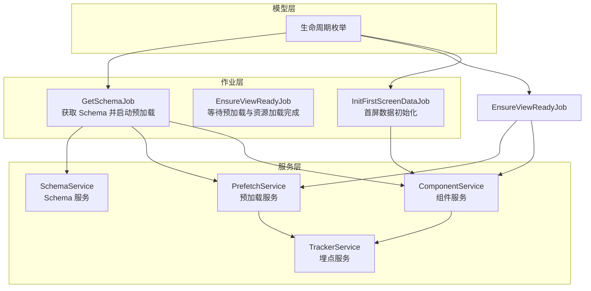
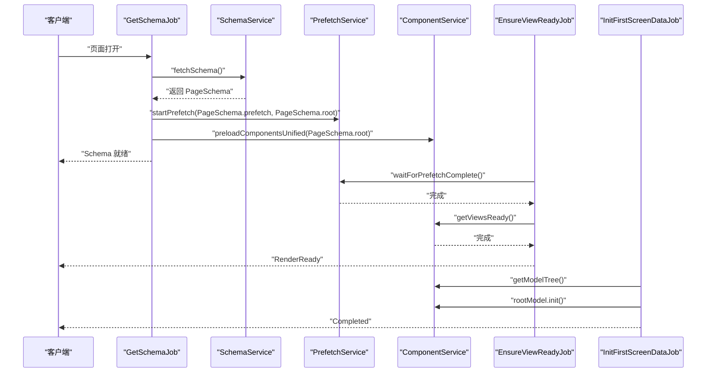
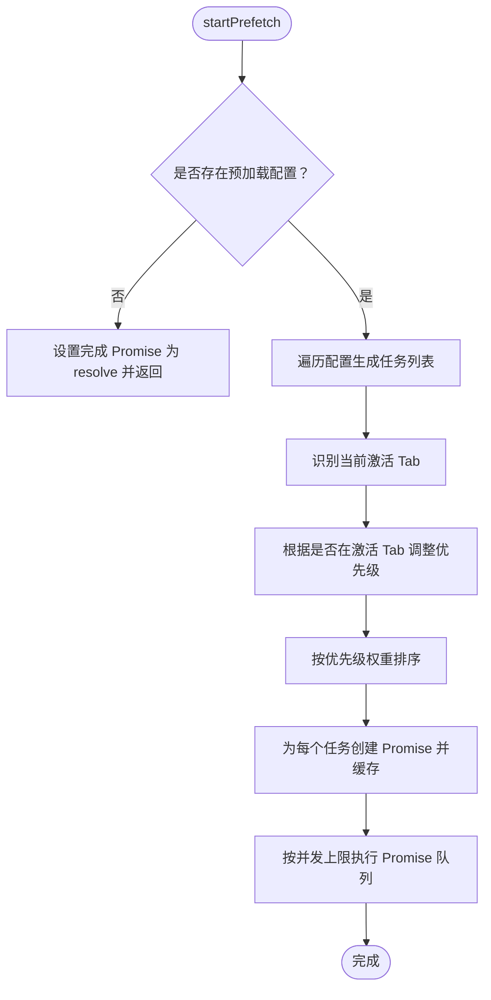
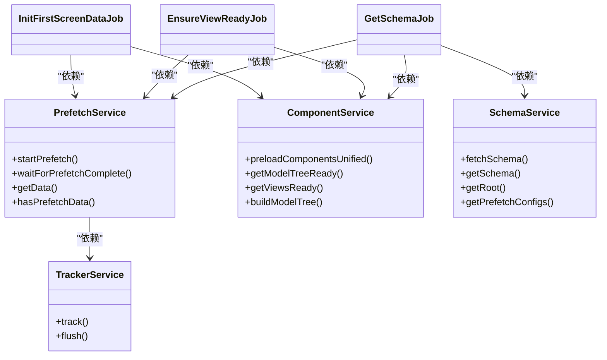

# 预加载服务

<cite>
**本文引用的文件**
- [prefetch.service.ts](file://packages/h5-builder/src/services/prefetch.service.ts)
- [component.service.ts](file://packages/h5-builder/src/services/component.service.ts)
- [service-identifiers.ts](file://packages/h5-builder/src/services/service-identifiers.ts)
- [get-schema-job.ts](file://packages/h5-builder/src/jobs/get-schema-job.ts)
- [ensure-view-ready.ts](file://packages/h5-builder/src/jobs/ensure-view-ready.ts)
- [init-first-screen-data-job.ts](file://packages/h5-builder/src/jobs/init-first-screen-data-job.ts)
- [lifecycle.ts](file://packages/h5-builder/src/jobs/lifecycle.ts)
- [schema.service.ts](file://packages/h5-builder/src/services/schema.service.ts)
- [tracker.service.ts](file://packages/h5-builder/src/services/tracker.service.ts)
</cite>

## 目录
1. [简介](#简介)
2. [项目结构](#项目结构)
3. [核心组件](#核心组件)
4. [架构总览](#架构总览)
5. [详细组件分析](#详细组件分析)
6. [依赖分析](#依赖分析)
7. [性能考量](#性能考量)
8. [故障排查指南](#故障排查指南)
9. [结论](#结论)

## 简介
本文件系统性阐述“预加载服务”的设计与实现，重点覆盖以下方面：
- 预加载配置与数据流
- 与组件加载流水线的集成方式
- Tab 优先级调整与并发控制策略
- 与埋点服务的联动
- 生命周期阶段中的触发与等待机制

该服务通过在页面打开阶段尽早启动预加载，结合组件资源的统一并发加载，确保首屏渲染所需数据与资源尽可能提前到位，从而缩短首屏交互时间。

## 项目结构
围绕预加载服务的关键文件组织如下：
- 服务层：预加载服务、组件服务、埋点服务、Schema 服务
- 作业层：获取 Schema 作业、构建视图就绪作业、首屏数据初始化作业
- 生命周期：定义页面各阶段名称与语义

图表来源
- [get-schema-job.ts](file://packages/h5-builder/src/jobs/get-schema-job.ts#L1-L132)
- [ensure-view-ready.ts](file://packages/h5-builder/src/jobs/ensure-view-ready.ts#L1-L63)
- [init-first-screen-data-job.ts](file://packages/h5-builder/src/jobs/init-first-screen-data-job.ts#L1-L71)
- [prefetch.service.ts](file://packages/h5-builder/src/services/prefetch.service.ts#L1-L273)
- [component.service.ts](file://packages/h5-builder/src/services/component.service.ts#L1-L797)
- [schema.service.ts](file://packages/h5-builder/src/services/schema.service.ts#L1-L56)
- [tracker.service.ts](file://packages/h5-builder/src/services/tracker.service.ts#L1-L290)
- [lifecycle.ts](file://packages/h5-builder/src/jobs/lifecycle.ts#L1-L18)

章节来源
- [get-schema-job.ts](file://packages/h5-builder/src/jobs/get-schema-job.ts#L1-L132)
- [ensure-view-ready.ts](file://packages/h5-builder/src/jobs/ensure-view-ready.ts#L1-L63)
- [init-first-screen-data-job.ts](file://packages/h5-builder/src/jobs/init-first-screen-data-job.ts#L1-L71)
- [prefetch.service.ts](file://packages/h5-builder/src/services/prefetch.service.ts#L1-L273)
- [component.service.ts](file://packages/h5-builder/src/services/component.service.ts#L1-L797)
- [schema.service.ts](file://packages/h5-builder/src/services/schema.service.ts#L1-L56)
- [tracker.service.ts](file://packages/h5-builder/src/services/tracker.service.ts#L1-L290)
- [lifecycle.ts](file://packages/h5-builder/src/jobs/lifecycle.ts#L1-L18)

## 核心组件
- 预加载服务：负责收集预加载配置、按 Tab 优先级调整、并发控制执行、缓存数据、上报埋点。
- 组件服务：负责组件注册、异步加载（Model/View）、统一并发队列、构建模型树。
- Schema 服务：提供页面 Schema（含预加载配置）。
- 作业链路：GetSchemaJob 启动预加载；EnsureViewReadyJob 等待预加载与资源加载完成；InitFirstScreenDataJob 在 Completed 阶段初始化首屏数据。
- 埋点服务：统一事件上报与持久化，预加载成功/失败均会上报。

章节来源
- [prefetch.service.ts](file://packages/h5-builder/src/services/prefetch.service.ts#L1-L273)
- [component.service.ts](file://packages/h5-builder/src/services/component.service.ts#L1-L797)
- [schema.service.ts](file://packages/h5-builder/src/services/schema.service.ts#L1-L56)
- [get-schema-job.ts](file://packages/h5-builder/src/jobs/get-schema-job.ts#L1-L132)
- [ensure-view-ready.ts](file://packages/h5-builder/src/jobs/ensure-view-ready.ts#L1-L63)
- [init-first-screen-data-job.ts](file://packages/h5-builder/src/jobs/init-first-screen-data-job.ts#L1-L71)
- [tracker.service.ts](file://packages/h5-builder/src/services/tracker.service.ts#L1-L290)

## 架构总览
预加载服务贯穿页面生命周期的关键阶段，与组件加载、视图就绪、首屏数据初始化形成协同。

图表来源
- [get-schema-job.ts](file://packages/h5-builder/src/jobs/get-schema-job.ts#L50-L73)
- [ensure-view-ready.ts](file://packages/h5-builder/src/jobs/ensure-view-ready.ts#L50-L61)
- [init-first-screen-data-job.ts](file://packages/h5-builder/src/jobs/init-first-screen-data-job.ts#L50-L69)
- [prefetch.service.ts](file://packages/h5-builder/src/services/prefetch.service.ts#L29-L53)
- [component.service.ts](file://packages/h5-builder/src/services/component.service.ts#L660-L796)
- [schema.service.ts](file://packages/h5-builder/src/services/schema.service.ts#L41-L50)

## 详细组件分析

### 预加载服务（PrefetchService）
- 职责
  - 接收预加载配置与根 Schema，启动异步预加载任务。
  - 识别当前激活 Tab，基于节点归属动态调整任务优先级。
  - 使用并发队列控制任务执行，避免过度并发导致抖动。
  - 缓存每个节点的预加载 Promise，供模型初始化时读取。
  - 通过埋点服务记录成功/失败事件，便于监控与诊断。
- 关键行为
  - 启动预加载：在 GetSchemaJob 的 Open 阶段调用，不阻塞后续流程。
  - 等待完成：在 EnsureViewReadyJob 的 RenderReady 阶段等待，确保首屏渲染前数据可用。
  - 数据获取：在模型初始化时通过 getNodeData 获取缓存的 Promise。
- 优先级与并发
  - 优先级：critical/high/normal/low，按权重排序，权重越小优先级越高。
  - 并发：固定并发上限，使用 Promise.race + Promise.all 控制执行节奏。
- 数据来源
  - Mock 实现：模拟网络延迟与不同节点类型的返回数据，便于演示与测试。
- 依赖
  - 依赖埋点服务进行事件上报。
  - 依赖组件 Schema 识别 Tab 与节点归属。

图表来源
- [prefetch.service.ts](file://packages/h5-builder/src/services/prefetch.service.ts#L29-L104)
- [prefetch.service.ts](file://packages/h5-builder/src/services/prefetch.service.ts#L106-L179)
- [prefetch.service.ts](file://packages/h5-builder/src/services/prefetch.service.ts#L235-L272)

章节来源
- [prefetch.service.ts](file://packages/h5-builder/src/services/prefetch.service.ts#L1-L273)

### 组件服务（ComponentService）
- 职责
  - 组件注册与异步加载（Model/View），支持延迟与优先级。
  - 统一并发队列：先加载 Model，再加载 View，并在完成后建立映射。
  - 构建模型树（同步），基于已加载的 Model。
- 与预加载的关系
  - 预加载数据由预加载服务缓存，组件模型在初始化时可读取。
  - EnsureViewReadyJob 等待组件资源加载完成，确保视图可用。
- 并发策略
  - 双队列（Model/View）与统一队列两种模式，统一队列并发上限可配置。

章节来源
- [component.service.ts](file://packages/h5-builder/src/services/component.service.ts#L1-L797)

### Schema 服务（SchemaService）
- 职责
  - 提供页面 Schema（包含根 Schema 与预加载配置）。
  - Mock 返回页面数据，便于演示预加载效果。
- 与预加载的关系
  - GetSchemaJob 从 SchemaService 获取 PageSchema，并将其中的预加载配置传入预加载服务。

章节来源
- [schema.service.ts](file://packages/h5-builder/src/services/schema.service.ts#L1-L56)

### 作业链路与生命周期
- GetSchemaJob
  - 在 Open 阶段拉取 Schema，注册组件加载器，启动预加载与组件资源预加载。
- EnsureViewReadyJob
  - 在 RenderReady 阶段等待预加载完成与组件资源加载完成，然后放行屏障。
- InitFirstScreenDataJob
  - 在 Completed 阶段初始化首屏数据，驱动模型树初始化。

章节来源
- [get-schema-job.ts](file://packages/h5-builder/src/jobs/get-schema-job.ts#L50-L73)
- [ensure-view-ready.ts](file://packages/h5-builder/src/jobs/ensure-view-ready.ts#L50-L61)
- [init-first-screen-data-job.ts](file://packages/h5-builder/src/jobs/init-first-screen-data-job.ts#L50-L69)
- [lifecycle.ts](file://packages/h5-builder/src/jobs/lifecycle.ts#L1-L18)

### 埋点服务（TrackerService）
- 职责
  - 统一事件上报、批量发送、持久化、调试模式等。
  - 预加载成功/失败事件通过埋点上报，便于监控与排障。
- 与预加载的关系
  - 预加载服务在成功/失败时调用埋点服务记录事件。

章节来源
- [tracker.service.ts](file://packages/h5-builder/src/services/tracker.service.ts#L1-L290)
- [prefetch.service.ts](file://packages/h5-builder/src/services/prefetch.service.ts#L160-L179)

## 依赖分析
- 依赖注入标识
  - 通过服务标识符进行依赖注入，避免硬编码类引用，提升可测试性与可替换性。
- 服务间耦合
  - 预加载服务依赖组件 Schema 与埋点服务。
  - 作业链路依赖服务层提供的能力，形成清晰的职责边界。
- 循环依赖
  - 代码中未发现明显循环依赖迹象，服务与作业通过标识符解耦。

图表来源
- [service-identifiers.ts](file://packages/h5-builder/src/services/service-identifiers.ts#L1-L22)
- [get-schema-job.ts](file://packages/h5-builder/src/jobs/get-schema-job.ts#L1-L132)
- [ensure-view-ready.ts](file://packages/h5-builder/src/jobs/ensure-view-ready.ts#L1-L63)
- [init-first-screen-data-job.ts](file://packages/h5-builder/src/jobs/init-first-screen-data-job.ts#L1-L71)
- [prefetch.service.ts](file://packages/h5-builder/src/services/prefetch.service.ts#L1-L273)
- [component.service.ts](file://packages/h5-builder/src/services/component.service.ts#L1-L797)
- [schema.service.ts](file://packages/h5-builder/src/services/schema.service.ts#L1-L56)
- [tracker.service.ts](file://packages/h5-builder/src/services/tracker.service.ts#L1-L290)

章节来源
- [service-identifiers.ts](file://packages/h5-builder/src/services/service-identifiers.ts#L1-L22)

## 性能考量
- 并发控制
  - 预加载与组件资源加载均采用并发队列，避免一次性大量请求导致网络拥塞或资源争抢。
- 优先级调度
  - 激活 Tab 内的组件优先级提升，非激活 Tab 降级，确保首屏交互优先。
- 缓存与去重
  - 预加载 Promise 缓存避免重复请求；组件资源加载完成后建立映射，减少重复工作。
- 延迟与抖动
  - 组件加载支持延迟配置，便于模拟与测试；预加载服务的并发与排序策略有助于平滑抖动。
- 埋点开销
  - 埋点服务支持批量与持久化，避免频繁 IO 与阻塞主线程。

[本节为通用性能建议，无需特定文件来源]

## 故障排查指南
- 预加载未生效
  - 检查是否传入预加载配置；确认 GetSchemaJob 已调用 startPrefetch。
  - 确认 EnsureViewReadyJob 已等待 waitForPrefetchComplete。
- 预加载失败
  - 查看埋点事件是否上报失败；检查 Mock 数据路径与节点类型匹配。
- 首屏交互延迟
  - 检查组件优先级配置与 Tab 识别逻辑；确认并发上限设置合理。
- 资源加载卡顿
  - 检查组件加载延迟配置与并发队列策略；必要时调整统一并发上限。

章节来源
- [prefetch.service.ts](file://packages/h5-builder/src/services/prefetch.service.ts#L160-L179)
- [ensure-view-ready.ts](file://packages/h5-builder/src/jobs/ensure-view-ready.ts#L50-L61)
- [get-schema-job.ts](file://packages/h5-builder/src/jobs/get-schema-job.ts#L50-L73)
- [tracker.service.ts](file://packages/h5-builder/src/services/tracker.service.ts#L144-L171)

## 结论
预加载服务通过“早启动、分优先级、并发控制、缓存命中”的策略，有效缩短首屏交互时间。其与组件加载流水线、生命周期阶段紧密协作，配合埋点服务形成可观测的运行轨迹。在实际工程中，建议：
- 明确预加载配置与节点归属，合理设置优先级。
- 根据业务场景调整并发上限与延迟策略。
- 借助埋点持续监控预加载成功率与耗时分布，迭代优化。