# 任务调度

<cite>
**本文档引用的文件**
- [job-scheduler.ts](file://packages/h5-builder/src/bedrock/launch/job-scheduler.ts)
- [abstract-job.ts](file://packages/h5-builder/src/bedrock/launch/abstract-job.ts)
- [lifecycle.ts](file://packages/h5-builder/src/jobs/lifecycle.ts)
- [get-schema-job.ts](file://packages/h5-builder/src/jobs/get-schema-job.ts)
- [build-tree-job.ts](file://packages/h5-builder/src/jobs/build-tree-job.ts)
- [trigger-render-job.ts](file://packages/h5-builder/src/jobs/trigger-render-job.ts)
- [cost-recorder.ts](file://packages/h5-builder/src/bedrock/launch/cost-recorder.ts)
- [component.service.ts](file://packages/h5-builder/src/services/component.service.ts)
- [schema.service.ts](file://packages/h5-builder/src/services/schema.service.ts)
- [barrier.ts](file://packages/h5-builder/src/bedrock/async/barrier.ts)
- [demo-progressive.tsx](file://packages/h5-builder/src/demo-progressive.tsx)
</cite>

## 目录
1. [任务调度系统概述](#任务调度系统概述)
2. [核心组件分析](#核心组件分析)
3. [页面生命周期与任务编排](#页面生命周期与任务编排)
4. [Job接口设计与执行机制](#job接口设计与执行机制)
5. [异步任务编排与依赖管理](#异步任务编排与依赖管理)
6. [自定义Job开发指南](#自定义job开发指南)
7. [调度性能监控方案](#调度性能监控方案)
8. [常见问题排查指南](#常见问题排查指南)

## 任务调度系统概述

任务调度系统是H5页面构建流程的核心控制机制，负责有序执行页面初始化过程中的各项关键任务。该系统通过JobScheduler协调GetSchemaJob、BuildTreeJob、TriggerRenderJob等任务的执行顺序，确保页面构建流程的正确性和高效性。调度系统实现了渐进式渲染和关键路径优化，通过精确控制任务执行时机来提升页面加载性能。

**Section sources**
- [job-scheduler.ts](file://packages/h5-builder/src/bedrock/launch/job-scheduler.ts)
- [lifecycle.ts](file://packages/h5-builder/src/jobs/lifecycle.ts)

## 核心组件分析

### JobScheduler核心机制

JobScheduler是任务调度系统的核心组件，负责管理任务的注册、准备和执行。它通过阶段化控制确保任务按正确的顺序执行，同时提供性能监控功能。

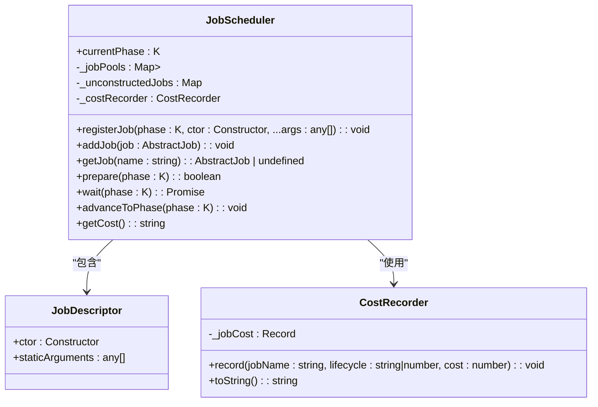

**Diagram sources**
- [job-scheduler.ts](file://packages/h5-builder/src/bedrock/launch/job-scheduler.ts)
- [cost-recorder.ts](file://packages/h5-builder/src/bedrock/launch/cost-recorder.ts)

### AbstractJob抽象基类

AbstractJob定义了所有任务的通用接口和行为规范，通过模板方法模式确保子类实现必要的生命周期方法。

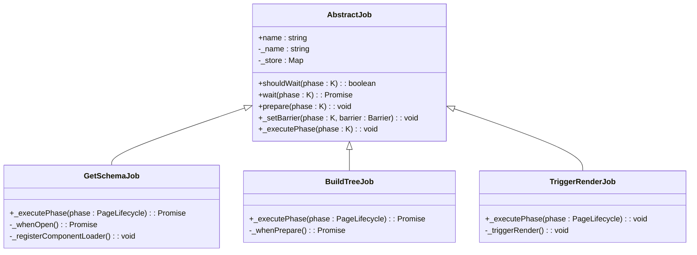

**Diagram sources**
- [abstract-job.ts](file://packages/h5-builder/src/bedrock/launch/abstract-job.ts)
- [get-schema-job.ts](file://packages/h5-builder/src/jobs/get-schema-job.ts)
- [build-tree-job.ts](file://packages/h5-builder/src/jobs/build-tree-job.ts)
- [trigger-render-job.ts](file://packages/h5-builder/src/jobs/trigger-render-job.ts)

**Section sources**
- [abstract-job.ts](file://packages/h5-builder/src/bedrock/launch/abstract-job.ts)
- [get-schema-job.ts](file://packages/h5-builder/src/jobs/get-schema-job.ts)
- [build-tree-job.ts](file://packages/h5-builder/src/jobs/build-tree-job.ts)
- [trigger-render-job.ts](file://packages/h5-builder/src/jobs/trigger-render-job.ts)

## 页面生命周期与任务编排

### 生命周期阶段定义

系统定义了清晰的页面生命周期阶段，每个阶段对应特定的构建任务，确保页面按序初始化。

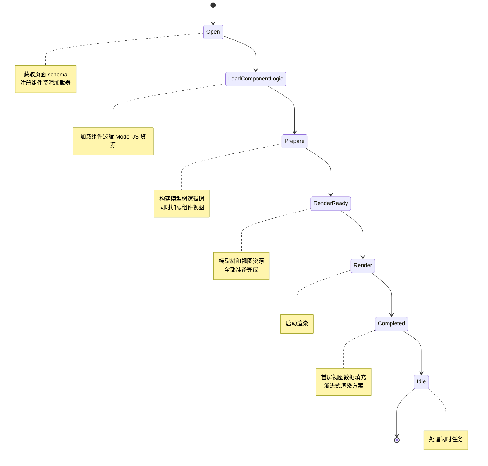

**Diagram sources**
- [lifecycle.ts](file://packages/h5-builder/src/jobs/lifecycle.ts)

### 任务-生命周期映射

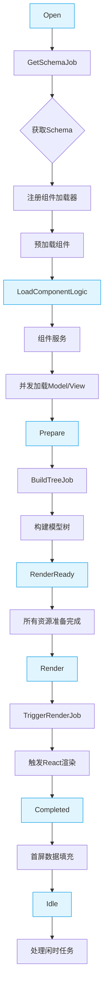

**Diagram sources**
- [lifecycle.ts](file://packages/h5-builder/src/jobs/lifecycle.ts)
- [get-schema-job.ts](file://packages/h5-builder/src/jobs/get-schema-job.ts)
- [build-tree-job.ts](file://packages/h5-builder/src/jobs/build-tree-job.ts)
- [trigger-render-job.ts](file://packages/h5-builder/src/jobs/trigger-render-job.ts)
- [component.service.ts](file://packages/h5-builder/src/services/component.service.ts)

**Section sources**
- [lifecycle.ts](file://packages/h5-builder/src/jobs/lifecycle.ts)

## Job接口设计与执行机制

### 任务执行流程

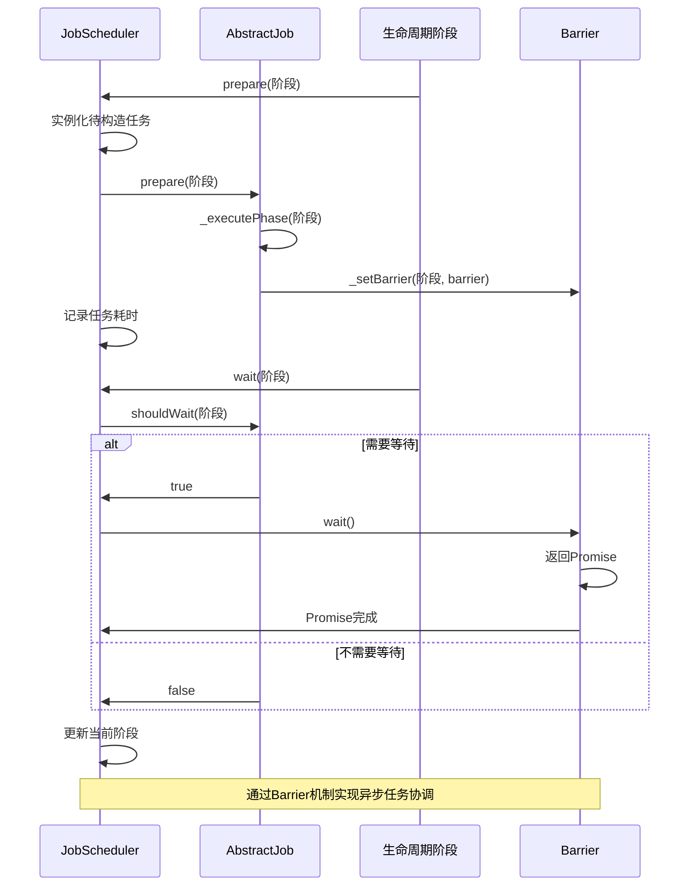

**Diagram sources**
- [job-scheduler.ts](file://packages/h5-builder/src/bedrock/launch/job-scheduler.ts)
- [abstract-job.ts](file://packages/h5-builder/src/bedrock/launch/abstract-job.ts)
- [barrier.ts](file://packages/h5-builder/src/bedrock/async/barrier.ts)

### 任务优先级管理

系统通过注册时机和依赖关系实现任务优先级管理。关键任务在早期阶段注册，确保优先执行。

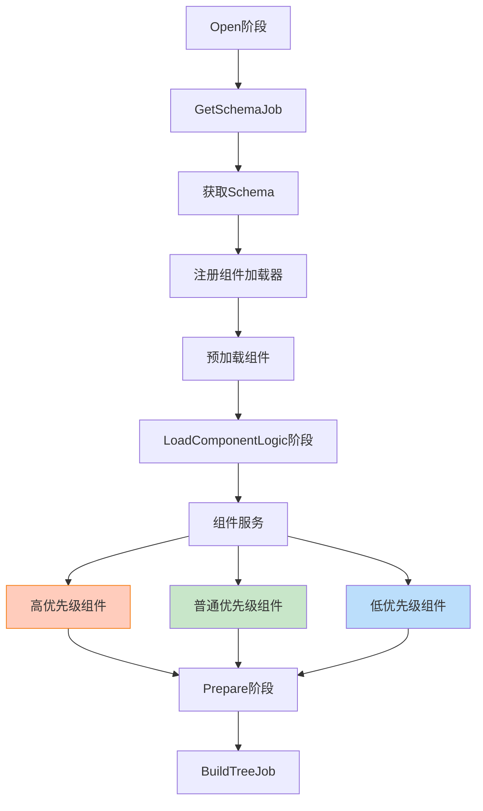

**Diagram sources**
- [get-schema-job.ts](file://packages/h5-builder/src/jobs/get-schema-job.ts)
- [component.service.ts](file://packages/h5-builder/src/services/component.service.ts)

**Section sources**
- [job-scheduler.ts](file://packages/h5-builder/src/bedrock/launch/job-scheduler.ts)
- [abstract-job.ts](file://packages/h5-builder/src/bedrock/launch/abstract-job.ts)

## 异步任务编排与依赖管理

### 组件加载依赖管理

系统通过组件元数据中的dependencies字段管理组件间的依赖关系，确保依赖组件先于依赖者加载。

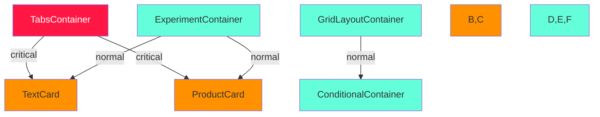

**Diagram sources**
- [get-schema-job.ts](file://packages/h5-builder/src/jobs/get-schema-job.ts)

### Barrier同步机制

Barrier是实现异步任务同步的关键机制，通过Promise模式协调任务完成状态。

```mermaid
classDiagram
class IBarrier {
    +isOpen() : boolean
    +open() : void
    +wait() : Promise<boolean>
}
class Barrier {
    -_isOpen : boolean
    -_promise : Promise<boolean>
    -_completePromise : (v : boolean) => void
    -_rejectPromise : (e : unknown) => void
    +isOpen() : boolean
    +open() : void
    +reject(e : unknown) : void
    +wait() : Promise<boolean>
}
IBarrier <|.. Barrier
class GetSchemaJob {
    -_schemaBarrier : Barrier
    -_whenOpen() : Promise<void>
}
GetSchemaJob --> Barrier : "使用"
note right of Barrier
    "初始状态为关闭<br/>调用open()后永久打开<br/>wait()返回Promise<br/>实现异步协调"
end note
```

**Diagram sources**
- [barrier.ts](file://packages/h5-builder/src/bedrock/async/barrier.ts)
- [get-schema-job.ts](file://packages/h5-builder/src/jobs/get-schema-job.ts)

**Section sources**
- [barrier.ts](file://packages/h5-builder/src/bedrock/async/barrier.ts)

## 自定义Job开发指南

### 自定义Job开发步骤

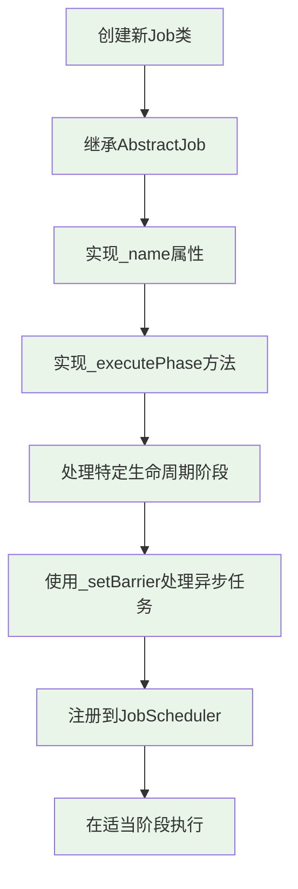

### 错误处理与超时控制

自定义Job应实现完善的错误处理和超时控制机制，确保系统稳定性。

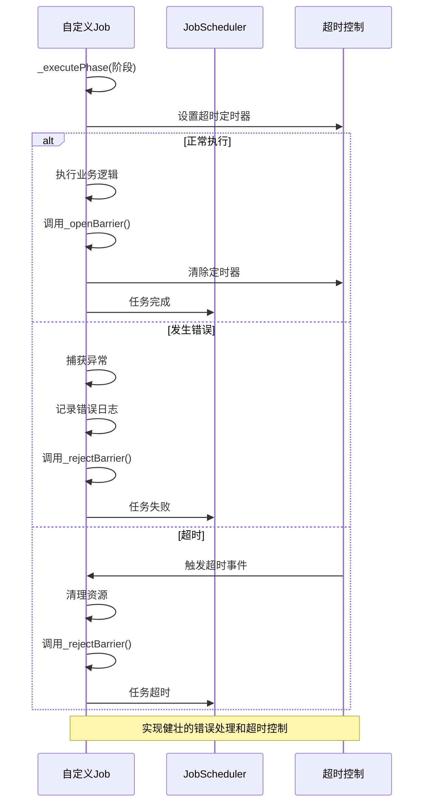

**Section sources**
- [abstract-job.ts](file://packages/h5-builder/src/bedrock/launch/abstract-job.ts)
- [get-schema-job.ts](file://packages/h5-builder/src/jobs/get-schema-job.ts)

## 调度性能监控方案

### 任务耗时统计

系统内置性能监控功能，可记录每个任务在各阶段的执行耗时。

```mermaid
erDiagram
JOB_COST ||--o{ JOB : "属于"
JOB_COST ||--o{ PHASE : "发生在"
class JOB {
+name: string
+description: string
}
class PHASE {
+name: string
+description: string
}
class JOB_COST {
+jobName: string
+phase: string|number
+cost: number
+timestamp: datetime
}
note right of JOB_COST
记录每个任务在各阶段的耗时
支持性能分析和优化
end note
```

**Diagram sources**
- [cost-recorder.ts](file://packages/h5-builder/src/bedrock/launch/cost-recorder.ts)

### 阻塞分析

通过分析任务等待状态，识别系统中的性能瓶颈和阻塞点。

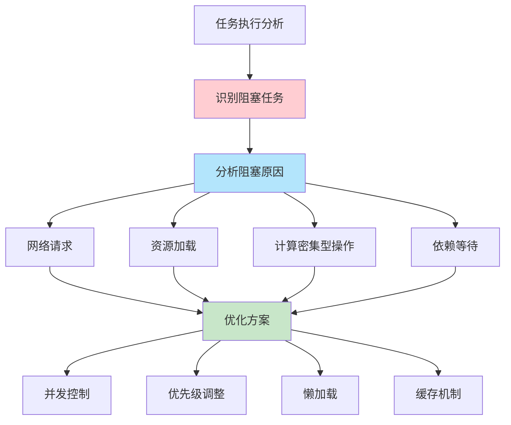

**Section sources**
- [job-scheduler.ts](file://packages/h5-builder/src/bedrock/launch/job-scheduler.ts)
- [cost-recorder.ts](file://packages/h5-builder/src/bedrock/launch/cost-recorder.ts)

## 常见问题排查指南

### 任务死锁排查

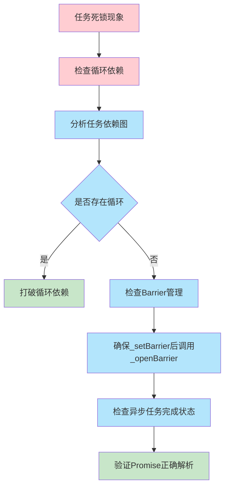

### 执行顺序错误排查

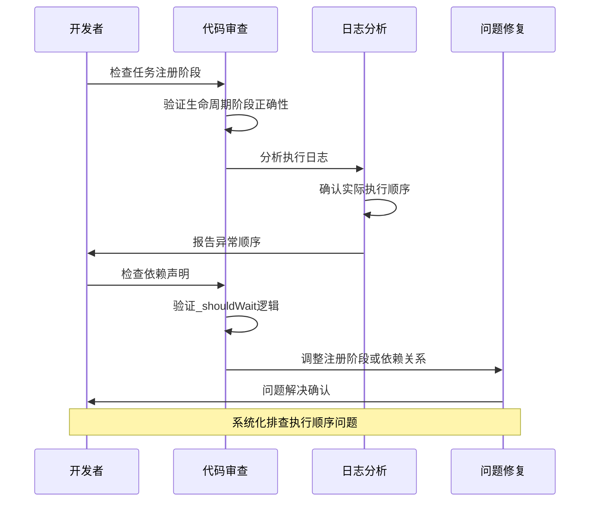

**Section sources**
- [job-scheduler.ts](file://packages/h5-builder/src/bedrock/launch/job-scheduler.ts)
- [abstract-job.ts](file://packages/h5-builder/src/bedrock/launch/abstract-job.ts)