# 依赖注入

<cite>
**本文档中引用的文件**  
- [instantiation-service.ts](file://packages/h5-builder/src/bedrock/di/instantiation-service.ts)
- [service-registry.ts](file://packages/h5-builder/src/bedrock/di/service-registry.ts)
- [service-collection.ts](file://packages/h5-builder/src/bedrock/di/service-collection.ts)
- [descriptor.ts](file://packages/h5-builder/src/bedrock/di/descriptor.ts)
- [proxy-builder.ts](file://packages/h5-builder/src/bedrock/di/proxy-builder.ts)
- [idle-value.ts](file://packages/h5-builder/src/bedrock/di/idle-value.ts)
- [base.ts](file://packages/h5-builder/src/bedrock/di/base.ts)
- [instantiation-service.interface.ts](file://packages/h5-builder/src/bedrock/di/instantiation-service.interface.ts)
- [service-ownership-collection.ts](file://packages/h5-builder/src/bedrock/di/service-ownership-collection.ts)
- [context.web.tsx](file://packages/h5-builder/src/bedrock/di/context.web.tsx)
- [lazy-service.ts](file://packages/h5-builder/src/bedrock/di/lazy/lazy-service.ts)
</cite>

## 目录
1. [引言](#引言)
2. [核心架构与组件](#核心架构与组件)
3. [服务注册与管理](#服务注册与管理)
4. [服务实例化机制](#服务实例化机制)
5. [懒加载与代理注入](#懒加载与代理注入)
6. [依赖解析与作用域](#依赖解析与作用域)
7. [子容器与继承机制](#子容器与继承机制)
8. [循环依赖与错误处理](#循环依赖与错误处理)
9. [React集成与使用](#react集成与使用)
10. [常见问题与性能优化](#常见问题与性能优化)

## 引言

mobx框架中的依赖注入（DI）系统提供了一套完整的服务管理解决方案，通过`InstantiationService`作为核心容器，实现了服务的注册、解析、生命周期管理及作用域控制。该系统支持单例与瞬态服务、懒加载、代理注入等高级特性，并通过类型安全的装饰器实现依赖声明。本文深入解析该系统的实现原理与应用模式。

## 核心架构与组件

mobx的依赖注入系统由多个核心组件构成，形成分层架构：

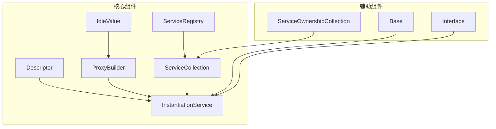

**Diagram sources**  
- [instantiation-service.ts](file://packages/h5-builder/src/bedrock/di/instantiation-service.ts)
- [service-registry.ts](file://packages/h5-builder/src/bedrock/di/service-registry.ts)
- [service-collection.ts](file://packages/h5-builder/src/bedrock/di/service-collection.ts)

**Section sources**  
- [instantiation-service.ts](file://packages/h5-builder/src/bedrock/di/instantiation-service.ts#L61-L467)
- [service-registry.ts](file://packages/h5-builder/src/bedrock/di/service-registry.ts#L16-L100)

## 服务注册与管理

### 服务标识与注册机制

系统通过`createDecorator`函数创建服务标识符，该标识符既是类型标记也是参数装饰器：

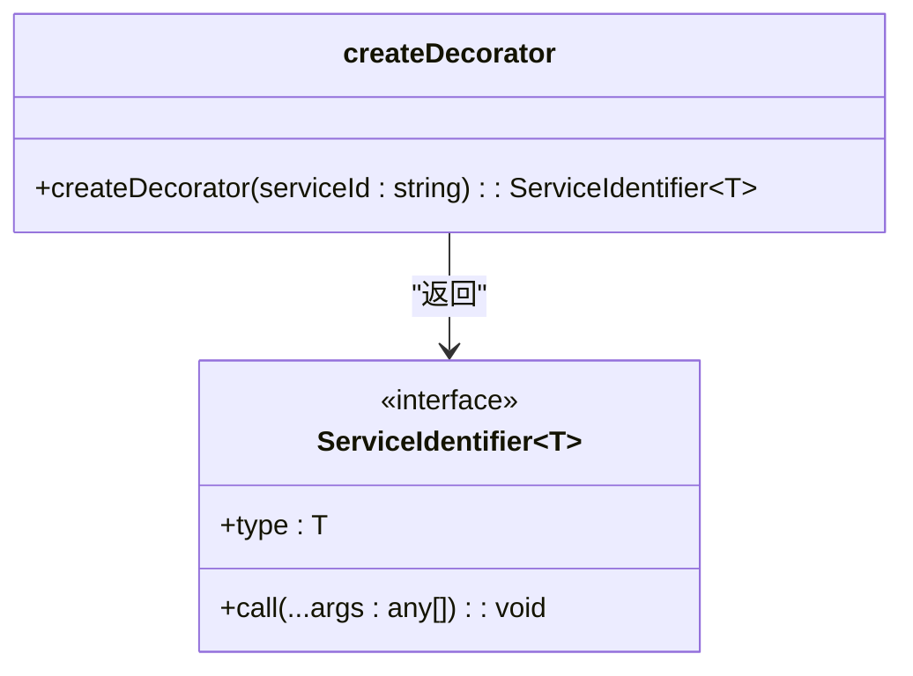

**Diagram sources**  
- [base.ts](file://packages/h5-builder/src/bedrock/di/base.ts#L9-L66)

服务注册通过`ServiceRegistry`完成，支持构造函数、描述符和实例三种方式：

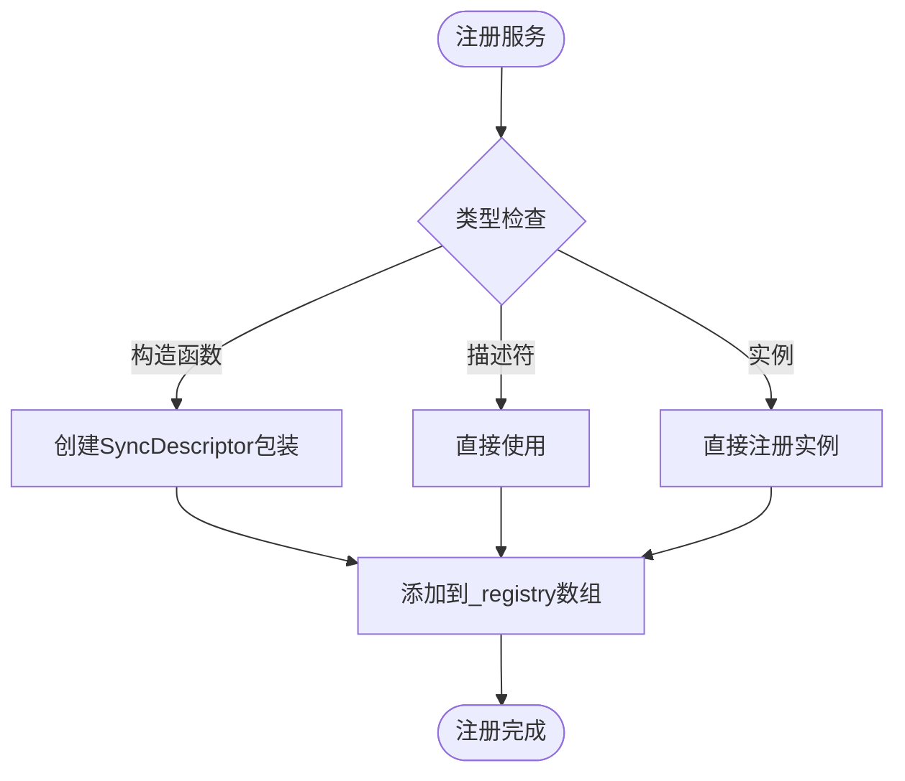

**Diagram sources**  
- [service-registry.ts](file://packages/h5-builder/src/bedrock/di/service-registry.ts#L35-L65)

### 服务集合管理

`ServiceCollection`作为服务的存储容器，维护服务标识与实例/描述符的映射关系：

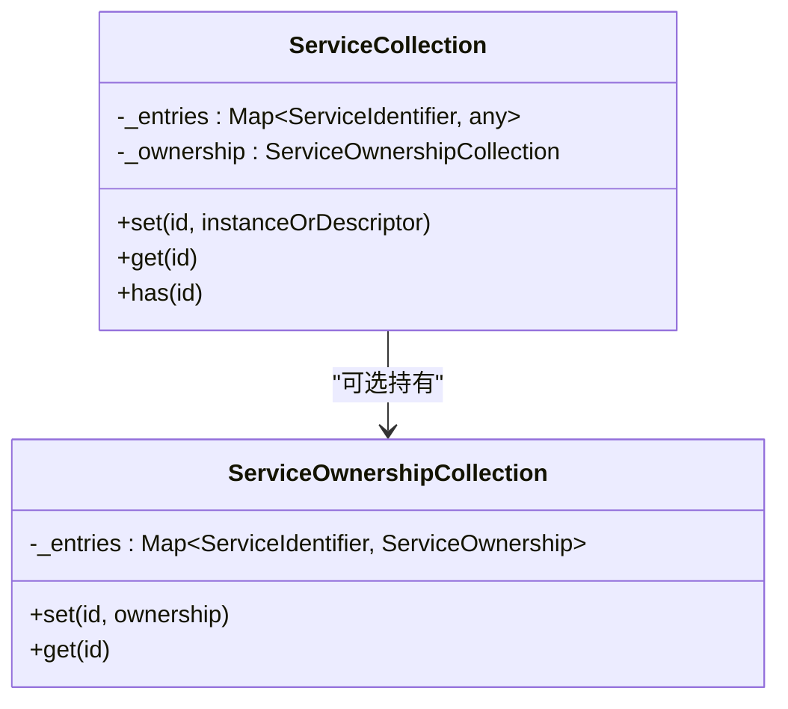

**Diagram sources**  
- [service-collection.ts](file://packages/h5-builder/src/bedrock/di/service-collection.ts#L14-L47)
- [service-ownership-collection.ts](file://packages/h5-builder/src/bedrock/di/service-ownership-collection.ts#L14-L39)

## 服务实例化机制

### 实例化服务核心流程

`InstantiationService`是核心DI容器，负责服务实例的创建与管理：

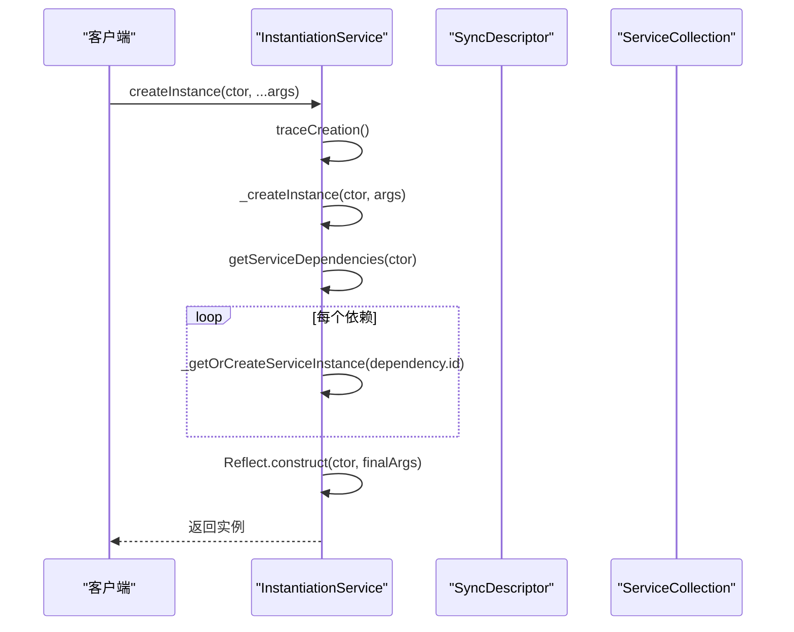

**Diagram sources**  
- [instantiation-service.ts](file://packages/h5-builder/src/bedrock/di/instantiation-service.ts#L150-L254)

### 服务创建与缓存

系统采用深度优先搜索算法处理依赖关系，确保依赖服务先于主服务创建：

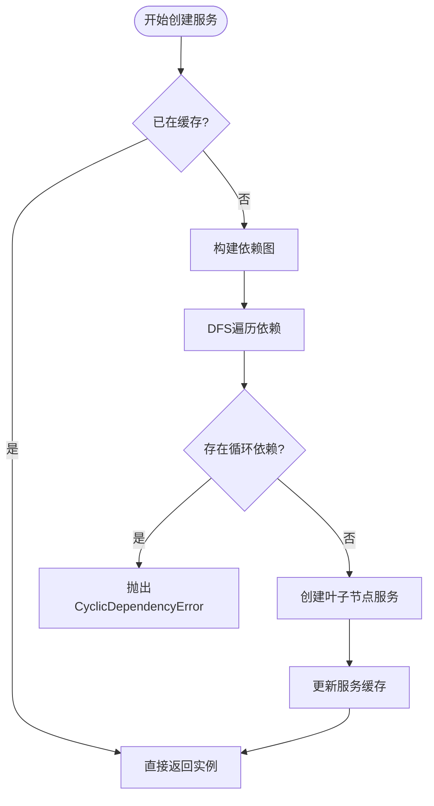

**Diagram sources**  
- [instantiation-service.ts](file://packages/h5-builder/src/bedrock/di/instantiation-service.ts#L308-L396)

## 懒加载与代理注入

### 懒加载机制

系统通过`IdleValue`实现懒加载，将实例化推迟到空闲时间：

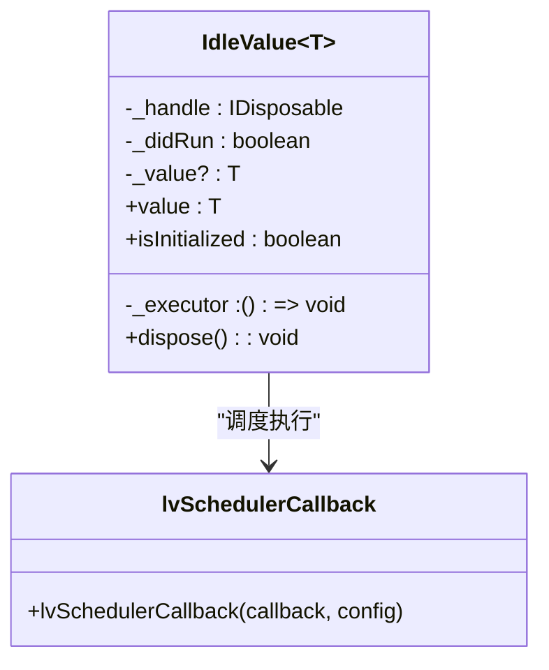

**Diagram sources**  
- [idle-value.ts](file://packages/h5-builder/src/bedrock/di/idle-value.ts#L8-L64)

### 代理构建机制

`proxy-builder`创建代理对象，实现访问时才触发实际实例化：

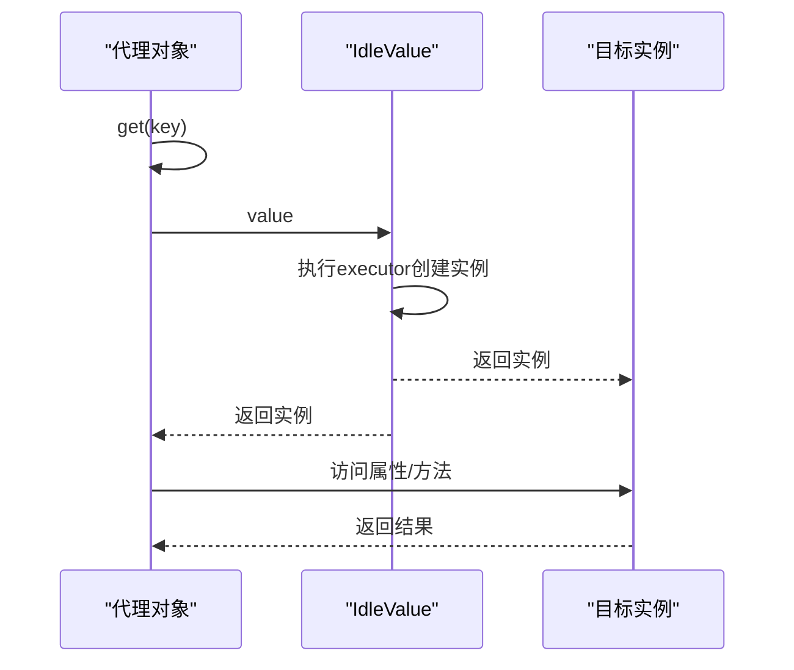

**Diagram sources**  
- [proxy-builder.ts](file://packages/h5-builder/src/bedrock/di/proxy-builder.ts#L8-L38)

## 依赖解析与作用域

### 服务作用域管理

系统支持两种服务作用域：单例（Singleton）和瞬态（Transient）：

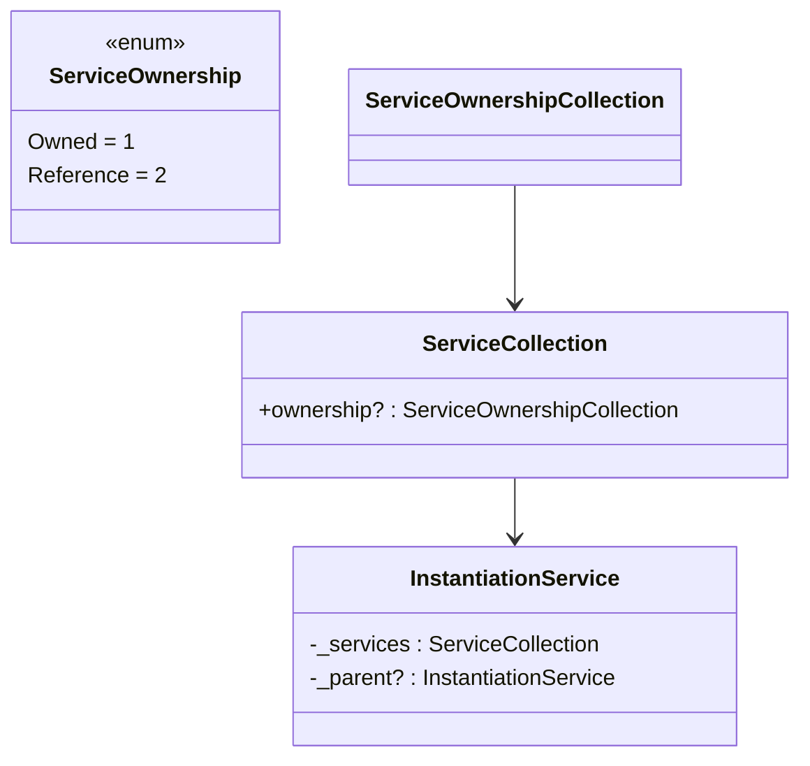

**Diagram sources**  
- [service-ownership-collection.ts](file://packages/h5-builder/src/bedrock/di/service-ownership-collection.ts#L3-L39)
- [instantiation-service.ts](file://packages/h5-builder/src/bedrock/di/instantiation-service.ts#L66-L88)

### 依赖解析流程

服务依赖通过参数装饰器自动解析：

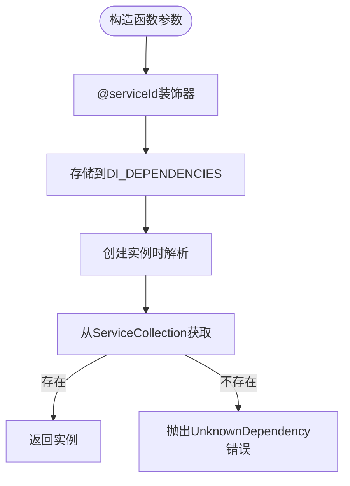

**Diagram sources**  
- [base.ts](file://packages/h5-builder/src/bedrock/di/base.ts#L27-L66)
- [instantiation-service.ts](file://packages/h5-builder/src/bedrock/di/instantiation-service.ts#L216-L232)

## 子容器与继承机制

### 容器继承体系

系统支持子容器创建，实现服务作用域的继承与覆盖：

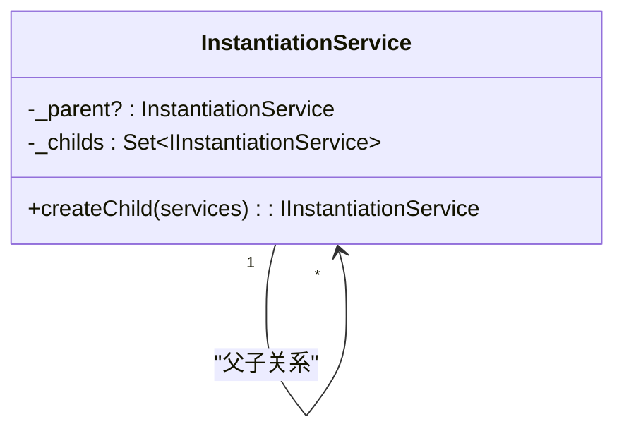

**Diagram sources**  
- [instantiation-service.ts](file://packages/h5-builder/src/bedrock/di/instantiation-service.ts#L68-L114)

### 子容器服务解析

子容器遵循特定的服务查找策略：

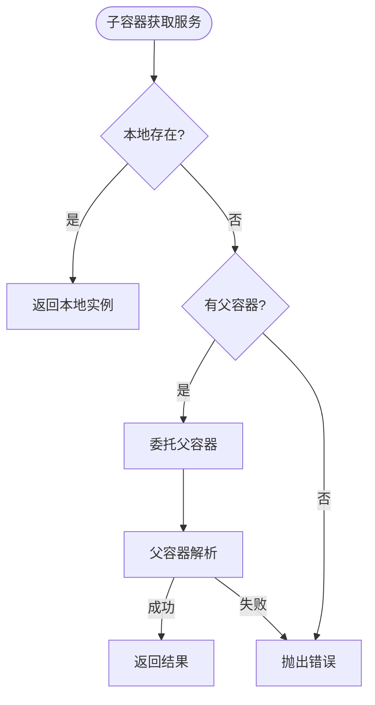

**Diagram sources**  
- [instantiation-service.ts](file://packages/h5-builder/src/bedrock/di/instantiation-service.ts#L268-L275)

## 循环依赖与错误处理

### 循环依赖检测

系统通过依赖图检测和活动实例集双重机制防止循环依赖：

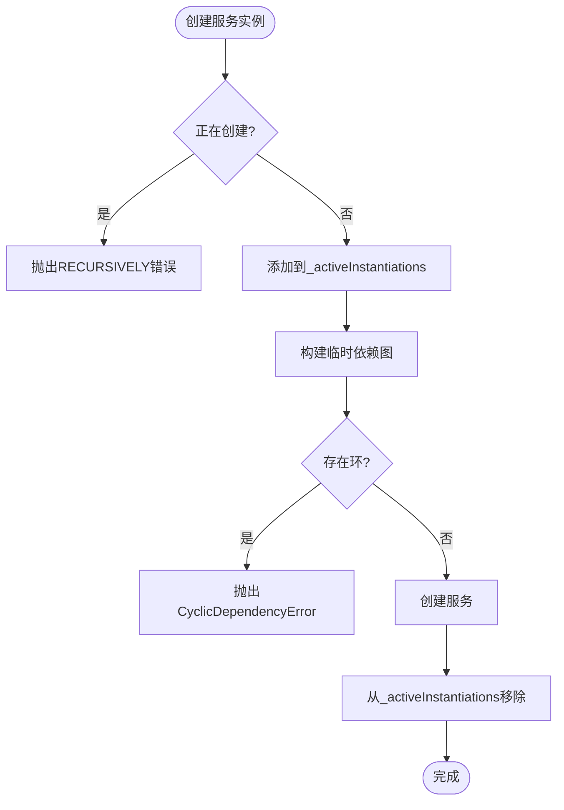

**Diagram sources**  
- [instantiation-service.ts](file://packages/h5-builder/src/bedrock/di/instantiation-service.ts#L297-L305)
- [instantiation-service.ts](file://packages/h5-builder/src/bedrock/di/instantiation-service.ts#L369-L374)

### 错误处理机制

系统采用集中式错误上报，确保错误在顶层容器处理：

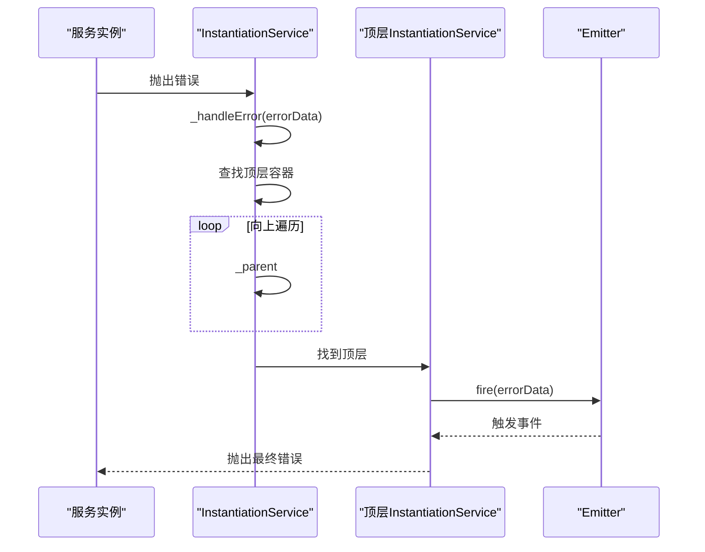

**Diagram sources**  
- [instantiation-service.ts](file://packages/h5-builder/src/bedrock/di/instantiation-service.ts#L453-L466)

## React集成与使用

### React上下文集成

系统提供React集成，通过Context实现服务注入：

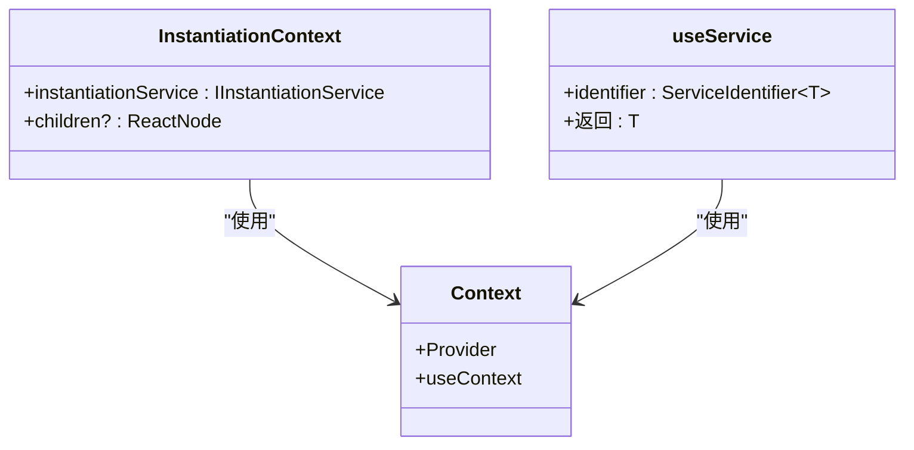

**Diagram sources**  
- [context.web.tsx](file://packages/h5-builder/src/bedrock/di/context.web.tsx#L11-L42)

### 使用示例

```typescript
// 创建服务标识
const IFooService = createDecorator<FooService>('foo-service');

// 定义服务
class FooService {
  _serviceBrand: undefined;
  constructor(@IBarService bar: IBarService) {
    // 依赖自动注入
  }
}

// 在React组件中使用
function MyComponent() {
  const fooService = useService(IFooService);
  return <div>{fooService.getData()}</div>;
}
```

**Section sources**  
- [context.web.tsx](file://packages/h5-builder/src/bedrock/di/context.web.tsx#L29-L41)
- [base.ts](file://packages/h5-builder/src/bedrock/di/base.ts#L50-L66)

## 常见问题与性能优化

### 常见问题解决方案

| 问题类型 | 原因 | 解决方案 |
|---------|------|---------|
| 服务未注册 | 服务未在ServiceRegistry中注册 | 确保服务已通过register方法注册 |
| 作用域冲突 | 子容器与父容器服务作用域不一致 | 明确指定ServiceOwnership |
| 循环依赖 | 两个服务相互依赖 | 重构依赖关系或使用懒加载 |
| 性能问题 | 运行时反射开销大 | 减少装饰器使用，预编译依赖信息 |

### 性能优化建议

1. **减少运行时反射**：尽量在编译时确定依赖关系，避免过多的运行时类型检查
2. **合理使用懒加载**：对非关键路径的服务使用`supportsDelayedInstantiation`选项
3. **服务作用域优化**：根据实际需求选择单例或瞬态作用域，避免不必要的实例创建
4. **批量注册服务**：使用ServiceRegistry集中注册，减少重复操作
5. **避免深层依赖**：控制服务依赖层级，提高实例化效率

**Section sources**  
- [instantiation-service.ts](file://packages/h5-builder/src/bedrock/di/instantiation-service.ts)
- [service-registry.ts](file://packages/h5-builder/src/bedrock/di/service-registry.ts)
- [idle-value.ts](file://packages/h5-builder/src/bedrock/di/idle-value.ts)