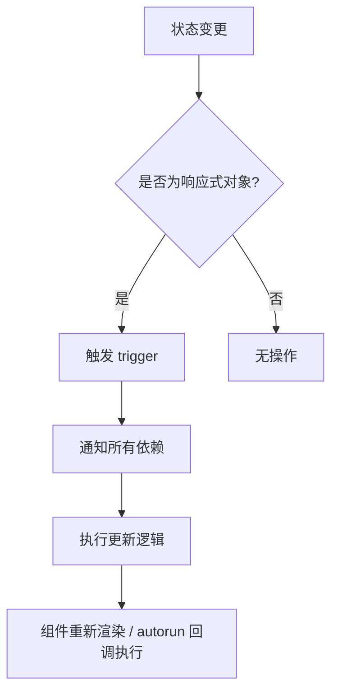
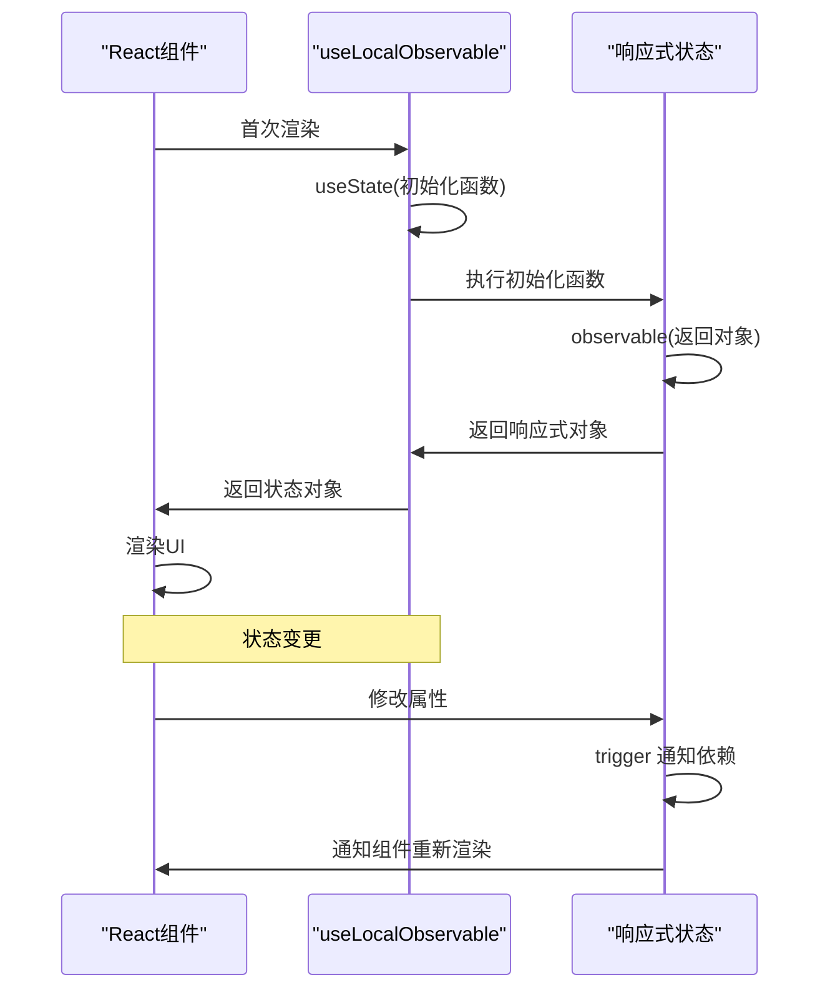
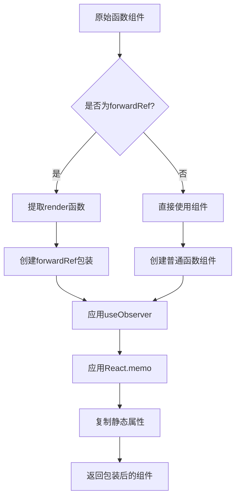
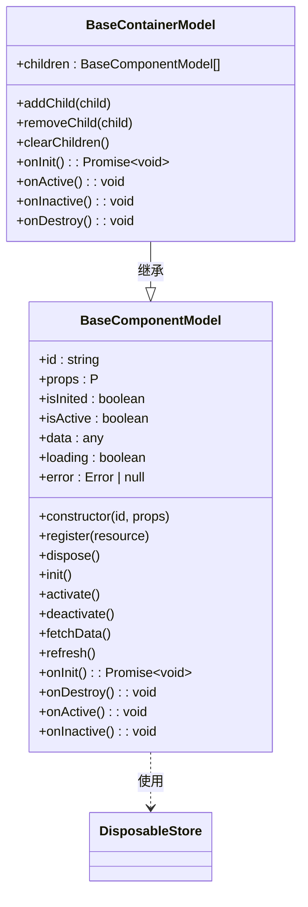

# 响应式系统

<cite>
**本文档中引用的文件**  
- [mobx.ts](file://packages/mobx-vue-lite/src/mobx.ts)
- [observer.ts](file://packages/mobx-vue-lite/src/observer.ts)
- [useObserver.ts](file://packages/mobx-vue-lite/src/useObserver.ts)
- [useLocalObservable.ts](file://packages/mobx-vue-lite/src/useLocalObservable.ts)
- [ObserverComponent.tsx](file://packages/mobx-vue-lite/src/ObserverComponent.tsx)
- [staticRendering.ts](file://packages/mobx-vue-lite/src/staticRendering.ts)
- [model.ts](file://packages/h5-builder/src/bedrock/model.ts)
- [integration.test.tsx](file://packages/mobx-vue-lite/src/__tests__/integration.test.tsx)
- [comprehensive.test.tsx](file://packages/mobx-vue-lite/src/__tests__/comprehensive.test.tsx)
</cite>

## 目录
1. [简介](#简介)
2. [核心实现原理](#核心实现原理)
3. [响应式状态管理](#响应式状态管理)
4. [组件响应式集成](#组件响应式集成)
5. [基于BaseComponentModel的实践应用](#基于basecomponentmodel的实践应用)
6. [性能优化建议](#性能优化建议)
7. [常见陷阱与解决方案](#常见陷阱与解决方案)
8. [总结](#总结)

## 简介
`mobx-vue-lite` 是一个轻量级的状态管理库，它基于 Vue 3 的 `@vue/reactivity` 响应式系统构建，为 React 应用提供与 `mobx-react-lite` 兼容的 API。该系统通过 `track` 和 `trigger` 机制实现自动依赖追踪与更新通知，使得开发者能够以声明式的方式管理应用状态。本文档将深入解析其内部实现原理，并详细说明如何在实际项目中高效使用这一响应式系统。

## 核心实现原理

`mobx-vue-lite` 的核心响应式能力来源于 `@vue/reactivity` 模块。它利用 Vue 3 的响应式引擎来实现 `observable`、`computed`、`autorun` 等核心功能。当一个对象被 `observable` 包装后，其属性访问和修改会被 `@vue/reactivity` 的 `reactive` 和 `ref` 机制所代理，从而实现对数据变化的追踪。

依赖追踪（`track`）发生在组件渲染或 `autorun` 函数执行期间，此时系统会记录下所有被访问的响应式属性。当这些属性的值发生变化时，`trigger` 机制会被激活，通知所有依赖于该属性的观察者（如组件或 `autorun` 回调）进行更新。



**图示来源**
- [mobx.ts](file://packages/mobx-vue-lite/src/mobx.ts#L2-8)
- [useObserver.ts](file://packages/mobx-vue-lite/src/useObserver.ts#L2-3)

## 响应式状态管理

### observable 与 useLocalObservable

`observable` 函数是创建响应式对象的基础。它直接调用 `@vue/reactivity` 的 `reactive` 函数，将传入的对象转换为一个深层响应式的代理对象。任何对该对象属性的读取和写入操作都会被自动追踪和响应。

`useLocalObservable` 是一个 React Hook，用于在函数组件中创建一个生命周期与组件绑定的本地响应式状态。它结合了 `useState` 和 `observable`，确保状态对象只在组件首次渲染时创建一次，并在整个组件生命周期内保持不变。



**图示来源**
- [mobx.ts](file://packages/mobx-vue-lite/src/mobx.ts#L13-17)
- [useLocalObservable.ts](file://packages/mobx-vue-lite/src/useLocalObservable.ts#L23-41)

### 计算属性与副作用

`computed` 函数用于创建计算属性。它利用 `@vue/reactivity` 的 `computed` 功能，接收一个 getter 函数，并返回一个包含 `get()` 方法的对象。计算属性会自动追踪其依赖项，并在依赖项变化时重新计算其值。

`autorun` 和 `reaction` 用于处理副作用。`autorun` 会立即执行传入的函数，并自动追踪其内部访问的所有响应式数据，一旦这些数据发生变化，函数就会重新执行。`reaction` 则提供了更精细的控制，允许分离数据源（`expression`）和副作用函数（`effectCallback`），并支持首次执行时是否立即调用的选项。

**本节来源**
- [mobx.ts](file://packages/mobx-vue-lite/src/mobx.ts#L23-55)
- [integration.test.tsx](file://packages/mobx-vue-lite/src/__tests__/integration.test.tsx#L25-33)
- [integration.test.tsx](file://packages/mobx-vue-lite/src/__tests__/integration.test.tsx#L35-49)

## 组件响应式集成

### observer 高阶组件

`observer` 是一个高阶组件（HOC），它将普通的 React 函数组件包装成一个响应式组件。其核心原理是利用 `useObserver` Hook 来实现。`observer` 会检测传入的组件是否为 `forwardRef` 组件，并相应地进行处理。它还自动应用 `React.memo` 来优化基于 props 的浅比较，避免不必要的渲染。



**图示来源**
- [observer.ts](file://packages/mobx-vue-lite/src/observer.ts#L16-51)

### useObserver Hook 与 Observer 组件

`useObserver` 是响应式更新的核心 Hook。它使用 `useReducer` 来强制组件重新渲染，并利用 `@vue/reactivity` 的 `effect` 函数来创建一个响应式副作用。`effect` 的 `scheduler` 被设置为调用 `forceUpdate`，这样当依赖项变化时，`scheduler` 会被触发，从而导致组件重新渲染。

`Observer` 组件是一个基于 `useObserver` 实现的 render props 组件。它提供了一种在 JSX 中声明式地创建细粒度响应式区域的方式。只有 `Observer` 组件内部的渲染逻辑会对其依赖的响应式数据进行追踪，这有助于避免父组件的过度渲染。

**本节来源**
- [useObserver.ts](file://packages/mobx-vue-lite/src/useObserver.ts#L19-58)
- [ObserverComponent.tsx](file://packages/mobx-vue-lite/src/ObserverComponent.tsx#L26-29)

## 基于BaseComponentModel的实践应用

`BaseComponentModel` 是一个结合了 `mobx-vue-lite` 响应式能力的基类，广泛应用于业务组件中。它通过在构造函数中调用 `observable(this)`，使得整个模型实例及其所有属性都成为响应式的。

```typescript
constructor(public id: string, public props: P) {
  return observable(this) as this;
}
```

该模型定义了标准的生命周期钩子，如 `onInit`、`onDestroy`、`onActive` 和 `onInactive`，并提供了 `register` 方法来管理资源（如定时器、事件监听器）。当模型被销毁时，所有通过 `register` 注册的资源都会被自动清理。

在实际应用中，`BaseComponentModel` 的状态（如 `loading`、`error`、`data`）可以直接在 React 组件中被 `observer` 或 `Observer` 组件消费。当模型内部的状态发生变化时，依赖于这些状态的 UI 会自动更新。



**图示来源**
- [model.ts](file://packages/h5-builder/src/bedrock/model.ts#L10-242)

## 性能优化建议

1.  **避免过度渲染**：优先使用 `Observer` 组件来创建细粒度的响应式区域，将状态依赖限制在最小的 UI 单元内，防止因局部状态变化导致整个大组件重新渲染。
2.  **合理使用 `runInAction`**：虽然 `mobx-vue-lite` 的 `action` 当前是透传的，但其理念是将多个状态变更包裹在一个“动作”中，以便系统可以进行批量更新。在未来的实现中，这可能会被用来优化性能。
3.  **利用 `useLocalObservable`**：对于组件内部的状态，使用 `useLocalObservable` 而非多个 `useState`，可以更好地组织逻辑，并且所有状态变更都会被统一追踪。
4.  **启用静态渲染**：在服务端渲染（SSR）场景下，务必调用 `enableStaticRendering(true)`，以避免在服务器端创建不必要的响应式追踪，防止内存泄漏。

**本节来源**
- [comprehensive.test.tsx](file://packages/mobx-vue-lite/src/__tests__/comprehensive.test.tsx#L104-136)
- [staticRendering.ts](file://packages/mobx-vue-lite/src/staticRendering.ts#L20-30)

## 常见陷阱与解决方案

1.  **陷阱：在非响应式上下文中访问 observable**  
    **问题**：如果在 `useObserver`、`observer` 或 `autorun` 之外访问 observable 对象，变化将不会触发更新。  
    **解决方案**：确保所有需要触发 UI 更新的状态读取都发生在响应式上下文中。

2.  **陷阱：内存泄漏**  
    **问题**：未正确清理 `autorun` 或 `reaction` 返回的 `disposer` 函数，或在 `BaseComponentModel` 中未通过 `register` 管理资源。  
    **解决方案**：在组件卸载时（如 `useEffect` 的清理函数）调用 `disposer`；在 `BaseComponentModel` 中始终使用 `register` 方法来管理可清理的资源。

3.  **陷阱：循环依赖**  
    **问题**：在 `computed` 属性中意外地创建了循环依赖，导致无限计算。  
    **解决方案**：仔细检查计算属性的依赖链，确保没有 A 依赖 B，而 B 又依赖 A 的情况。

4.  **陷阱：SSR 问题**  
    **问题**：在 SSR 时未禁用响应式追踪，导致每个请求都积累响应式依赖，造成内存泄漏。  
    **解决方案**：在服务器端入口文件中调用 `enableStaticRendering(true)`。

**本节来源**
- [integration.test.tsx](file://packages/mobx-vue-lite/src/__tests__/integration.test.tsx#L7-23)
- [comprehensive.test.tsx](file://packages/mobx-vue-lite/src/__tests__/comprehensive.test.tsx#L215-243)
- [model.ts](file://packages/h5-builder/src/bedrock/model.ts#L37-43)

## 总结
`mobx-vue-lite` 通过巧妙地桥接 `@vue/reactivity` 和 React，提供了一个高效、简洁的响应式状态管理方案。其核心的 `track` 和 `trigger` 机制，配合 `observer`、`useLocalObservable` 等易用的 API，极大地简化了状态管理的复杂性。通过理解其底层原理和最佳实践，开发者可以构建出高性能、可维护的 React 应用。