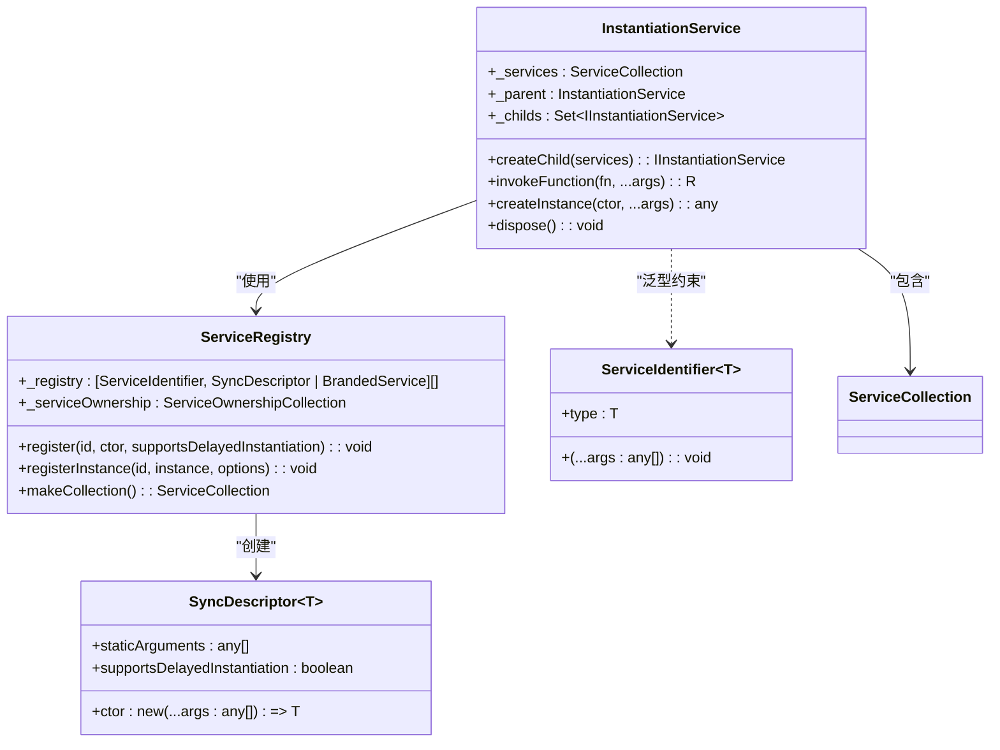
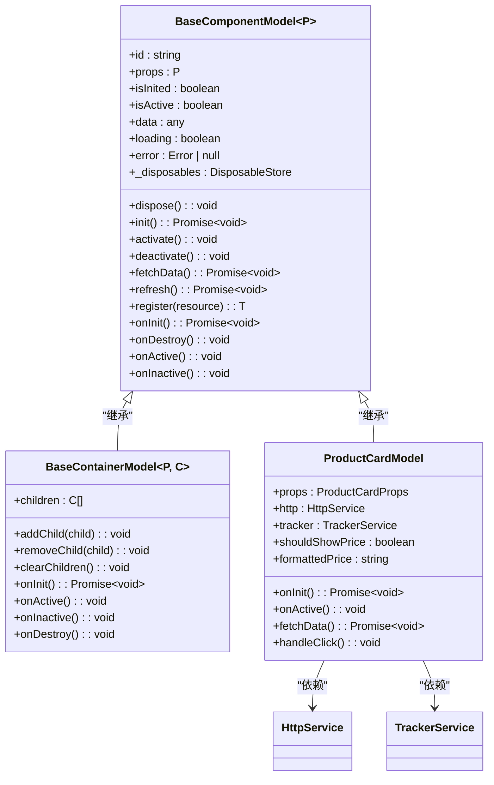
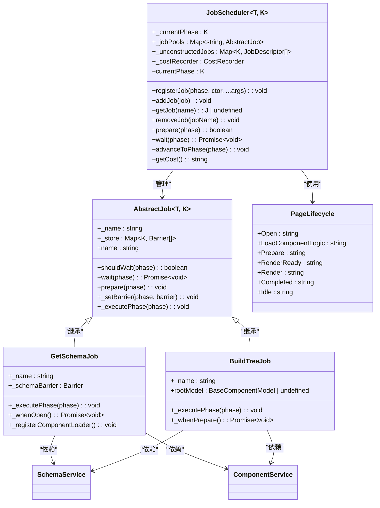

# 核心概念

<cite>
**本文档中引用的文件**   
- [instantiation-service.ts](file://packages/h5-builder/src/bedrock/di/instantiation-service.ts)
- [service-registry.ts](file://packages/h5-builder/src/bedrock/di/service-registry.ts)
- [base.ts](file://packages/h5-builder/src/bedrock/di/base.ts)
- [mobx.ts](file://packages/mobx-vue-lite/src/mobx.ts)
- [observer.ts](file://packages/mobx-vue-lite/src/observer.ts)
- [useObserver.ts](file://packages/mobx-vue-lite/src/useObserver.ts)
- [model.ts](file://packages/h5-builder/src/bedrock/model.ts)
- [product-card.model.ts](file://packages/h5-builder/src/components/product-card/product-card.model.ts)
- [job-scheduler.ts](file://packages/h5-builder/src/bedrock/launch/job-scheduler.ts)
- [abstract-job.ts](file://packages/h5-builder/src/bedrock/launch/abstract-job.ts)
- [get-schema-job.ts](file://packages/h5-builder/src/jobs/get-schema-job.ts)
- [build-tree-job.ts](file://packages/h5-builder/src/jobs/build-tree-job.ts)
- [lifecycle.ts](file://packages/h5-builder/src/jobs/lifecycle.ts)
- [schema.service.ts](file://packages/h5-builder/src/services/schema.service.ts)
</cite>

## 目录
1. [依赖注入](#依赖注入)
2. [响应式系统](#响应式系统)
3. [组件模型](#组件模型)
4. [任务调度](#任务调度)

## 依赖注入

在mobx框架中，依赖注入（DI）系统以`InstantiationService`为核心，作为DI容器管理服务的注册、解析和生命周期。该服务通过`ServiceRegistry`注册服务，支持立即实例化和延迟实例化两种模式。服务的依赖关系通过装饰器`@createDecorator`在编译时生成，并存储在构造函数的元数据中，确保在运行时能够正确解析依赖。

`InstantiationService`支持父子层级结构，子容器可以访问父容器注册的服务，同时可以覆盖或扩展服务。服务实例的创建过程通过深度优先搜索（DFS）算法检测循环依赖，确保系统稳定性。此外，通过`IdleValue`和代理机制，支持延迟实例化，优化资源使用。



**图示来源**
- [instantiation-service.ts](file://packages/h5-builder/src/bedrock/di/instantiation-service.ts#L61-L467)
- [service-registry.ts](file://packages/h5-builder/src/bedrock/di/service-registry.ts#L16-L100)
- [base.ts](file://packages/h5-builder/src/bedrock/di/base.ts#L9-L74)

**本节来源**
- [instantiation-service.ts](file://packages/h5-builder/src/bedrock/di/instantiation-service.ts#L61-L467)
- [service-registry.ts](file://packages/h5-builder/src/bedrock/di/service-registry.ts#L16-L100)
- [base.ts](file://packages/h5-builder/src/bedrock/di/base.ts#L9-L74)

## 响应式系统

mobx框架的响应式系统基于`@vue/reactivity`实现，通过`mobx-vue-lite`包提供自动依赖追踪和状态更新功能。核心API包括`observable`、`computed`、`autorun`和`reaction`，它们分别用于创建响应式对象、计算属性、自动运行函数和响应式表达式。

`observable`函数将普通对象转换为响应式对象，利用Vue的`reactive`机制追踪属性访问和修改。`computed`创建计算属性，仅在依赖项变化时重新计算。`autorun`和`reaction`用于副作用处理，当追踪的依赖项变化时自动执行指定函数。在React组件中，`useObserver` Hook结合`effect`和`stop`实现组件的自动重渲染。

```mermaid
classDiagram
class Mobx {
+observable(target) : T
+box(value) : Ref~T~
+computed(getter) : { get() : T }
+autorun(view) : IReactionDisposer
+reaction(expression, effectCallback, opts) : IReactionDisposer
+action(fn) : T
}
class Observer {
+useObserver(fn, baseComponentName) : T
+observer(baseComponent) : React.FunctionComponent
}
class VueReactivity {
+reactive(target) : T
+ref(value) : Ref~T~
+computed(getter) : ComputedRef~T~
+effect(fn, options) : ReactiveEffectRunner
+stop(runner) : void
}
Mobx --> VueReactivity : "依赖"
Observer --> VueReactivity : "依赖"
Observer --> Mobx : "使用"
```

**图示来源**
- [mobx.ts](file://packages/mobx-vue-lite/src/mobx.ts#L1-L65)
- [useObserver.ts](file://packages/mobx-vue-lite/src/useObserver.ts#L1-L59)
- [observer.ts](file://packages/mobx-vue-lite/src/observer.ts#L1-L52)

**本节来源**
- [mobx.ts](file://packages/mobx-vue-lite/src/mobx.ts#L1-L65)
- [useObserver.ts](file://packages/mobx-vue-lite/src/useObserver.ts#L1-L59)
- [observer.ts](file://packages/mobx-vue-lite/src/observer.ts#L1-L52)

## 组件模型

组件模型在mobx框架中通过`BaseComponentModel`类实现Model-View分离。该基类使用`observable`使自身成为响应式对象，其状态变化（如`isInited`、`isActive`、`data`、`loading`等）会自动触发视图更新。组件模型的生命周期包括初始化、激活、停用和销毁，通过`onInit`、`onActive`、`onInactive`和`onDestroy`钩子进行管理。

子组件模型继承`BaseComponentModel`，通过依赖注入获取所需服务（如`HttpService`、`TrackerService`），并在`onInit`中调用`refresh`方法获取数据。状态变化通过`fetchData`方法更新`data`、`loading`和`error`属性，视图组件通过`useObserver`监听这些状态变化并重新渲染。



**图示来源**
- [model.ts](file://packages/h5-builder/src/bedrock/model.ts#L10-L243)
- [product-card.model.ts](file://packages/h5-builder/src/components/product-card/product-card.model.ts#L29-L133)

**本节来源**
- [model.ts](file://packages/h5-builder/src/bedrock/model.ts#L10-L243)
- [product-card.model.ts](file://packages/h5-builder/src/components/product-card/product-card.model.ts#L29-L133)

## 任务调度

任务调度系统通过`JobScheduler`类控制页面生命周期，按有序阶段执行构建任务。`JobScheduler`管理多个`AbstractJob`实例，每个作业在特定生命周期阶段（`PageLifecycle`）执行。作业通过`registerJob`方法注册到特定阶段，`prepare`方法在阶段开始时实例化并准备作业，`wait`方法等待异步任务完成。

页面生命周期包括`Open`、`LoadComponentLogic`、`Prepare`、`RenderReady`、`Render`、`Completed`和`Idle`阶段。例如，`GetSchemaJob`在`Open`阶段获取页面schema，`BuildTreeJob`在`Prepare`阶段构建模型树。作业通过`Barrier`机制协调异步任务，确保任务按序完成。



**图示来源**
- [job-scheduler.ts](file://packages/h5-builder/src/bedrock/launch/job-scheduler.ts#L16-L123)
- [abstract-job.ts](file://packages/h5-builder/src/bedrock/launch/abstract-job.ts#L3-L46)
- [get-schema-job.ts](file://packages/h5-builder/src/jobs/get-schema-job.ts#L13-L119)
- [build-tree-job.ts](file://packages/h5-builder/src/jobs/build-tree-job.ts#L12-L59)
- [lifecycle.ts](file://packages/h5-builder/src/jobs/lifecycle.ts#L1-L18)

**本节来源**
- [job-scheduler.ts](file://packages/h5-builder/src/bedrock/launch/job-scheduler.ts#L16-L123)
- [abstract-job.ts](file://packages/h5-builder/src/bedrock/launch/abstract-job.ts#L3-L46)
- [get-schema-job.ts](file://packages/h5-builder/src/jobs/get-schema-job.ts#L13-L119)
- [build-tree-job.ts](file://packages/h5-builder/src/jobs/build-tree-job.ts#L12-L59)
- [lifecycle.ts](file://packages/h5-builder/src/jobs/lifecycle.ts#L1-L18)