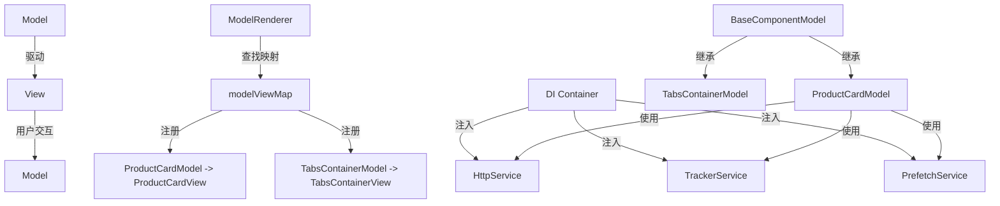
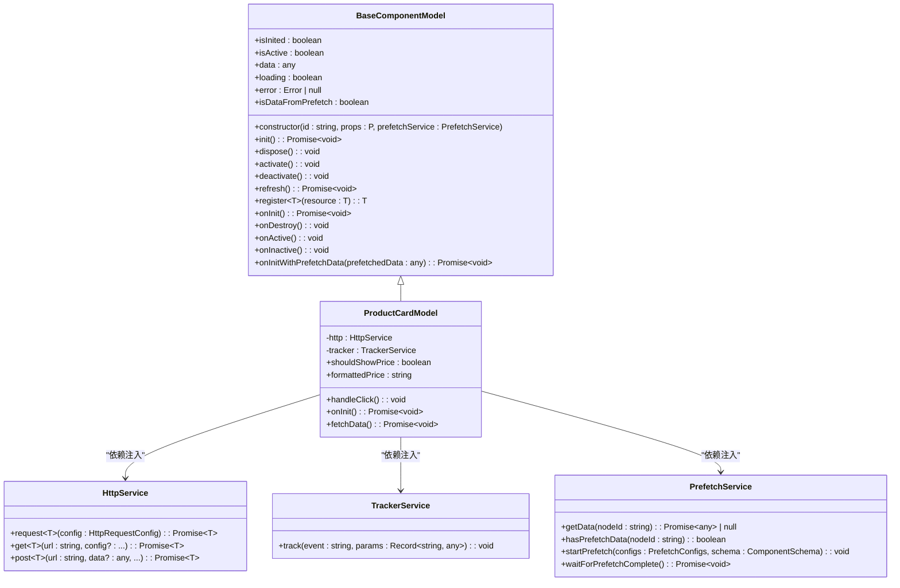
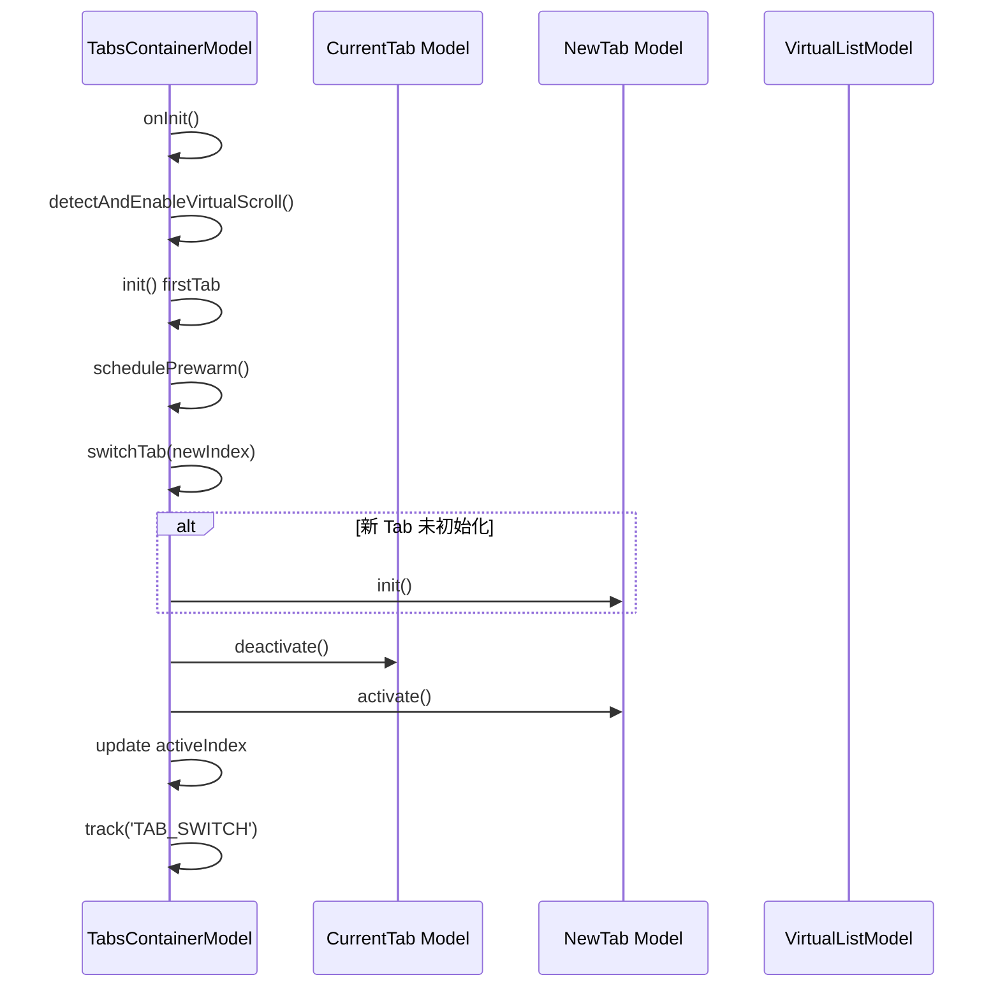
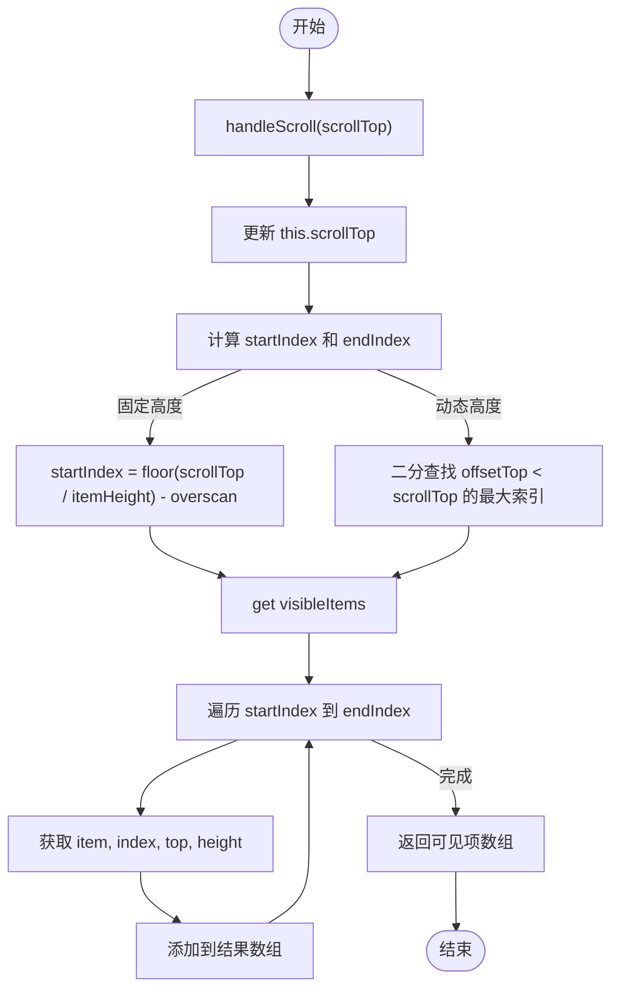
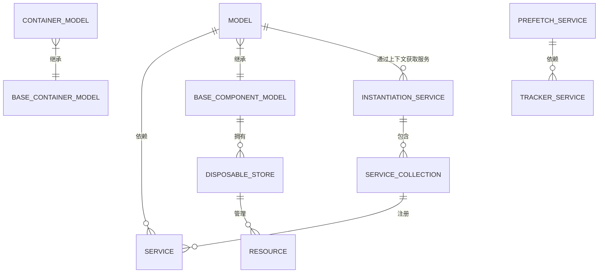

# 组件模型

<cite>
**本文档引用的文件**
- [model.ts](file://packages/h5-builder/src/bedrock/model.ts) - *更新了 BaseComponentModel 以支持预加载服务*
- [model-renderer.tsx](file://packages/h5-builder/src/components/model-renderer.tsx)
- [product-card.model.ts](file://packages/h5-builder/src/components/product-card/product-card.model.ts) - *更新以传递 PrefetchService 依赖*
- [tabs-container.model.ts](file://packages/h5-builder/src/components/tabs-container/tabs-container.model.ts) - *更新以传递 PrefetchService 依赖*
- [http.service.ts](file://packages/h5-builder/src/services/http.service.ts)
- [tracker.service.ts](file://packages/h5-builder/src/services/tracker.service.ts)
- [virtual-list.model.ts](file://packages/h5-builder/src/components/virtual-list/virtual-list.model.ts)
- [service-identifiers.ts](file://packages/h5-builder/src/services/service-identifiers.ts) - *新增了 IPrefetchService 标识符*
- [instantiation-service.ts](file://packages/h5-builder/src/bedrock/di/instantiation-service.ts)
- [context.web.tsx](file://packages/h5-builder/src/bedrock/di/context.web.tsx)
- [model.test.ts](file://packages/h5-builder/src/__tests__/model.test.ts) - *添加了 PrefetchService 的 mock*
- [disposable-store.ts](file://packages/h5-builder/src/bedrock/dispose/disposable-store.ts)
- [prefetch.service.ts](file://packages/h5-builder/src/services/prefetch.service.ts) - *新增的预加载服务*
</cite>

## 更新摘要
**变更内容**
- 更新了 `BaseComponentModel` 的构造函数，使其接受 `PrefetchService` 作为必需的依赖项。
- 重构了 `init` 方法，优先检查并使用预加载数据，若可用则调用新的 `onInitWithPrefetchData` 生命周期钩子。
- 新增了 `isDataFromPrefetch` getter 以供视图判断数据来源。
- 相应地更新了 `ProductCardModel` 和 `TabsContainerModel` 的构造函数以传递 `PrefetchService`。
- 在 `service-identifiers.ts` 中新增了 `IPrefetchService` 服务标识符。
- 在 `model.test.ts` 中添加了 `PrefetchService` 的 mock 实现。

## 目录
1. [简介](#简介)
2. [核心组件](#核心组件)
3. [架构概述](#架构概述)
4. [详细组件分析](#详细组件分析)
5. [依赖分析](#依赖分析)
6. [性能考虑](#性能考虑)
7. [故障排除指南](#故障排除指南)
8. [结论](#结论)

## 简介
本文档全面解析了基于 MobX 的组件模型（Component Model）的设计理念与实现细节。该模型采用模型-视图分离架构，其中 `BaseComponentModel` 作为所有组件模型的基类，封装了状态管理、生命周期钩子和业务逻辑。该基类已更新，现在接受 `PrefetchService` 作为必需的依赖项，并重构了 `init` 方法以支持预加载数据。模型负责数据与逻辑，而视图（View）负责 UI 渲染，两者通过 `ModelRenderer` 实现动态绑定。文档将结合 `ProductCard` 和 `TabsContainer` 等具体组件的实现，展示属性定义、异步数据加载和事件处理模式。同时，阐述模型如何与依赖注入（DI）系统集成以获取服务依赖，并响应外部状态变化。最后，提供自定义组件模型的最佳实践。

**Section sources**
- [model.ts](file://packages/h5-builder/src/bedrock/model.ts#L1-L243)

## 核心组件

`BaseComponentModel` 是所有业务组件模型的基类，它实现了 `IDisposable` 接口，确保资源的正确清理。该类利用 `mobx-vue-lite` 的 `observable` 函数，使整个对象及其状态（如 `isInited`, `isActive`, `data`, `loading`, `error`）变为响应式，从而驱动视图更新。**已更新**：构造函数现在接受 `@IPrefetchService protected prefetchService: PrefetchService` 作为第三个必需参数。`init` 方法已被重构，其逻辑变为：首先尝试通过 `prefetchService.getData(this.id)` 获取预加载数据。如果存在预加载数据，则将其赋值给 `this.data`，并设置 `this._dataFromPrefetch = true`，然后检查子类是否覆写了 `onInitWithPrefetchData` 钩子，如果覆写则调用它来加载补充数据；如果预加载失败或没有预加载数据，则回退到调用原有的 `onInit` 方法。该类还定义了 `init`, `dispose`, `activate`, `deactivate` 等核心方法，并通过 `onInit`, `onDestroy`, `onActive`, `onInactive` 等抽象或可覆写的生命周期钩子，为子类提供扩展点。`register` 方法用于管理资源（如定时器、事件监听器），这些资源会在模型销毁时被自动清理。此外，新增了 `isDataFromPrefetch` getter，供视图层判断当前数据是否来自预加载。

`BaseContainerModel` 继承自 `BaseComponentModel`，专为包含子模型的容器组件（如 Tabs, List）设计。它维护了一个 `children` 数组，并提供了 `addChild`, `removeChild`, `clearChildren` 等方法来管理子模型。其默认的生命周期行为是：`onInit` 时并行初始化所有子组件，`onActive` 和 `onInactive` 时分别激活和停用所有子组件。子类可以覆写这些方法以实现自定义逻辑（如懒加载）。

**Section sources**
- [model.ts](file://packages/h5-builder/src/bedrock/model.ts#L10-L242)

## 架构概述

该组件模型的核心是模型-视图分离（Model-View Separation）架构。模型（Model）专注于数据获取、状态管理和业务逻辑，而视图（View）则纯粹负责根据模型的状态渲染 UI。这种分离提高了代码的可维护性和可测试性。`ModelRenderer` 组件是连接模型与视图的桥梁，它通过一个 `modelViewMap` 映射表，根据模型的构造函数查找并渲染对应的视图组件。如果未找到注册的视图，则会根据模型类型（如占位符或容器）提供默认渲染。

**Diagram sources**
- [model-renderer.tsx](file://packages/h5-builder/src/components/model-renderer.tsx#L10-L37)
- [model.ts](file://packages/h5-builder/src/bedrock/model.ts#L10-L242)

## 详细组件分析

### ProductCardModel 分析
`ProductCardModel` 是 `BaseComponentModel` 的一个具体实现，用于展示商品卡片。它通过依赖注入获取 `HttpService`、`TrackerService` 和 `PrefetchService` 服务。**已更新**：其构造函数现在接收 `@IPrefetchService prefetchService: PrefetchService` 作为第三个依赖，并通过 `super(id, props, prefetchService)` 将其传递给基类。在 `onInit` 钩子中，它调用 `refresh` 方法来加载商品数据。`fetchData` 方法模拟了异步数据获取过程，包括网络延迟和错误处理。成功获取数据后，会通过 `TrackerService` 上报 `PRODUCT_LOADED` 埋点。它还定义了 `handleClick` 方法来处理用户点击事件，并上报 `PRODUCT_CLICK` 埋点。此外，它使用 `get` 语法定义了 `shouldShowPrice` 和 `formattedPrice` 两个计算属性，这些属性会根据 `props` 和 `data` 自动更新。

**Diagram sources**
- [product-card.model.ts](file://packages/h5-builder/src/components/product-card/product-card.model.ts#L29-L132)
- [http.service.ts](file://packages/h5-builder/src/services/http.service.ts#L56-L280)
- [tracker.service.ts](file://packages/h5-builder/src/services/tracker.service.ts#L34-L227)
- [prefetch.service.ts](file://packages/h5-builder/src/services/prefetch.service.ts#L5-L271)

### TabsContainerModel 分析
`TabsContainerModel` 是 `BaseContainerModel` 的一个高级实现，用于管理多个标签页。它覆写了 `onInit` 方法，实现了懒加载策略：只初始化当前激活的 Tab，而不是所有子组件。这显著提升了首屏性能。它还引入了自动虚拟滚动优化功能，当某个 Tab 的子组件数量超过阈值时，会自动为其创建一个 `VirtualListModel` 来优化渲染性能。`switchTab` 方法负责处理 Tab 切换，包括懒加载新 Tab 和管理生命周期。`schedulePrewarm` 方法实现了渐进式预热策略，优先预热相邻的 Tab，以提升用户体验。**已更新**：其构造函数现在接收 `@IPrefetchService prefetchService: PrefetchService` 作为第三个依赖，并通过 `super(id, props, prefetchService)` 将其传递给基类。

**Diagram sources**
- [tabs-container.model.ts](file://packages/h5-builder/src/components/tabs-container/tabs-container.model.ts#L29-L272)
- [virtual-list.model.ts](file://packages/h5-builder/src/components/virtual-list/virtual-list.model.ts#L20-L216)

### VirtualListModel 分析
`VirtualListModel` 是一个专门用于优化长列表渲染的模型。它支持固定高度和动态高度两种模式。模型通过 `scrollTop` 属性跟踪滚动位置，并利用 `heightCache` 和 `offsetCache` 缓存项的高度和偏移量，以提高性能。`startIndex` 和 `endIndex` 计算属性通过二分查找（动态高度）或简单计算（固定高度）来确定当前视口内需要渲染的项的范围。`visibleItems` 计算属性则返回这些可见项及其布局信息，供视图使用。

**Diagram sources**
- [virtual-list.model.ts](file://packages/h5-builder/src/components/virtual-list/virtual-list.model.ts#L20-L216)

## 依赖分析

组件模型与依赖注入（DI）系统紧密集成。服务（如 `HttpService`, `TrackerService`, `PrefetchService`）通过 `service-identifiers.ts` 中定义的标识符（如 `IHttpService`, `ITrackerService`, `IPrefetchService`）进行注册和解析。`InstantiationService` 是 DI 容器的核心，负责创建实例并注入其依赖。在组件模型的构造函数中，使用 `@IHttpService private http: HttpService` 这样的装饰器语法来声明依赖，DI 系统会在实例化时自动提供这些服务。`ModelRenderer` 组件本身也依赖于 `useService` 这个 React Hook 来获取服务，这表明整个应用的上下文由 `InstantiationContext` 提供。

**Diagram sources**
- [instantiation-service.ts](file://packages/h5-builder/src/bedrock/di/instantiation-service.ts#L61-L467)
- [context.web.tsx](file://packages/h5-builder/src/bedrock/di/context.web.tsx#L1-L42)
- [service-identifiers.ts](file://packages/h5-builder/src/services/service-identifiers.ts#L1-L20)
- [prefetch.service.ts](file://packages/h5-builder/src/services/prefetch.service.ts#L21-L23)

## 性能考虑

该组件模型在设计上充分考虑了性能。`BaseComponentModel` 的 `refresh` 方法通过 `loading` 和 `error` 状态提供了清晰的加载反馈。`TabsContainerModel` 的懒加载和渐进式预热策略避免了不必要的初始化开销。`VirtualListModel` 通过只渲染视口内的项，极大地减少了 DOM 节点数量，从而提升了长列表的滚动性能。DI 系统的 `IdleValue` 机制支持服务的延迟初始化，进一步优化了启动性能。此外，`DisposableStore` 确保了所有资源（如定时器、事件监听器）都能被正确清理，防止内存泄漏。**新增**：通过 `PrefetchService` 在页面早期阶段（Open 阶段）启动数据预加载，使得 `BaseComponentModel` 在 `init` 时能优先使用预加载数据，从而显著缩短了用户感知的加载时间。

## 故障排除指南

在使用组件模型时，可能会遇到以下问题：
- **重复初始化警告**：如果 `init()` 方法被多次调用，控制台会输出警告。应确保 `init()` 只在组件挂载时调用一次。
- **资源泄漏**：如果忘记通过 `register` 方法注册需要清理的资源，可能会导致内存泄漏。务必在 `onInit` 或其他方法中创建的资源（如 `setInterval` 返回的 ID）通过 `register` 进行管理。
- **DI 服务注入失败**：如果在构造函数中声明了依赖但注入失败，检查服务是否已在 DI 容器中正确注册，并确认 `InstantiationContext` 是否已正确包裹应用。
- **虚拟列表渲染异常**：如果 `VirtualListModel` 在动态高度模式下表现异常，确保视图组件在测量到项的高度后，及时调用 `updateItemHeight` 方法更新缓存。
- **预加载数据未生效**：如果 `isDataFromPrefetch` 始终为 `false`，请检查 `PrefetchService` 是否已在 DI 容器中正确注册，并确认 `GetSchemaJob` 是否在 `Open` 阶段调用了 `startPrefetch` 方法。

**Section sources**
- [model.ts](file://packages/h5-builder/src/bedrock/model.ts#L50-L57)
- [disposable-store.ts](file://packages/h5-builder/src/bedrock/dispose/disposable-store.ts#L21-L25)
- [instantiation-service.ts](file://packages/h5-builder/src/bedrock/di/instantiation-service.ts#L133-L138)

## 结论

本文档详细解析了基于 MobX 的组件模型设计。`BaseComponentModel` 作为基类，提供了一套完整的状态管理、生命周期管理和资源清理机制。通过模型-视图分离架构，实现了逻辑与表现的解耦。`ModelRenderer` 作为动态绑定的核心，使得模型与视图的关联变得灵活而清晰。结合 `ProductCard` 和 `TabsContainer` 等具体实现，展示了如何利用依赖注入获取服务、处理异步数据、响应用户事件以及进行性能优化。**特别地，通过引入 `PrefetchService` 依赖和重构 `init` 方法，模型现在能够智能地利用预加载数据，优先使用预加载数据并选择性地加载补充数据，从而为构建复杂、高性能的前端应用提供了更坚实的基础。**