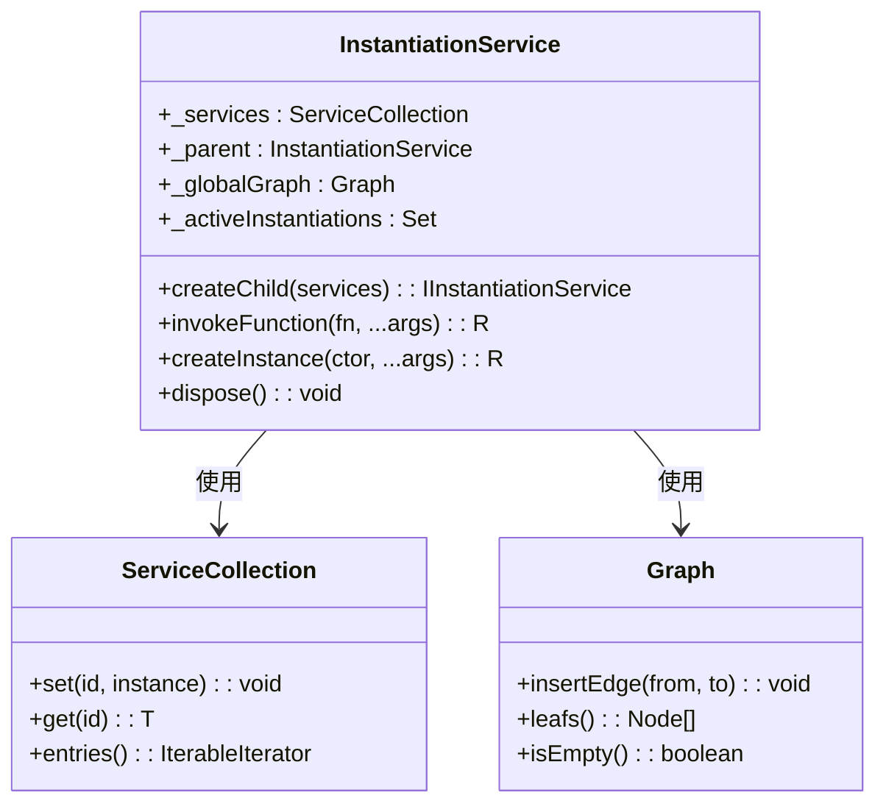
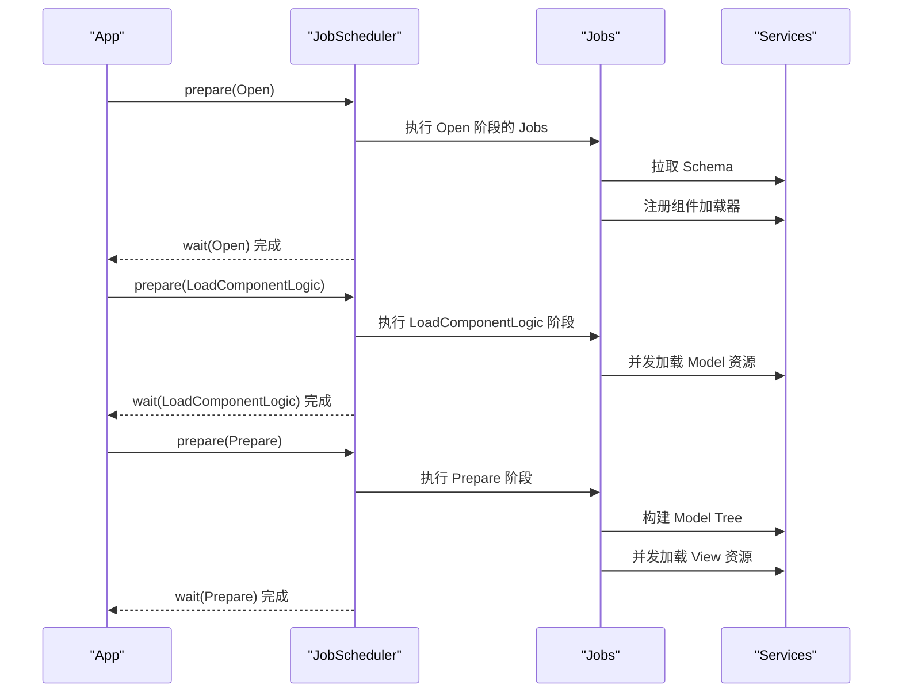
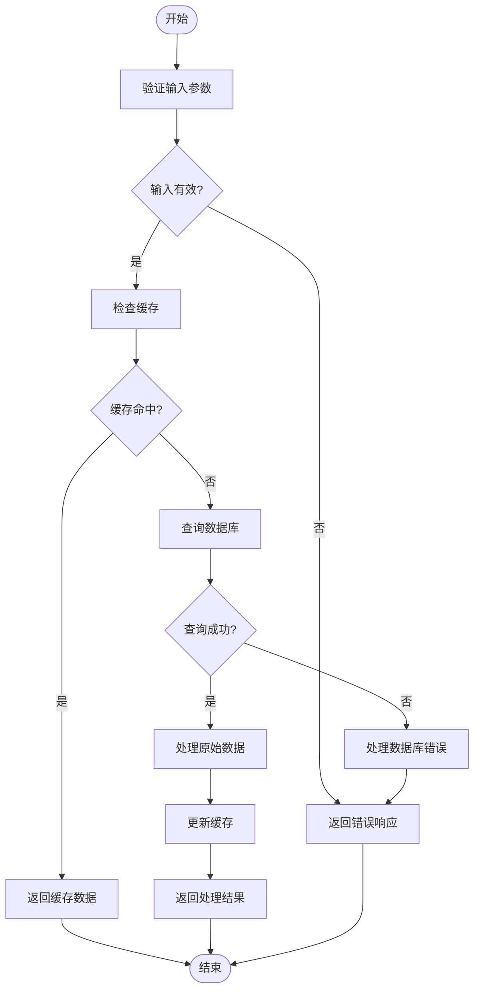
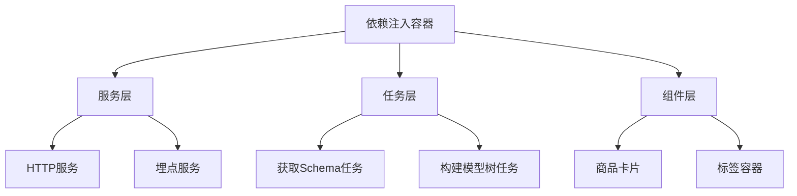

# 移动构建器架构

<cite>
**本文档中引用的文件**   
- [architecture-design.md](file://packages/mobile-builder/docs/architecture-design.md)
- [instantiation-service.ts](file://packages/mobile-builder/src/bedrock/di/instantiation-service.ts)
- [job-scheduler.ts](file://packages/mobile-builder/src/bedrock/launch/job-scheduler.ts)
- [model.ts](file://packages/mobile-builder/src/bedrock/model/model.ts)
- [component.service.ts](file://packages/mobile-builder/src/services/component.service.ts)
- [http.service.ts](file://packages/mobile-builder/src/services/http.service.ts)
- [tracker.service.ts](file://packages/mobile-builder/src/services/tracker.service.ts)
- [get-schema-job.ts](file://packages/mobile-builder/src/jobs/get-schema-job.ts)
- [build-tree-job.ts](file://packages/mobile-builder/src/jobs/build-tree-job.ts)
- [service-identifiers.ts](file://packages/mobile-builder/src/services/service-identifiers.ts)
- [product-card.model.ts](file://packages/mobile-builder/src/components/product-card/product-card.model.ts)
- [product-card.view.tsx](file://packages/mobile-builder/src/components/product-card/product-card.view.tsx)
</cite>

## 目录
1. [引言](#引言)
2. [项目结构](#项目结构)
3. [核心组件](#核心组件)
4. [架构概览](#架构概览)
5. [详细组件分析](#详细组件分析)
6. [依赖分析](#依赖分析)
7. [性能考虑](#性能考虑)
8. [故障排除指南](#故障排除指南)
9. [结论](#结论)

## 引言
移动构建器架构是一个现代化的前端框架，专为电商搭建场景下的移动端落地页设计。该架构基于依赖注入、生命周期驱动和逻辑视图分离等核心设计思想，旨在提供一个解耦、可测试且可扩展的开发环境。通过使用依赖注入容器、任务调度器以及响应式状态管理，该架构能够有效提升应用的启动性能和用户体验。

**Section sources**
- [architecture-design.md](file://packages/mobile-builder/docs/architecture-design.md)

## 项目结构
移动构建器项目的目录结构清晰地划分了不同层次的代码，包括基础设施层（bedrock）、服务层（services）、任务层（jobs）和组件层（components）。这种分层设计有助于维护代码的模块化和可维护性。

```
h5-builder/
├── src/
│   ├── bedrock/              # 基础设施层（参考 VSCode 架构）
│   │   ├── di/              # 依赖注入系统
│   │   ├── launch/          # 启动和调度系统
│   │   ├── async/           # 异步工具（Barrier、Queue 等）
│   │   ├── event/           # 事件系统
│   │   ├── dispose/         # 资源管理
│   │   └── model.ts         # Model 基类
│   ├── services/            # 服务层
│   │   ├── component.service.ts    # 组件注册、加载、构建
│   │   ├── http.service.ts         # HTTP 请求
│   │   ├── tracker.service.ts      # 埋点上报
│   │   └── service-identifiers.ts  # 服务标识符定义
│   ├── jobs/                # 任务层（生命周期驱动）
│   │   ├── lifecycle.ts            # 生命周期枚举
│   │   ├── get-schema-job.ts       # 获取 Schema
│   │   ├── load-components-job.ts  # 加载组件资源
│   │   ├── build-tree-job.ts       # 构建模型树
│   │   └── activate-tree-job.ts    # 激活组件树
│   └── components/          # 组件层（Model + View 分离）
│       ├── product-card/
│       │   ├── product-card.model.ts    # 业务逻辑
│       │   └── product-card.view.tsx    # UI 渲染
│       └── tabs-container/
│           ├── tabs-container.model.ts
│           └── tabs-container.view.tsx
```

**Section sources**
- [architecture-design.md](file://packages/mobile-builder/docs/architecture-design.md)

## 核心组件
移动构建器的核心组件包括依赖注入容器、任务调度器、Model 基类、服务层、任务层和组件层。这些组件共同构成了一个高效且灵活的前端架构。

**Section sources**
- [architecture-design.md](file://packages/mobile-builder/docs/architecture-design.md)

## 架构概览
移动构建器的整体架构分为应用层、基础设施层和业务层。应用层负责启动入口和生命周期管理；基础设施层提供了依赖注入容器、任务调度器和Model基类；业务层则包含了服务层、任务层和组件层。

```mermaid
graph TB
subgraph "应用层 Application Layer"
App[App 启动入口]
Lifecycle[生命周期管理]
end
subgraph "基础设施层 Bedrock Layer"
DI[依赖注入容器\nInstantiationService]
Scheduler[任务调度器\nJobScheduler]
Model[Model 基类\nBaseComponentModel]
end
subgraph "业务层 Business Layer"
Services[服务层\nComponentService\nHttpService\nTrackerService]
Jobs[Job 层\nGetSchemaJob\nLoadComponentsJob\nBuildTreeJob]
Components[组件层\nModel + View]
end
App --> Lifecycle
Lifecycle --> Scheduler
Scheduler --> Jobs
Jobs --> Services
Components --> Model
Components --> Services
DI ..> Services : 注入依赖
DI ..> Jobs : 注入依赖
DI ..> Components : 注入依赖
```

**Diagram sources **
- [architecture-design.md](file://packages/mobile-builder/docs/architecture-design.md)

## 详细组件分析

### 依赖注入容器分析
依赖注入容器是移动构建器架构中的关键组件之一，它通过解耦模块之间的依赖关系来提高代码的可测试性和可扩展性。

#### 依赖注入容器类图


**Diagram sources **
- [instantiation-service.ts](file://packages/mobile-builder/src/bedrock/di/instantiation-service.ts)

### 任务调度器分析
任务调度器负责按生命周期阶段调度和执行任务，确保各个阶段的任务能够有序进行。

#### 任务调度器序列图


**Diagram sources **
- [job-scheduler.ts](file://packages/mobile-builder/src/bedrock/launch/job-scheduler.ts)

### Model-View 分离分析
Model-View 分离模式将业务逻辑与UI渲染完全解耦，使得Model可以独立于UI框架进行测试和复用。

#### Model-View 分离流程图


**Diagram sources **
- [model.ts](file://packages/mobile-builder/src/bedrock/model/model.ts)

## 依赖分析
移动构建器的依赖关系主要体现在依赖注入容器对服务层、任务层和组件层的依赖，以及各层内部组件之间的依赖。



**Diagram sources **
- [service-identifiers.ts](file://packages/mobile-builder/src/services/service-identifiers.ts)

## 性能考虑
移动构建器通过渐进式渲染和优先级加载策略优化了首屏时间和用户体验。关键组件优先加载，非关键组件延后加载，避免了全量加载阻塞的问题。

**Section sources**
- [architecture-design.md](file://packages/mobile-builder/docs/architecture-design.md)

## 故障排除指南
在开发过程中，可能会遇到依赖注入失败、任务调度异常等问题。建议检查服务注册是否正确、生命周期阶段是否匹配，并利用埋点服务监控关键事件。

**Section sources**
- [http.service.ts](file://packages/mobile-builder/src/services/http.service.ts)
- [tracker.service.ts](file://packages/mobile-builder/src/services/tracker.service.ts)

## 结论
移动构建器架构通过依赖注入、生命周期驱动和Model-View分离等设计思想，构建了一个高效、灵活且易于维护的前端框架。该架构不仅提升了开发效率，还显著改善了用户体验。