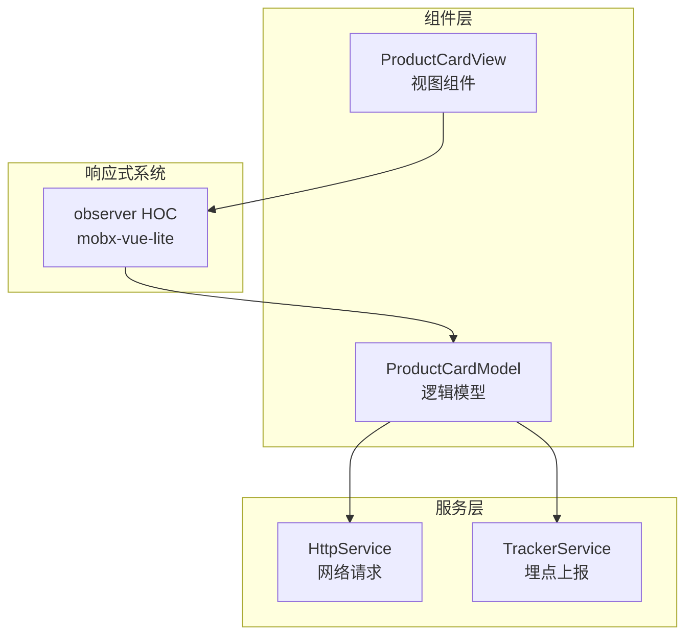
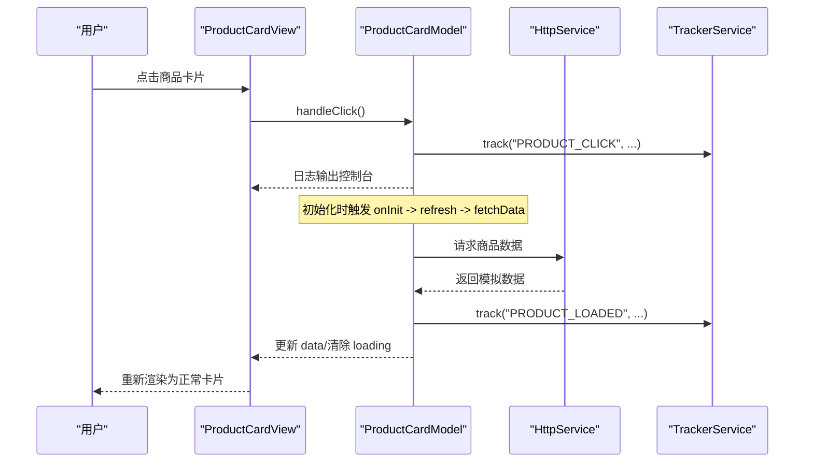
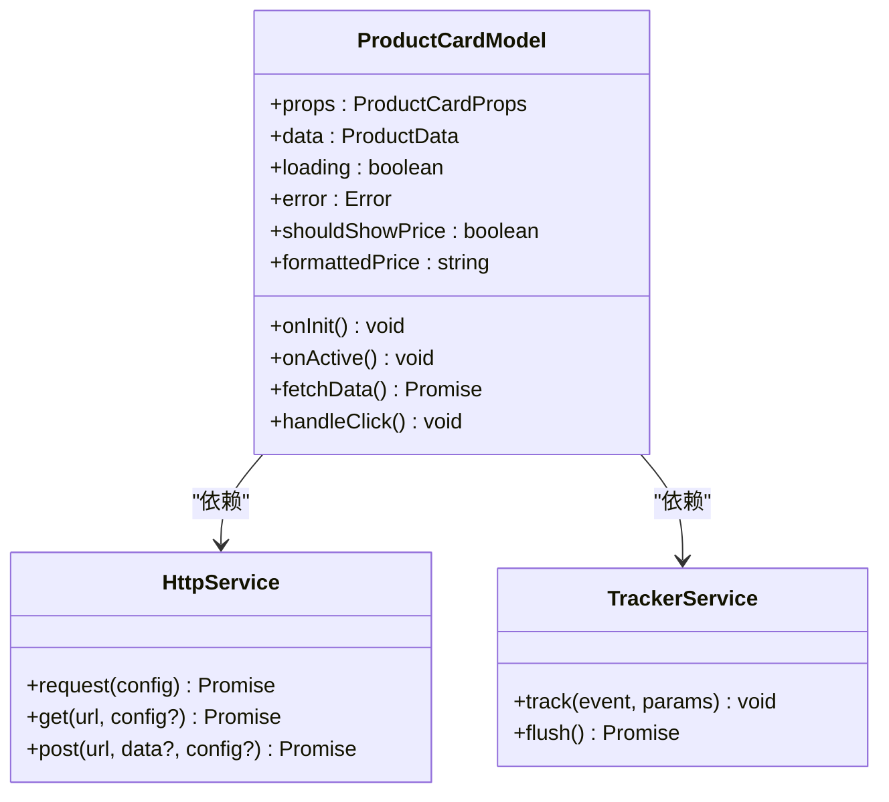
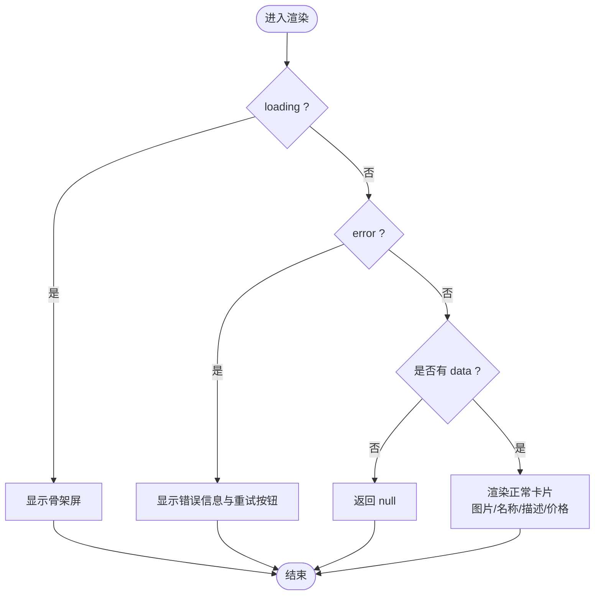
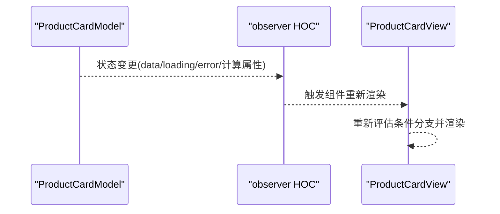
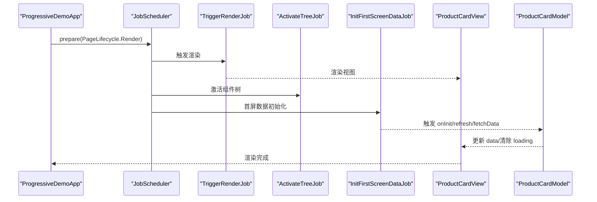
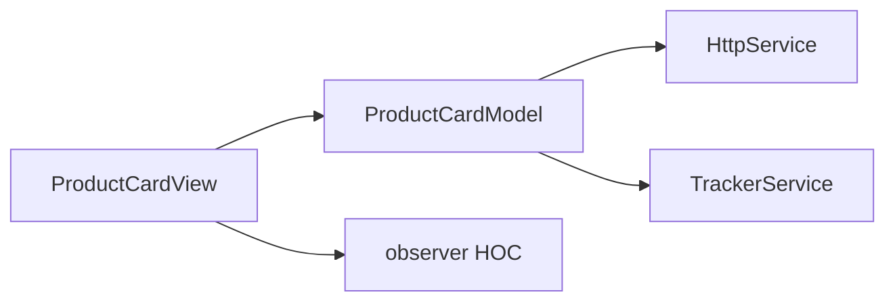

# 商品卡片组件

<cite>
**本文引用的文件**
- [product-card.model.ts](file://packages/h5-builder/src/components/product-card/product-card.model.ts)
- [product-card.view.tsx](file://packages/h5-builder/src/components/product-card/product-card.view.tsx)
- [observer.ts](file://packages/mobx-vue-lite/src/observer.ts)
- [index.ts](file://packages/mobx-vue-lite/src/index.ts)
- [demo-progressive.tsx](file://packages/h5-builder/src/demo-progressive.tsx)
- [demo.css](file://packages/h5-builder/src/demo.css)
- [http.service.ts](file://packages/h5-builder/src/services/http.service.ts)
- [tracker.service.ts](file://packages/h5-builder/src/services/tracker.service.ts)
</cite>

## 目录
1. [简介](#简介)
2. [项目结构](#项目结构)
3. [核心组件](#核心组件)
4. [架构总览](#架构总览)
5. [详细组件分析](#详细组件分析)
6. [依赖关系分析](#依赖关系分析)
7. [性能考虑](#性能考虑)
8. [故障排查指南](#故障排查指南)
9. [结论](#结论)
10. [附录](#附录)

## 简介
本文件围绕电商页面的核心展示单元“商品卡片”组件进行系统化文档化，重点解释其设计目的、视觉结构、数据绑定与响应式更新机制，以及与 mobx-vue-lite 响应式系统的集成方式。文档同时结合 demo-progressive.tsx 中的实际用例，说明如何通过 product-card.model.ts 实现数据加载、状态管理与埋点上报，并提供常见问题的解决方案与性能优化建议。

## 项目结构
商品卡片组件位于 h5-builder 包内，采用“逻辑模型 + 视图”的分层设计：
- 逻辑模型：product-card.model.ts，负责数据加载、状态管理、计算属性与埋点上报
- 视图组件：product-card.view.tsx，负责渲染 UI，使用 observer 将响应式状态自动映射到视图
- 响应式集成：通过 mobx-vue-lite 的 observer HOC 实现细粒度订阅与自动刷新
- 样式：demo.css 中定义了商品卡片的基础样式与骨架屏、错误态样式
- 服务：http.service.ts 提供网络请求能力；tracker.service.ts 提供埋点上报能力

图表来源
- [product-card.view.tsx](file://packages/h5-builder/src/components/product-card/product-card.view.tsx#L1-L81)
- [product-card.model.ts](file://packages/h5-builder/src/components/product-card/product-card.model.ts#L1-L133)
- [observer.ts](file://packages/mobx-vue-lite/src/observer.ts#L1-L52)
- [http.service.ts](file://packages/h5-builder/src/services/http.service.ts#L1-L281)
- [tracker.service.ts](file://packages/h5-builder/src/services/tracker.service.ts#L1-L290)

章节来源
- [product-card.model.ts](file://packages/h5-builder/src/components/product-card/product-card.model.ts#L1-L133)
- [product-card.view.tsx](file://packages/h5-builder/src/components/product-card/product-card.view.tsx#L1-L81)
- [demo-progressive.tsx](file://packages/h5-builder/src/demo-progressive.tsx#L1-L263)
- [demo.css](file://packages/h5-builder/src/demo.css#L180-L298)

## 核心组件
- 商品卡片模型（ProductCardModel）
  - 负责：初始化加载、激活曝光上报、点击事件上报、数据获取、计算属性（是否显示价格、价格格式化）
  - 状态：继承自基类的 data、loading、error，支持 refresh 刷新
- 商品卡片视图（ProductCardView）
  - 负责：根据模型状态渲染加载态、错误态与正常内容；通过 observer 自动响应模型状态变化
  - 交互：点击卡片调用模型的 handleClick 方法

章节来源
- [product-card.model.ts](file://packages/h5-builder/src/components/product-card/product-card.model.ts#L1-L133)
- [product-card.view.tsx](file://packages/h5-builder/src/components/product-card/product-card.view.tsx#L1-L81)

## 架构总览
商品卡片遵循“逻辑模型 + 视图”的分层架构，视图通过 observer HOC 订阅模型的可观察状态，当模型状态变化时，视图自动刷新。模型内部通过服务注入实现网络请求与埋点上报，形成清晰的职责边界。

图表来源
- [product-card.view.tsx](file://packages/h5-builder/src/components/product-card/product-card.view.tsx#L1-L81)
- [product-card.model.ts](file://packages/h5-builder/src/components/product-card/product-card.model.ts#L1-L133)
- [http.service.ts](file://packages/h5-builder/src/services/http.service.ts#L1-L281)
- [tracker.service.ts](file://packages/h5-builder/src/services/tracker.service.ts#L1-L290)

## 详细组件分析

### 商品卡片模型（ProductCardModel）
- 数据结构与接口
  - ProductData：id、name、price、image、description
  - ProductCardProps：productId、showPrice?
- 生命周期与状态
  - onInit：初始化时调用 refresh
  - onActive：激活时上报曝光埋点
  - data、loading、error：继承自基类，支持 refresh 刷新
- 数据获取与计算
  - fetchData：模拟异步加载，生成随机描述与图片，设置 data 并上报“已加载”埋点
  - shouldShowPrice：根据 props 决定是否显示价格
  - formattedPrice：格式化价格字符串（保留两位小数）
- 事件处理
  - handleClick：上报点击埋点并输出日志

图表来源
- [product-card.model.ts](file://packages/h5-builder/src/components/product-card/product-card.model.ts#L1-L133)
- [http.service.ts](file://packages/h5-builder/src/services/http.service.ts#L1-L281)
- [tracker.service.ts](file://packages/h5-builder/src/services/tracker.service.ts#L1-L290)

章节来源
- [product-card.model.ts](file://packages/h5-builder/src/components/product-card/product-card.model.ts#L1-L133)

### 商品卡片视图（ProductCardView）
- 设计原则
  - 仅接收 model 作为 props，不包含业务逻辑
  - 使用 observer HOC 包裹，自动响应模型状态变化
  - 交互统一委托给模型方法处理
- 状态渲染
  - loading：显示骨架屏与加载提示
  - error：显示错误信息与“重试”按钮（调用 model.refresh）
  - 正常：渲染图片、名称、描述、价格（受 shouldShowPrice 控制）
- 交互
  - 点击卡片：调用 model.handleClick()

图表来源
- [product-card.view.tsx](file://packages/h5-builder/src/components/product-card/product-card.view.tsx#L1-L81)

章节来源
- [product-card.view.tsx](file://packages/h5-builder/src/components/product-card/product-card.view.tsx#L1-L81)

### 响应式系统集成（mobx-vue-lite）
- observer HOC
  - observer 将函数组件包装为可观察组件，在组件内部访问的任何可观察值发生变化时，组件会自动重新渲染
  - 在静态渲染或 SSR 场景下直接返回原组件，避免不必要的包裹
  - 对 forwardRef 组件提供兼容处理，并自动 memo 化以减少不必要渲染
- 在商品卡片中的应用
  - ProductCardView 通过 observer 包裹，内部读取 model 的 data、loading、error、计算属性等，当这些状态变化时，视图自动刷新

图表来源
- [observer.ts](file://packages/mobx-vue-lite/src/observer.ts#L1-L52)
- [product-card.view.tsx](file://packages/h5-builder/src/components/product-card/product-card.view.tsx#L1-L81)

章节来源
- [observer.ts](file://packages/mobx-vue-lite/src/observer.ts#L1-L52)
- [index.ts](file://packages/mobx-vue-lite/src/index.ts#L1-L7)

### 与 demo-progressive.tsx 的集成
- 渐进式渲染流程
  - 通过 JobScheduler 驱动页面生命周期：Open、LoadComponentLogic、Prepare、RenderReady、Render、Completed、Idle
  - Render 阶段触发渲染与组件树激活，Completed 阶段进行首屏数据初始化
- 商品卡片在该流程中的作用
  - 在 RenderReady 阶段，视图开始渲染；在 Completed 阶段，模型完成数据加载与埋点上报
  - 视图通过 observer 自动响应模型状态变化，无需手动订阅

图表来源
- [demo-progressive.tsx](file://packages/h5-builder/src/demo-progressive.tsx#L1-L263)
- [product-card.model.ts](file://packages/h5-builder/src/components/product-card/product-card.model.ts#L1-L133)
- [product-card.view.tsx](file://packages/h5-builder/src/components/product-card/product-card.view.tsx#L1-L81)

章节来源
- [demo-progressive.tsx](file://packages/h5-builder/src/demo-progressive.tsx#L1-L263)

## 依赖关系分析
- 组件耦合
  - ProductCardView 仅依赖 ProductCardModel 的公共接口，耦合度低
  - ProductCardModel 依赖 HttpService 与 TrackerService，便于替换与测试
- 外部依赖
  - mobx-vue-lite 的 observer 提供细粒度响应式订阅
  - HttpService 提供请求拦截、超时、取消等能力
  - TrackerService 提供埋点队列、批量发送、持久化与调试模式

图表来源
- [product-card.view.tsx](file://packages/h5-builder/src/components/product-card/product-card.view.tsx#L1-L81)
- [product-card.model.ts](file://packages/h5-builder/src/components/product-card/product-card.model.ts#L1-L133)
- [observer.ts](file://packages/mobx-vue-lite/src/observer.ts#L1-L52)
- [http.service.ts](file://packages/h5-builder/src/services/http.service.ts#L1-L281)
- [tracker.service.ts](file://packages/h5-builder/src/services/tracker.service.ts#L1-L290)

章节来源
- [product-card.model.ts](file://packages/h5-builder/src/components/product-card/product-card.model.ts#L1-L133)
- [product-card.view.tsx](file://packages/h5-builder/src/components/product-card/product-card.view.tsx#L1-L81)
- [observer.ts](file://packages/mobx-vue-lite/src/observer.ts#L1-L52)

## 性能考虑
- 避免重复渲染
  - 使用 observer 包裹视图，只在访问到的可观察值变化时才重新渲染
  - 将计算属性（如 formattedPrice、shouldShowPrice）放在模型中，避免在视图中重复计算
- 网络请求优化
  - 使用 HttpService 的请求拦截器与超时配置，合理设置 timeout
  - 在组件卸载或离开页面时，可通过取消未完成请求避免资源浪费
- 埋点性能
  - TrackerService 支持批量发送与定时刷新，避免频繁 IO
  - Debug 模式下同步发送，便于开发调试但不建议在生产环境启用
- 视图渲染优化
  - 使用骨架屏与错误态，提升感知性能
  - 图片懒加载与占位符配合，减少首屏阻塞

章节来源
- [observer.ts](file://packages/mobx-vue-lite/src/observer.ts#L1-L52)
- [http.service.ts](file://packages/h5-builder/src/services/http.service.ts#L1-L281)
- [tracker.service.ts](file://packages/h5-builder/src/services/tracker.service.ts#L1-L290)
- [demo.css](file://packages/h5-builder/src/demo.css#L180-L298)

## 故障排查指南
- 图片懒加载失败
  - 现象：图片无法显示或加载缓慢
  - 排查要点：检查图片地址是否有效、网络是否可达、是否被浏览器拦截
  - 解决建议：在视图层增加错误回退（如占位图）、使用懒加载策略、确认跨域与缓存配置
- 价格格式化异常
  - 现象：价格显示为科学计数法或小数位不一致
  - 排查要点：确认 price 来源类型（number）、formattedPrice 的格式化逻辑
  - 解决建议：在模型中统一使用数值类型与固定小数位格式化，避免在视图中重复格式化
- 埋点上报失败
  - 现象：埋点未生效或丢失
  - 排查要点：检查 TrackerService 的队列与批量发送逻辑、持久化开关、调试模式
  - 解决建议：在开发环境开启 debug 模式验证；生产环境关注 flush 时机与失败重试
- 网络请求超时或中断
  - 现象：数据长时间未返回或报错
  - 排查要点：检查 timeout 配置、请求拦截器、是否被取消
  - 解决建议：合理设置超时时间，必要时提供“重试”按钮；在组件卸载时取消请求

章节来源
- [product-card.view.tsx](file://packages/h5-builder/src/components/product-card/product-card.view.tsx#L1-L81)
- [product-card.model.ts](file://packages/h5-builder/src/components/product-card/product-card.model.ts#L1-L133)
- [http.service.ts](file://packages/h5-builder/src/services/http.service.ts#L1-L281)
- [tracker.service.ts](file://packages/h5-builder/src/services/tracker.service.ts#L1-L290)

## 结论
商品卡片组件通过“逻辑模型 + 视图”的分层设计，实现了清晰的职责划分与良好的可维护性。借助 mobx-vue-lite 的 observer HOC，视图能够自动响应模型状态变化，确保 UI 与数据保持一致。结合 demo-progressive.tsx 的渐进式渲染流程，组件可在页面生命周期的不同阶段稳定工作。通过合理的网络请求与埋点策略，以及骨架屏与错误态的 UI 设计，组件在复杂场景下也能提供良好的用户体验。

## 附录
- Props 与事件清单
  - Props
    - productId: number（必需）
    - showPrice?: boolean（可选，默认显示）
  - 事件
    - 点击卡片：handleClick（触发点击埋点与日志输出）
  - 计算属性
    - shouldShowPrice：是否显示价格
    - formattedPrice：格式化后的价格字符串
- 样式参考
  - 商品卡片容器、图片区域、信息区域、价格样式、骨架屏与错误态样式均在 demo.css 中定义

章节来源
- [product-card.model.ts](file://packages/h5-builder/src/components/product-card/product-card.model.ts#L1-L133)
- [product-card.view.tsx](file://packages/h5-builder/src/components/product-card/product-card.view.tsx#L1-L81)
- [demo.css](file://packages/h5-builder/src/demo.css#L180-L298)