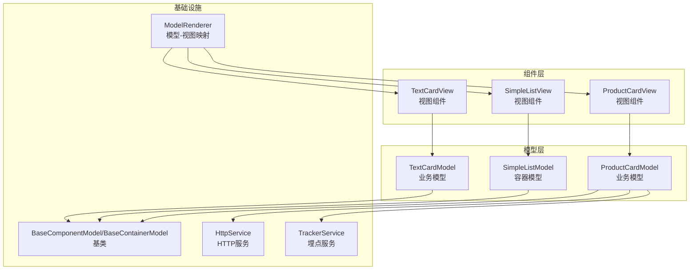
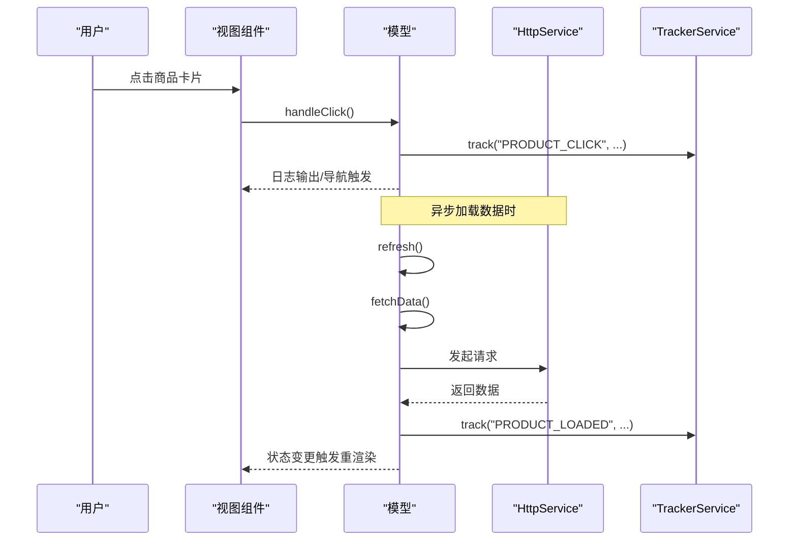
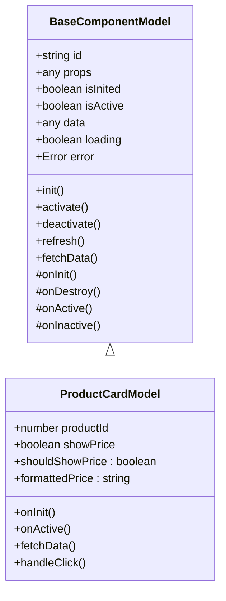
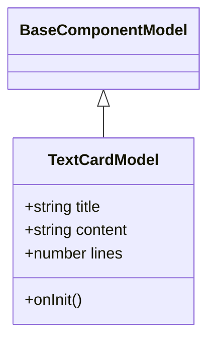
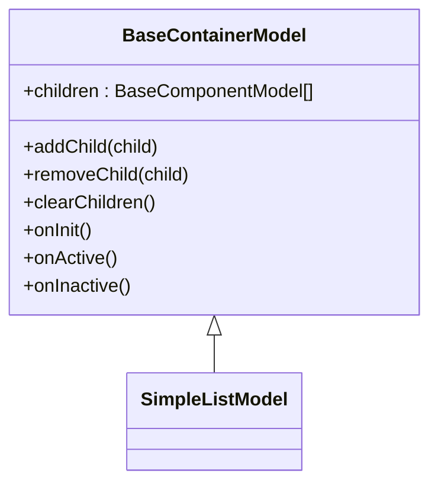
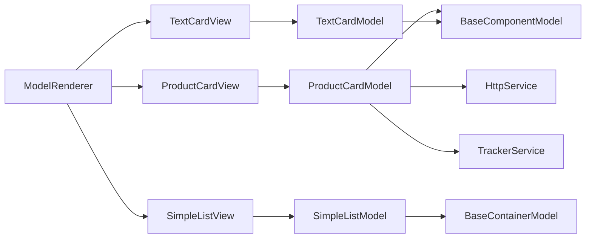

# 基础组件

<cite>
**本文引用的文件**
- [packages/h5-builder/src/components/product-card/product-card.model.ts](file://packages/h5-builder/src/components/product-card/product-card.model.ts)
- [packages/h5-builder/src/components/product-card/product-card.view.tsx](file://packages/h5-builder/src/components/product-card/product-card.view.tsx)
- [packages/h5-builder/src/components/text-card/text-card.model.ts](file://packages/h5-builder/src/components/text-card/text-card.model.ts)
- [packages/h5-builder/src/components/text-card/text-card.view.tsx](file://packages/h5-builder/src/components/text-card/text-card.view.tsx)
- [packages/h5-builder/src/components/simple-list/simple-list.model.ts](file://packages/h5-builder/src/components/simple-list/simple-list.model.ts)
- [packages/h5-builder/src/components/simple-list/simple-list.view.tsx](file://packages/h5-builder/src/components/simple-list/simple-list.view.tsx)
- [packages/h5-builder/src/components/model-renderer.tsx](file://packages/h5-builder/src/components/model-renderer.tsx)
- [packages/h5-builder/src/bedrock/model.ts](file://packages/h5-builder/src/bedrock/model.ts)
- [packages/h5-builder/src/services/http.service.ts](file://packages/h5-builder/src/services/http.service.ts)
- [packages/h5-builder/src/services/tracker.service.ts](file://packages/h5-builder/src/services/tracker.service.ts)
- [packages/h5-builder/src/components/index.ts](file://packages/h5-builder/src/components/index.ts)
</cite>

## 目录
1. [简介](#简介)
2. [项目结构](#项目结构)
3. [核心组件](#核心组件)
4. [架构总览](#架构总览)
5. [组件详解](#组件详解)
6. [依赖关系分析](#依赖关系分析)
7. [性能考量](#性能考量)
8. [故障排查指南](#故障排查指南)
9. [结论](#结论)
10. [附录](#附录)

## 简介
本文件聚焦于基础UI组件：ProductCard（商品卡片）、TextCard（文本卡片）与SimpleList（简单列表）。文档将系统阐述各组件的设计目的、视觉表现与典型使用场景；完整说明其Props接口、事件回调与插槽支持；提供TypeScript类型定义引用；结合实际代码路径展示如何配置与集成；解释组件如何通过对应model（如product-card.model.ts）实现数据绑定与状态管理；强调响应式更新机制及与mobx-vue-lite的集成方式；最后给出常见问题与排障建议。

## 项目结构
基础组件位于 h5-builder 包的 components 目录下，采用“模型-视图”分层设计：
- 模型层：负责数据获取、状态管理、生命周期与业务逻辑（如ProductCardModel、TextCardModel、SimpleListModel）
- 视图层：纯UI组件，接收model并通过observer进行响应式渲染（如ProductCardView、TextCardView、SimpleListView）
- 渲染器：ModelRenderer根据模型类型映射到对应视图组件，或渲染占位组件与容器默认渲染逻辑

图表来源
- [packages/h5-builder/src/components/product-card/product-card.view.tsx](file://packages/h5-builder/src/components/product-card/product-card.view.tsx#L1-L81)
- [packages/h5-builder/src/components/text-card/text-card.view.tsx](file://packages/h5-builder/src/components/text-card/text-card.view.tsx#L1-L32)
- [packages/h5-builder/src/components/simple-list/simple-list.view.tsx](file://packages/h5-builder/src/components/simple-list/simple-list.view.tsx#L1-L30)
- [packages/h5-builder/src/components/model-renderer.tsx](file://packages/h5-builder/src/components/model-renderer.tsx#L1-L105)
- [packages/h5-builder/src/bedrock/model.ts](file://packages/h5-builder/src/bedrock/model.ts#L1-L243)
- [packages/h5-builder/src/services/http.service.ts](file://packages/h5-builder/src/services/http.service.ts#L1-L281)
- [packages/h5-builder/src/services/tracker.service.ts](file://packages/h5-builder/src/services/tracker.service.ts#L1-L290)

章节来源
- [packages/h5-builder/src/components/index.ts](file://packages/h5-builder/src/components/index.ts#L1-L14)

## 核心组件
- ProductCard：展示商品信息，支持异步加载、错误重试、点击埋点上报、价格计算与显示控制
- TextCard：展示标题与多行文本，支持行数限制
- SimpleList：容器组件，负责渲染子组件集合，自动管理子组件生命周期

章节来源
- [packages/h5-builder/src/components/product-card/product-card.model.ts](file://packages/h5-builder/src/components/product-card/product-card.model.ts#L1-L133)
- [packages/h5-builder/src/components/text-card/text-card.model.ts](file://packages/h5-builder/src/components/text-card/text-card.model.ts#L1-L21)
- [packages/h5-builder/src/components/simple-list/simple-list.model.ts](file://packages/h5-builder/src/components/simple-list/simple-list.model.ts#L1-L16)

## 架构总览
组件遵循“模型-视图”分离与响应式渲染：
- 模型层继承BaseComponentModel或BaseContainerModel，内置loading、error、data等响应式状态，并提供init/refresh/fetchData等统一生命周期与数据流程
- 视图层通过observer包裹，仅从model读取状态与调用方法，避免副作用
- 埋点与HTTP服务通过依赖注入注入到模型中，便于测试与替换
- ModelRenderer集中管理模型到视图的映射，支持占位组件与容器默认渲染

图表来源
- [packages/h5-builder/src/components/product-card/product-card.view.tsx](file://packages/h5-builder/src/components/product-card/product-card.view.tsx#L1-L81)
- [packages/h5-builder/src/components/product-card/product-card.model.ts](file://packages/h5-builder/src/components/product-card/product-card.model.ts#L1-L133)
- [packages/h5-builder/src/services/http.service.ts](file://packages/h5-builder/src/services/http.service.ts#L1-L281)
- [packages/h5-builder/src/services/tracker.service.ts](file://packages/h5-builder/src/services/tracker.service.ts#L1-L290)

## 组件详解

### ProductCard（商品卡片）
- 设计目的：以卡片形式展示商品信息，支持异步加载、错误重试、点击埋点与价格格式化
- 视觉表现：骨架屏加载态、错误态（含重试按钮）、正常态（图片、名称、描述、价格）
- 典型使用场景：商品列表、推荐位、详情页商品信息块
- Props接口
  - productId: number（必填）
  - showPrice?: boolean（可选，默认显示）
- 事件回调
  - 无显式事件回调；交互通过model.handleClick()触发
- 插槽支持
  - 无插槽；通过props与计算属性控制展示内容
- TypeScript类型定义引用
  - ProductCardProps、ProductData
- 集成步骤
  - 在页面中使用ModelRenderer并传入ProductCardModel实例，或直接使用ProductCardView并传入model
  - 在onActive时触发曝光埋点（已在模型中实现）
- 响应式更新机制
  - 模型内部使用observable包装，loading、error、data变更自动触发observer包裹的视图重渲染
  - 通过refresh()统一管理加载状态与错误状态
- 与mobx-vue-lite集成
  - 视图使用observer包裹；模型构造时返回observable实例，确保状态可追踪
- 与服务集成
  - 通过依赖注入获取HttpService与TrackerService，分别用于数据加载与埋点上报
- 常见问题
  - 数据未更新：检查是否调用model.refresh()或props变更导致model重建
  - 渲染异常：确认视图未直接修改model.data，而应通过model.refresh()/fetchData()

图表来源
- [packages/h5-builder/src/bedrock/model.ts](file://packages/h5-builder/src/bedrock/model.ts#L1-L243)
- [packages/h5-builder/src/components/product-card/product-card.model.ts](file://packages/h5-builder/src/components/product-card/product-card.model.ts#L1-L133)

章节来源
- [packages/h5-builder/src/components/product-card/product-card.model.ts](file://packages/h5-builder/src/components/product-card/product-card.model.ts#L1-L133)
- [packages/h5-builder/src/components/product-card/product-card.view.tsx](file://packages/h5-builder/src/components/product-card/product-card.view.tsx#L1-L81)
- [packages/h5-builder/src/services/http.service.ts](file://packages/h5-builder/src/services/http.service.ts#L1-L281)
- [packages/h5-builder/src/services/tracker.service.ts](file://packages/h5-builder/src/services/tracker.service.ts#L1-L290)

### TextCard（文本卡片）
- 设计目的：以卡片形式展示标题与多行文本，支持行数限制
- 视觉表现：标题与多行文本，超出行数自动省略
- 典型使用场景：公告、说明、简介、摘要
- Props接口
  - title: string（必填）
  - content: string（必填）
  - lines?: number（可选，默认2行）
- 事件回调
  - 无显式事件回调
- 插槽支持
  - 无插槽
- TypeScript类型定义引用
  - TextCardProps
- 集成步骤
  - 传入TextCardModel实例给TextCardView，或通过ModelRenderer自动映射
- 响应式更新机制
  - 通过props驱动渲染，props变更触发observer包裹的视图重渲染
- 与mobx-vue-lite集成
  - 视图使用observer包裹；模型为轻量级，主要依赖props
- 常见问题
  - 行数不生效：检查CSS兼容性与WebkitLineClamp设置
  - 文本溢出：确保容器宽度与line-clamp设置合理

图表来源
- [packages/h5-builder/src/bedrock/model.ts](file://packages/h5-builder/src/bedrock/model.ts#L1-L243)
- [packages/h5-builder/src/components/text-card/text-card.model.ts](file://packages/h5-builder/src/components/text-card/text-card.model.ts#L1-L21)

章节来源
- [packages/h5-builder/src/components/text-card/text-card.model.ts](file://packages/h5-builder/src/components/text-card/text-card.model.ts#L1-L21)
- [packages/h5-builder/src/components/text-card/text-card.view.tsx](file://packages/h5-builder/src/components/text-card/text-card.view.tsx#L1-L32)

### SimpleList（简单列表）
- 设计目的：作为容器组件渲染一组子组件，自动管理子组件生命周期
- 视觉表现：按顺序渲染子组件，无额外装饰
- 典型使用场景：商品列表、文本列表、卡片集合
- Props接口
  - model: SimpleListModel（必填）
- 事件回调
  - 无显式事件回调
- 插槽支持
  - 无插槽；通过children数组传入子组件
- TypeScript类型定义引用
  - SimpleListModel、SimpleListViewProps
- 集成步骤
  - 使用ModelRenderer渲染SimpleListModel，或直接使用SimpleListView
  - 通过addChild/移除子组件管理children
- 响应式更新机制
  - children变更触发视图重渲染；容器默认在onInit/onActive/onInactive中并行初始化/激活/停用子组件
- 与mobx-vue-lite集成
  - 视图使用observer包裹；容器模型自动管理子组件响应式生命周期
- 常见问题
  - 子组件不渲染：检查children是否正确添加且已初始化
  - 性能问题：大量子组件时考虑虚拟滚动或懒加载策略

图表来源
- [packages/h5-builder/src/bedrock/model.ts](file://packages/h5-builder/src/bedrock/model.ts#L158-L243)
- [packages/h5-builder/src/components/simple-list/simple-list.model.ts](file://packages/h5-builder/src/components/simple-list/simple-list.model.ts#L1-L16)

章节来源
- [packages/h5-builder/src/components/simple-list/simple-list.model.ts](file://packages/h5-builder/src/components/simple-list/simple-list.model.ts#L1-L16)
- [packages/h5-builder/src/components/simple-list/simple-list.view.tsx](file://packages/h5-builder/src/components/simple-list/simple-list.view.tsx#L1-L30)

## 依赖关系分析
- 组件与模型
  - ProductCardModel继承BaseComponentModel，具备统一的生命周期与数据流
  - TextCardModel继承BaseComponentModel，轻量级模型
  - SimpleListModel继承BaseContainerModel，管理子组件集合
- 视图与模型
  - ProductCardView、TextCardView、SimpleListView均通过observer包裹，从model读取状态与调用方法
- 基础设施
  - HttpService提供请求拦截、错误处理与取消能力
  - TrackerService提供埋点队列、批量发送、持久化与调试模式
- 渲染器
  - ModelRenderer维护模型-视图映射表，支持占位组件与容器默认渲染

图表来源
- [packages/h5-builder/src/bedrock/model.ts](file://packages/h5-builder/src/bedrock/model.ts#L1-L243)
- [packages/h5-builder/src/components/product-card/product-card.view.tsx](file://packages/h5-builder/src/components/product-card/product-card.view.tsx#L1-L81)
- [packages/h5-builder/src/components/text-card/text-card.view.tsx](file://packages/h5-builder/src/components/text-card/text-card.view.tsx#L1-L32)
- [packages/h5-builder/src/components/simple-list/simple-list.view.tsx](file://packages/h5-builder/src/components/simple-list/simple-list.view.tsx#L1-L30)
- [packages/h5-builder/src/components/model-renderer.tsx](file://packages/h5-builder/src/components/model-renderer.tsx#L1-L105)
- [packages/h5-builder/src/services/http.service.ts](file://packages/h5-builder/src/services/http.service.ts#L1-L281)
- [packages/h5-builder/src/services/tracker.service.ts](file://packages/h5-builder/src/services/tracker.service.ts#L1-L290)

章节来源
- [packages/h5-builder/src/components/model-renderer.tsx](file://packages/h5-builder/src/components/model-renderer.tsx#L1-L105)
- [packages/h5-builder/src/bedrock/model.ts](file://packages/h5-builder/src/bedrock/model.ts#L1-L243)

## 性能考量
- 响应式渲染
  - 使用observer包裹视图，仅当模型状态变化时重渲染，避免不必要的DOM更新
- 数据加载
  - 使用统一refresh()与fetchData()流程，避免重复请求与竞态
- 容器管理
  - BaseContainerModel默认并行初始化/激活子组件，提升首屏渲染效率
- 埋点批处理
  - TrackerService批量发送与定时刷新，降低网络开销
- 资源清理
  - BaseComponentModel通过DisposableStore统一注册与释放资源，防止内存泄漏

[本节为通用指导，不直接分析具体文件]

## 故障排查指南
- 数据未更新
  - 确认是否调用了model.refresh()或props变更导致model重建
  - 检查模型中的fetchData()是否抛错或未设置data
- 渲染异常
  - 确保视图未直接修改model.data，应通过model.refresh()/fetchData()
  - 检查视图中对loading、error、data的分支渲染逻辑
- 埋点未上报
  - 确认TrackerService已正确注入并在onActive/onInit中调用track
  - 检查调试模式与持久化配置
- HTTP请求失败
  - 检查拦截器配置与错误拦截器是否捕获并处理异常
  - 确认超时与baseURL设置是否正确
- 子组件不渲染
  - 确认children已正确添加且已初始化
  - 检查ModelRenderer是否注册了对应模型-视图映射

章节来源
- [packages/h5-builder/src/components/product-card/product-card.model.ts](file://packages/h5-builder/src/components/product-card/product-card.model.ts#L1-L133)
- [packages/h5-builder/src/components/product-card/product-card.view.tsx](file://packages/h5-builder/src/components/product-card/product-card.view.tsx#L1-L81)
- [packages/h5-builder/src/services/tracker.service.ts](file://packages/h5-builder/src/services/tracker.service.ts#L1-L290)
- [packages/h5-builder/src/services/http.service.ts](file://packages/h5-builder/src/services/http.service.ts#L1-L281)
- [packages/h5-builder/src/components/model-renderer.tsx](file://packages/h5-builder/src/components/model-renderer.tsx#L1-L105)

## 结论
ProductCard、TextCard与SimpleList通过清晰的“模型-视图”分层与统一的状态管理，实现了良好的可维护性与可扩展性。借助mobx-vue-lite的响应式系统与BaseComponentModel/BaseContainerModel的生命周期抽象，组件能够高效地处理异步数据、埋点上报与容器管理。通过ModelRenderer统一映射，开发者可以快速集成与扩展新的组件类型。

[本节为总结，不直接分析具体文件]

## 附录
- 导出入口
  - 组件统一导出于components/index.ts，便于按需引入
- 类型与接口
  - ProductCardProps、ProductData、TextCardProps、SimpleListViewProps等类型定义可在对应index.ts中找到

章节来源
- [packages/h5-builder/src/components/index.ts](file://packages/h5-builder/src/components/index.ts#L1-L14)
- [packages/h5-builder/src/components/product-card/index.ts](file://packages/h5-builder/src/components/product-card/index.ts#L1-L7)
- [packages/h5-builder/src/components/text-card/index.ts](file://packages/h5-builder/src/components/text-card/index.ts#L1-L4)
- [packages/h5-builder/src/components/simple-list/index.ts](file://packages/h5-builder/src/components/simple-list/index.ts#L1-L4)