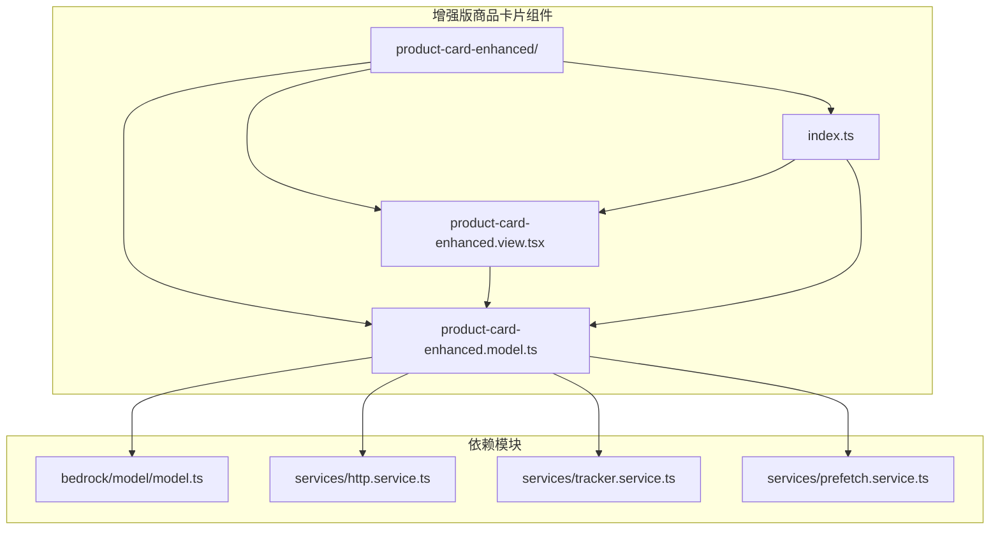
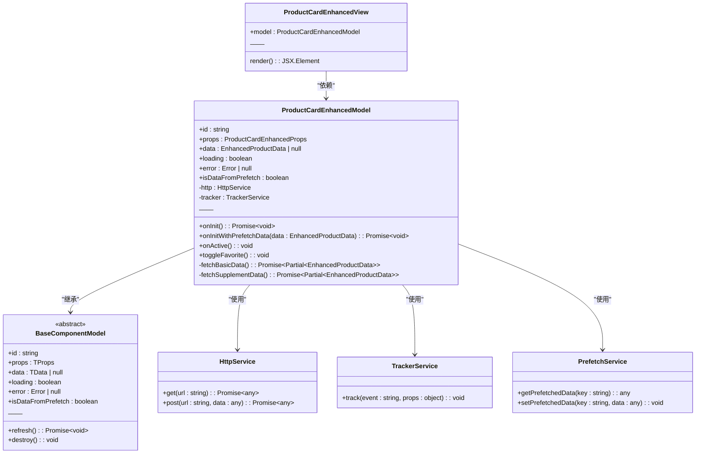
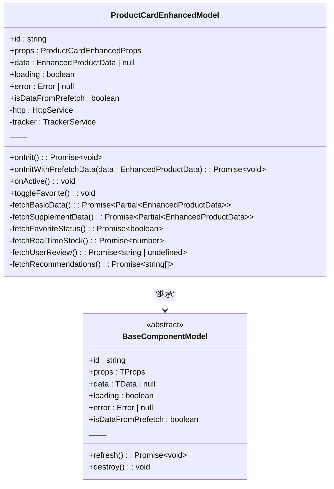
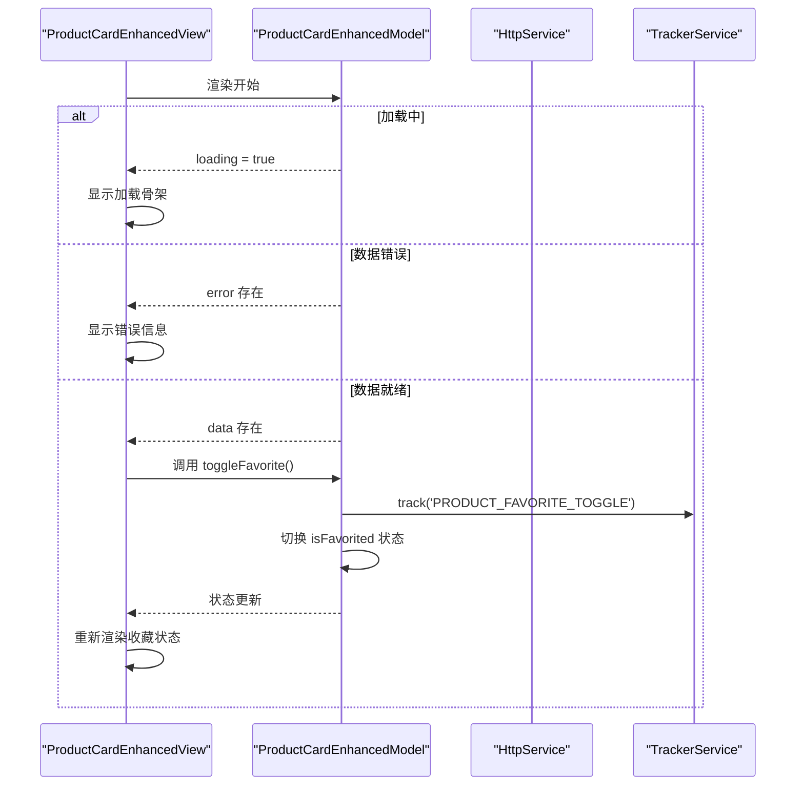
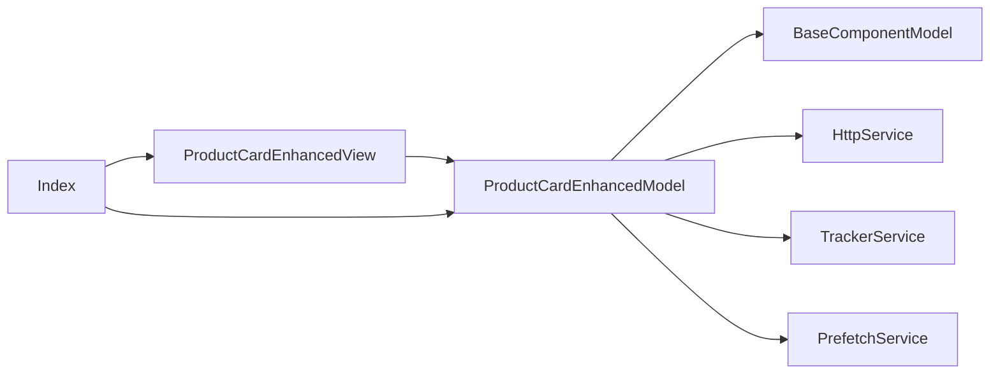

# 增强版商品卡片组件

<cite>
**本文档引用的文件**  
- [product-card-enhanced.model.ts](file://packages/h5-builder/src/components/product-card-enhanced/product-card-enhanced.model.ts)
- [product-card-enhanced.view.tsx](file://packages/h5-builder/src/components/product-card-enhanced/product-card-enhanced.view.tsx)
- [index.ts](file://packages/h5-builder/src/components/product-card-enhanced/index.ts)
- [product-card.model.ts](file://packages/h5-builder/src/components/product-card/product-card.model.ts)
- [product-card.view.tsx](file://packages/h5-builder/src/components/product-card/product-card.view.tsx)
- [model.ts](file://packages/h5-builder/src/bedrock/model/model.ts)
- [service-identifiers.ts](file://packages/h5-builder/src/services/service-identifiers.ts)
- [http.service.ts](file://packages/h5-builder/src/services/http.service.ts)
- [tracker.service.ts](file://packages/h5-builder/src/services/tracker.service.ts)
- [prefetch.service.ts](file://packages/h5-builder/src/services/prefetch.service.ts)
</cite>

## 目录
1. [简介](#简介)
2. [项目结构](#项目结构)
3. [核心组件](#核心组件)
4. [架构概述](#架构概述)
5. [详细组件分析](#详细组件分析)
6. [依赖分析](#依赖分析)
7. [性能考虑](#性能考虑)
8. [故障排除指南](#故障排除指南)
9. [结论](#结论)

## 简介
增强版商品卡片组件是移动构建器架构演示项目中的一个高级UI组件，旨在展示如何通过预加载和实时数据加载相结合的方式优化用户体验。该组件基于基础商品卡片组件进行扩展，引入了用户个性化数据（如收藏状态、库存、评价和推荐理由）的动态加载机制。通过使用MobX进行状态管理，并结合依赖注入和服务抽象，该组件实现了清晰的职责分离和可维护性。

## 项目结构
增强版商品卡片组件位于`packages/h5-builder/src/components/product-card-enhanced/`目录下，遵循标准的组件组织模式，包含模型、视图和入口文件。该组件依赖于项目中的基础架构模块（如bedrock/model）和服务层（如http.service、tracker.service等），并通过接口抽象实现松耦合。

**图示来源**  
- [product-card-enhanced.model.ts](file://packages/h5-builder/src/components/product-card-enhanced/product-card-enhanced.model.ts)
- [product-card-enhanced.view.tsx](file://packages/h5-builder/src/components/product-card-enhanced/product-card-enhanced.view.tsx)
- [index.ts](file://packages/h5-builder/src/components/product-card-enhanced/index.ts)
- [model.ts](file://packages/h5-builder/src/bedrock/model/model.ts)
- [http.service.ts](file://packages/h5-builder/src/services/http.service.ts)
- [tracker.service.ts](file://packages/h5-builder/src/services/tracker.service.ts)
- [prefetch.service.ts](file://packages/h5-builder/src/services/prefetch.service.ts)

**本节来源**  
- [product-card-enhanced.model.ts](file://packages/h5-builder/src/components/product-card-enhanced/product-card-enhanced.model.ts)
- [product-card-enhanced.view.tsx](file://packages/h5-builder/src/components/product-card-enhanced/product-card-enhanced.view.tsx)
- [index.ts](file://packages/h5-builder/src/components/product-card-enhanced/index.ts)

## 核心组件
增强版商品卡片组件由三个核心文件构成：模型（Model）、视图（View）和注册入口（index.ts）。模型负责数据获取、状态管理和业务逻辑，视图负责UI渲染和用户交互，注册入口则将两者绑定并暴露给外部使用。该组件通过继承`BaseComponentModel`并注入`HttpService`、`TrackerService`和`PrefetchService`服务，实现了完整的生命周期管理和数据流控制。

**本节来源**  
- [product-card-enhanced.model.ts](file://packages/h5-builder/src/components/product-card-enhanced/product-card-enhanced.model.ts#L1-L256)
- [product-card-enhanced.view.tsx](file://packages/h5-builder/src/components/product-card-enhanced/product-card-enhanced.view.tsx#L1-L153)
- [index.ts](file://packages/h5-builder/src/components/product-card-enhanced/index.ts#L1-L16)

## 架构概述
增强版商品卡片组件采用MVVM（Model-View-ViewModel）架构模式，将UI与业务逻辑完全分离。模型层负责处理数据加载、状态更新和埋点上报，视图层通过MobX的`observer`高阶组件自动响应模型状态变化。组件支持两种初始化路径：无预加载数据时的完整加载和有预加载数据时的补充加载，从而优化首屏性能。

**图示来源**  
- [product-card-enhanced.model.ts](file://packages/h5-builder/src/components/product-card-enhanced/product-card-enhanced.model.ts#L52-L255)
- [product-card-enhanced.view.tsx](file://packages/h5-builder/src/components/product-card-enhanced/product-card-enhanced.view.tsx#L18-L149)
- [model.ts](file://packages/h5-builder/src/bedrock/model/model.ts)
- [http.service.ts](file://packages/h5-builder/src/services/http.service.ts)
- [tracker.service.ts](file://packages/h5-builder/src/services/tracker.service.ts)
- [prefetch.service.ts](file://packages/h5-builder/src/services/prefetch.service.ts)

## 详细组件分析

### 增强版商品卡片模型分析
`ProductCardEnhancedModel`是组件的核心逻辑层，继承自`BaseComponentModel`并实现了数据加载、状态管理和用户交互功能。模型通过依赖注入获取`HttpService`、`TrackerService`和`PrefetchService`，确保了服务的可替换性和测试性。模型的关键特性包括双路径初始化（`onInit`和`onInitWithPrefetchData`）、并行数据加载和响应式状态更新。

#### 类图

**图示来源**  
- [product-card-enhanced.model.ts](file://packages/h5-builder/src/components/product-card-enhanced/product-card-enhanced.model.ts#L52-L255)
- [model.ts](file://packages/h5-builder/src/bedrock/model/model.ts)

### 增强版商品卡片视图分析
`ProductCardEnhancedView`是组件的UI层，使用React函数组件和MobX的`observer`高阶组件实现响应式渲染。视图通过`model`属性接收模型实例，并根据模型的`loading`、`error`和`data`状态渲染不同的UI。视图还通过内联样式和条件渲染展示了预加载数据的来源标识（"⚡ 预加载"或"📡 实时"），增强了调试和用户体验。

#### 序列图

**图示来源**  
- [product-card-enhanced.view.tsx](file://packages/h5-builder/src/components/product-card-enhanced/product-card-enhanced.view.tsx#L18-L149)
- [product-card-enhanced.model.ts](file://packages/h5-builder/src/components/product-card-enhanced/product-card-enhanced.model.ts#L241-L254)

**本节来源**  
- [product-card-enhanced.model.ts](file://packages/h5-builder/src/components/product-card-enhanced/product-card-enhanced.model.ts#L1-L256)
- [product-card-enhanced.view.tsx](file://packages/h5-builder/src/components/product-card-enhanced/product-card-enhanced.view.tsx#L1-L153)

## 依赖分析
增强版商品卡片组件依赖于多个核心服务和基础类，形成了清晰的依赖关系图。组件通过接口注入（`@IHttpService`、`@ITrackerService`、`@IPrefetchService`）实现松耦合，便于单元测试和替换实现。所有依赖均通过构造函数注入，符合依赖注入原则。

**图示来源**  
- [product-card-enhanced.model.ts](file://packages/h5-builder/src/components/product-card-enhanced/product-card-enhanced.model.ts#L53-L60)
- [product-card-enhanced.view.tsx](file://packages/h5-builder/src/components/product-card-enhanced/product-card-enhanced.view.tsx#L3)
- [index.ts](file://packages/h5-builder/src/components/product-card-enhanced/index.ts#L5-L6)

**本节来源**  
- [product-card-enhanced.model.ts](file://packages/h5-builder/src/components/product-card-enhanced/product-card-enhanced.model.ts#L2-L60)
- [service-identifiers.ts](file://packages/h5-builder/src/services/service-identifiers.ts)

## 性能考虑
增强版商品卡片组件通过预加载机制显著提升了首屏加载性能。当数据被预加载时，组件仅需加载补充的动态数据（如收藏状态、库存），减少了网络请求的延迟。模型中的`fetchBasicData`和`fetchSupplementData`方法使用`Promise.all`并行加载多个数据源，进一步优化了加载时间。视图层的`observer`高阶组件确保了仅在相关状态变化时重新渲染，避免了不必要的性能开销。

## 故障排除指南
当增强版商品卡片组件出现问题时，可参考以下常见问题及解决方案：

1. **数据未加载或显示空白**  
   检查模型的`data`属性是否为null，并确认`onInit`或`onInitWithPrefetchData`方法是否被正确调用。

2. **预加载数据未生效**  
   确认`PrefetchService`中是否已正确设置预加载数据，并检查`isDataFromPrefetch`标志位的值。

3. **收藏状态切换无效**  
   验证`toggleFavorite`方法是否正确更新了`data.isFavorited`状态，并检查`TrackerService`是否收到埋点事件。

4. **UI未响应状态变化**  
   确保视图组件使用了`observer`高阶组件，并检查MobX的响应式系统是否正常工作。

**本节来源**  
- [product-card-enhanced.model.ts](file://packages/h5-builder/src/components/product-card-enhanced/product-card-enhanced.model.ts#L241-L254)
- [product-card-enhanced.view.tsx](file://packages/h5-builder/src/components/product-card-enhanced/product-card-enhanced.view.tsx#L22-L23)

## 结论
增强版商品卡片组件是一个功能丰富、架构清晰的UI组件，展示了现代前端开发中的最佳实践。通过MVVM模式、依赖注入和响应式编程，该组件实现了高内聚、低耦合的设计目标。预加载与实时数据加载的结合策略有效提升了用户体验，而详细的埋点上报则为产品优化提供了数据支持。该组件的设计模式可作为其他复杂UI组件的参考模板。