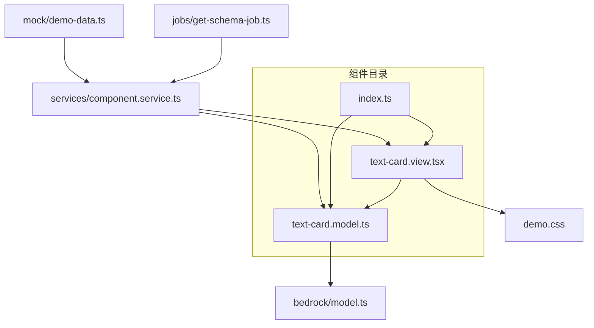
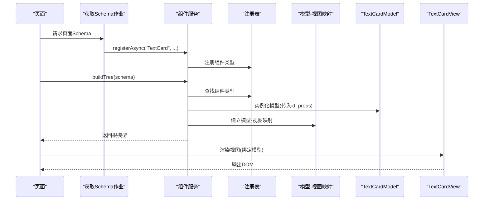
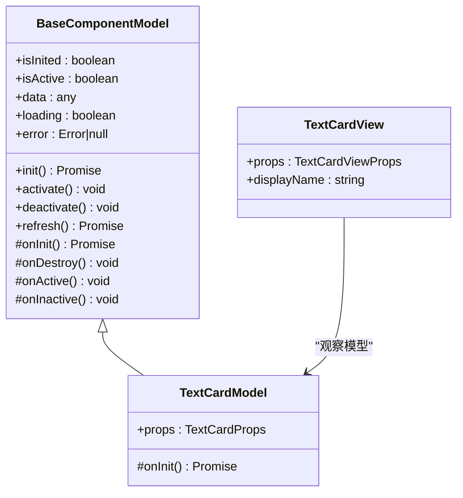
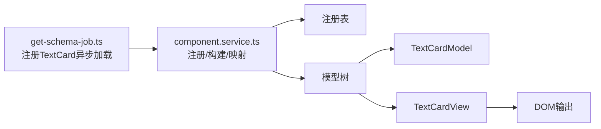

# 文本卡片组件

<cite>
**本文引用的文件**
- [text-card.model.ts](file://packages/h5-builder/src/components/text-card/text-card.model.ts)
- [text-card.view.tsx](file://packages/h5-builder/src/components/text-card/text-card.view.tsx)
- [index.ts](file://packages/h5-builder/src/components/text-card/index.ts)
- [model.ts](file://packages/h5-builder/src/bedrock/model.ts)
- [component.service.ts](file://packages/h5-builder/src/services/component.service.ts)
- [get-schema-job.ts](file://packages/h5-builder/src/jobs/get-schema-job.ts)
- [demo-data.ts](file://packages/h5-builder/src/mock/demo-data.ts)
- [demo.css](file://packages/h5-builder/src/demo.css)
</cite>

## 目录
1. [简介](#简介)
2. [项目结构](#项目结构)
3. [核心组件](#核心组件)
4. [架构概览](#架构概览)
5. [详细组件分析](#详细组件分析)
6. [依赖分析](#依赖分析)
7. [性能考虑](#性能考虑)
8. [故障排查指南](#故障排查指南)
9. [结论](#结论)
10. [附录](#附录)

## 简介
文本卡片组件用于在内容型 H5 页面中展示标题、描述与富文本片段，具备轻量、可配置、易扩展的特点。它通过模型-视图分离的设计，结合全局响应式系统与异步加载机制，适配多场景下的内容展示与交互需求。组件支持通过属性控制内容行数以控制高度，便于在长列表中保持稳定布局；同时提供统一导出接口，便于在页面 Schema 中声明式使用。

## 项目结构
文本卡片组件位于 H5 构建器包内，采用“组件目录 + 模型 + 视图 + 导出入口”的标准组织方式，配合通用模型基类与组件服务，形成可复用的组件体系。

图表来源
- [text-card.model.ts](file://packages/h5-builder/src/components/text-card/text-card.model.ts#L1-L21)
- [text-card.view.tsx](file://packages/h5-builder/src/components/text-card/text-card.view.tsx#L1-L32)
- [index.ts](file://packages/h5-builder/src/components/text-card/index.ts#L1-L4)
- [model.ts](file://packages/h5-builder/src/bedrock/model.ts#L1-L156)
- [component.service.ts](file://packages/h5-builder/src/services/component.service.ts#L1-L120)
- [get-schema-job.ts](file://packages/h5-builder/src/jobs/get-schema-job.ts#L78-L96)
- [demo-data.ts](file://packages/h5-builder/src/mock/demo-data.ts#L120-L155)
- [demo.css](file://packages/h5-builder/src/demo.css#L398-L426)

章节来源
- [text-card.model.ts](file://packages/h5-builder/src/components/text-card/text-card.model.ts#L1-L21)
- [text-card.view.tsx](file://packages/h5-builder/src/components/text-card/text-card.view.tsx#L1-L32)
- [index.ts](file://packages/h5-builder/src/components/text-card/index.ts#L1-L4)
- [model.ts](file://packages/h5-builder/src/bedrock/model.ts#L1-L156)
- [component.service.ts](file://packages/h5-builder/src/services/component.service.ts#L1-L120)
- [get-schema-job.ts](file://packages/h5-builder/src/jobs/get-schema-job.ts#L78-L96)
- [demo-data.ts](file://packages/h5-builder/src/mock/demo-data.ts#L120-L155)
- [demo.css](file://packages/h5-builder/src/demo.css#L398-L426)

## 核心组件
- 文本卡片模型（TextCardModel）
  - 继承通用模型基类，提供响应式状态与生命周期钩子
  - 属性接口包含标题、内容与可选的内容行数
- 文本卡片视图（TextCardView）
  - 基于观察者模式绑定模型，动态渲染标题与内容
  - 通过内联样式控制内容行数，实现截断效果
- 统一导出（index.ts）
  - 提供模型与视图的集中导出，便于外部引用

章节来源
- [text-card.model.ts](file://packages/h5-builder/src/components/text-card/text-card.model.ts#L1-L21)
- [text-card.view.tsx](file://packages/h5-builder/src/components/text-card/text-card.view.tsx#L1-L32)
- [index.ts](file://packages/h5-builder/src/components/text-card/index.ts#L1-L4)

## 架构概览
文本卡片组件遵循“Schema 驱动 + 组件服务 + 模型-视图”的整体架构。页面通过 Schema 描述组件树，组件服务负责注册、异步加载与构建模型树，最终由视图层渲染。

图表来源
- [get-schema-job.ts](file://packages/h5-builder/src/jobs/get-schema-job.ts#L78-L96)
- [component.service.ts](file://packages/h5-builder/src/services/component.service.ts#L100-L185)
- [component.service.ts](file://packages/h5-builder/src/services/component.service.ts#L258-L318)
- [component.service.ts](file://packages/h5-builder/src/services/component.service.ts#L496-L513)
- [text-card.model.ts](file://packages/h5-builder/src/components/text-card/text-card.model.ts#L1-L21)
- [text-card.view.tsx](file://packages/h5-builder/src/components/text-card/text-card.view.tsx#L1-L32)

## 详细组件分析

### 属性与行为
- 标题层级
  - 视图层使用语义化标题标签渲染标题，便于 SEO 与无障碍访问
- 文本对齐
  - 当前实现未显式设置对齐方式，可通过外层容器或主题样式覆盖
- 内容行数
  - 通过属性控制内容最大显示行数，从而控制高度
  - 视图层基于内联样式实现行数截断
- 链接跳转
  - 组件本身不内置链接跳转逻辑；可在内容中嵌入链接并在应用侧处理点击事件

章节来源
- [text-card.view.tsx](file://packages/h5-builder/src/components/text-card/text-card.view.tsx#L13-L29)
- [text-card.model.ts](file://packages/h5-builder/src/components/text-card/text-card.model.ts#L6-L10)

### 插槽与可定制样式类
- 插槽
  - 组件未提供具名插槽；可通过在内容中嵌入 HTML 结构实现富文本展示
- 样式类
  - 外层容器类名为文本卡片样式提供挂载点
  - 主题样式文件中提供了文本卡片的基础样式，包括标题与段落的字号、颜色与行高

章节来源
- [text-card.view.tsx](file://packages/h5-builder/src/components/text-card/text-card.view.tsx#L17-L28)
- [demo.css](file://packages/h5-builder/src/demo.css#L398-L426)

### 数据状态与全局响应式系统
- 状态来源
  - 模型基类提供响应式状态字段与生命周期钩子，组件模型继承该基类
- 状态同步
  - 视图层通过观察者模式绑定模型，当模型属性变化时自动重渲染
- 数据获取
  - 文本卡片模型为空实现，无需数据获取；如需扩展，可在派生模型中实现数据获取与刷新逻辑

章节来源
- [model.ts](file://packages/h5-builder/src/bedrock/model.ts#L1-L156)
- [text-card.model.ts](file://packages/h5-builder/src/components/text-card/text-card.model.ts#L16-L20)
- [text-card.view.tsx](file://packages/h5-builder/src/components/text-card/text-card.view.tsx#L1-L12)

### 在不同场景下的配置示例
以下示例展示如何在不同场景下配置文本样式与交互行为（请参考相应路径而非直接复制代码）：
- 短文本卡片（1行）
  - 示例路径：[短文本卡片配置](file://packages/h5-builder/src/mock/demo-data.ts#L120-L141)
- 长文本卡片（5行）
  - 示例路径：[长文本卡片配置](file://packages/h5-builder/src/mock/demo-data.ts#L133-L142)
- 嵌套容器中的文本卡片
  - 示例路径：[嵌套容器中的文本卡片](file://packages/h5-builder/src/mock/demo-data.ts#L184-L192)
  - 示例路径：[实验容器中的文本卡片](file://packages/h5-builder/src/mock/demo-data.ts#L247-L256)
  - 示例路径：[网格布局中的文本卡片](file://packages/h5-builder/src/mock/demo-data.ts#L265-L280)

章节来源
- [demo-data.ts](file://packages/h5-builder/src/mock/demo-data.ts#L120-L155)
- [demo-data.ts](file://packages/h5-builder/src/mock/demo-data.ts#L157-L319)

### HTML 转义与富文本处理
- 富文本
  - 组件直接渲染内容，未内置 HTML 解析或转义逻辑；如需在内容中插入链接或格式化文本，请在数据层确保内容安全
- HTML 转义
  - 若内容来自不受信任来源，建议在数据层进行转义处理，避免 XSS 风险
- 截断策略
  - 通过内容行数属性控制截断；若需更精细的截断策略（如按字符数），可在数据层预处理内容

章节来源
- [text-card.view.tsx](file://packages/h5-builder/src/components/text-card/text-card.view.tsx#L13-L29)
- [text-card.model.ts](file://packages/h5-builder/src/components/text-card/text-card.model.ts#L6-L10)

### 交互行为与链接跳转
- 组件本身不内置链接跳转；如需点击跳转，可在内容中嵌入链接并在应用侧监听点击事件
- 若需在组件层处理点击，可在派生模型中扩展事件处理逻辑，并通过视图层绑定事件处理器

章节来源
- [text-card.view.tsx](file://packages/h5-builder/src/components/text-card/text-card.view.tsx#L17-L28)

### 类关系图

图表来源
- [model.ts](file://packages/h5-builder/src/bedrock/model.ts#L1-L156)
- [text-card.model.ts](file://packages/h5-builder/src/components/text-card/text-card.model.ts#L1-L21)
- [text-card.view.tsx](file://packages/h5-builder/src/components/text-card/text-card.view.tsx#L1-L32)

## 依赖分析
- 组件注册与异步加载
  - 通过作业注册文本卡片组件，指定模型与视图加载器以及加载元数据
- 组件服务
  - 组件服务负责注册组件类型、构建模型树、建立模型-视图映射与资源加载
- Schema 驱动
  - 页面通过 Schema 描述组件树，组件服务据此构建模型树并触发渲染

图表来源
- [get-schema-job.ts](file://packages/h5-builder/src/jobs/get-schema-job.ts#L78-L96)
- [component.service.ts](file://packages/h5-builder/src/services/component.service.ts#L100-L185)
- [component.service.ts](file://packages/h5-builder/src/services/component.service.ts#L496-L513)

章节来源
- [get-schema-job.ts](file://packages/h5-builder/src/jobs/get-schema-job.ts#L78-L96)
- [component.service.ts](file://packages/h5-builder/src/services/component.service.ts#L100-L185)
- [component.service.ts](file://packages/h5-builder/src/services/component.service.ts#L258-L318)
- [component.service.ts](file://packages/h5-builder/src/services/component.service.ts#L496-L513)

## 性能考虑
- 轻量渲染
  - 组件仅包含少量 DOM 节点，渲染开销低
- 行数截断
  - 通过内容行数控制高度，避免长文本导致的布局抖动
- 异步加载
  - 组件支持异步加载与延迟策略，有助于首屏优化
- 虚拟滚动友好
  - 固定高度的卡片适合在虚拟滚动列表中使用，减少重排与重绘

章节来源
- [text-card.view.tsx](file://packages/h5-builder/src/components/text-card/text-card.view.tsx#L13-L29)
- [get-schema-job.ts](file://packages/h5-builder/src/jobs/get-schema-job.ts#L78-L96)
- [demo-data.ts](file://packages/h5-builder/src/mock/demo-data.ts#L120-L155)

## 故障排查指南
- 组件未注册
  - 症状：构建模型树时报未知组件类型
  - 处理：确认已在组件服务中注册该组件类型
- 异步加载失败
  - 症状：模型或视图加载失败，出现占位组件
  - 处理：检查加载器配置与网络状况，查看组件服务的错误上报
- 截断异常
  - 症状：内容未按预期截断
  - 处理：确认内容行数属性值在有效范围内，检查样式覆盖情况

章节来源
- [component.service.ts](file://packages/h5-builder/src/services/component.service.ts#L130-L185)
- [component.service.ts](file://packages/h5-builder/src/services/component.service.ts#L370-L420)
- [component.service.ts](file://packages/h5-builder/src/services/component.service.ts#L422-L471)

## 结论
文本卡片组件以简洁的模型-视图设计实现了内容型 H5 页面中的标题与描述展示，具备良好的可定制性与性能表现。通过属性控制内容行数，组件在长列表与虚拟滚动场景中尤为适用。结合异步加载与 Schema 驱动的架构，组件能够灵活地融入复杂页面结构，满足多样化的展示需求。

## 附录
- 统一导出
  - 通过统一导出入口引入模型与视图，便于在页面 Schema 中声明式使用
- 样式定制
  - 可通过外层容器类名与主题样式文件进行样式定制，满足不同视觉风格需求

章节来源
- [index.ts](file://packages/h5-builder/src/components/text-card/index.ts#L1-L4)
- [demo.css](file://packages/h5-builder/src/demo.css#L398-L426)