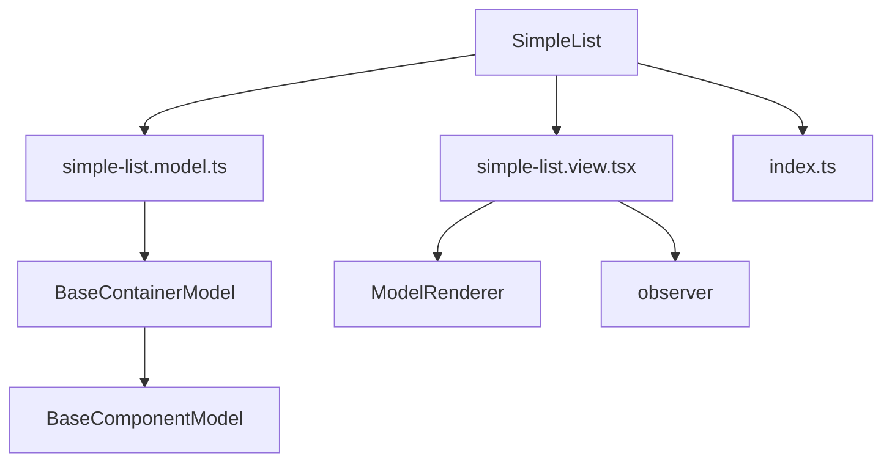
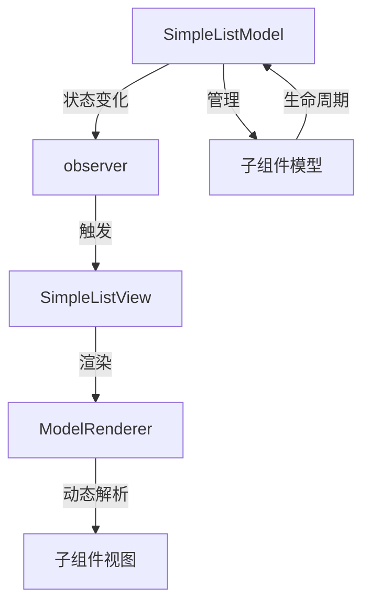
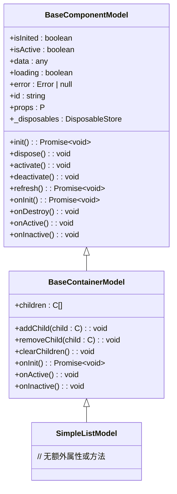
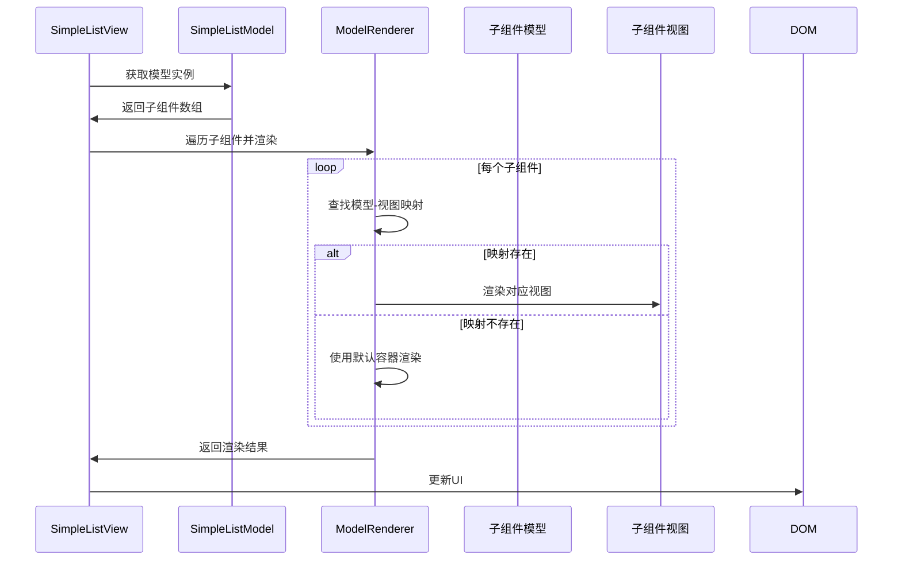
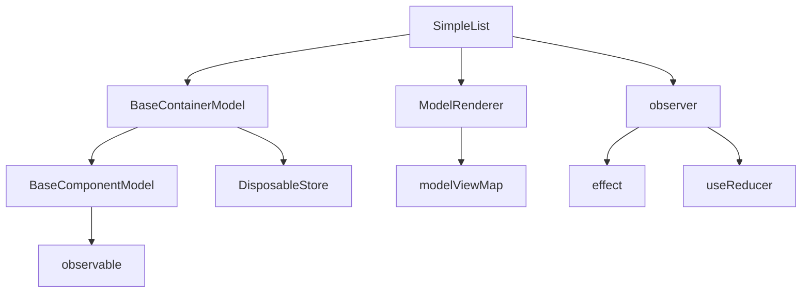

# 简单列表组件

<cite>
**本文档引用文件**  
- [simple-list.model.ts](file://packages/h5-builder/src/components/simple-list/simple-list.model.ts)
- [simple-list.view.tsx](file://packages/h5-builder/src/components/simple-list/simple-list.view.tsx)
- [model-renderer.tsx](file://packages/h5-builder/src/components/model-renderer.tsx)
- [model.ts](file://packages/h5-builder/src/bedrock/model.ts)
- [observer.ts](file://packages/mobx-vue-lite/src/observer.ts)
- [useObserver.ts](file://packages/mobx-vue-lite/src/useObserver.ts)
- [product-card.model.ts](file://packages/h5-builder/src/components/product-card/product-card.model.ts)
</cite>

## 目录
1. [简介](#简介)
2. [项目结构](#项目结构)
3. [核心组件](#核心组件)
4. [架构概述](#架构概述)
5. [详细组件分析](#详细组件分析)
6. [依赖分析](#依赖分析)
7. [性能考虑](#性能考虑)
8. [故障排除指南](#故障排除指南)
9. [结论](#结论)

## 简介
简单列表组件（SimpleList）是一个轻量级的容器组件，专为渲染结构化数据列表（如商品列表、菜单项等）而设计。该组件基于 MobX 状态管理库和 React 视图层，通过 `mobx-vue-lite` 实现高效的响应式更新机制。SimpleList 本身不包含业务逻辑，仅负责管理子组件的渲染和生命周期，其核心功能包括数据源绑定、列表项模板配置、滚动加载支持和事件监听。

该组件的设计目标是提供一个可复用、高性能的列表容器，能够灵活地集成各种类型的子组件，并通过响应式状态管理实现高效的数据更新和视图渲染。通过与 `BaseContainerModel` 的集成，SimpleList 自动继承了完整的生命周期管理能力，包括子组件的初始化、激活、停用和销毁。

## 项目结构
简单列表组件位于 `packages/h5-builder/src/components/simple-list/` 目录下，遵循标准的组件组织结构，包含模型（model）、视图（view）和入口文件（index.ts）。该组件作为容器组件，依赖于 `BaseContainerModel` 提供的通用容器功能，并通过 `ModelRenderer` 实现子组件的动态渲染。

**图表来源**  
- [simple-list.model.ts](file://packages/h5-builder/src/components/simple-list/simple-list.model.ts)
- [simple-list.view.tsx](file://packages/h5-builder/src/components/simple-list/simple-list.view.tsx)
- [model.ts](file://packages/h5-builder/src/bedrock/model.ts)
- [model-renderer.tsx](file://packages/h5-builder/src/components/model-renderer.tsx)

**本节来源**  
- [simple-list.model.ts](file://packages/h5-builder/src/components/simple-list/simple-list.model.ts)
- [simple-list.view.tsx](file://packages/h5-builder/src/components/simple-list/simple-list.view.tsx)

## 核心组件
简单列表组件由两个核心部分组成：`SimpleListModel` 和 `SimpleListView`。`SimpleListModel` 继承自 `BaseContainerModel`，负责管理子组件的生命周期和状态；`SimpleListView` 是一个 React 函数组件，使用 `observer` 高阶函数包装，确保在模型状态变化时自动重新渲染。

`SimpleListModel` 通过继承 `BaseContainerModel` 获得了自动管理子组件生命周期的能力，包括并行初始化所有子组件、激活和停用所有子组件。这种设计模式使得 SimpleList 成为一个纯粹的容器，无需关心具体的业务逻辑，只需关注子组件的组织和管理。

**本节来源**  
- [simple-list.model.ts](file://packages/h5-builder/src/components/simple-list/simple-list.model.ts)
- [simple-list.view.tsx](file://packages/h5-builder/src/components/simple-list/simple-list.view.tsx)

## 架构概述
简单列表组件采用模型-视图分离的架构模式，将数据逻辑与 UI 渲染完全解耦。模型层（`SimpleListModel`）负责管理组件的状态和生命周期，视图层（`SimpleListView`）负责将模型状态映射到 UI 元素。这种分离使得组件更易于测试、维护和复用。

组件通过 `mobx-vue-lite` 提供的响应式系统实现高效更新。当模型状态发生变化时，`observer` 会自动触发视图的重新渲染，避免了手动管理状态更新的复杂性。同时，`ModelRenderer` 组件通过注册表机制动态解析和渲染不同类型的子组件，实现了高度的灵活性和可扩展性。

**图表来源**  
- [simple-list.model.ts](file://packages/h5-builder/src/components/simple-list/simple-list.model.ts)
- [simple-list.view.tsx](file://packages/h5-builder/src/components/simple-list/simple-list.view.tsx)
- [model-renderer.tsx](file://packages/h5-builder/src/components/model-renderer.tsx)
- [observer.ts](file://packages/mobx-vue-lite/src/observer.ts)

## 详细组件分析

### SimpleListModel 分析
`SimpleListModel` 是简单列表的模型层，继承自 `BaseContainerModel`，因此自动获得了容器组件的通用功能。它不包含任何额外的业务逻辑，仅通过继承机制复用父类的生命周期管理能力。

**图表来源**  
- [model.ts](file://packages/h5-builder/src/bedrock/model.ts)
- [simple-list.model.ts](file://packages/h5-builder/src/components/simple-list/simple-list.model.ts)

**本节来源**  
- [simple-list.model.ts](file://packages/h5-builder/src/components/simple-list/simple-list.model.ts)
- [model.ts](file://packages/h5-builder/src/bedrock/model.ts)

### SimpleListView 分析
`SimpleListView` 是简单列表的视图层，使用 React 函数组件和 `mobx-vue-lite` 的 `observer` 高阶函数实现响应式渲染。它通过 `ModelRenderer` 动态渲染子组件，确保每个子组件都能根据其类型正确解析和显示。

**图表来源**  
- [simple-list.view.tsx](file://packages/h5-builder/src/components/simple-list/simple-list.view.tsx)
- [model-renderer.tsx](file://packages/h5-builder/src/components/model-renderer.tsx)

**本节来源**  
- [simple-list.view.tsx](file://packages/h5-builder/src/components/simple-list/simple-list.view.tsx)
- [model-renderer.tsx](file://packages/h5-builder/src/components/model-renderer.tsx)

## 依赖分析
简单列表组件依赖于多个核心模块，形成了清晰的依赖关系网络。这些依赖包括基础模型类、状态管理库、组件渲染机制等，共同支撑了组件的功能实现。

**图表来源**  
- [simple-list.model.ts](file://packages/h5-builder/src/components/simple-list/simple-list.model.ts)
- [simple-list.view.tsx](file://packages/h5-builder/src/components/simple-list/simple-list.view.tsx)
- [model.ts](file://packages/h5-builder/src/bedrock/model.ts)
- [model-renderer.tsx](file://packages/h5-builder/src/components/model-renderer.tsx)
- [observer.ts](file://packages/mobx-vue-lite/src/observer.ts)

**本节来源**  
- [simple-list.model.ts](file://packages/h5-builder/src/components/simple-list/simple-list.model.ts)
- [simple-list.view.tsx](file://packages/h5-builder/src/components/simple-list/simple-list.view.tsx)
- [model.ts](file://packages/h5-builder/src/bedrock/model.ts)

## 性能考虑
为了确保简单列表组件在大规模数据场景下的性能表现，需要遵循以下最佳实践：

1. **合理设置 key 属性**：在渲染列表项时，始终使用稳定的唯一标识作为 `key`，避免使用数组索引。这可以确保 React 能够正确识别列表项的变化，减少不必要的重新渲染。

2. **避免内联函数创建**：在 JSX 中避免创建内联函数，因为每次渲染都会生成新的函数实例，导致子组件不必要的重新渲染。应将事件处理函数定义为组件的成员方法或使用 `useCallback` 进行记忆化。

3. **利用 mobx-vue-lite 的优化机制**：`observer` 高阶函数内部使用了 `React.memo` 进行浅比较优化，确保只有当模型状态真正变化时才会触发重新渲染。同时，`useObserver` 钩子通过 `effect` 系统精确追踪依赖关系，避免过度渲染。

4. **批量更新状态**：当需要更新多个状态时，尽量将它们合并为一次更新操作，减少渲染次数。MobX 的事务机制可以确保多个状态变更被合并为一次原子操作。

5. **合理使用计算属性**：对于复杂的派生状态，使用 `computed` 装饰器创建计算属性，确保其值仅在依赖项变化时重新计算，避免重复计算带来的性能开销。

**本节来源**  
- [observer.ts](file://packages/mobx-vue-lite/src/observer.ts)
- [useObserver.ts](file://packages/mobx-vue-lite/src/useObserver.ts)
- [simple-list.view.tsx](file://packages/h5-builder/src/components/simple-list/simple-list.view.tsx)

## 故障排除指南
在使用简单列表组件时，可能会遇到一些常见问题。以下是这些问题的解决方案：

### 列表项错位
**问题描述**：列表项在滚动或更新时出现位置错乱。
**解决方案**：
- 确保每个列表项的 `key` 属性是稳定且唯一的，避免使用数组索引。
- 检查子组件是否正确实现了 `dispose` 方法，确保资源被正确清理。
- 确认 `ModelRenderer` 的映射表已正确注册所有子组件类型。

### 滚动卡顿
**问题描述**：列表在滚动时出现卡顿或掉帧现象。
**解决方案**：
- 对于长列表场景，考虑使用虚拟列表（VirtualList）组件替代简单列表，以减少 DOM 节点数量。
- 确保子组件的渲染逻辑尽可能轻量，避免复杂的计算或频繁的状态更新。
- 使用 `useObserver` 或 `observer` 包装子组件，确保只有相关状态变化时才触发重新渲染。

### 数据更新不生效
**问题描述**：模型状态已更新，但视图未重新渲染。
**解决方案**：
- 确认模型类已正确使用 `observable` 包装，确保状态是响应式的。
- 检查是否在 `onInit` 或其他异步方法中正确调用了 `refresh` 方法。
- 确认 `observer` 已正确应用到视图组件上，且没有被其他高阶组件意外移除。
- 使用开发者工具检查依赖追踪是否正确建立，确保 `effect` 系统能够捕获到状态变化。

**本节来源**  
- [simple-list.view.tsx](file://packages/h5-builder/src/components/simple-list/simple-list.view.tsx)
- [model-renderer.tsx](file://packages/h5-builder/src/components/model-renderer.tsx)
- [useObserver.ts](file://packages/mobx-vue-lite/src/useObserver.ts)

## 结论
简单列表组件通过结合 `BaseContainerModel` 的生命周期管理能力和 `mobx-vue-lite` 的响应式系统，提供了一个高效、灵活的列表渲染解决方案。其模型-视图分离的架构设计使得组件易于维护和扩展，而基于 MobX 的状态管理机制则确保了高性能的更新效率。

通过遵循本文档中的最佳实践和故障排除指南，开发者可以充分利用简单列表组件的优势，构建出流畅、可靠的用户界面。对于需要处理大量数据的场景，建议结合虚拟列表组件使用，以进一步提升性能表现。