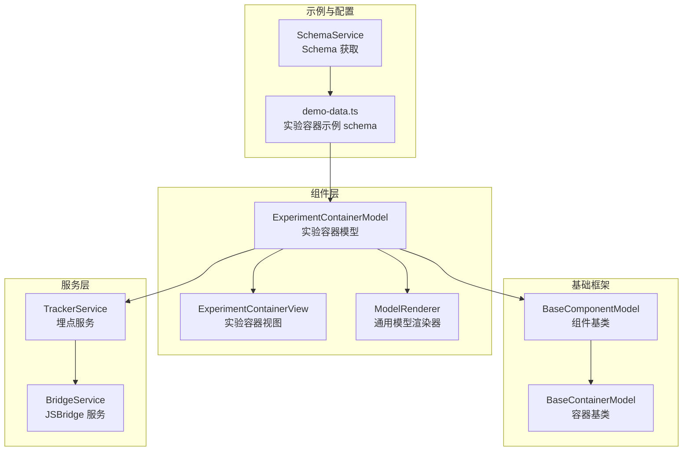
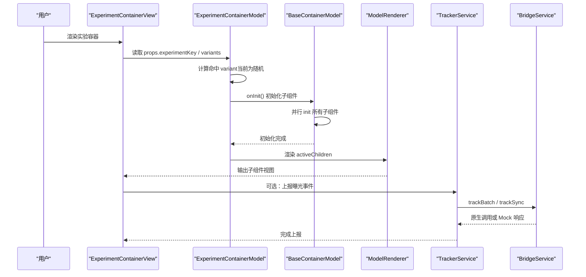
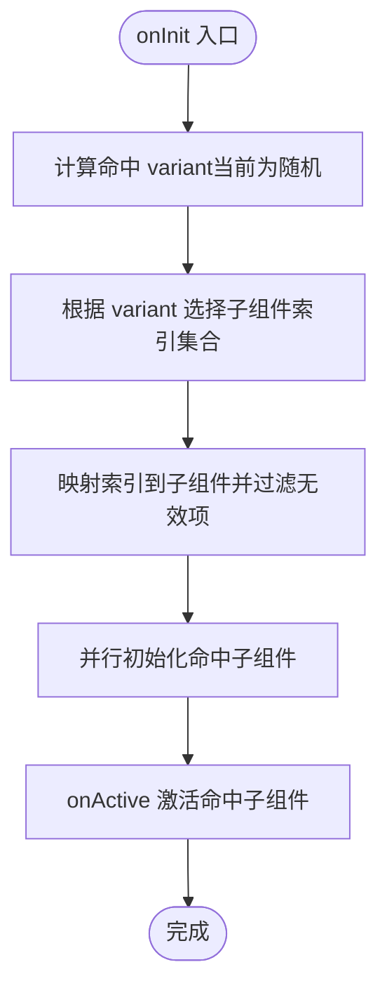
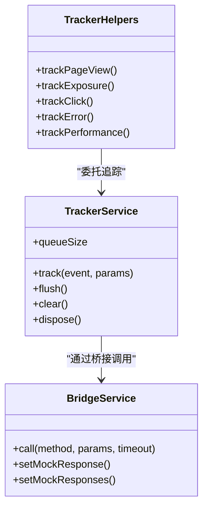
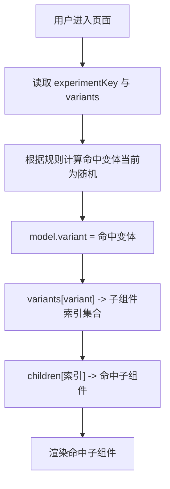
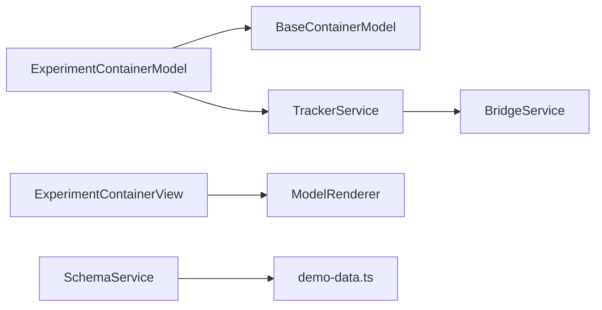

# 实验控制容器

<cite>
**本文引用的文件**
- [experiment-container.model.ts](file://packages/h5-builder/src/components/experiment-container/experiment-container.model.ts)
- [experiment-container.view.tsx](file://packages/h5-builder/src/components/experiment-container/experiment-container.view.tsx)
- [model-renderer.tsx](file://packages/h5-builder/src/components/model-renderer.tsx)
- [model.ts](file://packages/h5-builder/src/bedrock/model.ts)
- [tracker.service.ts](file://packages/h5-builder/src/services/tracker.service.ts)
- [bridge.service.ts](file://packages/h5-builder/src/services/bridge.service.ts)
- [demo-data.ts](file://packages/h5-builder/src/mock/demo-data.ts)
- [schema.service.ts](file://packages/h5-builder/src/services/schema.service.ts)
</cite>

## 目录
1. [简介](#简介)
2. [项目结构](#项目结构)
3. [核心组件](#核心组件)
4. [架构总览](#架构总览)
5. [组件详细分析](#组件详细分析)
6. [依赖关系分析](#依赖关系分析)
7. [性能考量](#性能考量)
8. [故障排查指南](#故障排查指南)
9. [结论](#结论)
10. [附录](#附录)

## 简介
本文件围绕 ExperimentContainer 组件在 A/B 测试与多变量实验中的应用进行系统化文档化，重点说明：
- 如何基于实验配置进行用户分流并渲染不同版本的子组件
- ExperimentContainerModel 与埋点服务 TrackerService 的集成方式，用于上报实验曝光与用户行为
- 实验配置 schema 的完整示例，解释流量分配算法与实验状态管理
- 实验数据隔离、调试模式启用与结果分析的实践建议

## 项目结构
ExperimentContainer 位于 h5-builder 包内，采用“模型-视图”分离设计，配合通用容器基类与渲染器完成子组件的动态选择与渲染；埋点服务通过桥接层对接原生能力或本地调试环境。

图表来源
- [experiment-container.model.ts](file://packages/h5-builder/src/components/experiment-container/experiment-container.model.ts#L1-L80)
- [experiment-container.view.tsx](file://packages/h5-builder/src/components/experiment-container/experiment-container.view.tsx#L1-L55)
- [model-renderer.tsx](file://packages/h5-builder/src/components/model-renderer.tsx#L1-L105)
- [model.ts](file://packages/h5-builder/src/bedrock/model.ts#L1-L243)
- [tracker.service.ts](file://packages/h5-builder/src/services/tracker.service.ts#L1-L290)
- [bridge.service.ts](file://packages/h5-builder/src/services/bridge.service.ts#L1-L227)
- [demo-data.ts](file://packages/h5-builder/src/mock/demo-data.ts#L61-L112)
- [schema.service.ts](file://packages/h5-builder/src/services/schema.service.ts#L1-L37)

章节来源
- [experiment-container.model.ts](file://packages/h5-builder/src/components/experiment-container/experiment-container.model.ts#L1-L80)
- [experiment-container.view.tsx](file://packages/h5-builder/src/components/experiment-container/experiment-container.view.tsx#L1-L55)
- [model-renderer.tsx](file://packages/h5-builder/src/components/model-renderer.tsx#L1-L105)
- [model.ts](file://packages/h5-builder/src/bedrock/model.ts#L1-L243)
- [tracker.service.ts](file://packages/h5-builder/src/services/tracker.service.ts#L1-L290)
- [bridge.service.ts](file://packages/h5-builder/src/services/bridge.service.ts#L1-L227)
- [demo-data.ts](file://packages/h5-builder/src/mock/demo-data.ts#L61-L112)
- [schema.service.ts](file://packages/h5-builder/src/services/schema.service.ts#L1-L37)

## 核心组件
- ExperimentContainerModel：负责实验分流、子组件选择与生命周期管理
- ExperimentContainerView：负责渲染实验容器与调试信息
- ModelRenderer：通用模型渲染器，按模型类型映射到对应视图
- BaseContainerModel/BaseComponentModel：容器与组件基类，提供统一的生命周期与资源管理
- TrackerService/BridgeService：埋点与桥接服务，支持调试模式、批量发送与持久化
- demo-data.ts：包含实验容器的完整 schema 示例

章节来源
- [experiment-container.model.ts](file://packages/h5-builder/src/components/experiment-container/experiment-container.model.ts#L1-L80)
- [experiment-container.view.tsx](file://packages/h5-builder/src/components/experiment-container/experiment-container.view.tsx#L1-L55)
- [model-renderer.tsx](file://packages/h5-builder/src/components/model-renderer.tsx#L1-L105)
- [model.ts](file://packages/h5-builder/src/bedrock/model.ts#L1-L243)
- [tracker.service.ts](file://packages/h5-builder/src/services/tracker.service.ts#L1-L290)
- [bridge.service.ts](file://packages/h5-builder/src/services/bridge.service.ts#L1-L227)
- [demo-data.ts](file://packages/h5-builder/src/mock/demo-data.ts#L61-L112)

## 架构总览
ExperimentContainer 的工作流包括：解析实验配置 -> 计算命中分组 -> 选择子组件 -> 初始化与激活 -> 渲染输出；同时可选地通过 TrackerService 上报曝光与交互事件。

图表来源
- [experiment-container.model.ts](file://packages/h5-builder/src/components/experiment-container/experiment-container.model.ts#L36-L79)
- [experiment-container.view.tsx](file://packages/h5-builder/src/components/experiment-container/experiment-container.view.tsx#L14-L51)
- [model-renderer.tsx](file://packages/h5-builder/src/components/model-renderer.tsx#L46-L105)
- [model.ts](file://packages/h5-builder/src/bedrock/model.ts#L202-L235)
- [tracker.service.ts](file://packages/h5-builder/src/services/tracker.service.ts#L71-L171)
- [bridge.service.ts](file://packages/h5-builder/src/services/bridge.service.ts#L55-L118)

## 组件详细分析

### ExperimentContainerModel：实验分流与子组件选择
- 关键职责
  - 解析 props.experimentKey 与 variants
  - 计算命中 variant（当前实现为随机选择）
  - 基于 variant 选择子组件索引集合，过滤有效子节点
  - 在 onInit 中初始化命中子组件，在 onActive/onInactive 中激活/停用
- 数据结构与复杂度
  - variants 结构为 variant 名称到子组件索引数组的映射，选择子组件的时间复杂度为 O(k)，k 为该变体的子组件数量
  - activeChildren 通过索引映射与过滤，避免重复遍历
- 错误处理与边界
  - 若 variant 不存在或索引越界，activeChildren 将安全过滤为空数组
  - 生命周期钩子遵循容器基类约定，保证子组件正确初始化与释放

图表来源
- [experiment-container.model.ts](file://packages/h5-builder/src/components/experiment-container/experiment-container.model.ts#L36-L79)

章节来源
- [experiment-container.model.ts](file://packages/h5-builder/src/components/experiment-container/experiment-container.model.ts#L1-L80)
- [model.ts](file://packages/h5-builder/src/bedrock/model.ts#L202-L235)

### ExperimentContainerView：渲染与调试信息
- 渲染逻辑
  - loading 状态下显示占位提示
  - 展示实验 key 与命中 variant 的调试信息
  - 通过 ModelRenderer 渲染 activeChildren
- 调试模式
  - 视图层直接展示实验信息，便于开发调试

章节来源
- [experiment-container.view.tsx](file://packages/h5-builder/src/components/experiment-container/experiment-container.view.tsx#L1-L55)
- [model-renderer.tsx](file://packages/h5-builder/src/components/model-renderer.tsx#L46-L105)

### 埋点服务集成：TrackerService 与 BridgeService
- TrackerService
  - 支持 debug 模式（同步上报+Toast提示）
  - 批量发送策略（按最大批次与时间间隔触发）
  - 可选持久化到 localStorage，支持重启恢复
  - 提供常用事件封装（页面浏览、组件曝光、点击、错误、性能）
- BridgeService
  - 统一调用原生能力或 Mock 数据
  - 提供超时与错误处理
- 集成建议
  - 在 ExperimentContainerView 或子组件中使用 TrackerHelpers 进行曝光与交互上报
  - 开发阶段启用 debug 模式，生产阶段关闭并配置批量参数

图表来源
- [tracker.service.ts](file://packages/h5-builder/src/services/tracker.service.ts#L1-L290)
- [bridge.service.ts](file://packages/h5-builder/src/services/bridge.service.ts#L1-L227)

章节来源
- [tracker.service.ts](file://packages/h5-builder/src/services/tracker.service.ts#L1-L290)
- [bridge.service.ts](file://packages/h5-builder/src/services/bridge.service.ts#L1-L227)

### 实验配置 schema 示例与流量分配
- 完整示例位置
  - 在 demo-data.ts 中定义了多个实验容器示例，包含不同变体与子组件组合
- 配置要点
  - experimentKey：实验标识，用于区分不同实验
  - variants：变体到子组件索引的映射，控制渲染哪些子组件
  - 子组件：按顺序排列，索引从 0 开始
- 流量分配算法
  - 当前实现为随机选择变体（便于演示），实际生产中应替换为基于用户标识与实验规则的稳定分配
- 实验状态管理
  - model.variant 记录当前命中变体
  - activeChildren 动态反映当前变体所选子组件集合

图表来源
- [demo-data.ts](file://packages/h5-builder/src/mock/demo-data.ts#L61-L112)
- [experiment-container.model.ts](file://packages/h5-builder/src/components/experiment-container/experiment-container.model.ts#L36-L79)

章节来源
- [demo-data.ts](file://packages/h5-builder/src/mock/demo-data.ts#L61-L112)
- [experiment-container.model.ts](file://packages/h5-builder/src/components/experiment-container/experiment-container.model.ts#L1-L80)

### 容器生命周期与子组件管理
- BaseContainerModel 默认行为
  - onInit：并行初始化所有子组件
  - onActive：激活所有子组件
  - onInactive：停用所有子组件
- ExperimentContainerModel 覆写
  - 在 onInit 中先计算 variant，再仅初始化命中子组件
  - 在 onActive/onInactive 中仅激活/停用命中子组件

章节来源
- [model.ts](file://packages/h5-builder/src/bedrock/model.ts#L202-L235)
- [experiment-container.model.ts](file://packages/h5-builder/src/components/experiment-container/experiment-container.model.ts#L36-L79)

## 依赖关系分析
- 组件依赖
  - ExperimentContainerModel 继承 BaseContainerModel，复用容器生命周期
  - ExperimentContainerView 依赖 ModelRenderer 进行子组件渲染
- 服务依赖
  - TrackerService 依赖 BridgeService 进行事件上报
  - SchemaService 提供 demo-data.ts 中的 schema 数据
- 外部接口
  - BridgeService 支持原生调用与 Mock 回退，便于调试

图表来源
- [experiment-container.model.ts](file://packages/h5-builder/src/components/experiment-container/experiment-container.model.ts#L1-L80)
- [experiment-container.view.tsx](file://packages/h5-builder/src/components/experiment-container/experiment-container.view.tsx#L1-L55)
- [model-renderer.tsx](file://packages/h5-builder/src/components/model-renderer.tsx#L1-L105)
- [model.ts](file://packages/h5-builder/src/bedrock/model.ts#L1-L243)
- [tracker.service.ts](file://packages/h5-builder/src/services/tracker.service.ts#L1-L290)
- [bridge.service.ts](file://packages/h5-builder/src/services/bridge.service.ts#L1-L227)
- [schema.service.ts](file://packages/h5-builder/src/services/schema.service.ts#L1-L37)

章节来源
- [experiment-container.model.ts](file://packages/h5-builder/src/components/experiment-container/experiment-container.model.ts#L1-L80)
- [experiment-container.view.tsx](file://packages/h5-builder/src/components/experiment-container/experiment-container.view.tsx#L1-L55)
- [model-renderer.tsx](file://packages/h5-builder/src/components/model-renderer.tsx#L1-L105)
- [model.ts](file://packages/h5-builder/src/bedrock/model.ts#L1-L243)
- [tracker.service.ts](file://packages/h5-builder/src/services/tracker.service.ts#L1-L290)
- [bridge.service.ts](file://packages/h5-builder/src/services/bridge.service.ts#L1-L227)
- [schema.service.ts](file://packages/h5-builder/src/services/schema.service.ts#L1-L37)

## 性能考量
- 子组件初始化
  - BaseContainerModel 默认并行初始化所有子组件，ExperimentContainerModel 仅初始化命中子组件，减少初始化开销
- 渲染优化
  - 通过 activeChildren 精准选择子组件，避免无关渲染
- 埋点性能
  - 生产模式下采用批量发送与定时刷新，降低网络压力
  - 可选持久化，提升稳定性但需注意存储上限与清理策略

[本节为通用性能讨论，无需列出具体文件来源]

## 故障排查指南
- 实验未生效
  - 检查 props.experimentKey 与 variants 配置是否正确
  - 确认当前 variant 是否存在且索引有效
- 子组件未渲染
  - 核对 variants 中变体到索引映射是否包含目标变体
  - 确认子组件索引未越界
- 埋点异常
  - 开启 debug 模式观察 Toast 与同步上报
  - 检查 BridgeService 的原生调用是否可用或 Mock 响应是否配置
- 批量发送失败
  - 查看 flush 失败后的重试与持久化逻辑
  - 确认 localStorage 权限与容量

章节来源
- [tracker.service.ts](file://packages/h5-builder/src/services/tracker.service.ts#L71-L171)
- [bridge.service.ts](file://packages/h5-builder/src/services/bridge.service.ts#L55-L118)

## 结论
ExperimentContainer 通过简洁的配置与容器基类的生命周期管理，实现了灵活的实验分流与子组件渲染。结合 TrackerService 的埋点能力，可在开发与生产环境中高效完成实验曝光与行为采集。建议在生产环境将随机分流替换为稳定的用户标识分配，并充分利用调试模式与持久化机制进行问题定位与结果分析。

[本节为总结性内容，无需列出具体文件来源]

## 附录

### 实验配置 schema 完整示例（来自 demo-data.ts）
- 示例位置
  - [demo-data.ts](file://packages/h5-builder/src/mock/demo-data.ts#L61-L112)
- 关键字段
  - experimentKey：实验标识
  - variants：变体到子组件索引映射
  - children：实验容器的子组件列表（按顺序编号）

章节来源
- [demo-data.ts](file://packages/h5-builder/src/mock/demo-data.ts#L61-L112)

### 实验状态管理与流量分配建议
- 状态管理
  - model.variant 记录当前命中变体，activeChildren 动态反映渲染集合
- 流量分配
  - 当前实现为随机分流，建议替换为基于用户 ID 的哈希或规则引擎
- 数据隔离
  - 不同实验 key 应独立管理，避免交叉污染
- 调试模式
  - 开发阶段启用 debug 模式，便于快速验证曝光与交互上报
- 结果分析
  - 使用 TrackerService 的批量与持久化能力，结合后端埋点平台进行归因分析

章节来源
- [experiment-container.model.ts](file://packages/h5-builder/src/components/experiment-container/experiment-container.model.ts#L1-L80)
- [tracker.service.ts](file://packages/h5-builder/src/services/tracker.service.ts#L1-L290)