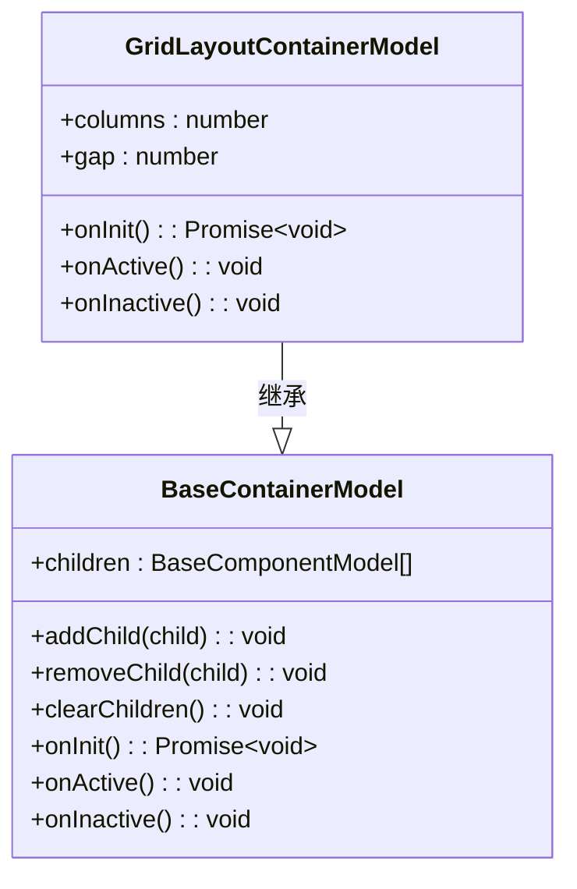
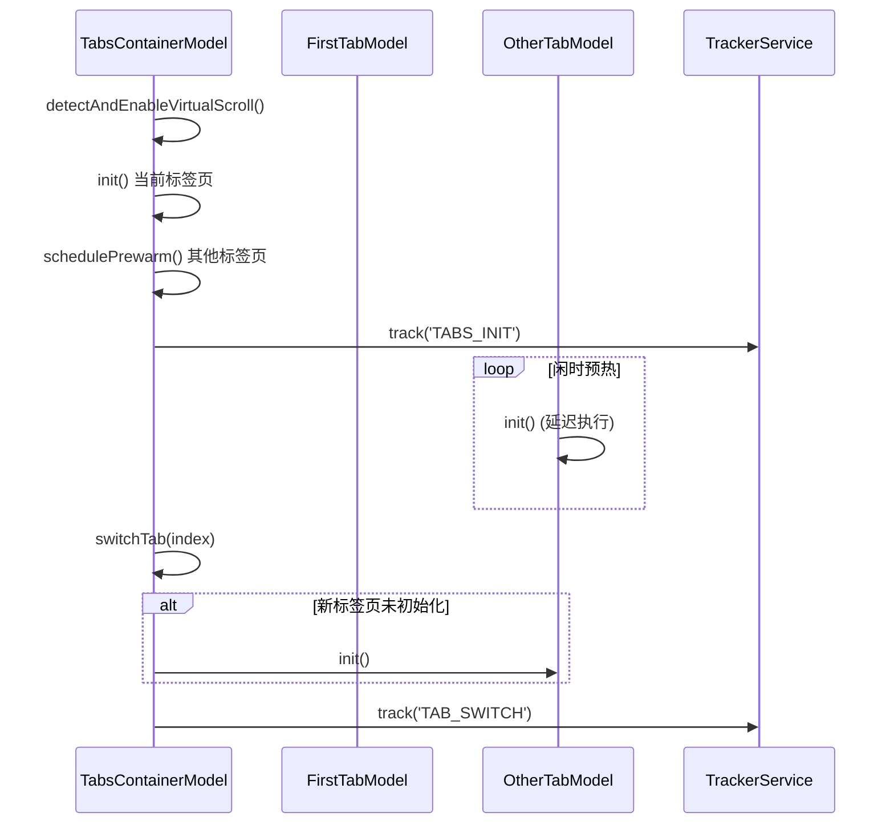
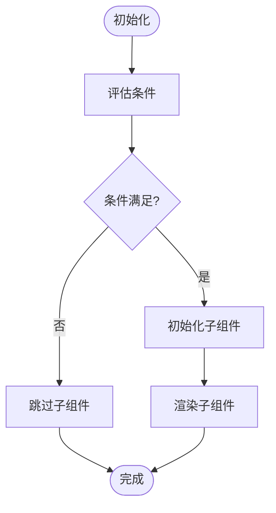
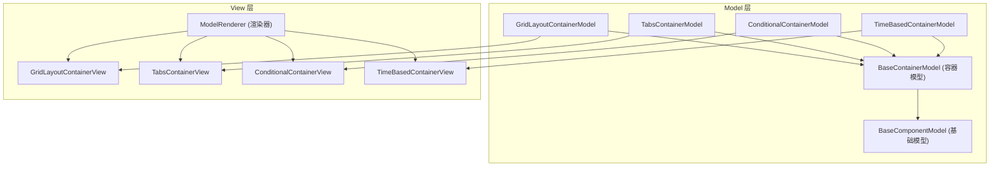
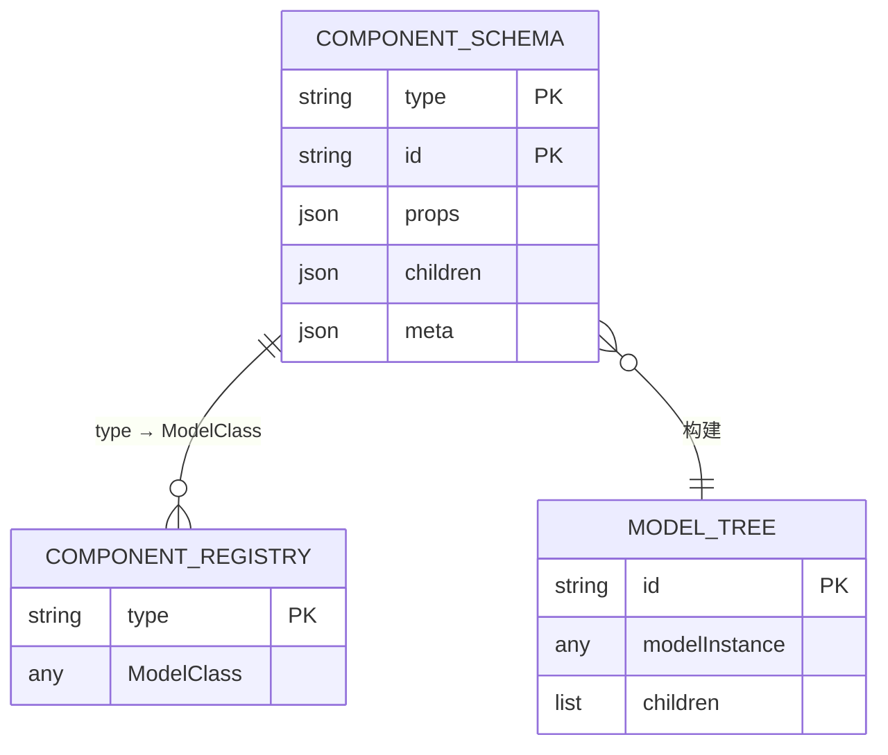
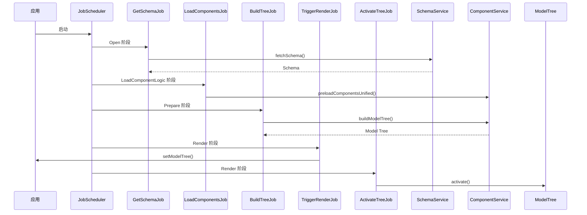

# 容器组件

<cite>
**本文档引用的文件**
- [grid-layout-container.model.ts](file://packages/h5-builder/src/components/grid-layout-container/grid-layout-container.model.ts)
- [grid-layout-container.view.tsx](file://packages/h5-builder/src/components/grid-layout-container/grid-layout-container.view.tsx)
- [tabs-container.model.ts](file://packages/h5-builder/src/components/tabs-container/tabs-container.model.ts)
- [tabs-container.view.tsx](file://packages/h5-builder/src/components/tabs-container/tabs-container.view.tsx)
- [conditional-container.model.ts](file://packages/h5-builder/src/components/conditional-container/conditional-container.model.ts)
- [conditional-container.view.tsx](file://packages/h5-builder/src/components/conditional-container/conditional-container.view.tsx)
- [time-based-container.model.ts](file://packages/h5-builder/src/components/time-based-container/time-based-container.model.ts)
- [time-based-container.view.tsx](file://packages/h5-builder/src/components/time-based-container/time-based-container.view.tsx)
- [component.service.ts](file://packages/h5-builder/src/services/component.service.ts)
- [model.ts](file://packages/h5-builder/src/bedrock/model.ts)
- [virtual-list.model.ts](file://packages/h5-builder/src/components/virtual-list/virtual-list.model.ts)
- [model-renderer.tsx](file://packages/h5-builder/src/components/model-renderer.tsx)
- [demo-progressive.tsx](file://packages/h5-builder/src/demo-progressive.tsx)
- [schema.service.ts](file://packages/h5-builder/src/services/schema.service.ts)
- [build-tree-job.ts](file://packages/h5-builder/src/jobs/build-tree-job.ts)
</cite>

## 目录
1. [简介](#简介)
2. [核心容器组件](#核心容器组件)
   1. [GridLayoutContainer](#gridlayoutcontainer)
   2. [TabsContainer](#tabscontainer)
   3. [ConditionalContainer](#conditionalcontainer)
   4. [TimeBasedContainer](#timebasedcontainer)
3. [容器组件架构](#容器组件架构)
4. [配置属性与Schema驱动](#配置属性与schema驱动)
5. [动态结构控制与Job调度](#动态结构控制与job调度)
6. [嵌套使用与性能建议](#嵌套使用与性能建议)
7. [总结](#总结)

## 简介

本文档详细描述了H5搭建系统中的核心容器组件，包括`GridLayoutContainer`、`TabsContainer`、`ConditionalContainer`和`TimeBasedContainer`。这些组件通过继承`BaseContainerModel`实现了统一的生命周期管理和子组件控制机制。文档将深入分析每种容器的布局特性、条件渲染逻辑、配置属性以及它们如何与Job调度系统协同工作，实现渐进式渲染。所有容器组件均采用Schema驱动的设计模式，通过`component.service.ts`中的`ComponentService`将JSON Schema转换为可交互的Model-View树。

**Section sources**
- [grid-layout-container.model.ts](file://packages/h5-builder/src/components/grid-layout-container/grid-layout-container.model.ts#L1-L44)
- [tabs-container.model.ts](file://packages/h5-builder/src/components/tabs-container/tabs-container.model.ts#L1-L273)
- [conditional-container.model.ts](file://packages/h5-builder/src/components/conditional-container/conditional-container.model.ts#L1-L86)

## 核心容器组件

### GridLayoutContainer

`GridLayoutContainer`是一个用于创建网格布局的容器组件，适用于商品展示、图片墙等场景。它通过CSS Grid实现响应式布局，并提供简单的配置属性来控制列数和间距。

#### 布局特性与子组件管理
`GridLayoutContainer`通过`BaseContainerModel`继承了标准的子组件管理机制。在`onInit`生命周期中，它会并行初始化所有子组件，确保整个网格结构在渲染前已准备就绪。其View组件使用CSS Grid的`gridTemplateColumns`属性根据`columns`配置动态生成列布局。



**Diagram sources**
- [grid-layout-container.model.ts](file://packages/h5-builder/src/components/grid-layout-container/grid-layout-container.model.ts#L20-L43)
- [model.ts](file://packages/h5-builder/src/bedrock/model.ts#L168-L242)

#### 配置属性
`GridLayoutContainer`的配置属性定义在`GridLayoutContainerProps`接口中，主要包括：
- `columns`: 必需的列数配置
- `gap`: 可选的网格间距（默认8px）

#### Schema驱动使用示例
```json
{
  "type": "GridLayoutContainer",
  "id": "grid-1",
  "props": {
    "columns": 3,
    "gap": 12
  },
  "children": [
    {
      "type": "ProductCard",
      "id": "product-1",
      "props": { "title": "商品1" }
    },
    {
      "type": "ProductCard",
      "id": "product-2",
      "props": { "title": "商品2" }
    }
  ]
}
```

**Section sources**
- [grid-layout-container.model.ts](file://packages/h5-builder/src/components/grid-layout-container/grid-layout-container.model.ts#L6-L9)
- [grid-layout-container.view.tsx](file://packages/h5-builder/src/components/grid-layout-container/grid-layout-container.view.tsx#L16-L25)

### TabsContainer

`TabsContainer`是一个功能丰富的标签页容器，支持懒加载、闲时预热和自动虚拟滚动优化。它通过`switchTab`方法管理标签页的切换，并在初始化时只加载当前激活的标签页。

#### 布局特性与子组件管理
`TabsContainer`的核心特性是其懒加载机制。在`onInit`方法中，它只初始化当前激活的标签页，而其他标签页则通过`schedulePrewarm`方法在闲时进行预热。这种设计显著提升了首屏加载性能。对于包含大量子组件的标签页，`TabsContainer`会自动启用虚拟滚动优化。



**Diagram sources**
- [tabs-container.model.ts](file://packages/h5-builder/src/components/tabs-container/tabs-container.model.ts#L68-L96)
- [tabs-container.model.ts](file://packages/h5-builder/src/components/tabs-container/tabs-container.model.ts#L171-L203)

#### 条件渲染逻辑与配置属性
`TabsContainer`的条件渲染逻辑主要体现在其虚拟滚动的自动启用机制上。当某个标签页的子组件数量超过阈值（默认20）时，系统会自动为其启用虚拟滚动，而无需修改Schema。其配置属性包括：
- `defaultIndex`: 默认激活的标签页索引
- `virtualScroll`: 虚拟滚动配置，包含`enabled`、`threshold`、`itemHeight`等子属性

#### Schema驱动使用示例
```json
{
  "type": "TabsContainer",
  "id": "tabs-1",
  "props": {
    "defaultIndex": 0,
    "virtualScroll": {
      "threshold": 15,
      "itemHeight": 100
    }
  },
  "children": [
    {
      "type": "SimpleList",
      "id": "list-1",
      "children": [/* 大量子组件 */]
    },
    {
      "type": "TextCard",
      "id": "text-1",
      "props": { "content": "标签页2内容" }
    }
  ]
}
```

**Section sources**
- [tabs-container.model.ts](file://packages/h5-builder/src/components/tabs-container/tabs-container.model.ts#L9-L17)
- [tabs-container.view.tsx](file://packages/h5-builder/src/components/tabs-container/tabs-container.view.tsx#L52-L74)

### ConditionalContainer

`ConditionalContainer`是一个条件渲染容器，根据指定的条件决定是否渲染其子组件。它适用于VIP专属内容、新用户引导、A/B测试等场景。

#### 条件渲染逻辑
`ConditionalContainer`在`onInit`生命周期中通过`evaluateCondition`方法评估条件。如果条件满足，才会初始化并渲染子组件；否则，整个容器及其子组件都不会被渲染。其条件类型包括：
- `user_vip`: 基于用户VIP状态
- `user_new`: 基于用户是否为新用户
- `random`: 基于指定概率的随机条件
- `always`: 总是渲染



**Diagram sources**
- [conditional-container.model.ts](file://packages/h5-builder/src/components/conditional-container/conditional-container.model.ts#L29-L38)
- [conditional-container.model.ts](file://packages/h5-builder/src/components/conditional-container/conditional-container.model.ts#L44-L63)

#### 配置属性
`ConditionalContainer`的配置属性包括：
- `condition`: 条件类型（'user_vip', 'user_new', 'random', 'always'）
- `probability`: 随机条件的概率（0-1）

#### Schema驱动使用示例
```json
{
  "type": "ConditionalContainer",
  "id": "conditional-1",
  "props": {
    "condition": "random",
    "probability": 0.3
  },
  "children": [
    {
      "type": "ProductCard",
      "id": "special-offer",
      "props": { "title": "限时优惠" }
    }
  ]
}
```

**Section sources**
- [conditional-container.model.ts](file://packages/h5-builder/src/components/conditional-container/conditional-container.model.ts#L7-L9)
- [conditional-container.view.tsx](file://packages/h5-builder/src/components/conditional-container/conditional-container.view.tsx#L17-L19)

### TimeBasedContainer

`TimeBasedContainer`是一个时间段容器，根据当前时间决定渲染哪个子组件。它适用于早餐/午餐/晚餐推荐、限时活动展示等场景。

#### 时间规则与条件渲染
`TimeBasedContainer`在`onInit`时通过`determineTimeSlot`方法确定当前时间段。它根据`timeSlots`配置中的`startHour`和`endHour`判断当前时间属于哪个时间段，并将`currentSlot`属性设置为对应的槽位名称。该容器会初始化所有子组件，但仅根据时间规则决定渲染逻辑。

#### 配置属性
`TimeBasedContainer`的配置属性`timeSlots`是一个对象，其键为时间段名称，值为包含`startHour`和`endHour`的对象。

#### Schema驱动使用示例
```json
{
  "type": "TimeBasedContainer",
  "id": "time-based-1",
  "props": {
    "timeSlots": {
      "breakfast": { "startHour": 6, "endHour": 10 },
      "lunch": { "startHour": 11, "endHour": 14 },
      "dinner": { "startHour": 17, "endHour": 21 }
    }
  },
  "children": [
    {
      "type": "TextCard",
      "id": "breakfast-content",
      "props": { "content": "早餐推荐" }
    },
    {
      "type": "TextCard",
      "id": "lunch-content",
      "props": { "content": "午餐推荐" }
    }
  ]
}
```

**Section sources**
- [time-based-container.model.ts](file://packages/h5-builder/src/components/time-based-container/time-based-container.model.ts#L7-L12)
- [time-based-container.model.ts](file://packages/h5-builder/src/components/time-based-container/time-based-container.model.ts#L45-L55)

## 容器组件架构

所有容器组件都遵循统一的架构模式，基于Model-View分离的设计思想。`BaseComponentModel`提供了基础的生命周期管理，而`BaseContainerModel`则在此基础上增加了子组件管理功能。



**Diagram sources**
- [model.ts](file://packages/h5-builder/src/bedrock/model.ts#L10-L242)
- [model-renderer.tsx](file://packages/h5-builder/src/components/model-renderer.tsx#L10-L37)

## 配置属性与Schema驱动

容器组件通过Schema驱动的方式进行配置。`ComponentService`负责将JSON Schema转换为Model树。Schema中的`type`字段用于查找对应的Model类，`props`字段传递配置属性，`children`字段定义子组件结构。



**Diagram sources**
- [component.service.ts](file://packages/h5-builder/src/services/component.service.ts#L31-L46)
- [component.service.ts](file://packages/h5-builder/src/services/component.service.ts#L52-L94)
- [build-tree-job.ts](file://packages/h5-builder/src/jobs/build-tree-job.ts#L46-L58)

## 动态结构控制与Job调度

容器组件的动态结构控制通过与Job调度系统的协同工作实现。应用启动流程分为多个生命周期阶段，每个阶段由特定的Job处理。



**Diagram sources**
- [demo-progressive.tsx](file://packages/h5-builder/src/demo-progressive.tsx#L76-L84)
- [build-tree-job.ts](file://packages/h5-builder/src/jobs/build-tree-job.ts#L46-L58)
- [schema.service.ts](file://packages/h5-builder/src/services/schema.service.ts#L23-L31)

## 嵌套使用与性能建议

容器组件支持嵌套使用，但深层嵌套可能导致性能下降。建议遵循以下最佳实践：

1. **避免过深嵌套**：尽量将嵌套层级控制在3层以内，以减少Model树的复杂度和初始化时间。
2. **合理使用懒加载**：对于非首屏内容，使用`TabsContainer`的懒加载特性或`ConditionalContainer`的条件渲染。
3. **启用虚拟滚动**：当容器包含大量子组件时，确保`TabsContainer`的虚拟滚动功能已启用。
4. **优化初始化顺序**：关键路径上的容器应优先初始化，非关键容器可在闲时预热。

**Section sources**
- [tabs-container.model.ts](file://packages/h5-builder/src/components/tabs-container/tabs-container.model.ts#L85-L86)
- [tabs-container.model.ts](file://packages/h5-builder/src/components/tabs-container/tabs-container.model.ts#L212-L247)

## 总结

本文档详细介绍了H5搭建系统中的核心容器组件。`GridLayoutContainer`、`TabsContainer`、`ConditionalContainer`和`TimeBasedContainer`通过统一的`BaseContainerModel`基类实现了标准的生命周期管理和子组件控制。这些组件采用Schema驱动的设计模式，能够通过JSON配置灵活地构建复杂的页面布局。与Job调度系统的协同工作使得这些容器组件能够实现高效的渐进式渲染，提升用户体验。在使用时，应注意避免深层嵌套，并合理利用懒加载和虚拟滚动等性能优化特性。

**Section sources**
- [grid-layout-container.model.ts](file://packages/h5-builder/src/components/grid-layout-container/grid-layout-container.model.ts#L1-L44)
- [tabs-container.model.ts](file://packages/h5-builder/src/components/tabs-container/tabs-container.model.ts#L1-L273)
- [conditional-container.model.ts](file://packages/h5-builder/src/components/conditional-container/conditional-container.model.ts#L1-L86)
- [time-based-container.model.ts](file://packages/h5-builder/src/components/time-based-container/time-based-container.model.ts#L1-L74)