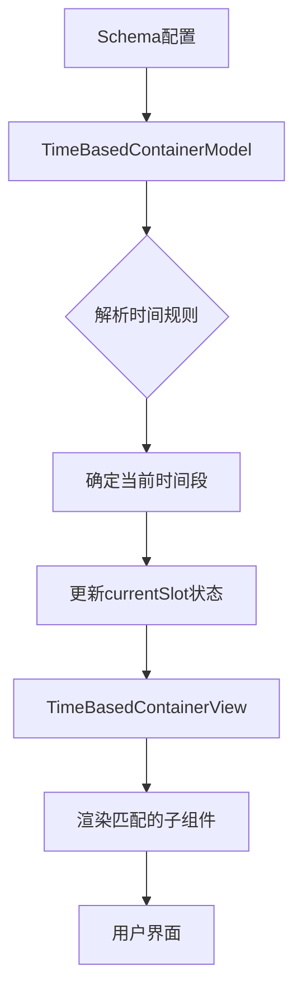
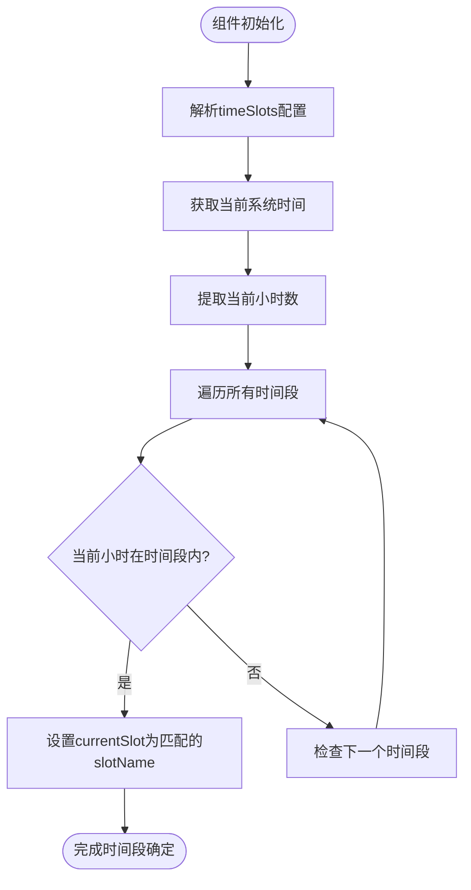
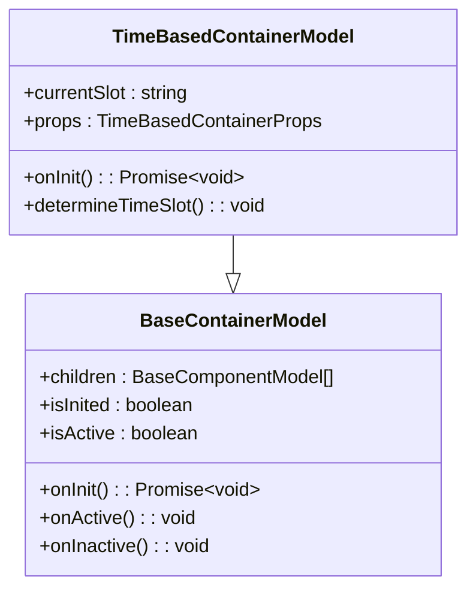
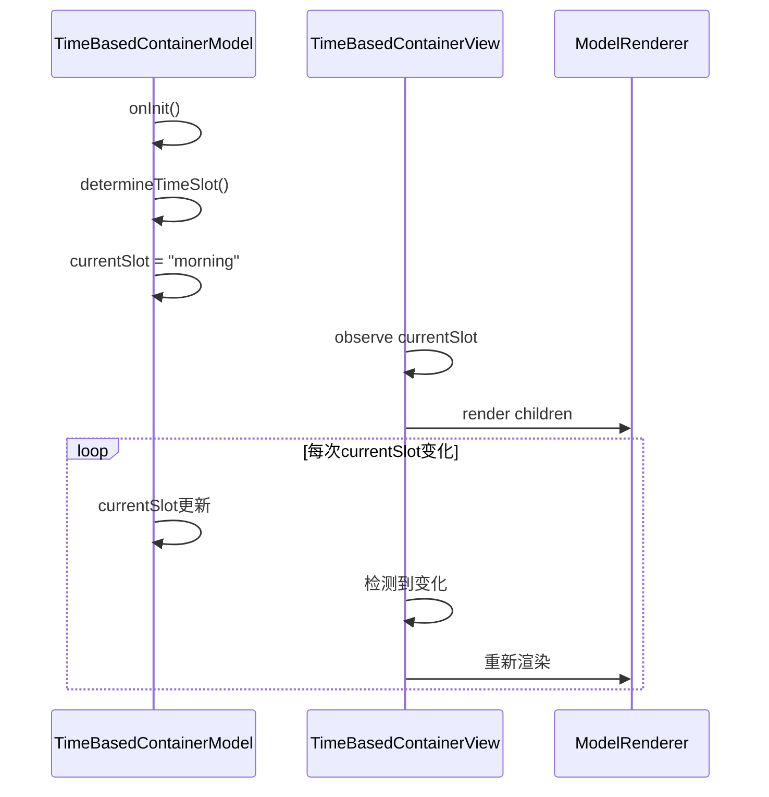
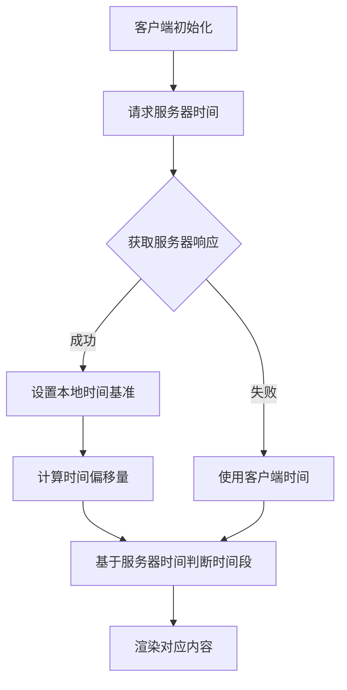
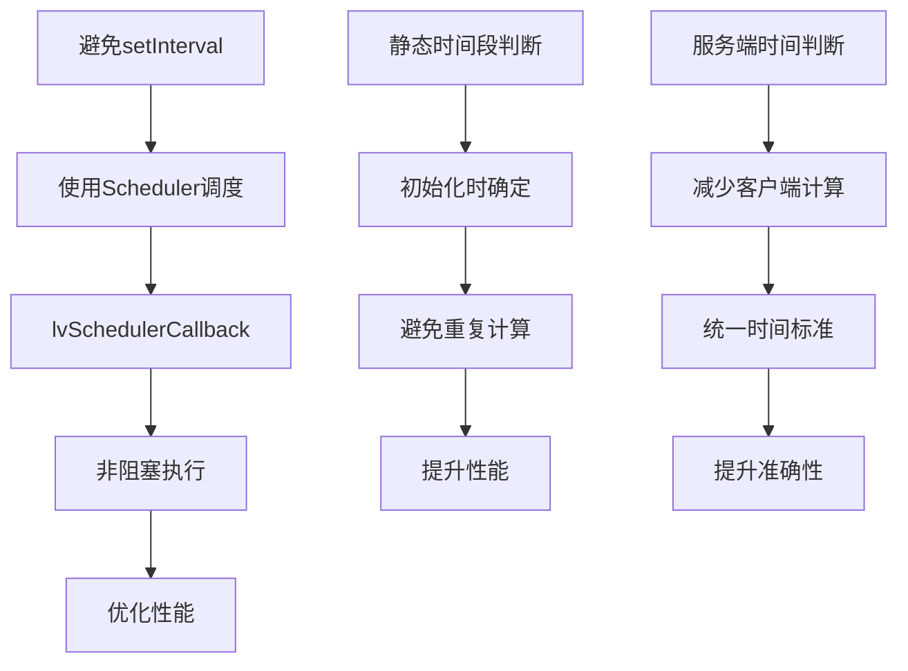

# 时间控制容器

<cite>
**本文档引用的文件**
- [time-based-container.model.ts](file://packages/h5-builder/src/components/time-based-container/time-based-container.model.ts)
- [time-based-container.view.tsx](file://packages/h5-builder/src/components/time-based-container/time-based-container.view.tsx)
- [demo-data.ts](file://packages/h5-builder/src/mock/demo-data.ts)
- [model.ts](file://packages/h5-builder/src/bedrock/model.ts)
- [scheduler.ts](file://packages/h5-builder/src/bedrock/scheduler/core/scheduler.ts)
- [lv-scheduler-callback.ts](file://packages/h5-builder/src/bedrock/scheduler/lv-scheduler-callback.ts)
</cite>

## 目录
1. [简介](#简介)
2. [核心组件分析](#核心组件分析)
3. [架构与工作流程](#架构与工作流程)
4. [时间规则解析与显示控制](#时间规则解析与显示控制)
5. [模型层时间监听机制](#模型层时间监听机制)
6. [视图层渲染行为](#视图层渲染行为)
7. [服务器时间同步与使用示例](#服务器时间同步与使用示例)
8. [时区与夏令时处理](#时区与夏令时处理)
9. [性能优化建议](#性能优化建议)
10. [结论](#结论)

## 简介
时间控制容器（TimeBasedContainer）是一种基于时间规则控制子组件可见性的容器组件。该组件通过解析配置的时间段规则，在运行时根据系统时间动态决定渲染哪个子组件。典型应用场景包括早餐/午餐/晚餐推荐、工作时间/休息时间内容展示以及限时活动展示等。本文档详细描述了TimeBasedContainer组件的实现机制，包括其基于时间规则的显示控制功能、模型层对系统时间的监听机制、视图层的时间敏感渲染行为，以及相关的性能优化策略。

## 核心组件分析

TimeBasedContainer组件由模型层（Model）和视图层（View）两部分构成，遵循MVC设计模式。模型层负责处理时间逻辑和状态管理，视图层负责UI渲染。该组件继承自BaseContainerModel，具备容器组件的基本特性，如子组件管理和生命周期控制。

**Section sources**
- [time-based-container.model.ts](file://packages/h5-builder/src/components/time-based-container/time-based-container.model.ts#L1-L74)
- [time-based-container.view.tsx](file://packages/h5-builder/src/components/time-based-container/time-based-container.view.tsx#L1-L43)

## 架构与工作流程

**Diagram sources**
- [time-based-container.model.ts](file://packages/h5-builder/src/components/time-based-container/time-based-container.model.ts#L1-L74)
- [time-based-container.view.tsx](file://packages/h5-builder/src/components/time-based-container/time-based-container.view.tsx#L1-L43)

**Section sources**
- [time-based-container.model.ts](file://packages/h5-builder/src/components/time-based-container/time-based-container.model.ts#L1-L74)
- [time-based-container.view.tsx](file://packages/h5-builder/src/components/time-based-container/time-based-container.view.tsx#L1-L43)

## 时间规则解析与显示控制

TimeBasedContainer组件通过props中的timeSlots配置来定义时间段规则。每个时间段包含开始小时（startHour）和结束小时（endHour），以24小时制表示。组件在初始化时会根据当前系统时间确定匹配的时间段，并将结果存储在currentSlot属性中。

**Diagram sources**
- [time-based-container.model.ts](file://packages/h5-builder/src/components/time-based-container/time-based-container.model.ts#L45-L59)

**Section sources**
- [time-based-container.model.ts](file://packages/h5-builder/src/components/time-based-container/time-based-container.model.ts#L6-L59)

## 模型层时间监听机制

TimeBasedContainerModel在onInit生命周期钩子中调用determineTimeSlot方法来确定当前时间段。该方法使用JavaScript的Date对象获取当前时间，并通过getHours()方法提取小时数。由于该组件目前是静态判断时间，没有实现持续的时间监听，因此只在初始化时进行一次时间判断。

**Diagram sources**
- [time-based-container.model.ts](file://packages/h5-builder/src/components/time-based-container/time-based-container.model.ts#L24-L74)
- [model.ts](file://packages/h5-builder/src/bedrock/model.ts#L168-L243)

**Section sources**
- [time-based-container.model.ts](file://packages/h5-builder/src/components/time-based-container/time-based-container.model.ts#L24-L74)
- [model.ts](file://packages/h5-builder/src/bedrock/model.ts#L168-L243)

## 视图层渲染行为

TimeBasedContainerView使用MobX的observer装饰器实现响应式渲染。当模型层的currentSlot状态发生变化时，视图会自动重新渲染。视图层不仅渲染子组件，还提供调试信息显示当前匹配的时间段名称。

**Diagram sources**
- [time-based-container.view.tsx](file://packages/h5-builder/src/components/time-based-container/time-based-container.view.tsx#L13-L40)
- [time-based-container.model.ts](file://packages/h5-builder/src/components/time-based-container/time-based-container.model.ts#L24-L74)

**Section sources**
- [time-based-container.view.tsx](file://packages/h5-builder/src/components/time-based-container/time-based-container.view.tsx#L1-L43)

## 服务器时间同步与使用示例

虽然当前实现使用客户端系统时间，但可以通过服务端提供的时间进行同步。在demo-data.ts中提供了TimeBasedContainer的使用示例，展示了如何配置多个时间段规则。

**Diagram sources**
- [demo-data.ts](file://packages/h5-builder/src/mock/demo-data.ts#L164-L174)

**Section sources**
- [demo-data.ts](file://packages/h5-builder/src/mock/demo-data.ts#L164-L174)

## 时区与夏令时处理

当前实现基于本地系统时间的小时数进行判断，不直接处理时区和夏令时问题。由于使用getHours()方法获取的是本地时间的小时数，因此自动适应用户的本地时区设置。对于需要精确控制跨时区显示的场景，建议在服务端进行时间判断并传递结果。

## 性能优化建议

为了避免高频时间检查对主线程的影响，建议采用以下优化策略：

**Diagram sources**
- [lv-scheduler-callback.ts](file://packages/h5-builder/src/bedrock/scheduler/lv-scheduler-callback.ts#L14-L18)
- [scheduler.ts](file://packages/h5-builder/src/bedrock/scheduler/core/scheduler.ts#L24-L174)

**Section sources**
- [lv-scheduler-callback.ts](file://packages/h5-builder/src/bedrock/scheduler/lv-scheduler-callback.ts#L14-L18)
- [scheduler.ts](file://packages/h5-builder/src/bedrock/scheduler/core/scheduler.ts#L24-L174)

## 结论
TimeBasedContainer组件提供了一种简单有效的方式，基于时间规则控制子组件的显示。通过解析schema中的时间段配置，组件能够在初始化时根据系统时间确定当前时间段，并相应地渲染匹配的子组件。虽然当前实现较为基础，仅在初始化时进行一次时间判断，但为更复杂的时间控制功能提供了良好的基础架构。通过结合服务端时间同步和合理的性能优化策略，可以构建出更加精确和高效的时间敏感型用户界面。