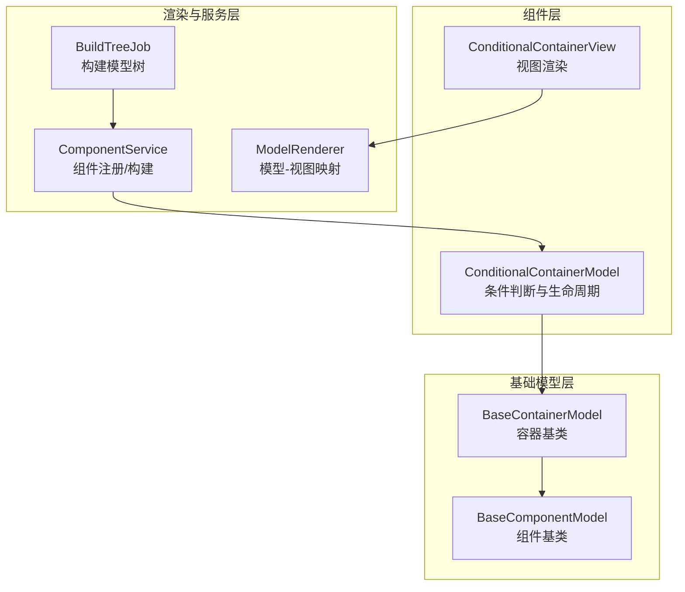
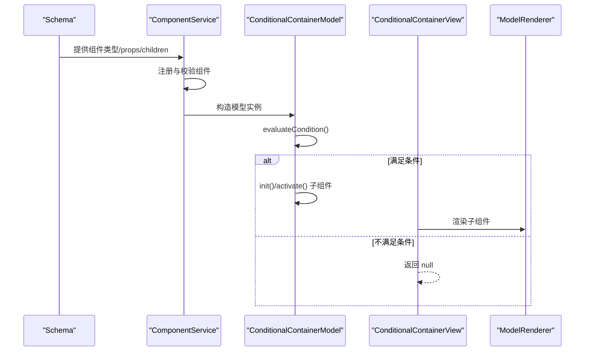
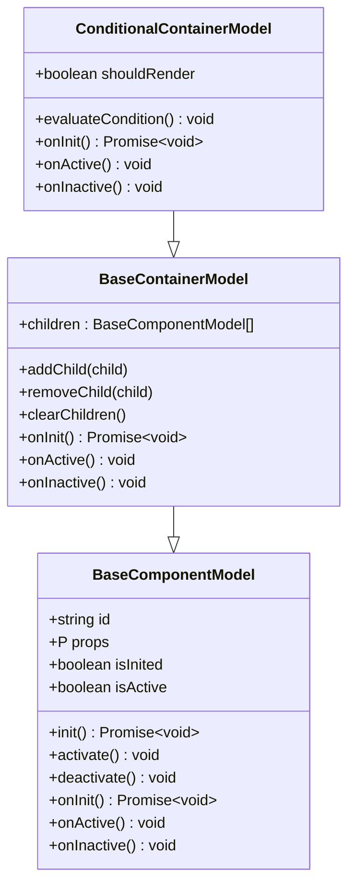
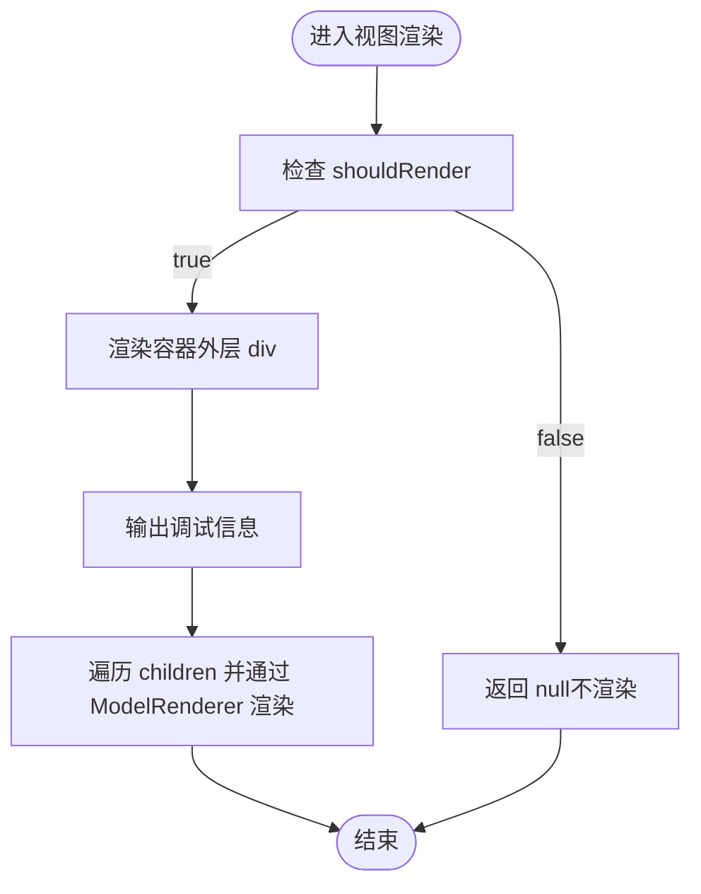
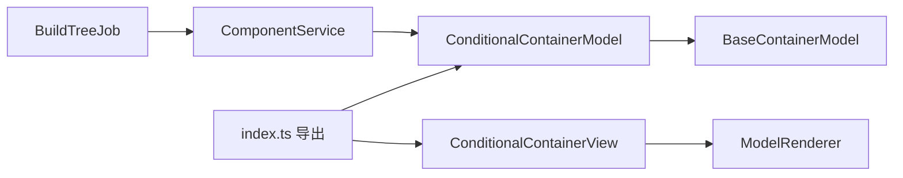

# 条件渲染容器

<cite>
**本文引用的文件**
- [conditional-container.model.ts](file://packages/h5-builder/src/components/conditional-container/conditional-container.model.ts)
- [conditional-container.view.tsx](file://packages/h5-builder/src/components/conditional-container/conditional-container.view.tsx)
- [index.ts](file://packages/h5-builder/src/components/conditional-container/index.ts)
- [model.ts](file://packages/h5-builder/src/bedrock/model.ts)
- [model-renderer.tsx](file://packages/h5-builder/src/components/model-renderer.tsx)
- [component.service.ts](file://packages/h5-builder/src/services/component.service.ts)
- [build-tree-job.ts](file://packages/h5-builder/src/jobs/build-tree-job.ts)
- [component-loader.test.ts](file://packages/h5-builder/src/__tests__/component-loader.test.ts)
</cite>

## 目录
1. [简介](#简介)
2. [项目结构](#项目结构)
3. [核心组件](#核心组件)
4. [架构总览](#架构总览)
5. [详细组件分析](#详细组件分析)
6. [依赖关系分析](#依赖关系分析)
7. [性能考量](#性能考量)
8. [故障排查指南](#故障排查指南)
9. [结论](#结论)
10. [附录](#附录)

## 简介
本篇文档围绕 ConditionalContainer 组件展开，系统性阐述其基于表达式或状态的条件渲染能力，如何解析 schema 中的条件规则（如用户属性、设备类型、随机概率、始终显示）来决定子组件的显示；同时深入解析 ConditionalContainerModel 的条件求值与状态监听机制，以及视图层的动态挂载/卸载行为。文档还提供复杂条件组合的使用建议、与全局状态管理的集成方式，并总结常见陷阱与优化策略，帮助读者在实际工程中安全高效地使用该组件。

## 项目结构
ConditionalContainer 位于 h5-builder 包内，采用“模型-视图”分层设计，配合通用的 bedrock 基类模型与组件服务，形成从 schema 到模型树再到视图渲染的完整链路。

图表来源
- [conditional-container.model.ts](file://packages/h5-builder/src/components/conditional-container/conditional-container.model.ts#L1-L86)
- [conditional-container.view.tsx](file://packages/h5-builder/src/components/conditional-container/conditional-container.view.tsx#L1-L47)
- [model.ts](file://packages/h5-builder/src/bedrock/model.ts#L1-L243)
- [model-renderer.tsx](file://packages/h5-builder/src/components/model-renderer.tsx#L1-L105)
- [component.service.ts](file://packages/h5-builder/src/services/component.service.ts#L48-L226)
- [build-tree-job.ts](file://packages/h5-builder/src/jobs/build-tree-job.ts#L1-L58)

章节来源
- [conditional-container.model.ts](file://packages/h5-builder/src/components/conditional-container/conditional-container.model.ts#L1-L86)
- [conditional-container.view.tsx](file://packages/h5-builder/src/components/conditional-container/conditional-container.view.tsx#L1-L47)
- [model.ts](file://packages/h5-builder/src/bedrock/model.ts#L1-L243)
- [model-renderer.tsx](file://packages/h5-builder/src/components/model-renderer.tsx#L1-L105)
- [component.service.ts](file://packages/h5-builder/src/services/component.service.ts#L48-L226)
- [build-tree-job.ts](file://packages/h5-builder/src/jobs/build-tree-job.ts#L1-L58)

## 核心组件
- ConditionalContainerModel：负责条件评估、生命周期管理（初始化、激活、停用），以及子组件的按需初始化与激活/停用。
- ConditionalContainerView：基于 shouldRender 决定是否渲染，若满足条件则通过 ModelRenderer 渲染子组件。
- BaseComponentModel/BaseContainerModel：提供统一的生命周期钩子、资源注册与销毁、子组件管理等能力。
- ComponentService：将 schema 转换为模型树，支持组件注册、递归构建、错误占位等。
- ModelRenderer：根据模型类型映射到对应视图组件，或对容器组件进行默认渲染。

章节来源
- [conditional-container.model.ts](file://packages/h5-builder/src/components/conditional-container/conditional-container.model.ts#L1-L86)
- [conditional-container.view.tsx](file://packages/h5-builder/src/components/conditional-container/conditional-container.view.tsx#L1-L47)
- [model.ts](file://packages/h5-builder/src/bedrock/model.ts#L1-L243)
- [model-renderer.tsx](file://packages/h5-builder/src/components/model-renderer.tsx#L1-L105)
- [component.service.ts](file://packages/h5-builder/src/services/component.service.ts#L48-L226)

## 架构总览
ConditionalContainer 的工作流从 schema 解析开始，经由 ComponentService 构建模型树，再由 ConditionalContainerModel 在初始化阶段评估条件，最终由 ConditionalContainerView 决定是否渲染子组件。

图表来源
- [component.service.ts](file://packages/h5-builder/src/services/component.service.ts#L100-L226)
- [conditional-container.model.ts](file://packages/h5-builder/src/components/conditional-container/conditional-container.model.ts#L29-L84)
- [conditional-container.view.tsx](file://packages/h5-builder/src/components/conditional-container/conditional-container.view.tsx#L13-L44)
- [model-renderer.tsx](file://packages/h5-builder/src/components/model-renderer.tsx#L46-L105)

## 详细组件分析

### ConditionalContainerModel：条件求值与生命周期
- 条件类型与参数
  - 支持的条件类型：用户 VIP、新用户、随机概率、始终显示。
  - 随机概率可通过 props.probability 指定，默认 0.5。
- 条件求值
  - evaluateCondition 根据 props.condition 计算 shouldRender。
  - 日志输出包含组件 id、条件类型与 shouldRender 结果，便于调试。
- 生命周期联动
  - onInit：评估条件后，若满足条件则逐个初始化子组件。
  - onActive/onInactive：当 shouldRender 为真时，激活/停用所有子组件。
- 与 BaseContainerModel 的关系
  - 继承 BaseContainerModel，复用 children 管理与默认的并行初始化/激活/停用策略，仅在初始化阶段加入条件判断。

图表来源
- [model.ts](file://packages/h5-builder/src/bedrock/model.ts#L1-L243)
- [conditional-container.model.ts](file://packages/h5-builder/src/components/conditional-container/conditional-container.model.ts#L1-L86)

章节来源
- [conditional-container.model.ts](file://packages/h5-builder/src/components/conditional-container/conditional-container.model.ts#L1-L86)
- [model.ts](file://packages/h5-builder/src/bedrock/model.ts#L157-L242)

### ConditionalContainerView：视图层动态挂载/卸载
- 渲染逻辑
  - 若 shouldRender 为假，直接返回 null，不渲染任何子节点。
  - 若满足条件，则渲染容器外层 div，并输出调试信息（条件类型与“已渲染”标识）。
  - 通过 ModelRenderer 渲染子组件，保持与模型层一致的渲染策略。
- 与 MobX 的集成
  - 使用 observer 包装，确保 shouldRender 变化时触发重渲染。

图表来源
- [conditional-container.view.tsx](file://packages/h5-builder/src/components/conditional-container/conditional-container.view.tsx#L13-L44)
- [model-renderer.tsx](file://packages/h5-builder/src/components/model-renderer.tsx#L46-L105)

章节来源
- [conditional-container.view.tsx](file://packages/h5-builder/src/components/conditional-container/conditional-container.view.tsx#L1-L47)
- [model-renderer.tsx](file://packages/h5-builder/src/components/model-renderer.tsx#L1-L105)

### 与全局状态管理的集成
- 当前实现
  - ConditionalContainerModel 的条件评估为本地模拟（如随机概率），并未直接依赖外部全局状态。
- 推荐集成方式
  - 将 shouldRender 的计算迁移到可观察的状态源（如全局 Store 或响应式变量），并在 onInit/onActive/onInactive 中订阅/取消订阅。
  - 通过 props 传递状态键或回调，使条件判断与外部状态解耦。
- 与 ComponentService 的衔接
  - 通过 ComponentService 将 schema 转为模型树，ConditionalContainerModel 在初始化阶段完成条件评估与子组件初始化，保证渲染前的确定性。

章节来源
- [conditional-container.model.ts](file://packages/h5-builder/src/components/conditional-container/conditional-container.model.ts#L29-L84)
- [component.service.ts](file://packages/h5-builder/src/services/component.service.ts#L100-L226)

### 复杂条件组合的使用建议
- 组合策略
  - 将多条件封装为单一布尔值（如 computed 值），在 props 中传入，简化 ConditionalContainerModel 的分支逻辑。
  - 对于设备类型、用户属性等外部状态，建议在上层组件或 Store 中聚合，避免在模型内部直接访问全局对象。
- 与容器嵌套
  - 可在多个层级的容器中叠加条件，注意避免重复初始化与激活带来的性能开销。
- 与虚拟化/懒加载结合
  - 对于大量子组件的场景，可在上层容器中引入虚拟化或懒加载策略，减少初始渲染压力。

章节来源
- [conditional-container.model.ts](file://packages/h5-builder/src/components/conditional-container/conditional-container.model.ts#L29-L84)
- [tabs-container.model.ts](file://packages/h5-builder/src/components/tabs-container/tabs-container.model.ts#L58-L203)

## 依赖关系分析
- 组件导出
  - index.ts 统一导出 ConditionalContainerModel 与 ConditionalContainerView，便于外部按需引入。
- 服务与构建
  - ComponentService 负责组件注册、Schema 校验与模型树构建；BuildTreeJob 在页面生命周期中触发构建流程。
- 视图映射
  - ModelRenderer 提供模型-视图映射，若未注册对应视图，容器组件默认递归渲染子模型。

图表来源
- [index.ts](file://packages/h5-builder/src/components/conditional-container/index.ts#L1-L4)
- [conditional-container.model.ts](file://packages/h5-builder/src/components/conditional-container/conditional-container.model.ts#L1-L86)
- [conditional-container.view.tsx](file://packages/h5-builder/src/components/conditional-container/conditional-container.view.tsx#L1-L47)
- [model-renderer.tsx](file://packages/h5-builder/src/components/model-renderer.tsx#L1-L105)
- [component.service.ts](file://packages/h5-builder/src/services/component.service.ts#L100-L226)
- [build-tree-job.ts](file://packages/h5-builder/src/jobs/build-tree-job.ts#L1-L58)

章节来源
- [index.ts](file://packages/h5-builder/src/components/conditional-container/index.ts#L1-L4)
- [component.service.ts](file://packages/h5-builder/src/services/component.service.ts#L100-L226)
- [build-tree-job.ts](file://packages/h5-builder/src/jobs/build-tree-job.ts#L1-L58)
- [model-renderer.tsx](file://packages/h5-builder/src/components/model-renderer.tsx#L1-L105)

## 性能考量
- 条件频繁变化导致的重渲染
  - 视图层使用 observer 包裹，shouldRender 为响应式字段，变化即触发重渲染。若条件过于频繁波动，可能导致不必要的重渲染。
- 优化策略
  - 将条件计算上移至 Store 或使用 computed，降低视图层的直接依赖。
  - 对子组件初始化与激活进行节流/防抖，避免在短时间内多次触发。
  - 对大量子组件采用懒加载或虚拟化，减少初始渲染成本。
  - 在 ConditionalContainerModel 中尽量避免在 onActive/onInactive 中执行昂贵操作，必要时拆分为异步任务。
- 初始化与激活
  - BaseContainerModel 默认并行初始化子组件，ConditionalContainerModel 在满足条件时才初始化，有助于减少无效初始化。

章节来源
- [conditional-container.view.tsx](file://packages/h5-builder/src/components/conditional-container/conditional-container.view.tsx#L13-L44)
- [conditional-container.model.ts](file://packages/h5-builder/src/components/conditional-container/conditional-container.model.ts#L29-L84)
- [model.ts](file://packages/h5-builder/src/bedrock/model.ts#L202-L235)

## 故障排查指南
- 条件评估不符合预期
  - 检查 props.condition 与 probability 的传入是否正确。
  - 查看日志输出，确认 shouldRender 的计算结果。
- 子组件未渲染
  - 确认 shouldRender 为真且 children 已正确添加。
  - 检查 ModelRenderer 是否能正确映射到对应视图组件。
- 构建模型树失败
  - 确认 ComponentService 已注册 ConditionalContainerModel。
  - 检查 schema 的 type、id、props 是否符合要求。
- 测试参考
  - 可参考组件加载与构建的测试用例，验证注册、构建、错误占位等行为。

章节来源
- [conditional-container.model.ts](file://packages/h5-builder/src/components/conditional-container/conditional-container.model.ts#L29-L84)
- [model-renderer.tsx](file://packages/h5-builder/src/components/model-renderer.tsx#L46-L105)
- [component.service.ts](file://packages/h5-builder/src/services/component.service.ts#L100-L226)
- [component-loader.test.ts](file://packages/h5-builder/src/__tests__/component-loader.test.ts#L41-L270)

## 结论
ConditionalContainer 通过简洁的条件判断与生命周期联动，实现了灵活的条件渲染能力。其与 bedrock 基类模型、组件服务、视图映射协同工作，形成从 schema 到视图的完整链路。在实际使用中，建议将条件计算上移至状态层，结合懒加载/虚拟化等策略，以获得更好的性能与可维护性。

## 附录
- 统一导出入口
  - index.ts 提供 ConditionalContainerModel 与 ConditionalContainerView 的集中导出，便于按需引入与使用。

章节来源
- [index.ts](file://packages/h5-builder/src/components/conditional-container/index.ts#L1-L4)