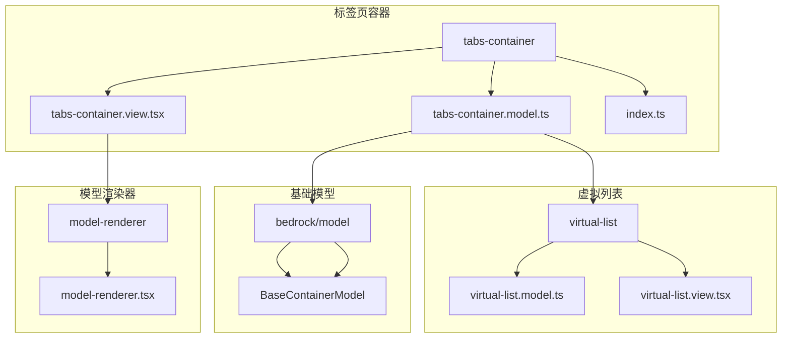
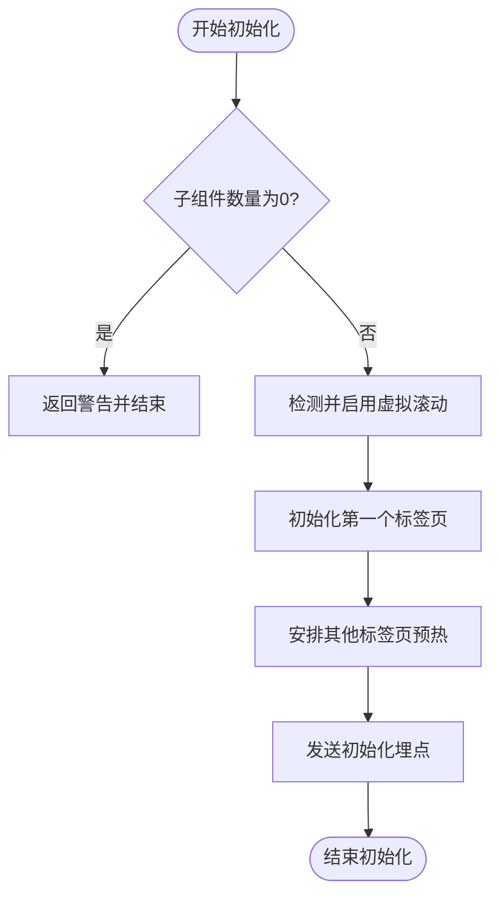
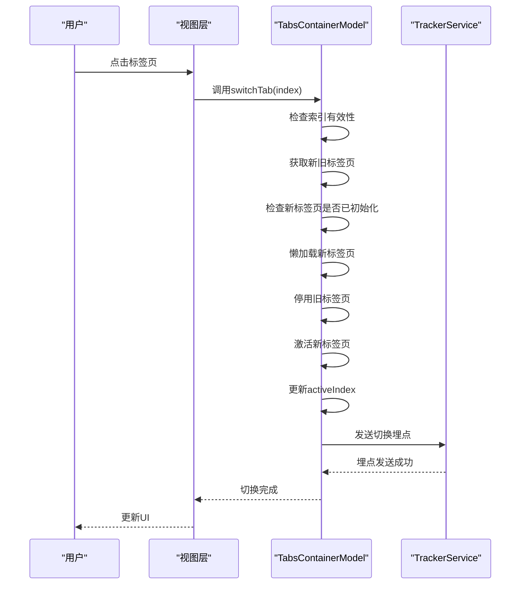
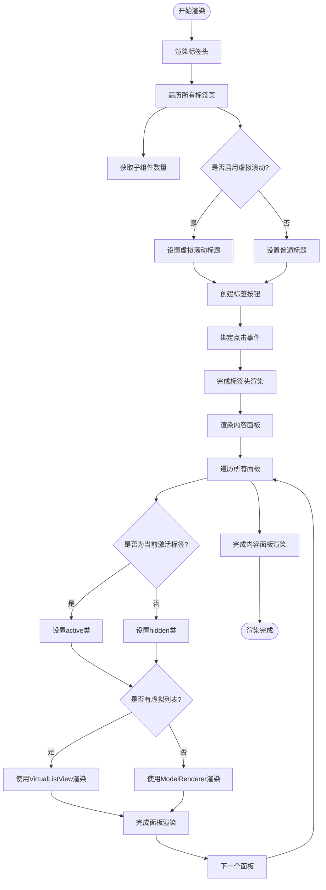
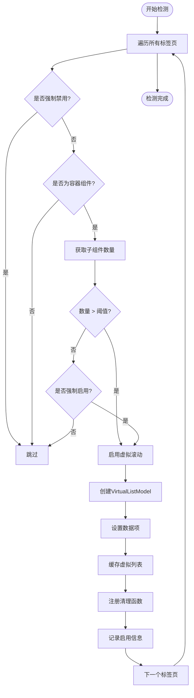
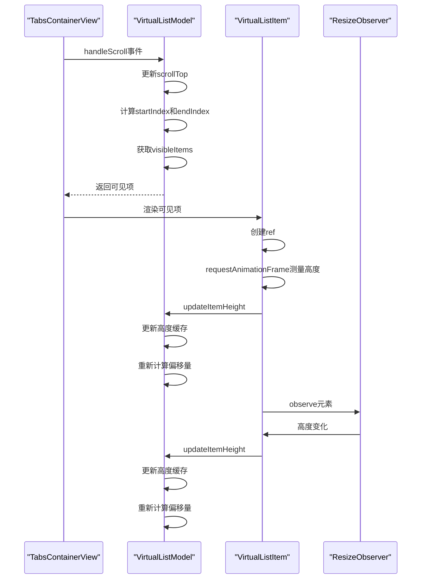
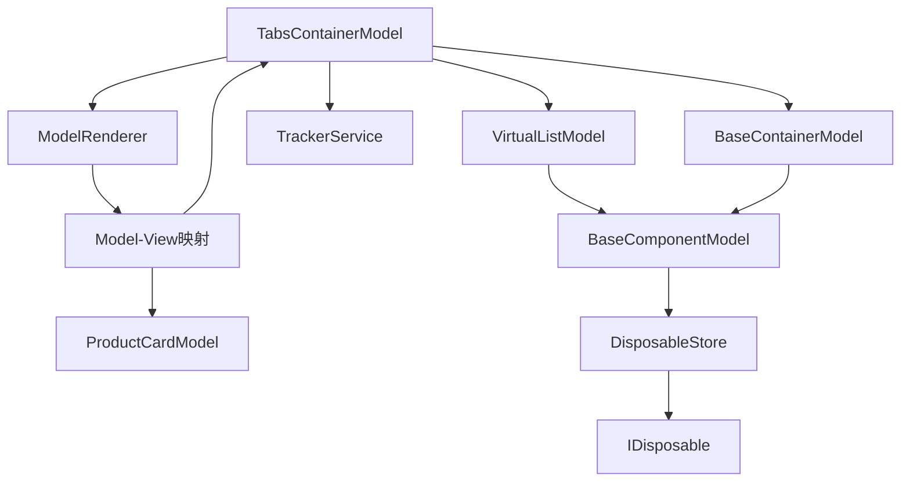

# 标签页容器

<cite>
**本文档引用的文件**
- [tabs-container.model.ts](file://packages/h5-builder/src/components/tabs-container/tabs-container.model.ts)
- [tabs-container.view.tsx](file://packages/h5-builder/src/components/tabs-container/tabs-container.view.tsx)
- [virtual-list.model.ts](file://packages/h5-builder/src/components/virtual-list/virtual-list.model.ts)
- [virtual-list.view.tsx](file://packages/h5-builder/src/components/virtual-list/virtual-list.view.tsx)
- [base-container.model.ts](file://packages/h5-builder/src/bedrock/model.ts)
- [model-renderer.tsx](file://packages/h5-builder/src/components/model-renderer.tsx)
- [demo-data.ts](file://packages/h5-builder/src/mock/demo-data.ts)
- [component.service.ts](file://packages/h5-builder/src/services/component.service.ts)
</cite>

## 目录
1. [简介](#简介)
2. [项目结构](#项目结构)
3. [核心组件](#核心组件)
4. [架构概述](#架构概述)
5. [详细组件分析](#详细组件分析)
6. [依赖分析](#依赖分析)
7. [性能考虑](#性能考虑)
8. [故障排除指南](#故障排除指南)
9. [结论](#结论)

## 简介
标签页容器（TabsContainer）是一个功能丰富的UI组件，用于管理多个标签页的切换和内容展示。该组件通过schema配置实现标签标题、激活状态和内容面板的动态管理，并支持标签的动态增删。TabsContainerModel负责对当前激活标签的响应式管理，视图层实现了流畅的过渡动画。组件还支持异步加载标签内容，并与路由系统集成。文档还涵盖了无障碍访问（a11y）最佳实践和键盘导航支持。

## 项目结构
标签页容器组件位于`packages/h5-builder/src/components/tabs-container/`目录下，包含模型、视图和索引文件。组件依赖于虚拟列表组件（VirtualList）来优化大量内容的渲染性能。模型层继承自BaseContainerModel，实现了懒加载和闲时预热策略。视图层使用React和MobX实现响应式更新。



**Diagram sources**
- [tabs-container.model.ts](file://packages/h5-builder/src/components/tabs-container/tabs-container.model.ts)
- [tabs-container.view.tsx](file://packages/h5-builder/src/components/tabs-container/tabs-container.view.tsx)
- [virtual-list.model.ts](file://packages/h5-builder/src/components/virtual-list/virtual-list.model.ts)
- [virtual-list.view.tsx](file://packages/h5-builder/src/components/virtual-list/virtual-list.view.tsx)
- [base-container.model.ts](file://packages/h5-builder/src/bedrock/model.ts)
- [model-renderer.tsx](file://packages/h5-builder/src/components/model-renderer.tsx)

**Section sources**
- [tabs-container.model.ts](file://packages/h5-builder/src/components/tabs-container/tabs-container.model.ts)
- [tabs-container.view.tsx](file://packages/h5-builder/src/components/tabs-container/tabs-container.view.tsx)

## 核心组件
标签页容器的核心功能由TabsContainerModel和TabsContainerView两个组件实现。TabsContainerModel负责管理标签页的状态、生命周期和数据加载，而TabsContainerView负责渲染UI和处理用户交互。组件通过props配置默认激活的标签页和虚拟滚动行为。模型层实现了懒加载策略，只初始化当前激活的标签页，其他标签页在闲时预热。

**Section sources**
- [tabs-container.model.ts](file://packages/h5-builder/src/components/tabs-container/tabs-container.model.ts)
- [tabs-container.view.tsx](file://packages/h5-builder/src/components/tabs-container/tabs-container.view.tsx)

## 架构概述
标签页容器采用MVC架构模式，模型层（Model）负责状态管理和业务逻辑，视图层（View）负责UI渲染，控制器逻辑内置于模型中。组件通过继承BaseContainerModel获得容器的基本能力，并通过依赖注入获取TrackerService用于埋点统计。虚拟列表组件被集成用于优化大量内容的渲染性能。

```mermaid
classDiagram
class BaseComponentModel {
+id : string
+props : P
+isInited : boolean
+isActive : boolean
+data : any
+loading : boolean
+error : Error | null
+constructor(id : string, props : P)
+register(resource : IDisposable | () => void) : T
+dispose() : void
+init() : Promise~void~
+activate() : void
+deactivate() : void
+fetchData() : Promise~void~
+refresh() : Promise~void~
+onInit() : Promise~void~
+onDestroy() : void
+onActive() : void
+onInactive() : void
}
class BaseContainerModel {
+children : C[]
+addChild(child : C) : void
+removeChild(child : C) : void
+clearChildren() : void
+onInit() : Promise~void~
+onActive() : void
+onInactive() : void
+onDestroy() : void
}
class TabsContainerModel {
+activeIndex : number
-virtualLists : Map~number, VirtualListModel~
-VIRTUAL_THRESHOLD : number
-ITEM_HEIGHT : number
-CONTAINER_HEIGHT : number
-OVERSCAN : number
+constructor(id : string, props : TabsContainerProps, tracker : TrackerService)
+onInit() : Promise~void~
+detectAndEnableVirtualScroll() : void
+enableVirtualScrollForTab(tab : BaseContainerModel, index : number) : void
+isVirtualScrollEnabled(index : number) : boolean
+getVirtualList(index : number) : VirtualListModel | undefined
+switchTab(index : number) : Promise~void~
+schedulePrewarm() : void
+prewarmTab(index : number, delay : number) : void
+activeTab : BaseComponentModel
}
class VirtualListModel {
+scrollTop : number
+items : any[]
-heightCache : Map~number, number~
-offsetCache : Map~number, number~
-isFixedHeight : boolean
-estimatedHeight : number
+constructor(id : string, props : VirtualListProps)
+onInit() : Promise~void~
+handleScroll(scrollTop : number) : void
+setItems(items : any[]) : void
+updateItemHeight(index : number, height : number) : void
+getItemHeight(index : number) : number
+getOffsetTop(index : number) : number
+startIndex : number
+endIndex : number
+visibleItems : {item : any, index : number, top : number, height : number}[]
+totalHeight : number
}
BaseComponentModel <|-- BaseContainerModel
BaseContainerModel <|-- TabsContainerModel
BaseComponentModel <|-- VirtualListModel
TabsContainerModel --> VirtualListModel : "使用"
TabsContainerModel --> TrackerService : "依赖"
```

**Diagram sources**
- [tabs-container.model.ts](file://packages/h5-builder/src/components/tabs-container/tabs-container.model.ts)
- [virtual-list.model.ts](file://packages/h5-builder/src/components/virtual-list/virtual-list.model.ts)
- [base-container.model.ts](file://packages/h5-builder/src/bedrock/model.ts)

## 详细组件分析

### TabsContainerModel分析
TabsContainerModel是标签页容器的核心，负责管理标签页的状态和生命周期。模型通过activeIndex属性跟踪当前激活的标签页，并在切换时管理子组件的激活状态。组件实现了懒加载策略，只在需要时初始化标签页，提高了初始加载性能。

#### 模型初始化流程


**Diagram sources**
- [tabs-container.model.ts](file://packages/h5-builder/src/components/tabs-container/tabs-container.model.ts#L68-L96)

#### 标签页切换流程


**Diagram sources**
- [tabs-container.model.ts](file://packages/h5-builder/src/components/tabs-container/tabs-container.model.ts#L171-L203)

**Section sources**
- [tabs-container.model.ts](file://packages/h5-builder/src/components/tabs-container/tabs-container.model.ts)

### TabsContainerView分析
TabsContainerView负责渲染标签页容器的UI，包括标签头和内容面板。视图使用React的observer高阶组件实现响应式更新，当模型状态变化时自动重新渲染。组件支持通过tabTitles属性自定义标签标题。

#### 视图渲染流程


**Diagram sources**
- [tabs-container.view.tsx](file://packages/h5-builder/src/components/tabs-container/tabs-container.view.tsx#L24-L82)

**Section sources**
- [tabs-container.view.tsx](file://packages/h5-builder/src/components/tabs-container/tabs-container.view.tsx)

### 虚拟列表集成分析
标签页容器集成了虚拟列表功能，当标签页的子组件数量超过阈值时自动启用虚拟滚动，优化大量内容的渲染性能。

#### 虚拟滚动启用决策流程


**Diagram sources**
- [tabs-container.model.ts](file://packages/h5-builder/src/components/tabs-container/tabs-container.model.ts#L101-L127)

#### 虚拟列表渲染流程


**Diagram sources**
- [virtual-list.model.ts](file://packages/h5-builder/src/components/virtual-list/virtual-list.model.ts)
- [virtual-list.view.tsx](file://packages/h5-builder/src/components/virtual-list/virtual-list.view.tsx)

**Section sources**
- [virtual-list.model.ts](file://packages/h5-builder/src/components/virtual-list/virtual-list.model.ts)
- [virtual-list.view.tsx](file://packages/h5-builder/src/components/virtual-list/virtual-list.view.tsx)

## 依赖分析
标签页容器组件依赖于多个核心模块和外部服务。主要依赖包括基础模型层、虚拟列表组件、模型渲染器和跟踪服务。组件通过依赖注入获取TrackerService实例，用于发送埋点事件。



**Diagram sources**
- [tabs-container.model.ts](file://packages/h5-builder/src/components/tabs-container/tabs-container.model.ts)
- [tabs-container.view.tsx](file://packages/h5-builder/src/components/tabs-container/tabs-container.view.tsx)
- [model-renderer.tsx](file://packages/h5-builder/src/components/model-renderer.tsx)
- [base-container.model.ts](file://packages/h5-builder/src/bedrock/model.ts)

**Section sources**
- [tabs-container.model.ts](file://packages/h5-builder/src/components/tabs-container/tabs-container.model.ts)
- [tabs-container.view.tsx](file://packages/h5-builder/src/components/tabs-container/tabs-container.view.tsx)

## 性能考虑
标签页容器在设计时充分考虑了性能优化。主要性能优化策略包括：

1. **懒加载**：只初始化当前激活的标签页，避免一次性初始化所有标签页带来的性能开销。
2. **闲时预热**：在应用空闲时渐进式预热其他标签页，平衡用户体验和性能。
3. **虚拟滚动**：当标签页内容过多时自动启用虚拟滚动，只渲染可见区域的内容。
4. **响应式更新**：使用MobX实现细粒度的响应式更新，避免不必要的重新渲染。

组件还实现了超时兜底机制，确保在5秒后强制预热所有未初始化的标签页，防止预热任务被无限延迟。

## 故障排除指南
### 常见问题及解决方案

1. **标签页切换无响应**
   - 检查模型的activeIndex是否正确更新
   - 确认视图层是否正确绑定了switchTab事件
   - 检查控制台是否有错误信息

2. **虚拟滚动未启用**
   - 确认标签页的子组件数量是否超过阈值（默认20）
   - 检查props.virtualScroll配置是否正确
   - 确认子组件是否为容器类型

3. **内容加载缓慢**
   - 检查是否启用了懒加载
   - 确认预热策略是否合理
   - 考虑启用虚拟滚动优化大量内容的渲染

4. **内存泄漏**
   - 确认所有资源都通过register方法注册
   - 检查dispose方法是否正确清理了所有资源
   - 确保事件监听器被正确移除

**Section sources**
- [tabs-container.model.ts](file://packages/h5-builder/src/components/tabs-container/tabs-container.model.ts)
- [tabs-container.view.tsx](file://packages/h5-builder/src/components/tabs-container/tabs-container.view.tsx)

## 结论
标签页容器是一个功能强大且性能优化的UI组件，通过合理的架构设计和性能优化策略，提供了流畅的用户体验。组件的模块化设计使其易于扩展和维护，响应式状态管理确保了UI的及时更新。通过集成虚拟滚动和懒加载策略，组件能够高效处理大量内容的渲染。未来可以考虑增加更多动画效果和交互特性，进一步提升用户体验。