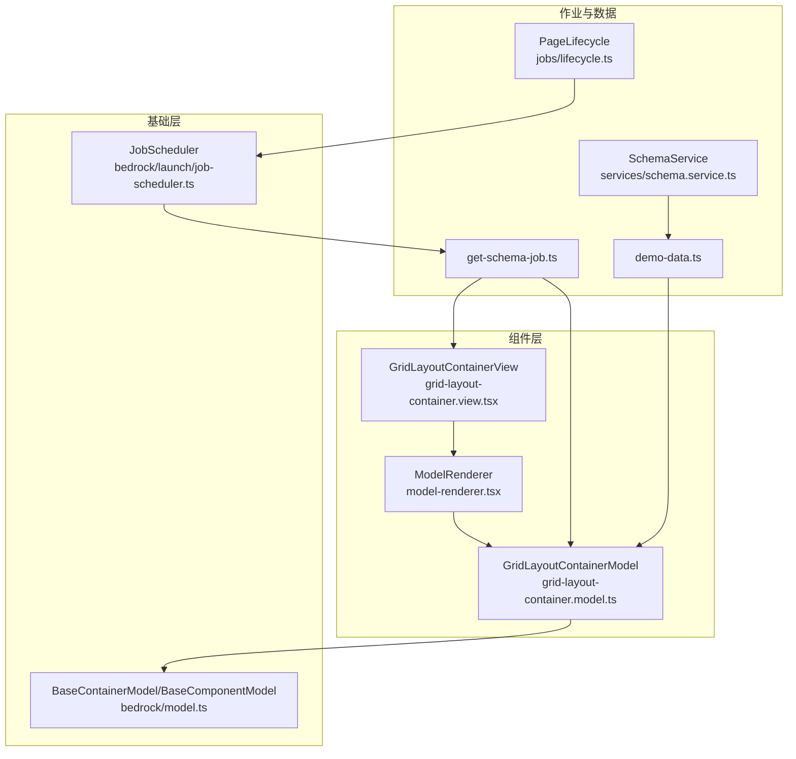
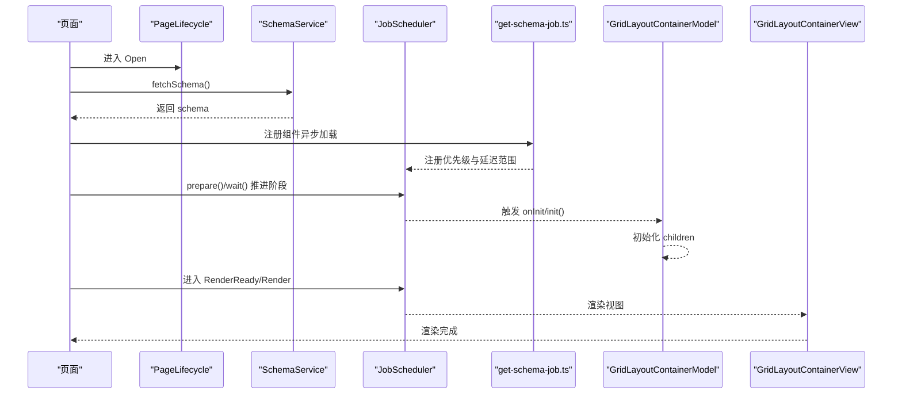
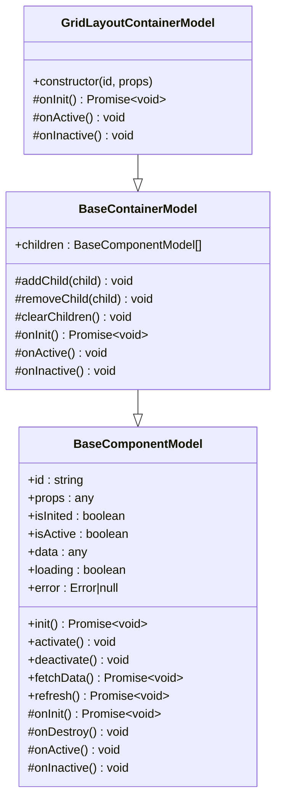
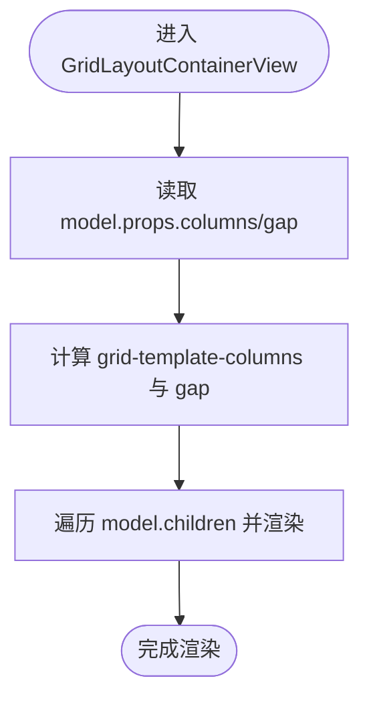
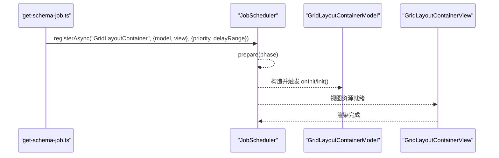
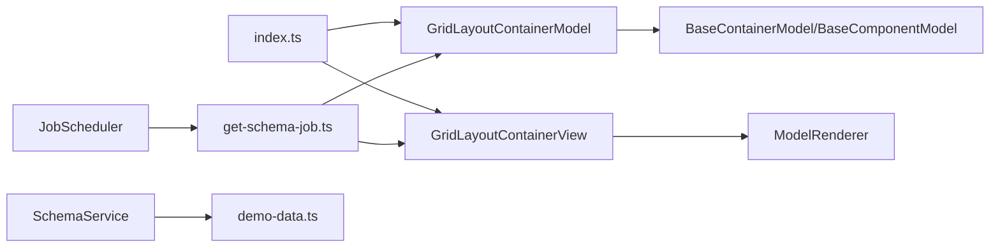

# 网格布局容器

<cite>
**本文引用的文件**
- [grid-layout-container.model.ts](file://packages/h5-builder/src/components/grid-layout-container/grid-layout-container.model.ts)
- [grid-layout-container.view.tsx](file://packages/h5-builder/src/components/grid-layout-container/grid-layout-container.view.tsx)
- [index.ts](file://packages/h5-builder/src/components/grid-layout-container/index.ts)
- [model-renderer.tsx](file://packages/h5-builder/src/components/model-renderer.tsx)
- [model.ts](file://packages/h5-builder/src/bedrock/model.ts)
- [get-schema-job.ts](file://packages/h5-builder/src/jobs/get-schema-job.ts)
- [demo-data.ts](file://packages/h5-builder/src/mock/demo-data.ts)
- [job-scheduler.ts](file://packages/h5-builder/src/bedrock/launch/job-scheduler.ts)
- [lifecycle.ts](file://packages/h5-builder/src/jobs/lifecycle.ts)
- [schema.service.ts](file://packages/h5-builder/src/services/schema.service.ts)
- [virtual-list.model.ts](file://packages/h5-builder/src/components/virtual-list/virtual-list.model.ts)
- [virtual-list.view.tsx](file://packages/h5-builder/src/components/virtual-list/virtual-list.view.tsx)
</cite>

## 目录
1. [简介](#简介)
2. [项目结构](#项目结构)
3. [核心组件](#核心组件)
4. [架构总览](#架构总览)
5. [详细组件分析](#详细组件分析)
6. [依赖关系分析](#依赖关系分析)
7. [性能考虑](#性能考虑)
8. [故障排查指南](#故障排查指南)
9. [结论](#结论)
10. [附录](#附录)

## 简介
本文件围绕 GridLayoutContainer 组件，系统化阐述其二维网格布局能力、基于 schema 的配置方式、子组件位置管理机制、视图层 CSS Grid 渲染策略，以及与作业调度系统的集成以实现懒加载区域。同时提供多设备适配的使用建议与性能优化实践，包括避免过度复杂的网格嵌套、在大量子项场景下采用虚拟滚动等。

## 项目结构
GridLayoutContainer 组件位于 h5-builder 包内，采用“模型-视图”分层设计，配合通用的模型基类与渲染映射机制工作。其关键文件如下：
- 模型层：grid-layout-container.model.ts
- 视图层：grid-layout-container.view.tsx
- 统一导出：index.ts
- 通用渲染器：model-renderer.tsx
- 模型基类：bedrock/model.ts
- 作业调度注册：jobs/get-schema-job.ts
- 示例 schema：mock/demo-data.ts
- 作业调度器：bedrock/launch/job-scheduler.ts
- 页面生命周期：jobs/lifecycle.ts
- Schema 服务：services/schema.service.ts
- 虚拟列表参考：components/virtual-list/*

图表来源
- [grid-layout-container.model.ts](file://packages/h5-builder/src/components/grid-layout-container/grid-layout-container.model.ts#L1-L44)
- [grid-layout-container.view.tsx](file://packages/h5-builder/src/components/grid-layout-container/grid-layout-container.view.tsx#L1-L38)
- [model-renderer.tsx](file://packages/h5-builder/src/components/model-renderer.tsx#L1-L105)
- [model.ts](file://packages/h5-builder/src/bedrock/model.ts#L1-L243)
- [get-schema-job.ts](file://packages/h5-builder/src/jobs/get-schema-job.ts#L78-L118)
- [demo-data.ts](file://packages/h5-builder/src/mock/demo-data.ts#L195-L333)
- [job-scheduler.ts](file://packages/h5-builder/src/bedrock/launch/job-scheduler.ts#L1-L123)
- [lifecycle.ts](file://packages/h5-builder/src/jobs/lifecycle.ts#L1-L18)
- [schema.service.ts](file://packages/h5-builder/src/services/schema.service.ts#L1-L38)

章节来源
- [grid-layout-container.model.ts](file://packages/h5-builder/src/components/grid-layout-container/grid-layout-container.model.ts#L1-L44)
- [grid-layout-container.view.tsx](file://packages/h5-builder/src/components/grid-layout-container/grid-layout-container.view.tsx#L1-L38)
- [model-renderer.tsx](file://packages/h5-builder/src/components/model-renderer.tsx#L1-L105)
- [model.ts](file://packages/h5-builder/src/bedrock/model.ts#L1-L243)
- [get-schema-job.ts](file://packages/h5-builder/src/jobs/get-schema-job.ts#L78-L118)
- [demo-data.ts](file://packages/h5-builder/src/mock/demo-data.ts#L195-L333)
- [job-scheduler.ts](file://packages/h5-builder/src/bedrock/launch/job-scheduler.ts#L1-L123)
- [lifecycle.ts](file://packages/h5-builder/src/jobs/lifecycle.ts#L1-L18)
- [schema.service.ts](file://packages/h5-builder/src/services/schema.service.ts#L1-L38)

## 核心组件
- GridLayoutContainerModel：继承容器模型基类，负责子组件的初始化、激活与停用生命周期传播；通过 props.columns 与 props.gap 控制网格列数与间距。
- GridLayoutContainerView：使用 CSS Grid 实现渲染，根据 columns 生成 repeat 列模板，gap 设置网格间距；通过 ModelRenderer 渲染子模型。
- ModelRenderer：通用的 Model-View 映射渲染器，若未注册对应 View，则回退到容器默认渲染（递归渲染子节点）。
- BaseContainerModel/BaseComponentModel：提供统一的生命周期钩子（init/activate/deactivate/onInit/onActive/onInactive），容器默认行为会批量初始化/激活/停用子组件。
- 作业调度注册：在 get-schema-job.ts 中注册 GridLayoutContainer 的异步加载与优先级，结合 JobScheduler 实现懒加载区域。

章节来源
- [grid-layout-container.model.ts](file://packages/h5-builder/src/components/grid-layout-container/grid-layout-container.model.ts#L1-L44)
- [grid-layout-container.view.tsx](file://packages/h5-builder/src/components/grid-layout-container/grid-layout-container.view.tsx#L1-L38)
- [model-renderer.tsx](file://packages/h5-builder/src/components/model-renderer.tsx#L1-L105)
- [model.ts](file://packages/h5-builder/src/bedrock/model.ts#L157-L243)
- [get-schema-job.ts](file://packages/h5-builder/src/jobs/get-schema-job.ts#L78-L118)

## 架构总览
GridLayoutContainer 的运行流程如下：
- 页面生命周期推进：从 Open 到 LoadComponentLogic、Prepare、RenderReady、Render、Completed、Idle。
- SchemaService 提供 schema；get-schema-job 注册组件异步加载与优先级。
- JobScheduler 在不同阶段构造与等待作业，确保组件资源按优先级与依赖顺序加载。
- GridLayoutContainerModel 在初始化时批量初始化子组件；激活/停用时传播至子组件。
- 视图层 GridLayoutContainerView 使用 CSS Grid 渲染，ModelRenderer 递归渲染子模型。

图表来源
- [lifecycle.ts](file://packages/h5-builder/src/jobs/lifecycle.ts#L1-L18)
- [schema.service.ts](file://packages/h5-builder/src/services/schema.service.ts#L1-L38)
- [get-schema-job.ts](file://packages/h5-builder/src/jobs/get-schema-job.ts#L78-L118)
- [job-scheduler.ts](file://packages/h5-builder/src/bedrock/launch/job-scheduler.ts#L1-L123)
- [grid-layout-container.model.ts](file://packages/h5-builder/src/components/grid-layout-container/grid-layout-container.model.ts#L1-L44)
- [grid-layout-container.view.tsx](file://packages/h5-builder/src/components/grid-layout-container/grid-layout-container.view.tsx#L1-L38)

## 详细组件分析

### GridLayoutContainerModel 分析
- 职责：作为容器模型，管理子组件的生命周期传播；默认行为批量初始化/激活/停用子组件。
- 关键点：
  - onInit：遍历 children 并逐个 init。
  - onActive/onInactive：遍历 children 并逐个 activate/deactivate。
- 与 BaseContainerModel 的关系：复用容器基类提供的 addChild/removeChild/clearChildren 与默认生命周期行为。

图表来源
- [model.ts](file://packages/h5-builder/src/bedrock/model.ts#L1-L243)
- [grid-layout-container.model.ts](file://packages/h5-builder/src/components/grid-layout-container/grid-layout-container.model.ts#L1-L44)

章节来源
- [grid-layout-container.model.ts](file://packages/h5-builder/src/components/grid-layout-container/grid-layout-container.model.ts#L1-L44)
- [model.ts](file://packages/h5-builder/src/bedrock/model.ts#L157-L243)

### GridLayoutContainerView 分析
- 职责：将 GridLayoutContainerModel 的 props 渲染为 CSS Grid 样式，使用 repeat(columns, 1fr) 生成等宽列，gap 控制网格间距。
- 渲染策略：通过 ModelRenderer 递归渲染每个子模型，保证容器内任意子组件类型均可被正确渲染。
- 与模型的关系：读取 model.props.columns 与 model.props.gap，作为渲染参数。

图表来源
- [grid-layout-container.view.tsx](file://packages/h5-builder/src/components/grid-layout-container/grid-layout-container.view.tsx#L1-L38)
- [model-renderer.tsx](file://packages/h5-builder/src/components/model-renderer.tsx#L1-L105)

章节来源
- [grid-layout-container.view.tsx](file://packages/h5-builder/src/components/grid-layout-container/grid-layout-container.view.tsx#L1-L38)
- [model-renderer.tsx](file://packages/h5-builder/src/components/model-renderer.tsx#L1-L105)

### 与作业调度系统的集成
- 组件注册：在 get-schema-job.ts 中，GridLayoutContainer 被注册为异步组件，指定 model/view 的动态导入路径与优先级、延迟范围。
- 作业调度：JobScheduler 在不同阶段构造与等待作业，确保组件资源按优先级与依赖顺序加载，从而实现“懒加载区域”的效果。
- 页面生命周期：PageLifecycle 定义了从 Open 到 Idle 的阶段推进，作业调度贯穿其中。

图表来源
- [get-schema-job.ts](file://packages/h5-builder/src/jobs/get-schema-job.ts#L78-L118)
- [job-scheduler.ts](file://packages/h5-builder/src/bedrock/launch/job-scheduler.ts#L1-L123)
- [grid-layout-container.model.ts](file://packages/h5-builder/src/components/grid-layout-container/grid-layout-container.model.ts#L1-L44)
- [grid-layout-container.view.tsx](file://packages/h5-builder/src/components/grid-layout-container/grid-layout-container.view.tsx#L1-L38)

章节来源
- [get-schema-job.ts](file://packages/h5-builder/src/jobs/get-schema-job.ts#L78-L118)
- [job-scheduler.ts](file://packages/h5-builder/src/bedrock/launch/job-scheduler.ts#L1-L123)
- [lifecycle.ts](file://packages/h5-builder/src/jobs/lifecycle.ts#L1-L18)

### 多设备适配与响应式断点
- 当前实现：GridLayoutContainerView 通过 props.columns 与 gap 控制网格列数与间距，未在组件内部显式声明媒体查询或断点映射。
- 建议实践：
  - 在上层容器或主题层通过 CSS 媒体查询切换 columns 值，实现移动端单列、平板双列、桌面多列的响应式布局。
  - 若需要更细粒度的断点控制，可在 schema 层为不同设备传入不同的 columns 值，或在业务侧根据窗口尺寸动态更新 props。
  - 避免在同一网格容器内嵌套过多层级，减少复杂度带来的重排成本。

章节来源
- [grid-layout-container.view.tsx](file://packages/h5-builder/src/components/grid-layout-container/grid-layout-container.view.tsx#L1-L38)
- [demo-data.ts](file://packages/h5-builder/src/mock/demo-data.ts#L195-L333)

### 子组件位置管理机制
- GridLayoutContainerModel 作为容器，通过 BaseContainerModel 的 children 数组维护子组件顺序；默认生命周期会批量传播到子组件。
- ModelRenderer 在未注册对应 View 时，会回退到容器默认渲染，递归渲染子模型，保证任意层级的嵌套都能被正确呈现。

章节来源
- [model.ts](file://packages/h5-builder/src/bedrock/model.ts#L157-L243)
- [model-renderer.tsx](file://packages/h5-builder/src/components/model-renderer.tsx#L1-L105)

## 依赖关系分析
- 组件导出：index.ts 统一导出模型与视图，便于外部按需引入。
- 依赖链：
  - GridLayoutContainerModel 依赖 BaseContainerModel/BaseComponentModel。
  - GridLayoutContainerView 依赖 ModelRenderer。
  - get-schema-job.ts 依赖组件服务，注册 GridLayoutContainer 的异步加载。
  - JobScheduler 依赖 DI 容器与抽象作业，驱动页面生命周期推进。
  - SchemaService 提供 schema 数据，驱动组件树构建。

图表来源
- [index.ts](file://packages/h5-builder/src/components/grid-layout-container/index.ts#L1-L4)
- [grid-layout-container.model.ts](file://packages/h5-builder/src/components/grid-layout-container/grid-layout-container.model.ts#L1-L44)
- [grid-layout-container.view.tsx](file://packages/h5-builder/src/components/grid-layout-container/grid-layout-container.view.tsx#L1-L38)
- [model-renderer.tsx](file://packages/h5-builder/src/components/model-renderer.tsx#L1-L105)
- [model.ts](file://packages/h5-builder/src/bedrock/model.ts#L1-L243)
- [get-schema-job.ts](file://packages/h5-builder/src/jobs/get-schema-job.ts#L78-L118)
- [job-scheduler.ts](file://packages/h5-builder/src/bedrock/launch/job-scheduler.ts#L1-L123)
- [schema.service.ts](file://packages/h5-builder/src/services/schema.service.ts#L1-L38)
- [demo-data.ts](file://packages/h5-builder/src/mock/demo-data.ts#L195-L333)

章节来源
- [index.ts](file://packages/h5-builder/src/components/grid-layout-container/index.ts#L1-L4)
- [get-schema-job.ts](file://packages/h5-builder/src/jobs/get-schema-job.ts#L78-L118)
- [job-scheduler.ts](file://packages/h5-builder/src/bedrock/launch/job-scheduler.ts#L1-L123)
- [schema.service.ts](file://packages/h5-builder/src/services/schema.service.ts#L1-L38)
- [demo-data.ts](file://packages/h5-builder/src/mock/demo-data.ts#L195-L333)

## 性能考虑
- 避免过度复杂的网格嵌套：深层嵌套会增加 DOM 结构与重排成本，建议保持网格容器扁平化，必要时拆分为多个独立网格。
- 大量子项场景：当网格子项数量较多时，建议采用虚拟滚动方案（参考 virtual-list 组件）以降低渲染开销。
- 虚拟滚动参考：
  - 虚拟列表模型提供固定高度与动态高度两种模式，支持容器高度与预渲染项数配置。
  - 视图层通过滚动事件计算可见区间并渲染可见项，上方/下方预留占位以维持滚动容器总高度。
- 与懒加载结合：利用作业调度系统为网格区域设置较低优先级与延迟范围，避免阻塞首屏渲染。

章节来源
- [virtual-list.model.ts](file://packages/h5-builder/src/components/virtual-list/virtual-list.model.ts#L1-L49)
- [virtual-list.view.tsx](file://packages/h5-builder/src/components/virtual-list/virtual-list.view.tsx#L95-L128)
- [get-schema-job.ts](file://packages/h5-builder/src/jobs/get-schema-job.ts#L78-L118)

## 故障排查指南
- 子组件未渲染：
  - 检查是否已注册对应 Model-View 映射；若未注册，ModelRenderer 会回退到容器默认渲染，确认 children 是否为空。
- 网格列数异常：
  - 确认 props.columns 是否传入有效数值；视图层默认值为 2，gap 默认为 8。
- 懒加载未生效：
  - 检查 get-schema-job.ts 中是否正确注册 GridLayoutContainer 的异步加载与优先级；确认 JobScheduler 的阶段推进是否正常。
- 生命周期问题：
  - 确认 BaseContainerModel 的 onInit/onActive/onInactive 是否被正确覆写或调用父类逻辑；容器默认会批量传播到子组件。

章节来源
- [model-renderer.tsx](file://packages/h5-builder/src/components/model-renderer.tsx#L1-L105)
- [grid-layout-container.view.tsx](file://packages/h5-builder/src/components/grid-layout-container/grid-layout-container.view.tsx#L1-L38)
- [get-schema-job.ts](file://packages/h5-builder/src/jobs/get-schema-job.ts#L78-L118)
- [model.ts](file://packages/h5-builder/src/bedrock/model.ts#L157-L243)

## 结论
GridLayoutContainer 通过简洁的模型-视图分离与通用渲染器，实现了稳定的二维网格布局能力。其与作业调度系统的集成使得网格区域可按优先级与延迟进行懒加载，有助于提升首屏性能。在多设备适配上，建议通过上层 CSS 媒体查询与 schema 层参数切换实现响应式布局。对于大量子项场景，应优先考虑虚拟滚动方案以优化渲染性能。

## 附录
- 使用示例（来自 demo-data）：
  - 在 schema 中定义 GridLayoutContainer，设置 columns 与 gap，并在其 children 中放置若干子组件（如 ProductCard）。
  - 可在不同层级嵌套网格容器，形成复合布局结构。
- 参考路径：
  - [demo-data.ts](file://packages/h5-builder/src/mock/demo-data.ts#L195-L333)

章节来源
- [demo-data.ts](file://packages/h5-builder/src/mock/demo-data.ts#L195-L333)