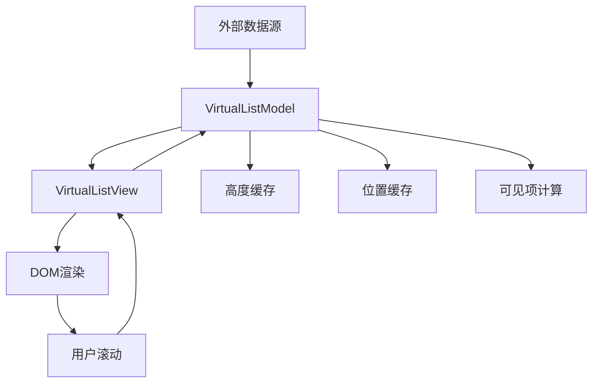
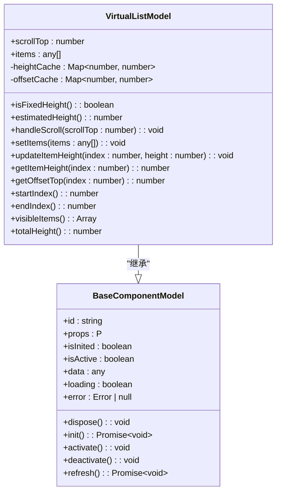
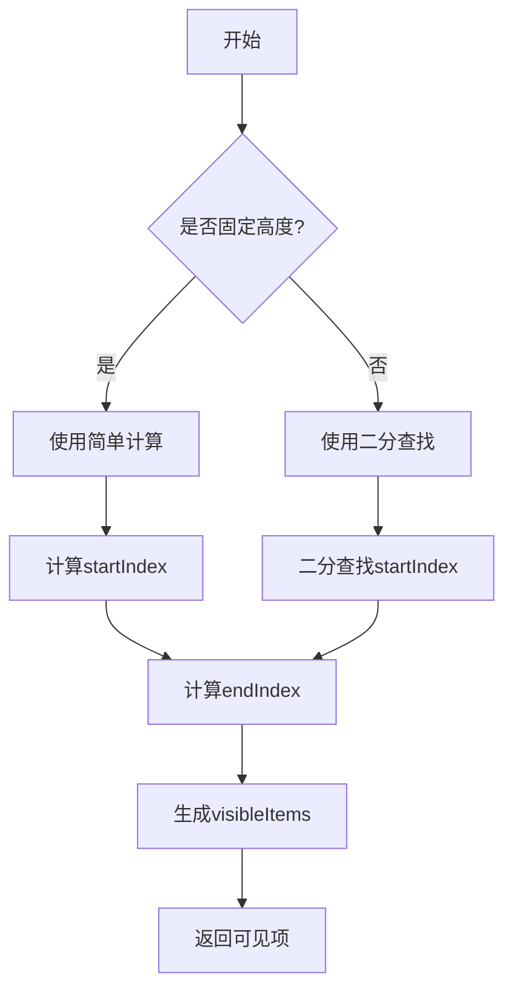
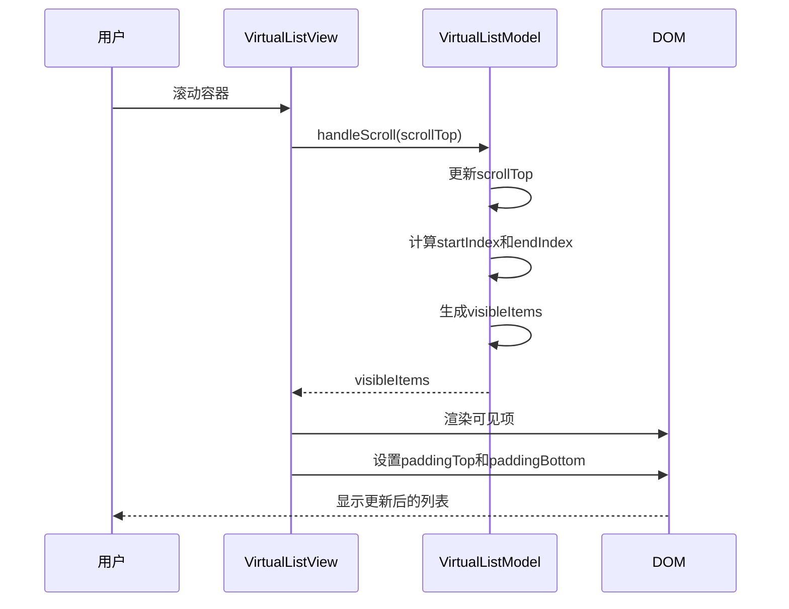
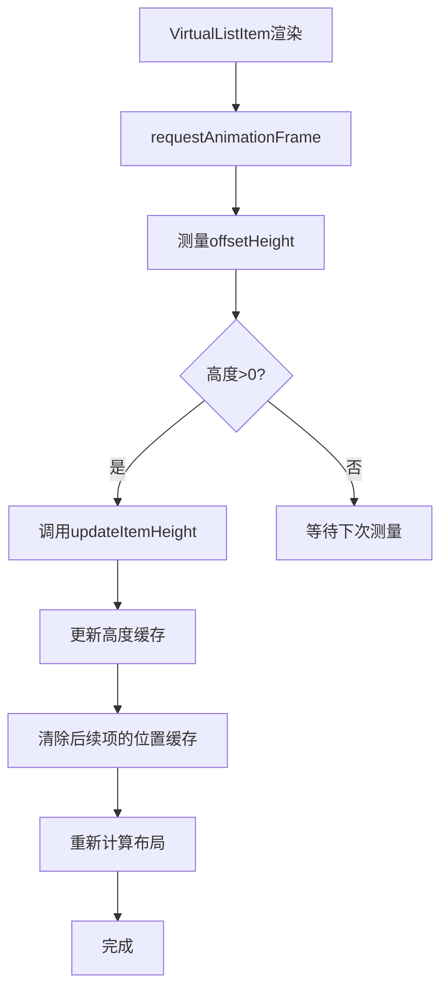
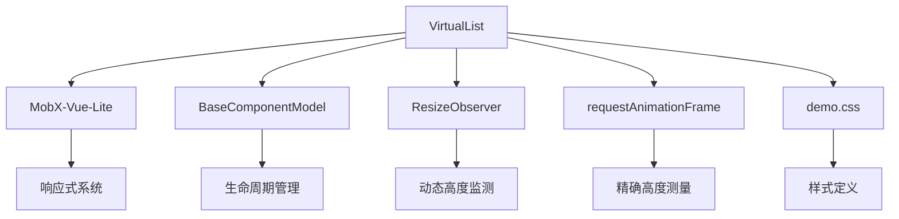

# 数据组件

<cite>
**本文档引用的文件**
- [virtual-list.model.ts](file://packages/h5-builder/src/components/virtual-list/virtual-list.model.ts)
- [virtual-list.view.tsx](file://packages/h5-builder/src/components/virtual-list/virtual-list.view.tsx)
- [model.ts](file://packages/h5-builder/src/bedrock/model.ts)
- [demo.css](file://packages/h5-builder/src/demo.css)
</cite>

## 目录
1. [简介](#简介)
2. [项目结构](#项目结构)
3. [核心组件](#核心组件)
4. [架构概述](#架构概述)
5. [详细组件分析](#详细组件分析)
6. [依赖分析](#依赖分析)
7. [性能考虑](#性能考虑)
8. [故障排除指南](#故障排除指南)
9. [结论](#结论)
10. [附录](#附录)（如有必要）

## 简介
本文档详细说明了VirtualList这一核心高性能数据密集型组件的实现原理和使用方法。VirtualList组件通过虚拟滚动技术实现了对大数据集的高效渲染，支持固定高度和动态高度两种模式。文档将深入分析其渲染窗口机制、性能优化策略以及关键属性的使用方法，为开发者提供完整的使用指导和最佳实践。

## 项目结构
VirtualList组件位于`packages/h5-builder/src/components/virtual-list/`目录下，采用Model-View架构分离的设计模式。该组件由模型层（.model.ts）和视图层（.view.tsx）组成，通过清晰的职责划分实现了逻辑与UI的解耦。

```mermaid
graph TB
subgraph "VirtualList组件"
Model[virtual-list.model.ts]
View[virtual-list.view.tsx]
Index[index.ts]
end
Model --> View : "提供数据和逻辑"
View --> Model : "反馈用户交互"
Index --> Model : "导出模型"
Index --> View : "导出视图"
```

**图示来源**
- [virtual-list.model.ts](file://packages/h5-builder/src/components/virtual-list/virtual-list.model.ts)
- [virtual-list.view.tsx](file://packages/h5-builder/src/components/virtual-list/virtual-list.view.tsx)

**本节来源**
- [virtual-list.model.ts](file://packages/h5-builder/src/components/virtual-list/virtual-list.model.ts)
- [virtual-list.view.tsx](file://packages/h5-builder/src/components/virtual-list/virtual-list.view.tsx)

## 核心组件
VirtualList组件的核心是其虚拟滚动实现，通过只渲染可见区域的项来大幅提升大数据集下的性能表现。组件支持固定高度和动态高度两种模式，能够适应不同的使用场景。模型层负责管理数据源、高度缓存和滚动位置，视图层则负责实际的DOM渲染和用户交互处理。

**本节来源**
- [virtual-list.model.ts](file://packages/h5-builder/src/components/virtual-list/virtual-list.model.ts)
- [virtual-list.view.tsx](file://packages/h5-builder/src/components/virtual-list/virtual-list.view.tsx)

## 架构概述
VirtualList组件采用Model-View架构，其中Model负责数据管理和逻辑处理，View负责UI渲染和用户交互。这种分离设计使得组件具有良好的可维护性和可测试性。



**图示来源**
- [virtual-list.model.ts](file://packages/h5-builder/src/components/virtual-list/virtual-list.model.ts)
- [virtual-list.view.tsx](file://packages/h5-builder/src/components/virtual-list/virtual-list.view.tsx)

## 详细组件分析
VirtualList组件的实现包含了多个关键部分，包括虚拟滚动算法、高度测量、缓存管理和性能优化等。以下是对各关键部分的详细分析。

### VirtualList模型分析
VirtualListModel是VirtualList组件的核心逻辑层，负责管理所有与虚拟滚动相关的状态和计算。

#### 类图


**图示来源**
- [virtual-list.model.ts](file://packages/h5-builder/src/components/virtual-list/virtual-list.model.ts)
- [model.ts](file://packages/h5-builder/src/bedrock/model.ts)

#### 虚拟滚动实现原理
VirtualList的虚拟滚动实现基于渲染窗口机制，只渲染当前可见区域及其周围的预渲染项。这种机制大大减少了DOM节点的数量，从而提升了性能。



**图示来源**
- [virtual-list.model.ts](file://packages/h5-builder/src/components/virtual-list/virtual-list.model.ts)

**本节来源**
- [virtual-list.model.ts](file://packages/h5-builder/src/components/virtual-list/virtual-list.model.ts)

### VirtualList视图分析
VirtualListView是VirtualList组件的UI层，负责实际的DOM渲染和用户交互处理。

#### 渲染流程序列图


**图示来源**
- [virtual-list.model.ts](file://packages/h5-builder/src/components/virtual-list/virtual-list.model.ts)
- [virtual-list.view.tsx](file://packages/h5-builder/src/components/virtual-list/virtual-list.view.tsx)

#### 动态高度测量
对于动态高度的项，VirtualList使用ResizeObserver来实时监测高度变化，并更新缓存。



**图示来源**
- [virtual-list.view.tsx](file://packages/h5-builder/src/components/virtual-list/virtual-list.view.tsx)

**本节来源**
- [virtual-list.view.tsx](file://packages/h5-builder/src/components/virtual-list/virtual-list.view.tsx)

## 依赖分析
VirtualList组件依赖于多个基础模块，包括MobX状态管理、BaseComponentModel基类和CSS样式。



**图示来源**
- [virtual-list.model.ts](file://packages/h5-builder/src/components/virtual-list/virtual-list.model.ts)
- [virtual-list.view.tsx](file://packages/h5-builder/src/components/virtual-list/virtual-list.view.tsx)
- [model.ts](file://packages/h5-builder/src/bedrock/model.ts)
- [demo.css](file://packages/h5-builder/src/demo.css)

**本节来源**
- [virtual-list.model.ts](file://packages/h5-builder/src/components/virtual-list/virtual-list.model.ts)
- [virtual-list.view.tsx](file://packages/h5-builder/src/components/virtual-list/virtual-list.view.tsx)
- [model.ts](file://packages/h5-builder/src/bedrock/model.ts)

## 性能考虑
VirtualList组件通过多种优化策略确保在大数据集下的流畅性能表现。

### 关键属性说明
| 属性 | 类型 | 默认值 | 说明 |
|------|------|--------|------|
| itemHeight | number | undefined | 固定高度模式下的项高度 |
| estimatedItemHeight | number | 120 | 动态高度模式下的估算高度 |
| containerHeight | number | required | 容器高度 |
| overscan | number | 3 | 预渲染项数（上下各多渲染几项） |

### 性能优化策略
1. **缓存机制**：使用Map对象缓存项的高度和偏移位置，避免重复计算
2. **二分查找**：在动态高度模式下使用二分查找优化startIndex的计算性能
3. **增量更新**：当项高度变化时，只清除受影响的后续项缓存
4. **requestAnimationFrame**：在下一帧进行高度测量，确保元素完全渲染
5. **ResizeObserver**：实时监测高度变化，自动更新布局

**本节来源**
- [virtual-list.model.ts](file://packages/h5-builder/src/components/virtual-list/virtual-list.model.ts)
- [virtual-list.view.tsx](file://packages/h5-builder/src/components/virtual-list/virtual-list.view.tsx)

## 故障排除指南
### 常见问题及解决方案
1. **滚动卡顿**
   - 检查renderItem函数是否过于复杂
   - 确保使用了合适的overscan值
   - 避免在renderItem中进行大量计算

2. **高度测量不准确**
   - 确保内容完全加载后再进行测量
   - 检查CSS样式是否影响了元素的实际高度
   - 考虑使用estimatedItemHeight提供更准确的估算值

3. **内存泄漏**
   - 确保组件销毁时正确清理ResizeObserver
   - 检查是否存在未清理的定时器或事件监听器
   - 使用dispose方法正确释放资源

**本节来源**
- [virtual-list.model.ts](file://packages/h5-builder/src/components/virtual-list/virtual-list.model.ts)
- [virtual-list.view.tsx](file://packages/h5-builder/src/components/virtual-list/virtual-list.view.tsx)

## 结论
VirtualList组件通过精心设计的虚拟滚动算法和高效的性能优化策略，为处理大数据集提供了优秀的解决方案。其灵活的配置选项和清晰的架构设计使得开发者能够轻松地将其集成到各种应用场景中。通过正确配置关键属性和遵循最佳实践，可以确保在各种设备上都能提供流畅的用户体验。