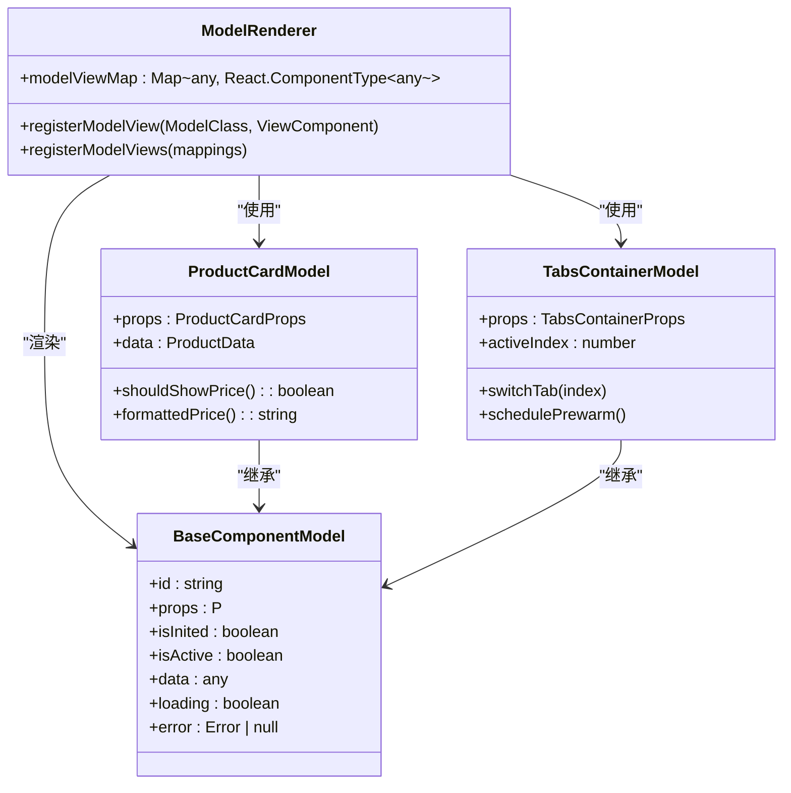
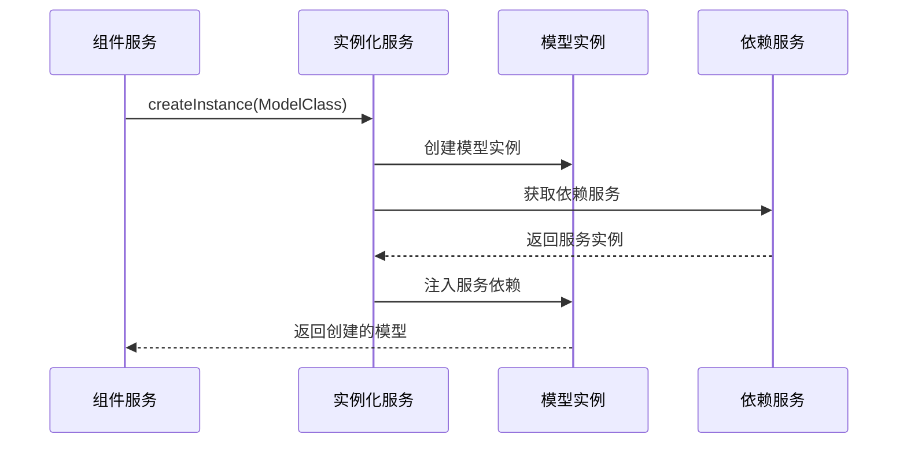
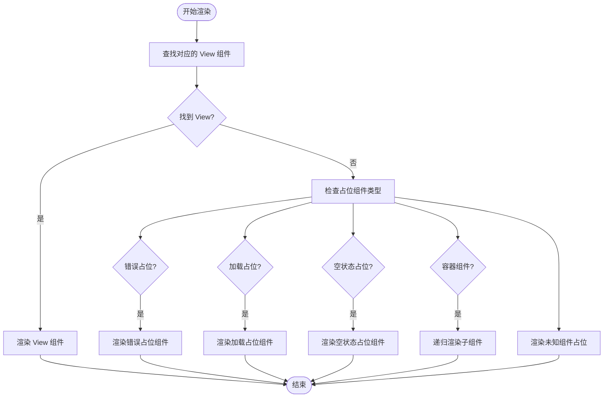
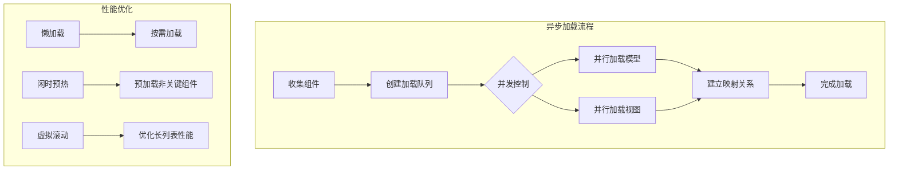
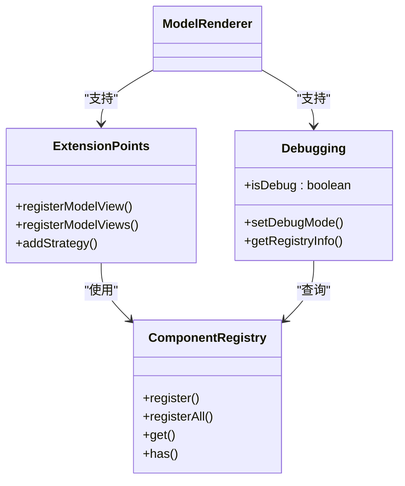
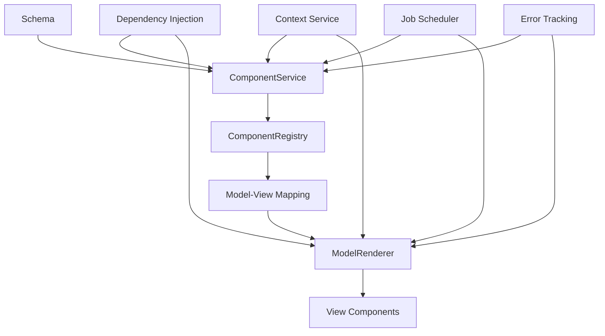

# 模型渲染器

<cite>
**本文档引用的文件**   
- [model-renderer.tsx](file://packages/h5-builder/src/components/model-renderer.tsx)
- [product-card.model.ts](file://packages/h5-builder/src/components/product-card/product-card.model.ts)
- [tabs-container.model.ts](file://packages/h5-builder/src/components/tabs-container/tabs-container.model.ts)
- [product-card.view.tsx](file://packages/h5-builder/src/components/product-card/product-card.view.tsx)
- [tabs-container.view.tsx](file://packages/h5-builder/src/components/tabs-container/tabs-container.view.tsx)
- [model.ts](file://packages/h5-builder/src/bedrock/model.ts)
- [context.service.ts](file://packages/h5-builder/src/services/context.service.ts)
- [component.service.ts](file://packages/h5-builder/src/services/component.service.ts)
- [demo-progressive.tsx](file://packages/h5-builder/src/demo-progressive.tsx)
</cite>

## 目录
1. [简介](#简介)
2. [核心机制](#核心机制)
3. [依赖注入与上下文传递](#依赖注入与上下文传递)
4. [生命周期与错误处理](#生命周期与错误处理)
5. [异步加载与性能优化](#异步加载与性能优化)
6. [扩展点与调试](#扩展点与调试)
7. [架构图](#架构图)
8. [总结](#总结)

## 简介

模型渲染器（ModelRenderer）是整个组件系统的核心渲染协调器，作为组件模型（BaseComponentModel）与UI视图之间的桥梁。它负责根据模型类型动态加载并渲染对应的.view.tsx组件，支持异步组件加载和错误边界处理。

**Section sources**
- [model-renderer.tsx](file://packages/h5-builder/src/components/model-renderer.tsx)

## 核心机制

模型渲染器通过维护一个模型-视图映射表（modelViewMap），将组件模型与对应的UI视图进行关联。当接收到一个模型实例时，它会查找映射表中对应的视图组件并进行渲染。

映射表通过`registerModelView`和`registerModelViews`函数进行注册，这些函数允许将特定的模型类与对应的视图组件进行绑定。例如，ProductCardModel与ProductCardView、TabsContainerModel与TabsContainerView的映射关系。

**Diagram sources **
- [model-renderer.tsx](file://packages/h5-builder/src/components/model-renderer.tsx)
- [product-card.model.ts](file://packages/h5-builder/src/components/product-card/product-card.model.ts)
- [tabs-container.model.ts](file://packages/h5-builder/src/components/tabs-container/tabs-container.model.ts)

**Section sources**
- [model-renderer.tsx](file://packages/h5-builder/src/components/model-renderer.tsx)
- [product-card.model.ts](file://packages/h5-builder/src/components/product-card/product-card.model.ts)
- [tabs-container.model.ts](file://packages/h5-builder/src/components/tabs-container/tabs-container.model.ts)

## 依赖注入与上下文传递

模型渲染器通过依赖注入机制获取所需的服务实例，如HTTP服务、埋点服务等。这些服务通过装饰器注入到模型类的构造函数中，实现了松耦合的设计。

上下文服务（PageContextService）提供了页面级的共享状态，包括用户信息、环境信息、路由信息等。这些信息可以在组件树中共享，避免了深层传递props的复杂性。

**Diagram sources **
- [component.service.ts](file://packages/h5-builder/src/services/component.service.ts)
- [context.service.ts](file://packages/h5-builder/src/services/context.service.ts)

**Section sources**
- [component.service.ts](file://packages/h5-builder/src/services/component.service.ts)
- [context.service.ts](file://packages/h5-builder/src/services/context.service.ts)

## 生命周期与错误处理

模型渲染器支持完整的生命周期管理，包括初始化（onInit）、激活（onActive）、停用（onInactive）和销毁（dispose）等钩子。这些钩子允许在特定时机执行相应的逻辑。

对于错误处理，系统提供了专门的占位组件模型，包括ErrorPlaceholderModel、LoadingPlaceholderModel和EmptyPlaceholderModel。当组件加载失败、正在加载或没有内容时，会自动渲染对应的占位组件。

**Diagram sources **
- [model-renderer.tsx](file://packages/h5-builder/src/components/model-renderer.tsx)
- [placeholder/index.ts](file://packages/h5-builder/src/placeholder/index.ts)

**Section sources**
- [model-renderer.tsx](file://packages/h5-builder/src/components/model-renderer.tsx)
- [placeholder/index.ts](file://packages/h5-builder/src/placeholder/index.ts)

## 异步加载与性能优化

组件服务（ComponentService）支持异步组件加载，通过`registerAsync`和`preloadComponentsUnified`方法实现。这些方法允许将组件的模型和视图分离加载，优化首屏加载性能。

系统实现了并发控制机制，通过`processQueue`和`processPromiseQueue`方法限制同时加载的组件数量，避免资源竞争和性能瓶颈。加载策略支持优先级调度、依赖管理和延迟加载等功能。

**Diagram sources **
- [component.service.ts](file://packages/h5-builder/src/services/component.service.ts)

**Section sources**
- [component.service.ts](file://packages/h5-builder/src/services/component.service.ts)

## 扩展点与调试

模型渲染器提供了多个扩展点，允许自定义渲染逻辑。开发者可以通过注册新的模型-视图映射关系来扩展系统功能。

在调试模式下，可以通过查看渲染树结构来分析组件的层次关系和状态。PageContextService的isDebug属性控制调试模式，允许在开发环境中显示额外的调试信息。

**Diagram sources **
- [component.service.ts](file://packages/h5-builder/src/services/component.service.ts)
- [context.service.ts](file://packages/h5-builder/src/services/context.service.ts)

**Section sources**
- [component.service.ts](file://packages/h5-builder/src/services/component.service.ts)
- [context.service.ts](file://packages/h5-builder/src/services/context.service.ts)

## 架构图

整个组件系统的架构基于模型-视图分离的设计模式，通过模型渲染器协调模型和视图的交互。

**Diagram sources **
- [demo-progressive.tsx](file://packages/h5-builder/src/demo-progressive.tsx)
- [component.service.ts](file://packages/h5-builder/src/services/component.service.ts)
- [model-renderer.tsx](file://packages/h5-builder/src/components/model-renderer.tsx)

## 总结

模型渲染器作为组件系统的核心，实现了模型与视图的解耦，提供了灵活的扩展机制和强大的错误处理能力。通过依赖注入和上下文传递，它能够有效地管理组件间的依赖关系，支持异步加载和性能优化策略。

该设计模式提高了代码的可维护性和可测试性，使得组件可以独立开发和测试，同时保持了系统的整体一致性。通过清晰的生命周期管理和错误边界处理，确保了应用的稳定性和用户体验。