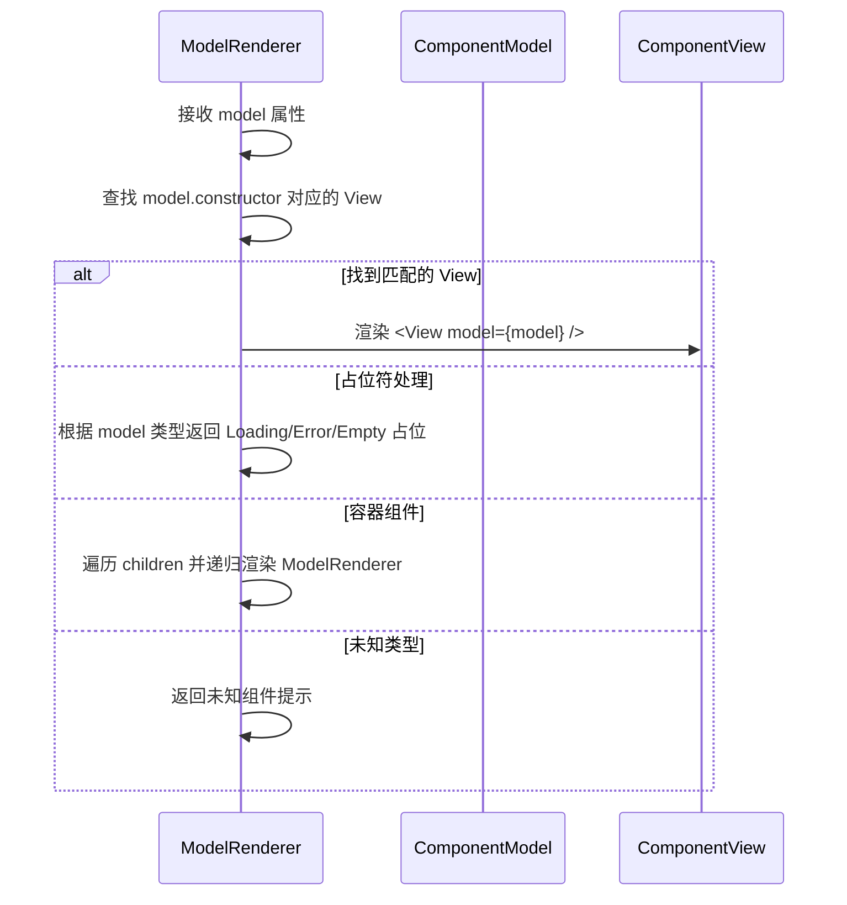

# 组件库

<cite>
**本文档中引用的文件**  
- [product-card.model.ts](file://packages/h5-builder/src/components/product-card/product-card.model.ts)
- [product-card.view.tsx](file://packages/h5-builder/src/components/product-card/product-card.view.tsx)
- [text-card.model.ts](file://packages/h5-builder/src/components/text-card/text-card.model.ts)
- [text-card.view.tsx](file://packages/h5-builder/src/components/text-card/text-card.view.tsx)
- [tabs-container.model.ts](file://packages/h5-builder/src/components/tabs-container/tabs-container.model.ts)
- [tabs-container.view.tsx](file://packages/h5-builder/src/components/tabs-container/tabs-container.view.tsx)
- [grid-layout-container.model.ts](file://packages/h5-builder/src/components/grid-layout-container/grid-layout-container.model.ts)
- [grid-layout-container.view.tsx](file://packages/h5-builder/src/components/grid-layout-container/grid-layout-container.view.tsx)
- [virtual-list.model.ts](file://packages/h5-builder/src/components/virtual-list/virtual-list.model.ts)
- [virtual-list.view.tsx](file://packages/h5-builder/src/components/virtual-list/virtual-list.view.tsx)
- [model-renderer.tsx](file://packages/h5-builder/src/components/model-renderer.tsx)
- [index.ts](file://packages/h5-builder/src/components/index.ts)
</cite>

## 目录
1. [简介](#简介)
2. [核心架构](#核心架构)
3. [组件模型与视图分离机制](#组件模型与视图分离机制)
4. [组件详细说明](#组件详细说明)
   - [ProductCard 商品卡片](#productcard-商品卡片)
   - [TextCard 文本卡片](#textcard-文本卡片)
   - [TabsContainer 选项卡容器](#tabscontainer-选项卡容器)
   - [GridLayoutContainer 网格布局容器](#gridlayoutcontainer-网格布局容器)
   - [VirtualList 虚拟列表](#virtuallist-虚拟列表)
5. [容器组件的特殊行为](#容器组件的特殊行为)
6. [性能优化建议](#性能优化建议)

## 简介
h5-builder 组件库提供了一套基于 Model-View 架构的 UI 组件系统，支持数据驱动渲染、懒加载、虚拟滚动等高级特性。本组件库通过将业务逻辑（Model）与 UI 展示（View）分离，实现了高内聚、低耦合的设计目标。

所有组件均通过 `ModelRenderer` 进行统一渲染，开发者只需定义组件模型（Model），即可自动匹配对应的视图组件（View），实现声明式开发体验。

## 核心架构
```mermaid
graph TB
ModelRenderer["ModelRenderer<br/>根据模型类型渲染视图"] --> ProductCardView["ProductCardView<br/>商品卡片视图"]
ModelRenderer --> TextCardView["TextCardView<br/>文本卡片视图"]
ModelRenderer --> TabsContainerView["TabsContainerView<br/>选项卡容器视图"]
ModelRenderer --> GridLayoutContainerView["GridLayoutContainerView<br/>网格布局容器视图"]
ModelRenderer --> VirtualListView["VirtualListView<br/>虚拟列表视图"]
ProductCardModel["ProductCardModel<br/>商品卡片模型"] --> ModelRenderer
TextCardModel["TextCardModel<br/>文本卡片模型"] --> ModelRenderer
TabsContainerModel["TabsContainerModel<br/>选项卡容器模型"] --> ModelRenderer
GridLayoutContainerModel["GridLayoutContainerModel<br/>网格布局容器模型"] --> ModelRenderer
VirtualListModel["VirtualListModel<br/>虚拟列表模型"] --> ModelRenderer
TabsContainerModel --> VirtualListModel
classDef default fill:#f9f,stroke:#333,stroke-width:1px;
class ModelRenderer,ModelRendererProps class default;
```

**图示来源**  
- [model-renderer.tsx](file://packages/h5-builder/src/components/model-renderer.tsx#L50-L105)
- [index.ts](file://packages/h5-builder/src/components/index.ts#L1-L14)

## 组件模型与视图分离机制
h5-builder 采用 Model-View 分离架构，其中：

- **Model**：负责数据获取、状态管理、生命周期处理、埋点上报等业务逻辑
- **View**：仅负责 UI 渲染，通过 `observer` 高阶组件响应 Model 状态变化

组件通过 `registerModelView` 或 `registerModelViews` 注册到全局映射表中，由 `ModelRenderer` 根据模型实例自动选择对应的视图组件进行渲染。



**图示来源**  
- [model-renderer.tsx](file://packages/h5-builder/src/components/model-renderer.tsx#L50-L105)

**本节来源**  
- [model-renderer.tsx](file://packages/h5-builder/src/components/model-renderer.tsx#L1-L105)

## 组件详细说明

### ProductCard 商品卡片
展示商品信息的卡片组件，支持异步数据加载、点击埋点、价格显示控制等功能。

#### 属性（Props）
| 属性名 | 类型 | 必需 | 默认值 | 说明 |
|-------|------|------|--------|------|
| productId | number | 是 | - | 商品 ID |
| showPrice | boolean | 否 | true | 是否显示价格 |

#### 事件
- `handleClick()`：点击商品卡片时触发，自动上报点击埋点

#### 计算属性
- `shouldShowPrice`：根据 `showPrice` 属性判断是否显示价格
- `formattedPrice`：格式化后的价格字符串（¥xx.xx）

#### 使用示例
```tsx
const model = new ProductCardModel('product-1', { productId: 123 });
<ModelRenderer model={model} />
```

**本节来源**  
- [product-card.model.ts](file://packages/h5-builder/src/components/product-card/product-card.model.ts#L29-L133)
- [product-card.view.tsx](file://packages/h5-builder/src/components/product-card/product-card.view.tsx#L22-L81)

### TextCard 文本卡片
用于展示标题和内容的简单文本卡片，支持行数截断。

#### 属性（Props）
| 属性名 | 类型 | 必需 | 默认值 | 说明 |
|-------|------|------|--------|------|
| title | string | 是 | - | 标题 |
| content | string | 是 | - | 正文内容 |
| lines | number | 否 | 2 | 显示行数（1-5） |

#### 使用示例
```tsx
const model = new TextCardModel('text-1', { 
  title: '新闻标题', 
  content: '这是一段很长的正文内容...', 
  lines: 3 
});
<ModelRenderer model={model} />
```

**本节来源**  
- [text-card.model.ts](file://packages/h5-builder/src/components/text-card/text-card.model.ts#L16-L21)
- [text-card.view.tsx](file://packages/h5-builder/src/components/text-card/text-card.view.tsx#L13-L32)

### TabsContainer 选项卡容器
提供多标签页切换功能的容器组件，支持懒加载、闲时预热和自动虚拟滚动优化。

#### 属性（Props）
| 属性名 | 类型 | 必需 | 默认值 | 说明 |
|-------|------|------|--------|------|
| defaultIndex | number | 否 | 0 | 默认激活的标签索引 |
| virtualScroll.enabled | boolean | 否 | 自动检测 | 是否启用虚拟滚动 |
| virtualScroll.threshold | number | 否 | 20 | 启用虚拟滚动的子项数量阈值 |
| virtualScroll.itemHeight | number | 否 | 120 | 估算项高度（px） |
| virtualScroll.containerHeight | number | 否 | 600 | 容器高度（px） |
| virtualScroll.overscan | number | 否 | 3 | 预渲染项数 |

#### 方法
- `switchTab(index)`：切换到指定索引的标签页
- `isVirtualScrollEnabled(index)`：判断某标签是否启用虚拟滚动

#### 生命周期行为
- **初始化**：仅初始化当前标签页，其他标签页懒加载
- **标签切换**：停用旧标签，激活新标签
- **预热策略**：优先预热相邻标签（500ms 延迟），再预热其他标签（2000ms 延迟），5秒后强制预热所有未初始化标签

#### 使用示例
```tsx
const model = new TabsContainerModel('tabs-1', { 
  defaultIndex: 0,
  virtualScroll: { threshold: 15 }
});
<ModelRenderer model={model} />
```

**本节来源**  
- [tabs-container.model.ts](file://packages/h5-builder/src/components/tabs-container/tabs-container.model.ts#L29-L273)
- [tabs-container.view.tsx](file://packages/h5-builder/src/components/tabs-container/tabs-container.view.tsx#L24-L85)

### GridLayoutContainer 网格布局容器
将子组件按网格排列的容器组件，适用于商品列表、功能入口等场景。

#### 属性（Props）
| 属性名 | 类型 | 必需 | 默认值 | 说明 |
|-------|------|------|--------|------|
| columns | number | 是 | - | 列数 |
| gap | number | 否 | 8 | 间距（px） |

#### 生命周期行为
- **onInit**：初始化所有子组件
- **onActive**：激活所有子组件
- **onInactive**：停用所有子组件

#### 使用示例
```tsx
const model = new GridLayoutContainerModel('grid-1', { 
  columns: 3, 
  gap: 12 
});
<ModelRenderer model={model} />
```

**本节来源**  
- [grid-layout-container.model.ts](file://packages/h5-builder/src/components/grid-layout-container/grid-layout-container.model.ts#L20-L44)
- [grid-layout-container.view.tsx](file://packages/h5-builder/src/components/grid-layout-container/grid-layout-container.view.tsx#L13-L38)

### VirtualList 虚拟列表
高性能虚拟滚动列表组件，仅渲染可视区域内的项目，大幅提升长列表性能。

#### 属性（Props）
| 属性名 | 类型 | 必需 | 默认值 | 说明 |
|-------|------|------|--------|------|
| estimatedItemHeight | number | 是 | - | 估算项高度（px） |
| containerHeight | number | 是 | - | 容器高度（px） |
| overscan | number | 否 | 3 | 预渲染项数 |

#### 方法
- `setItems(items)`：设置列表数据
- `getVisibleRange()`：获取当前可见项范围

#### 使用示例
```tsx
const virtualList = new VirtualListModel('virtual-1', {
  estimatedItemHeight: 100,
  containerHeight: 500,
  overscan: 3
});
virtualList.setItems(childModels); // 设置子模型数组
<VirtualListView model={virtualList} renderItem={(item) => <ModelRenderer model={item} />} />
```

**本节来源**  
- [virtual-list.model.ts](file://packages/h5-builder/src/components/virtual-list/virtual-list.model.ts)
- [virtual-list.view.tsx](file://packages/h5-builder/src/components/virtual-list/virtual-list.view.tsx)

## 容器组件的特殊行为
容器组件（如 TabsContainer、GridLayoutContainer）具有以下特殊行为：

1. **子组件管理**：通过 `children` 数组管理子组件模型
2. **生命周期传播**：
   - `onInit`：初始化子组件
   - `onActive`：激活子组件
   - `onInactive`：停用子组件
3. **懒加载机制**：TabsContainer 仅初始化当前标签页，提升首屏性能
4. **自动优化**：TabsContainer 可自动为长列表标签启用虚拟滚动
5. **预热策略**：利用闲时资源预加载非当前标签页，提升切换体验

这些行为使得容器组件既能保证良好用户体验，又能有效控制资源消耗。

**本节来源**  
- [tabs-container.model.ts](file://packages/h5-builder/src/components/tabs-container/tabs-container.model.ts#L68-L273)
- [grid-layout-container.model.ts](file://packages/h5-builder/src/components/grid-layout-container/grid-layout-container.model.ts#L25-L43)

## 性能优化建议
1. **长列表使用 VirtualList**：当列表项超过 20 个时，务必使用虚拟列表
2. **TabsContainer 合理配置阈值**：根据实际内容调整 `virtualScroll.threshold`
3. **避免过度嵌套**：减少组件层级深度，降低渲染复杂度
4. **利用预热机制**：对于可预测的用户行为（如轮播图），可提前触发预热
5. **监控加载性能**：通过埋点跟踪 `PRODUCT_LOADED` 等事件，分析加载耗时
6. **合理设置估算高度**：VirtualList 的 `estimatedItemHeight` 应尽量接近实际平均高度，避免滚动抖动

通过以上优化措施，可显著提升页面加载速度和交互流畅度。

**本节来源**  
- [tabs-container.model.ts](file://packages/h5-builder/src/components/tabs-container/tabs-container.model.ts#L101-L128)
- [virtual-list.model.ts](file://packages/h5-builder/src/components/virtual-list/virtual-list.model.ts)
- [product-card.model.ts](file://packages/h5-builder/src/components/product-card/product-card.model.ts#L64-L101)