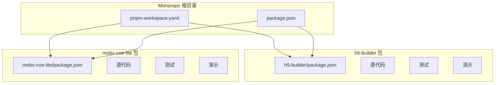
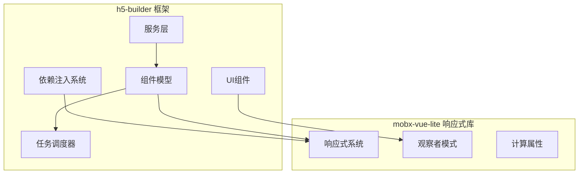
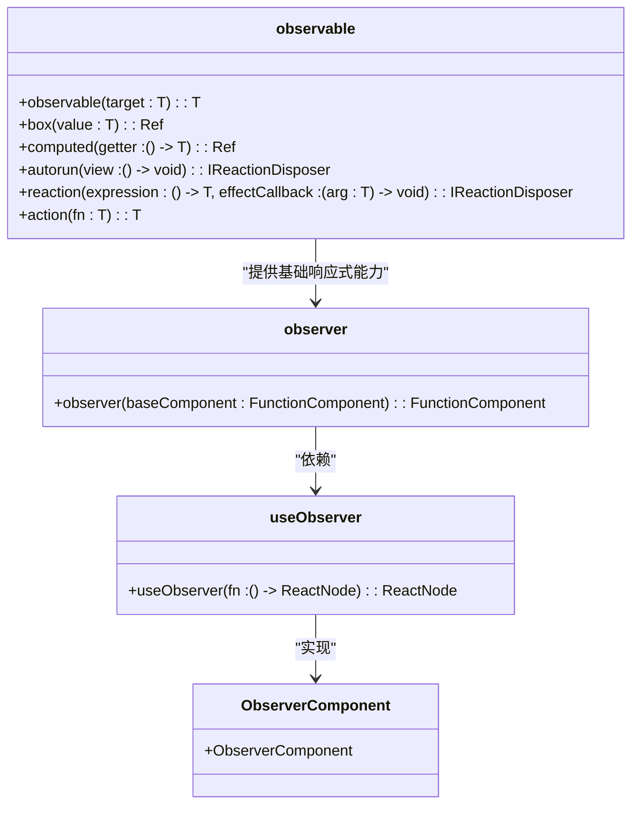
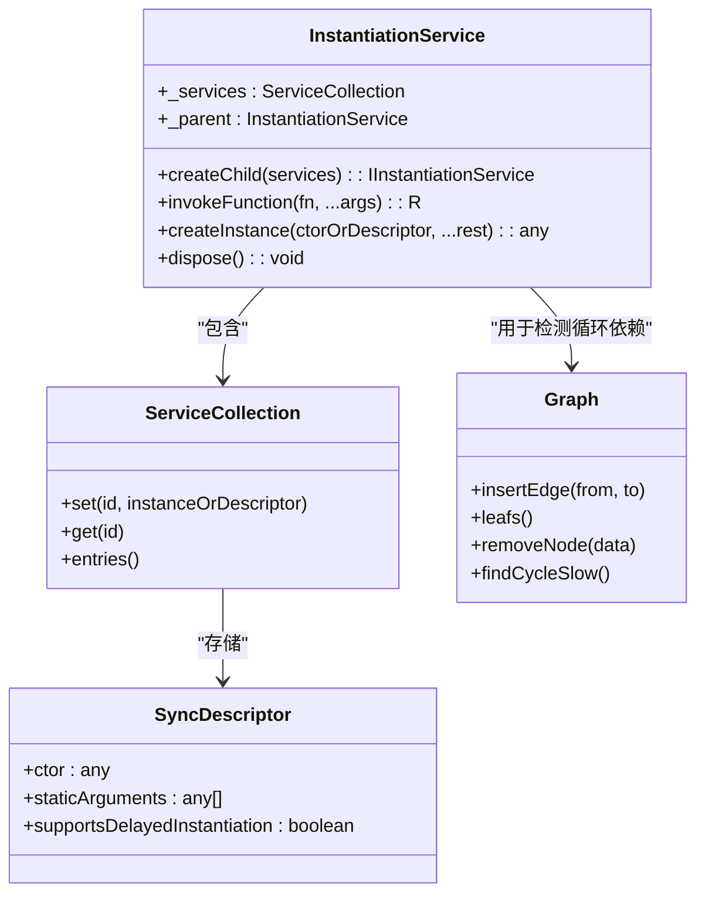
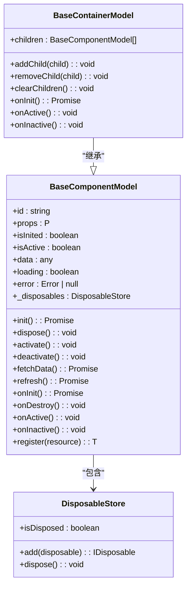
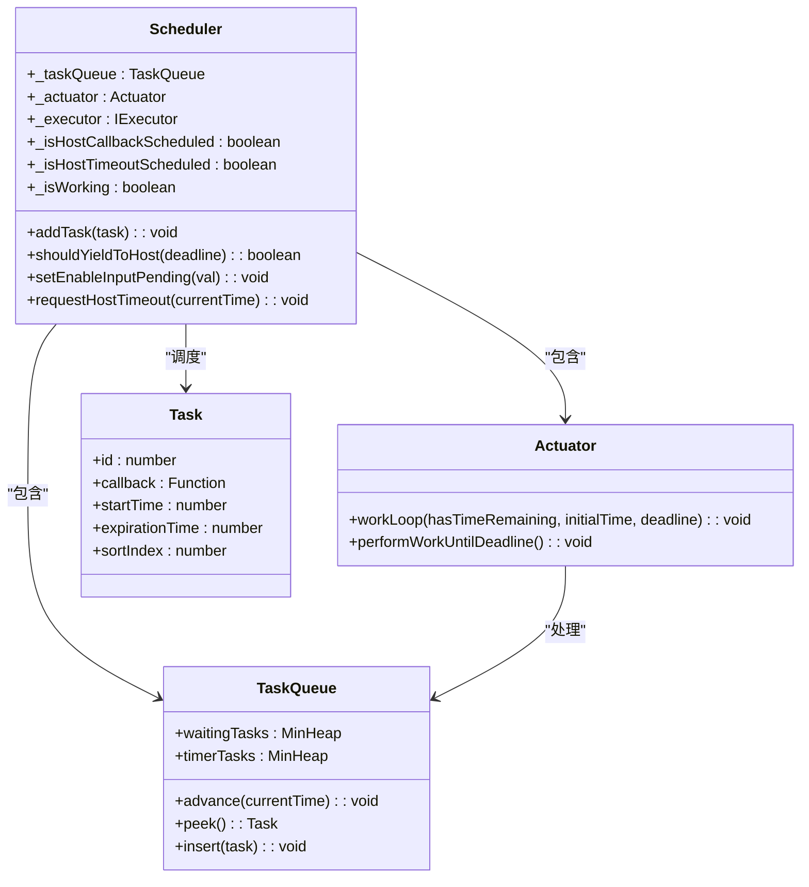
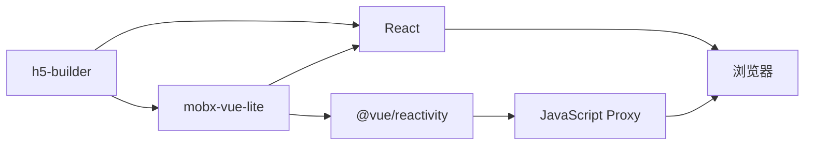

# 项目概述

<cite>
**本文档引用的文件**
- [h5-builder/package.json](file://packages/h5-builder/package.json)
- [mobx-vue-lite/package.json](file://packages/mobx-vue-lite/package.json)
- [mobx-vue-lite/src/mobx.ts](file://packages/mobx-vue-lite/src/mobx.ts)
- [mobx-vue-lite/src/observer.ts](file://packages/mobx-vue-lite/src/observer.ts)
- [h5-builder/src/bedrock/di/instantiation-service.ts](file://packages/h5-builder/src/bedrock/di/instantiation-service.ts)
- [h5-builder/src/bedrock/model.ts](file://packages/h5-builder/src/bedrock/model.ts)
- [h5-builder/src/bedrock/scheduler/core/scheduler.ts](file://packages/h5-builder/src/bedrock/scheduler/core/scheduler.ts)
- [h5-builder/src/components/index.ts](file://packages/h5-builder/src/components/index.ts)
- [h5-builder/src/services/index.ts](file://packages/h5-builder/src/services/index.ts)
- [pnpm-workspace.yaml](file://pnpm-workspace.yaml)
</cite>

## 目录
1. [简介](#简介)
2. [项目结构](#项目结构)
3. [核心组件](#核心组件)
4. [架构概述](#架构概述)
5. [详细组件分析](#详细组件分析)
6. [依赖分析](#依赖分析)
7. [性能考虑](#性能考虑)
8. [故障排除指南](#故障排除指南)
9. [结论](#结论)

## 简介
本项目是一个基于Monorepo架构的H5构建框架，专为电商H5页面设计，提供模块化、可扩展且具备响应式能力的构建能力。框架由两个核心包组成：`h5-builder`主框架和`mobx-vue-lite`响应式库。`h5-builder`利用依赖注入、组件模型分离、任务调度机制和渐进式渲染等特性，为复杂电商页面提供强大的构建能力。`mobx-vue-lite`是一个轻量级的响应式库，基于Vue的响应式系统实现，为整个框架提供响应式能力。

## 项目结构
该项目采用Monorepo架构，包含两个主要的npm包：`h5-builder`和`mobx-vue-lite`。这种结构允许两个包独立开发、测试和发布，同时保持紧密的集成关系。

**Diagram sources**
- [pnpm-workspace.yaml](file://pnpm-workspace.yaml)
- [h5-builder/package.json](file://packages/h5-builder/package.json)
- [mobx-vue-lite/package.json](file://packages/mobx-vue-lite/package.json)

**Section sources**
- [pnpm-workspace.yaml](file://pnpm-workspace.yaml)
- [h5-builder/package.json](file://packages/h5-builder/package.json)
- [mobx-vue-lite/package.json](file://packages/mobx-vue-lite/package.json)

## 核心组件
项目的核心组件包括`h5-builder`框架和`mobx-vue-lite`响应式库。`h5-builder`提供了依赖注入系统、任务调度器、组件模型基类和各种服务。`mobx-vue-lite`提供了基于Vue响应式系统的轻量级MobX实现，包括observable、observer、computed等核心功能。

**Section sources**
- [h5-builder/package.json](file://packages/h5-builder/package.json)
- [mobx-vue-lite/package.json](file://packages/mobx-vue-lite/package.json)
- [h5-builder/src/bedrock/model.ts](file://packages/h5-builder/src/bedrock/model.ts)
- [mobx-vue-lite/src/mobx.ts](file://packages/mobx-vue-lite/src/mobx.ts)

## 架构概述
该项目采用分层架构设计，`h5-builder`作为主框架依赖`mobx-vue-lite`提供的响应式能力。`h5-builder`内部实现了依赖注入系统来管理服务，任务调度器来优化性能，以及组件模型分离模式来解耦数据和视图。

**Diagram sources**
- [h5-builder/package.json](file://packages/h5-builder/package.json)
- [mobx-vue-lite/package.json](file://packages/mobx-vue-lite/package.json)
- [h5-builder/src/bedrock/di/instantiation-service.ts](file://packages/h5-builder/src/bedrock/di/instantiation-service.ts)
- [h5-builder/src/bedrock/scheduler/core/scheduler.ts](file://packages/h5-builder/src/bedrock/scheduler/core/scheduler.ts)

## 详细组件分析

### 响应式系统分析
`mobx-vue-lite`实现了完整的响应式系统，基于Vue 3的`@vue/reactivity`包，提供了MobX风格的API。

**Diagram sources**
- [mobx-vue-lite/src/mobx.ts](file://packages/mobx-vue-lite/src/mobx.ts)
- [mobx-vue-lite/src/observer.ts](file://packages/mobx-vue-lite/src/observer.ts)
- [mobx-vue-lite/src/useObserver.ts](file://packages/mobx-vue-lite/src/useObserver.ts)

**Section sources**
- [mobx-vue-lite/src/mobx.ts](file://packages/mobx-vue-lite/src/mobx.ts)
- [mobx-vue-lite/src/observer.ts](file://packages/mobx-vue-lite/src/observer.ts)

### 依赖注入系统分析
`h5-builder`实现了强大的依赖注入系统，用于管理服务实例的创建和生命周期。

**Diagram sources**
- [h5-builder/src/bedrock/di/instantiation-service.ts](file://packages/h5-builder/src/bedrock/di/instantiation-service.ts)
- [h5-builder/src/bedrock/di/service-collection.ts](file://packages/h5-builder/src/bedrock/di/service-collection.ts)
- [h5-builder/src/bedrock/di/descriptor.ts](file://packages/h5-builder/src/bedrock/di/descriptor.ts)
- [h5-builder/src/bedrock/structure/graph.ts](file://packages/h5-builder/src/bedrock/structure/graph.ts)

**Section sources**
- [h5-builder/src/bedrock/di/instantiation-service.ts](file://packages/h5-builder/src/bedrock/di/instantiation-service.ts)

### 组件模型分析
`h5-builder`定义了组件模型基类，实现了数据和视图的分离，并集成了响应式系统。

**Diagram sources**
- [h5-builder/src/bedrock/model.ts](file://packages/h5-builder/src/bedrock/model.ts)
- [h5-builder/src/bedrock/dispose/disposable-store.ts](file://packages/h5-builder/src/bedrock/dispose/disposable-store.ts)

**Section sources**
- [h5-builder/src/bedrock/model.ts](file://packages/h5-builder/src/bedrock/model.ts)

### 任务调度器分析
`h5-builder`实现了任务调度器，用于优化性能，实现渐进式渲染。

**Diagram sources**
- [h5-builder/src/bedrock/scheduler/core/scheduler.ts](file://packages/h5-builder/src/bedrock/scheduler/core/scheduler.ts)
- [h5-builder/src/bedrock/scheduler/core/task-queue.ts](file://packages/h5-builder/src/bedrock/scheduler/core/task-queue.ts)
- [h5-builder/src/bedrock/scheduler/core/actuator.ts](file://packages/h5-builder/src/bedrock/scheduler/core/actuator.ts)
- [h5-builder/src/bedrock/scheduler/core/task.ts](file://packages/h5-builder/src/bedrock/scheduler/core/task.ts)

**Section sources**
- [h5-builder/src/bedrock/scheduler/core/scheduler.ts](file://packages/h5-builder/src/bedrock/scheduler/core/scheduler.ts)

## 依赖分析
项目采用Monorepo架构，通过pnpm workspace管理包之间的依赖关系。`h5-builder`直接依赖`mobx-vue-lite`来实现响应式系统。

**Diagram sources**
- [h5-builder/package.json](file://packages/h5-builder/package.json)
- [mobx-vue-lite/package.json](file://packages/mobx-vue-lite/package.json)

**Section sources**
- [h5-builder/package.json](file://packages/h5-builder/package.json)
- [mobx-vue-lite/package.json](file://packages/mobx-vue-lite/package.json)

## 性能考虑
该项目在性能方面做了多项优化：
1. 使用任务调度器实现时间分片，避免长时间运行的任务阻塞主线程
2. 支持延迟实例化，减少初始加载时的性能开销
3. 使用响应式系统实现精确的依赖追踪，避免不必要的重新渲染
4. 提供渐进式渲染能力，优先渲染关键内容

## 故障排除指南
常见问题及解决方案：
1. **循环依赖问题**：依赖注入系统会检测并报告循环依赖，需要重构服务依赖关系
2. **内存泄漏**：确保所有可释放资源都通过`register`方法注册到`DisposableStore`
3. **响应式失效**：确保模型类通过`observable`包装，且状态变更在action中进行
4. **调度器问题**：检查`shouldYieldToHost`实现，确保在正确的时间让出控制权

**Section sources**
- [h5-builder/src/bedrock/di/instantiation-service.ts](file://packages/h5-builder/src/bedrock/di/instantiation-service.ts)
- [h5-builder/src/bedrock/dispose/disposable-store.ts](file://packages/h5-builder/src/bedrock/dispose/disposable-store.ts)
- [h5-builder/src/bedrock/model.ts](file://packages/h5-builder/src/bedrock/model.ts)
- [h5-builder/src/bedrock/scheduler/core/scheduler.ts](file://packages/h5-builder/src/bedrock/scheduler/core/scheduler.ts)

## 结论
该项目是一个功能完备的H5构建框架，通过Monorepo架构将`h5-builder`主框架和`mobx-vue-lite`响应式库有机结合。框架提供了依赖注入、组件模型分离、任务调度和渐进式渲染等高级特性，特别适合构建复杂的电商H5页面。响应式系统基于Vue 3的响应式核心，提供了高性能的响应式能力。整体架构设计合理，模块职责清晰，具有良好的可扩展性和可维护性。