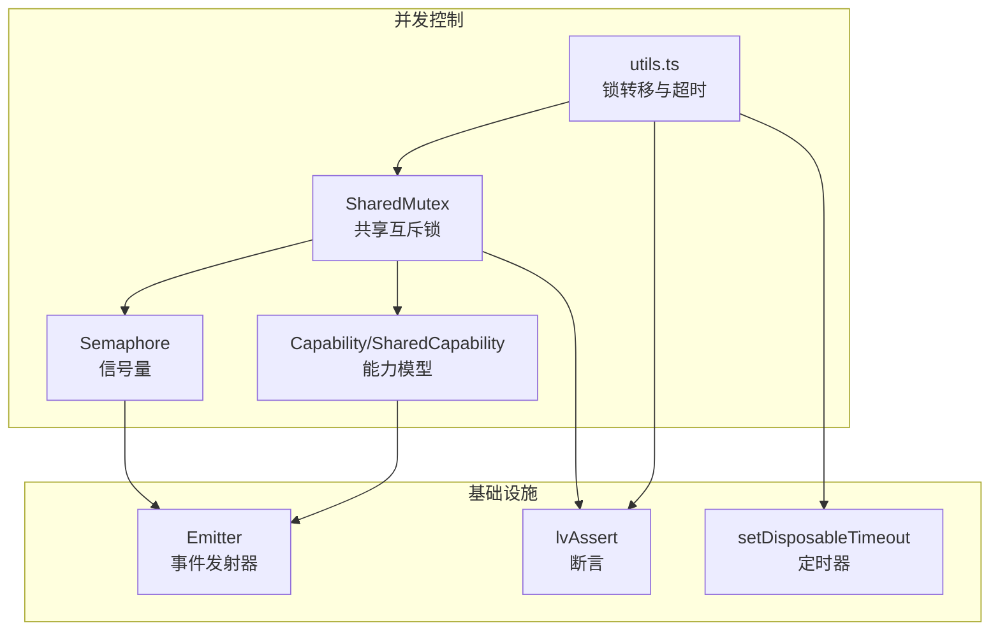
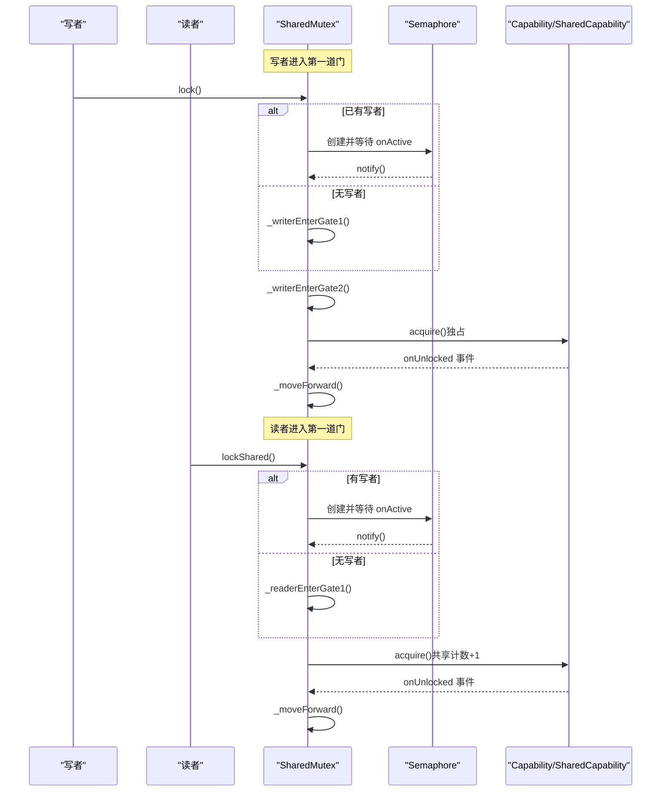
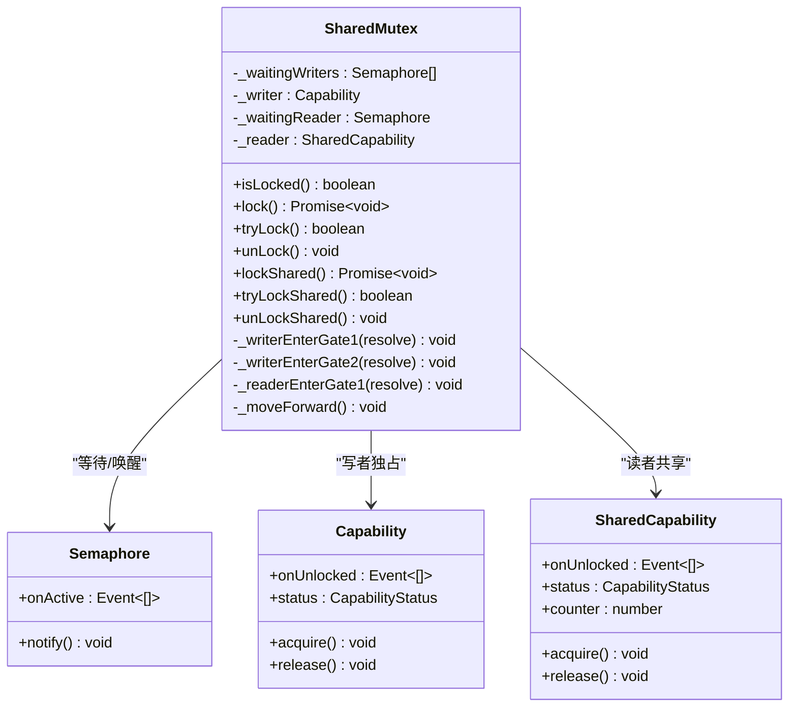
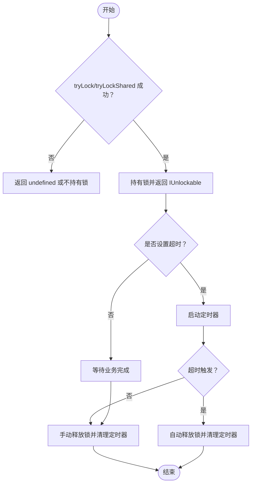
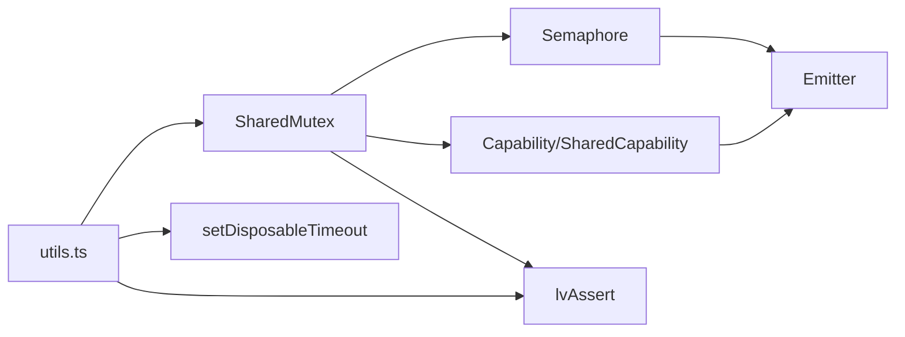

# 并发控制与锁机制

<cite>
**本文引用的文件列表**
- [shared-mutex.ts](file://packages/h5-builder/src/bedrock/lock/shared-mutex.ts)
- [semaphore.ts](file://packages/h5-builder/src/bedrock/lock/semaphore.ts)
- [capability.ts](file://packages/h5-builder/src/bedrock/lock/capability.ts)
- [utils.ts](file://packages/h5-builder/src/bedrock/lock/utils.ts)
- [shared-mutex.test.ts](file://packages/h5-builder/src/bedrock/lock/shared-mutex.test.ts)
- [capability.test.ts](file://packages/h5-builder/src/bedrock/lock/capability.test.ts)
- [utils.test.ts](file://packages/h5-builder/src/bedrock/lock/utils.test.ts)
- [README.md](file://packages/h5-builder/src/bedrock/lock/README.md)
- [emitter.ts](file://packages/h5-builder/src/bedrock/event/emitter.ts)
- [assert.ts](file://packages/h5-builder/src/bedrock/assert/assert.ts)
- [timer.ts](file://packages/h5-builder/src/bedrock/dispose/timer.ts)
</cite>

## 目录
1. [简介](#简介)
2. [项目结构](#项目结构)
3. [核心组件](#核心组件)
4. [架构总览](#架构总览)
5. [组件详解](#组件详解)
6. [依赖关系分析](#依赖关系分析)
7. [性能考量](#性能考量)
8. [故障排查指南](#故障排查指南)
9. [结论](#结论)
10. [附录：实战案例与最佳实践](#附录实战案例与最佳实践)

## 简介
本文件面向需要处理异步竞态条件的高级场景，系统性解析框架提供的并发控制工具，包括：
- SharedMutex（共享互斥锁）：在读写操作中避免数据竞争，遵循“写写互斥、读写互斥、读读可重入”，并采用“写者优先”的调度策略。
- Semaphore（信号量）：用于协调线程/任务的等待与唤醒，作为条件变量的轻量替代。
- Capability 模式：以状态机抽象资源占用与释放，支持独占与共享两种能力模型。
- 超时与安全释放工具：提供带超时的锁转移封装，确保在异常或长时间占用时自动释放，避免死锁。
- 死锁预防与超时处理：结合定时器与可释放句柄，形成闭环的安全机制。

## 项目结构
围绕并发控制的核心文件位于 lock 目录，配合事件系统、断言与可释放定时器共同构成完整的并发基础设施。

图表来源
- [shared-mutex.ts](file://packages/h5-builder/src/bedrock/lock/shared-mutex.ts#L1-L243)
- [semaphore.ts](file://packages/h5-builder/src/bedrock/lock/semaphore.ts#L1-L22)
- [capability.ts](file://packages/h5-builder/src/bedrock/lock/capability.ts#L1-L90)
- [utils.ts](file://packages/h5-builder/src/bedrock/lock/utils.ts#L1-L136)
- [emitter.ts](file://packages/h5-builder/src/bedrock/event/emitter.ts#L1-L163)
- [assert.ts](file://packages/h5-builder/src/bedrock/assert/assert.ts#L1-L43)
- [timer.ts](file://packages/h5-builder/src/bedrock/dispose/timer.ts#L1-L17)

章节来源
- [README.md](file://packages/h5-builder/src/bedrock/lock/README.md#L1-L12)

## 核心组件
- SharedMutex：双门思想实现的读写锁，支持 lock/unlock（独占）与 lockShared/unlockShared（共享），具备写者优先与读读可重入特性。
- Semaphore：轻量信号量，提供 onActive 事件与 notify 能力，用于等待/唤醒。
- Capability/SharedCapability：资源状态机，记录锁定状态与计数，分别用于独占与共享场景。
- utils.ts：提供 transferLock/tryTransferLock 与 transferSharedLock/tryTransferSharedLock，支持超时自动释放与可释放句柄。

章节来源
- [shared-mutex.ts](file://packages/h5-builder/src/bedrock/lock/shared-mutex.ts#L48-L243)
- [semaphore.ts](file://packages/h5-builder/src/bedrock/lock/semaphore.ts#L1-L22)
- [capability.ts](file://packages/h5-builder/src/bedrock/lock/capability.ts#L1-L90)
- [utils.ts](file://packages/h5-builder/src/bedrock/lock/utils.ts#L1-L136)

## 架构总览
SharedMutex 的实现采用“双门”思想：
- 第一道门：区分写者与读者，写者进入后会阻塞后续读者；读者进入后允许多读者同时持有。
- 第二道门：写者在确认无读者后才真正获得独占锁；读者在释放时触发队列推进。

图表来源
- [shared-mutex.ts](file://packages/h5-builder/src/bedrock/lock/shared-mutex.ts#L73-L241)
- [semaphore.ts](file://packages/h5-builder/src/bedrock/lock/semaphore.ts#L1-L22)
- [capability.ts](file://packages/h5-builder/src/bedrock/lock/capability.ts#L1-L90)

## 组件详解

### SharedMutex（共享互斥锁）
- 设计要点
  - 写写互斥、读写互斥、读读可重入。
  - 写者优先：当有写者在等待时，优先唤醒写者。
  - 双门机制：第一道门区分写者/读者；第二道门在无读者时才授予写者独占。
- 关键方法
  - lock()/unlock()：独占写锁。
  - lockShared()/unlockShared()：共享读锁。
  - tryLock()/tryLockShared()：非阻塞尝试获取。
  - isLocked()：查询是否被占用。
- 状态推进
  - 释放锁后调用 _moveForward()，按“写者优先、读者次之”的顺序推进等待队列。

图表来源
- [shared-mutex.ts](file://packages/h5-builder/src/bedrock/lock/shared-mutex.ts#L48-L243)
- [semaphore.ts](file://packages/h5-builder/src/bedrock/lock/semaphore.ts#L1-L22)
- [capability.ts](file://packages/h5-builder/src/bedrock/lock/capability.ts#L1-L90)

章节来源
- [shared-mutex.ts](file://packages/h5-builder/src/bedrock/lock/shared-mutex.ts#L48-L243)
- [shared-mutex.test.ts](file://packages/h5-builder/src/bedrock/lock/shared-mutex.test.ts#L1-L538)

### Semaphore（信号量）
- 作用：模拟条件变量，提供 onActive 事件与 notify 能力，用于等待与唤醒。
- 使用：在 SharedMutex 中作为“第一道门”的等待队列节点，协调写者/读者的进入时机。

章节来源
- [semaphore.ts](file://packages/h5-builder/src/bedrock/lock/semaphore.ts#L1-L22)

### Capability 模式（能力模型）
- Capability：独占能力，状态为 Unlocked/Locked，支持 acquire/release，并在释放时触发 onUnlocked。
- SharedCapability：共享能力，维护计数 counter，支持多读者同时持有，计数归零时触发 onUnlocked。
- 断言保护：通过 lvAssert/lvAssertNotNil 保证状态机的正确性（例如未锁定时不能释放）。

章节来源
- [capability.ts](file://packages/h5-builder/src/bedrock/lock/capability.ts#L1-L90)
- [assert.ts](file://packages/h5-builder/src/bedrock/assert/assert.ts#L1-L43)

### 超时与安全释放工具（utils.ts）
- transferLock/tryTransferLock：获取独占锁并返回可释放句柄，支持可选超时；超时后自动释放。
- transferSharedLock/tryTransferSharedLock：获取共享锁并返回可释放句柄，支持可选超时。
- 与定时器集成：使用 setDisposableTimeout，在超时触发时自动清理定时器与释放锁，避免泄漏与死锁。

图表来源
- [utils.ts](file://packages/h5-builder/src/bedrock/lock/utils.ts#L1-L136)
- [timer.ts](file://packages/h5-builder/src/bedrock/dispose/timer.ts#L1-L17)

章节来源
- [utils.ts](file://packages/h5-builder/src/bedrock/lock/utils.ts#L1-L136)
- [utils.test.ts](file://packages/h5-builder/src/bedrock/lock/utils.test.ts#L1-L166)

## 依赖关系分析
- SharedMutex 依赖：
  - Semaphore：用于等待队列与唤醒。
  - Capability/SharedCapability：用于独占与共享状态管理。
  - Emitter：事件系统，驱动 onUnlocked/onActive。
  - lvAssert/lvAssertNotNil：运行时断言，保障状态机正确性。
- utils.ts 依赖：
  - SharedMutex：锁转移。
  - setDisposableTimeout：超时自动释放。
  - 断言工具：防止误用。

图表来源
- [shared-mutex.ts](file://packages/h5-builder/src/bedrock/lock/shared-mutex.ts#L1-L243)
- [semaphore.ts](file://packages/h5-builder/src/bedrock/lock/semaphore.ts#L1-L22)
- [capability.ts](file://packages/h5-builder/src/bedrock/lock/capability.ts#L1-L90)
- [utils.ts](file://packages/h5-builder/src/bedrock/lock/utils.ts#L1-L136)
- [emitter.ts](file://packages/h5-builder/src/bedrock/event/emitter.ts#L1-L163)
- [assert.ts](file://packages/h5-builder/src/bedrock/assert/assert.ts#L1-L43)
- [timer.ts](file://packages/h5-builder/src/bedrock/dispose/timer.ts#L1-L17)

## 性能考量
- 读多写少场景：SharedMutex 的“读读可重入”显著降低锁竞争，提升吞吐。
- 写者优先：减少读者饥饿，但可能放大写者延迟；在写者频繁场景下需评估。
- 事件分发优化：Emitter 在单监听器时避免队列开销，多监听器时批量投递，兼顾公平与效率。
- 非阻塞尝试：tryLock/tryLockShared 适合快速失败或降级路径，避免阻塞等待。
- 超时释放：避免长时间占用导致的资源积压，提高系统稳定性。

## 故障排查指南
- 常见问题
  - 未释放锁：使用 utils.ts 返回的 IUnlockable，确保在任何分支都释放；必要时启用超时自动释放。
  - 死锁风险：避免在持有锁期间发起可能再次请求同一锁的操作；优先使用 tryLock/tryLockShared 进行快速失败。
  - 读者/写者饥饿：写者优先策略下，若写者长期占用，可考虑拆分临界区或引入退避策略。
- 定位手段
  - 利用断言：lvAssert/lvAssertNotNil 在状态机错误时抛出明确异常，便于定位。
  - 单元测试覆盖：参考测试用例，验证读写交替、写者优先、超时释放等关键行为。
- 修复建议
  - 对长时间临界区进行拆分，缩短持锁时间。
  - 对外部依赖（网络/IO）使用非阻塞接口，避免在锁内等待。
  - 使用 utils.ts 的超时封装，确保异常情况下也能释放锁。

章节来源
- [capability.test.ts](file://packages/h5-builder/src/bedrock/lock/capability.test.ts#L1-L111)
- [shared-mutex.test.ts](file://packages/h5-builder/src/bedrock/lock/shared-mutex.test.ts#L1-L538)
- [utils.test.ts](file://packages/h5-builder/src/bedrock/lock/utils.test.ts#L1-L166)
- [assert.ts](file://packages/h5-builder/src/bedrock/assert/assert.ts#L1-L43)

## 结论
该并发控制体系以 SharedMutex 为核心，结合 Semaphore 与 Capability 模式，提供了高可用的读写分离与优先级调度；通过 utils.ts 的超时与可释放封装，进一步增强了安全性与易用性。在读多写少、强一致性要求的场景中，该方案能够有效避免数据竞争、减少死锁风险，并在性能与可靠性之间取得良好平衡。

## 附录：实战案例与最佳实践

### 场景一：组件初始化与数据加载
- 目标：在组件初始化阶段加载数据，避免并发初始化导致的状态不一致。
- 方案：
  - 使用 tryTransferLock/tryTransferSharedLock 快速尝试获取锁，失败则走降级或回退策略。
  - 若必须等待，使用 transferLock/transferSharedLock 并设置合理超时，防止阻塞影响主线程。
- 注意事项：
  - 释放锁时务必包裹在 finally 或使用 IUnlockable.dispose。
  - 对超时后的重复释放要幂等处理，避免二次释放异常。

章节来源
- [utils.ts](file://packages/h5-builder/src/bedrock/lock/utils.ts#L1-L136)
- [utils.test.ts](file://packages/h5-builder/src/bedrock/lock/utils.test.ts#L1-L166)

### 场景二：缓存更新与读取
- 目标：在缓存失效时进行重建，同时允许并发读取。
- 方案：
  - 读取路径使用 lockShared，允许多读者并发读取。
  - 缓存重建使用 lock，确保只有一个写者重建，其余读者等待。
  - 写者完成后，统一推进等待队列，避免读者饥饿。
- 注意事项：
  - 写者优先策略下，若写者频繁重建，可考虑合并更新或延迟重建。
  - 对重建耗时较长的任务，结合超时封装，避免长时间占用。

章节来源
- [shared-mutex.ts](file://packages/h5-builder/src/bedrock/lock/shared-mutex.ts#L114-L198)
- [shared-mutex.test.ts](file://packages/h5-builder/src/bedrock/lock/shared-mutex.test.ts#L1-L538)

### 场景三：限流与并发控制
- 目标：限制并发请求数量，避免过载。
- 方案：
  - 使用 Semaphore 作为轻量令牌桶：每个请求前获取令牌，完成后释放。
  - 对于更复杂的限流策略，可在业务层维护多个 Semaphore，按类别隔离。
- 注意事项：
  - 与 SharedMutex 结合使用时，注意不要在同一资源上叠加多层锁，避免死锁。
  - 对于长尾请求，建议配合超时与重试策略，避免阻塞队列。

章节来源
- [semaphore.ts](file://packages/h5-builder/src/bedrock/lock/semaphore.ts#L1-L22)

### 死锁预防与超时处理清单
- 预防死锁
  - 固定锁顺序：对多个资源按固定顺序获取，避免循环等待。
  - 避免嵌套锁：尽量不在持有锁的情况下再次请求同一锁。
  - 使用 tryLock/tryLockShared 进行快速失败，避免无限等待。
- 超时处理
  - 使用 transferLock/transferSharedLock 设置超时，超时后自动释放。
  - 对 IUnlockable 的 unlock/dispose 进行幂等包装，避免重复释放。
- 监控与告警
  - 记录锁等待时间分布，识别热点与瓶颈。
  - 对超时释放次数进行统计，及时发现异常。

章节来源
- [utils.ts](file://packages/h5-builder/src/bedrock/lock/utils.ts#L1-L136)
- [timer.ts](file://packages/h5-builder/src/bedrock/dispose/timer.ts#L1-L17)