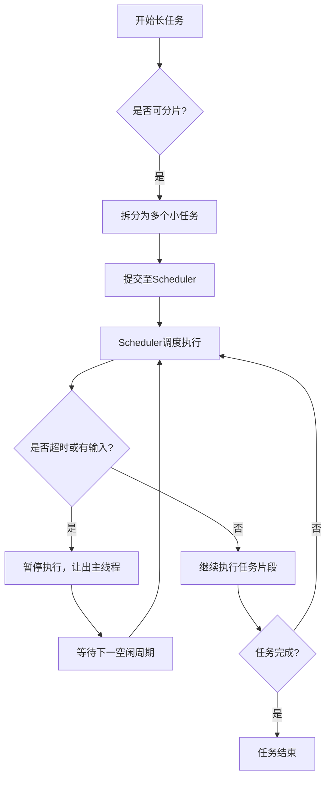
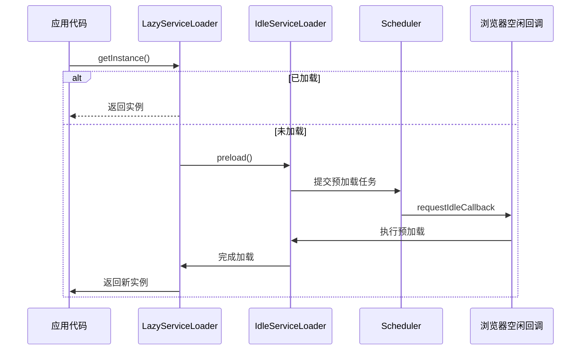
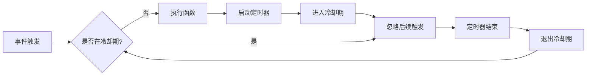
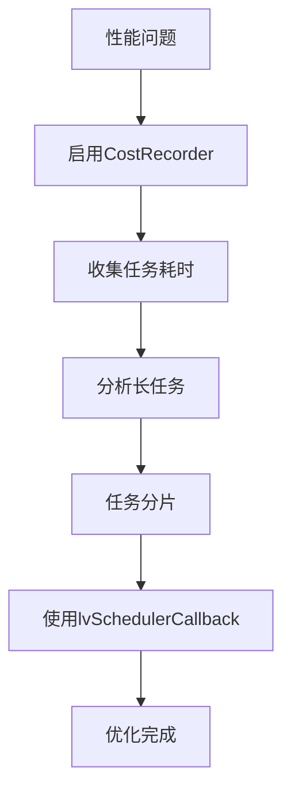

# 性能优化策略

<cite>
**本文档中引用的文件**
- [job-scheduler.ts](file://packages/h5-builder/src/bedrock/launch/job-scheduler.ts)
- [scheduler.ts](file://packages/h5-builder/src/bedrock/scheduler/core/scheduler.ts)
- [chunk-scheduler.ts](file://packages/h5-builder/src/bedrock/scheduler/core/chunk-scheduler.ts)
- [idle-callback-executor.ts](file://packages/h5-builder/src/bedrock/scheduler/executor/idle-callback-executor.ts)
- [lv-scheduler-callback.ts](file://packages/h5-builder/src/bedrock/scheduler/lv-scheduler-callback.ts)
- [debounce.ts](file://packages/h5-builder/src/bedrock/function/debounce.ts)
- [throttle.ts](file://packages/h5-builder/src/bedrock/function/throttle.ts)
- [idle-load.ts](file://packages/h5-builder/src/bedrock/di/lazy/idle-load.ts)
- [lazy-service.ts](file://packages/h5-builder/src/bedrock/di/lazy/lazy-service.ts)
</cite>

## 目录
1. [引言](#引言)
2. [任务分片机制](#任务分片机制)
3. [懒加载实现](#懒加载实现)
4. [防抖与节流应用](#防抖与节流应用)
5. [响应式系统优化](#响应式系统优化)
6. [性能监控与诊断](#性能监控与诊断)

## 引言
本文档系统性地介绍框架内支持高性能H5页面构建的核心优化技术。通过任务分片、懒加载、防抖节流等机制，开发者可以有效避免主线程阻塞，提升页面响应速度和用户体验。文档详细阐述了JobScheduler、idle-value、空闲回调调度等关键技术的实现原理与使用方式，并提供性能监控工具的集成建议。

## 任务分片机制

框架通过`JobScheduler`与`Scheduler`协同工作，将长任务分解为多个小任务片段，在浏览器空闲期间逐步执行，从而避免阻塞主线程。

`JobScheduler`负责管理不同阶段的任务注册与调度，允许开发者按阶段注册任务，并在适当时机触发准备和等待逻辑。任务的实际执行由底层`Scheduler`驱动，其基于优先级队列和时间切片机制进行调度。

`Scheduler`内部维护两个任务队列：等待执行队列和定时任务队列。它通过`requestHostCallback`机制结合`IdleCallbackExecutor`，在浏览器空闲时执行任务片段。当检测到输入待处理（`isInputPending`）或超过时间限制时，主动让出控制权，确保UI响应性。

**图示来源**
- [job-scheduler.ts](file://packages/h5-builder/src/bedrock/launch/job-scheduler.ts#L16-L122)
- [scheduler.ts](file://packages/h5-builder/src/bedrock/scheduler/core/scheduler.ts#L24-L174)

**本节来源**
- [job-scheduler.ts](file://packages/h5-builder/src/bedrock/launch/job-scheduler.ts#L1-L122)
- [scheduler.ts](file://packages/h5-builder/src/bedrock/scheduler/core/scheduler.ts#L1-L174)

## 懒加载实现

框架提供了基于依赖注入（DI）系统的懒加载机制，支持在空闲时间预加载服务模块，提升后续访问性能。

`LazyServiceLoader`是懒加载的核心抽象类，封装了模块的异步加载与实例化逻辑。通过`SharedMutex`保证多线程环境下的安全访问，避免重复加载。

`makeLazyServiceIdleLoad`函数用于创建一个在空闲时间自动预加载的服务包装器。它利用`lvSchedulerCallback`将预加载任务提交到调度系统，在浏览器空闲时执行，不影响关键路径性能。

`idle-load.ts`中的`IdleServiceLoader`实现了在空闲时间触发预加载的功能，确保非关键服务不会抢占主线程资源。

**图示来源**
- [lazy-service.ts](file://packages/h5-builder/src/bedrock/di/lazy/lazy-service.ts#L19-L72)
- [idle-load.ts](file://packages/h5-builder/src/bedrock/di/lazy/idle-load.ts#L7-L40)

**本节来源**
- [lazy-service.ts](file://packages/h5-builder/src/bedrock/di/lazy/lazy-service.ts#L1-L72)
- [idle-load.ts](file://packages/h5-builder/src/bedrock/di/lazy/idle-load.ts#L1-L40)

## 防抖与节流应用

框架提供了标准的防抖（debounce）和节流（throttle）工具函数，用于优化高频事件处理。

`debounce.ts`实现了完整的防抖逻辑，支持`leading`（首次立即执行）、`trailing`（末次执行）和`maxWait`（最大等待时间）配置。通过维护调用上下文、定时器和时间判断，确保函数在指定间隔内最多执行一次。

`throttle.ts`基于`debounce`实现节流功能，确保函数以固定频率执行，适用于滚动、窗口大小变化等场景。

**图示来源**
- [debounce.ts](file://packages/h5-builder/src/bedrock/function/debounce.ts#L108-L169)
- [throttle.ts](file://packages/h5-builder/src/bedrock/function/throttle.ts#L9-L27)

**本节来源**
- [debounce.ts](file://packages/h5-builder/src/bedrock/function/debounce.ts#L1-L169)
- [throttle.ts](file://packages/h5-builder/src/bedrock/function/throttle.ts#L1-L27)

## 响应式系统优化

虽然本框架未直接实现MobX核心响应式逻辑，但其设计原则支持高效的状态管理。建议开发者：

- 避免在计算属性中产生副作用
- 合理使用`useObserver`等响应式钩子，避免过度追踪
- 将复杂计算逻辑拆分为多个小任务，利用`lvSchedulerCallback`在空闲时间执行
- 对频繁更新的状态使用防抖或节流控制更新频率

## 性能监控与诊断

框架内置了`CostRecorder`组件，用于记录各任务在不同阶段的执行耗时。通过`JobScheduler.getCost()`可获取JSON格式的性能数据，便于分析瓶颈。

建议结合浏览器开发者工具的Performance面板进行综合诊断：

1. 使用`performance.mark()`和`performance.measure()`标记关键路径
2. 分析主线程任务分布，识别长任务
3. 利用`requestIdleCallback`优化非关键任务调度
4. 监控内存使用情况，防止泄漏

**本节来源**
- [cost-recorder.ts](file://packages/h5-builder/src/bedrock/launch/cost-recorder.ts#L1-L23)
- [lv-scheduler-callback.ts](file://packages/h5-builder/src/bedrock/scheduler/lv-scheduler-callback.ts#L1-L20)

## 结论

本文档全面介绍了框架提供的性能优化技术体系。通过任务分片、懒加载、防抖节流等手段，开发者能够构建出响应迅速、流畅的H5页面。建议在实际开发中结合性能监控工具持续优化，确保最佳用户体验。