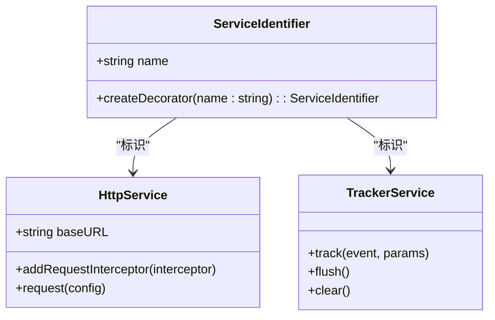
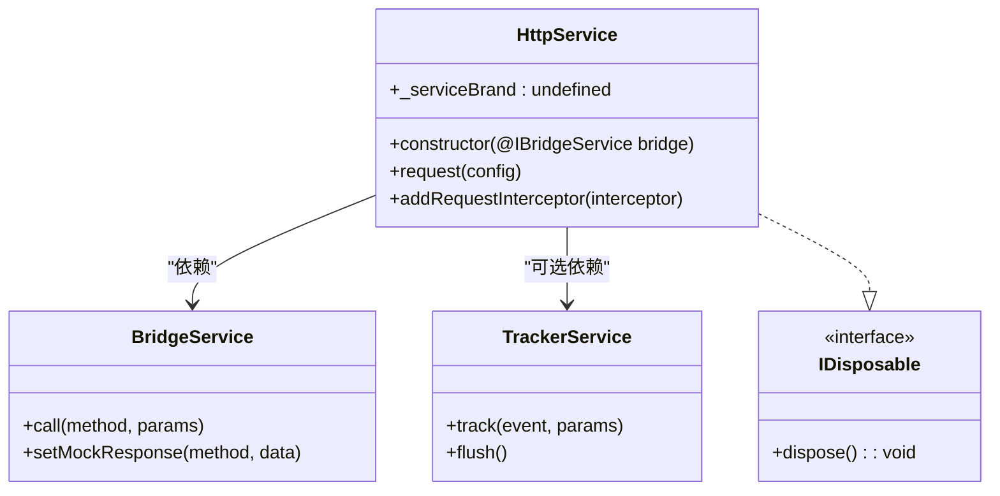
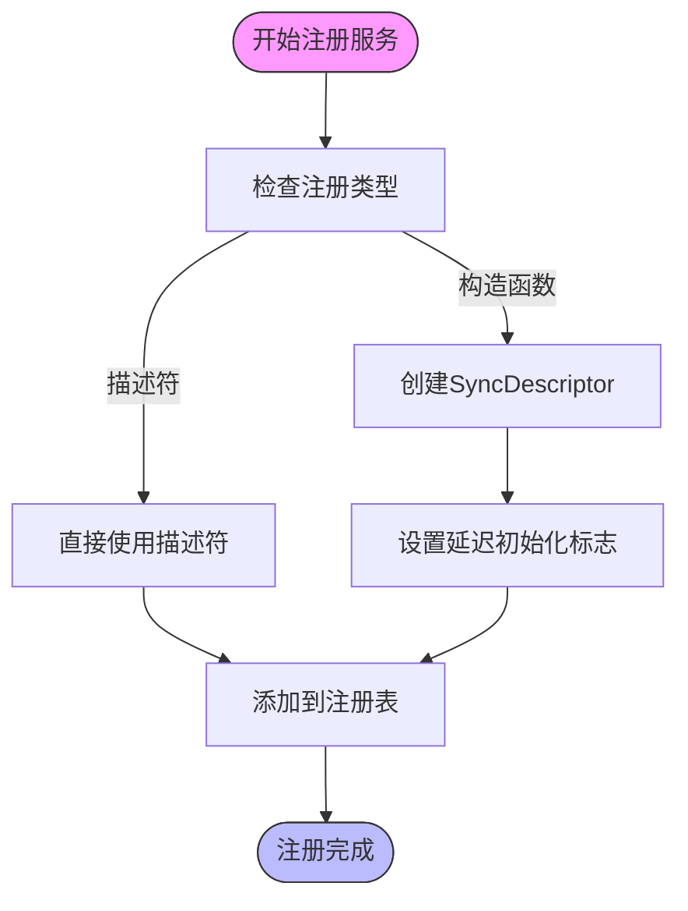
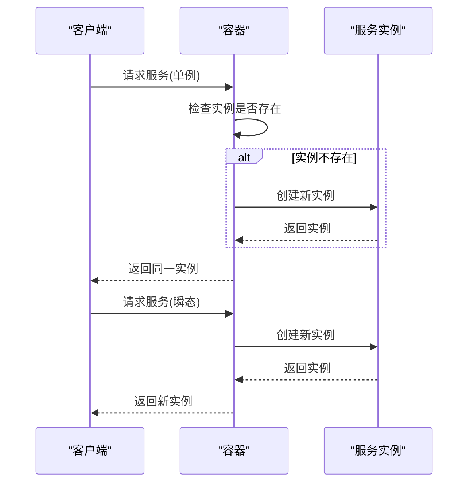
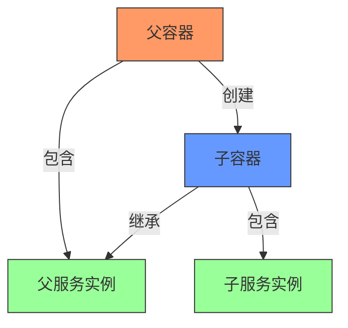
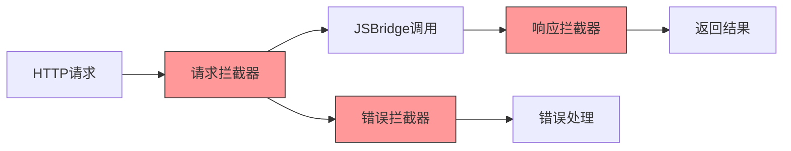
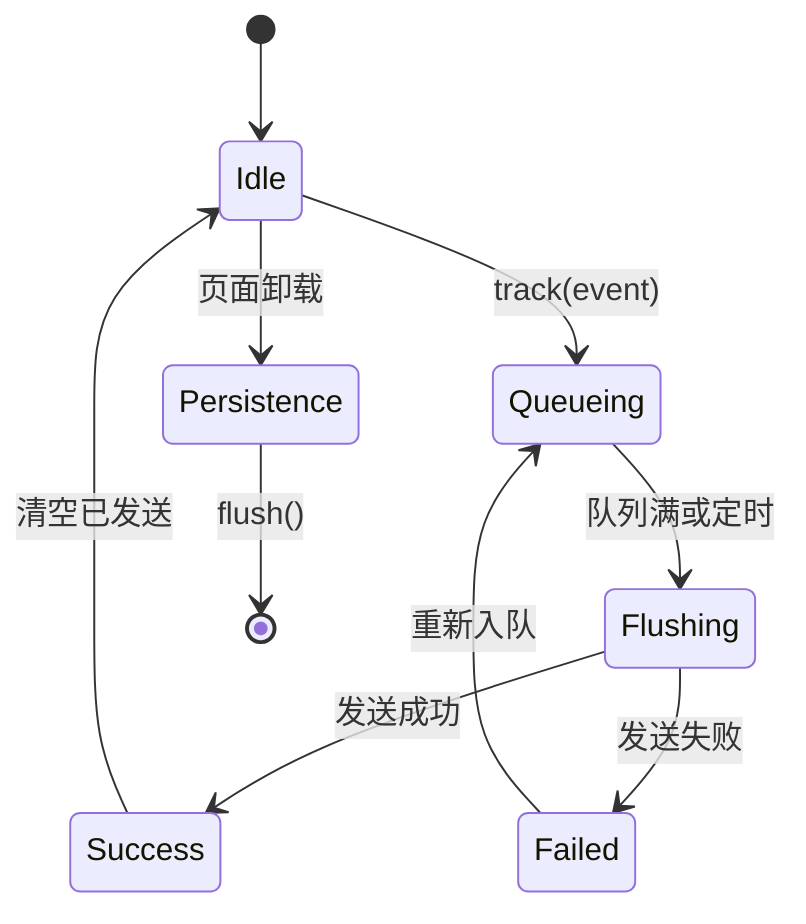
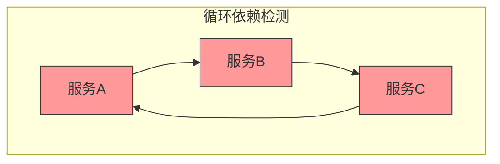

# 服务扩展与依赖注入

<cite>
**本文档引用的文件**
- [service-identifiers.ts](file://packages/h5-builder/src/services/service-identifiers.ts)
- [instantiation-service.ts](file://packages/h5-builder/src/bedrock/di/instantiation-service.ts)
- [service-collection.ts](file://packages/h5-builder/src/bedrock/di/service-collection.ts)
- [service-registry.ts](file://packages/h5-builder/src/bedrock/di/service-registry.ts)
- [descriptor.ts](file://packages/h5-builder/src/bedrock/di/descriptor.ts)
- [http.service.ts](file://packages/h5-builder/src/services/http.service.ts)
- [tracker.service.ts](file://packages/h5-builder/src/services/tracker.service.ts)
- [bridge.service.ts](file://packages/h5-builder/src/services/bridge.service.ts)
- [lazy-service.ts](file://packages/h5-builder/src/bedrock/di/lazy/lazy-service.ts)
- [context.web.tsx](file://packages/h5-builder/src/bedrock/di/context.web.tsx)
</cite>

## 目录
1. [引言](#引言)
2. [服务标识符定义规范](#服务标识符定义规范)
3. [自定义服务类创建与接口实现](#自定义服务类创建与接口实现)
4. [服务注册机制](#服务注册机制)
5. [服务作用域配置](#服务作用域配置)
6. [子容器服务继承与覆盖](#子容器服务继承与覆盖)
7. [实际应用示例](#实际应用示例)
8. [服务依赖解析调试](#服务依赖解析调试)
9. [常见问题规避策略](#常见问题规避策略)
10. [结论](#结论)

## 引言
本项目采用基于类反射的依赖注入（DI）系统，实现了服务的松耦合管理和灵活扩展。该系统通过服务标识符（Service Identifier）而非具体类引用进行服务注册和获取，支持即时注册和延迟加载等多种注册方式，并提供了完整的生命周期管理机制。本文档将深入讲解如何通过该依赖注入系统扩展框架服务。

**本节来源**
- [instantiation-service.ts](file://packages/h5-builder/src/bedrock/di/instantiation-service.ts#L1-L50)
- [service-identifiers.ts](file://packages/h5-builder/src/services/service-identifiers.ts#L1-L10)

## 服务标识符定义规范
服务标识符是依赖注入系统的核心概念，用于唯一标识一个服务。在本项目中，服务标识符通过`createDecorator`函数创建，遵循以下规范：

1. **命名约定**：所有服务标识符以大写字母"I"开头，后接服务名称，如`IHttpService`、`ITrackerService`。
2. **类型安全**：每个标识符都关联一个具体的类型，确保编译时类型检查。
3. **集中管理**：所有服务标识符统一在`service-identifiers.ts`文件中定义。

**图示来源**
- [service-identifiers.ts](file://packages/h5-builder/src/services/service-identifiers.ts#L14-L19)

**本节来源**
- [service-identifiers.ts](file://packages/h5-builder/src/services/service-identifiers.ts#L1-L20)

## 自定义服务类创建与接口实现
创建自定义服务类需要遵循特定的模式和接口规范。以`HttpService`为例，其创建过程包含以下关键要素：

1. **实现IDisposable接口**：确保服务可以被正确清理。
2. **使用服务标识符注入依赖**：通过`@IxxxService`装饰器注入其他服务。
3. **定义服务品牌**：使用`_serviceBrand`属性标记服务。

**图示来源**
- [http.service.ts](file://packages/h5-builder/src/services/http.service.ts#L56-L281)
- [bridge.service.ts](file://packages/h5-builder/src/services/bridge.service.ts#L39-L227)

**本节来源**
- [http.service.ts](file://packages/h5-builder/src/services/http.service.ts#L56-L281)
- [tracker.service.ts](file://packages/h5-builder/src/services/tracker.service.ts#L34-L290)

## 服务注册机制
服务注册支持多种方式，包括即时注册和延迟加载，满足不同场景的需求。

### 即时注册
通过`ServiceRegistry`类的`register`方法进行注册，服务在首次请求时立即创建。

### 延迟加载
支持通过`SyncDescriptor`的`supportsDelayedInstantiation`参数配置延迟初始化，服务在真正使用时才创建。

**图示来源**
- [service-registry.ts](file://packages/h5-builder/src/bedrock/di/service-registry.ts#L35-L65)
- [descriptor.ts](file://packages/h5-builder/src/bedrock/di/descriptor.ts#L8-L22)

**本节来源**
- [service-registry.ts](file://packages/h5-builder/src/bedrock/di/service-registry.ts#L1-L100)
- [descriptor.ts](file://packages/h5-builder/src/bedrock/di/descriptor.ts#L1-L32)

## 服务作用域配置
服务作用域决定了服务实例的生命周期和共享方式，支持Singleton（单例）和Transient（瞬态）两种模式。

### Singleton模式
同一容器内始终返回同一个实例，通过服务集合自动管理。

### Transient模式
每次请求都创建新实例，需要手动管理生命周期。

**图示来源**
- [instantiation-service.ts](file://packages/h5-builder/src/bedrock/di/instantiation-service.ts#L278-L288)
- [service-collection.ts](file://packages/h5-builder/src/bedrock/di/service-collection.ts#L35-L46)

**本节来源**
- [instantiation-service.ts](file://packages/h5-builder/src/bedrock/di/instantiation-service.ts#L61-L468)
- [service-collection.ts](file://packages/h5-builder/src/bedrock/di/service-collection.ts#L1-L47)

## 子容器服务继承与覆盖
依赖注入系统支持容器的层级结构，子容器可以继承父容器的服务，并可以选择性地覆盖特定服务。

### 继承机制
子容器通过构造函数接收父容器引用，形成父子关系链。

### 覆盖机制
子容器可以注册同名服务来覆盖父容器的实现。

**图示来源**
- [instantiation-service.ts](file://packages/h5-builder/src/bedrock/di/instantiation-service.ts#L112-L114)
- [instantiation-service.ts](file://packages/h5-builder/src/bedrock/di/instantiation-service.ts#L267-L275)

**本节来源**
- [instantiation-service.ts](file://packages/h5-builder/src/bedrock/di/instantiation-service.ts#L61-L468)

## 实际应用示例
以下通过具体示例展示如何扩展框架服务。

### HTTP拦截器注入
通过`HttpService`提供的拦截器机制，可以轻松扩展HTTP请求处理逻辑。

**图示来源**
- [http.service.ts](file://packages/h5-builder/src/services/http.service.ts#L56-L281)

### 自定义埋点处理器
通过`TrackerService`可以实现自定义的埋点处理逻辑，支持批量发送、持久化等功能。

**图示来源**
- [tracker.service.ts](file://packages/h5-builder/src/services/tracker.service.ts#L34-L290)

**本节来源**
- [http.service.ts](file://packages/h5-builder/src/services/http.service.ts#L56-L281)
- [tracker.service.ts](file://packages/h5-builder/src/services/tracker.service.ts#L34-L290)

## 服务依赖解析调试
系统提供了完善的依赖解析调试机制，帮助开发者诊断服务依赖问题。

### 循环依赖检测
通过依赖图（Graph）检测循环依赖，在开发阶段及时发现问题。

### 错误处理
统一的错误处理机制，将错误上报到顶层容器进行集中处理。

**图示来源**
- [instantiation-service.ts](file://packages/h5-builder/src/bedrock/di/instantiation-service.ts#L24-L29)
- [instantiation-service.ts](file://packages/h5-builder/src/bedrock/di/instantiation-service.ts#L320-L375)

**本节来源**
- [instantiation-service.ts](file://packages/h5-builder/src/bedrock/di/instantiation-service.ts#L1-L468)

## 常见问题规避策略
### 循环依赖规避
1. **重构服务职责**：将共同依赖提取到独立服务。
2. **使用延迟加载**：通过`supportsDelayedInstantiation`打破循环。
3. **依赖注入访问器**：使用`ServicesAccessor`在运行时获取依赖。

### 性能优化
1. **合理使用单例**：避免频繁创建高成本服务。
2. **延迟初始化**：对非关键服务启用延迟加载。
3. **服务作用域控制**：根据业务需求选择合适的容器层级。

**本节来源**
- [instantiation-service.ts](file://packages/h5-builder/src/bedrock/di/instantiation-service.ts#L297-L305)
- [lazy-service.ts](file://packages/h5-builder/src/bedrock/di/lazy/lazy-service.ts#L1-L72)

## 结论
本项目的依赖注入系统提供了一套完整的服务扩展机制，通过服务标识符、多种注册方式、灵活的作用域控制和层级容器结构，实现了高度可扩展和可维护的服务架构。开发者可以基于此系统轻松添加自定义服务，如HTTP拦截器、埋点处理器等，并通过完善的调试机制确保系统的稳定性和性能。