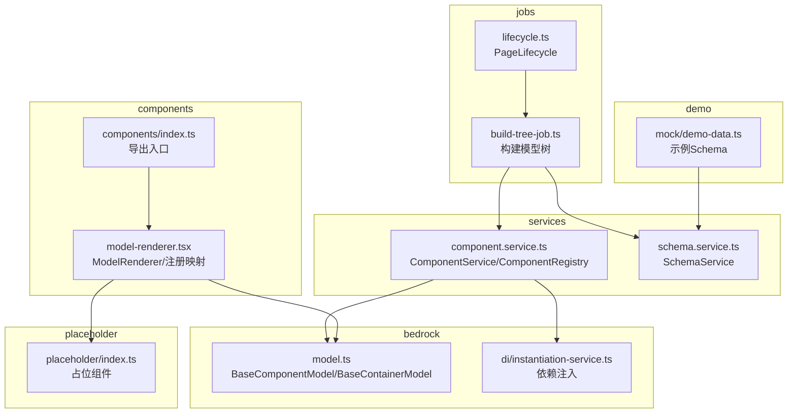
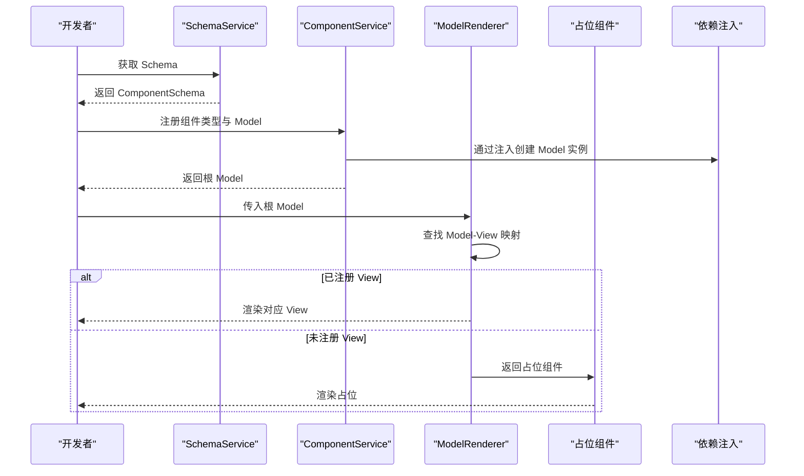
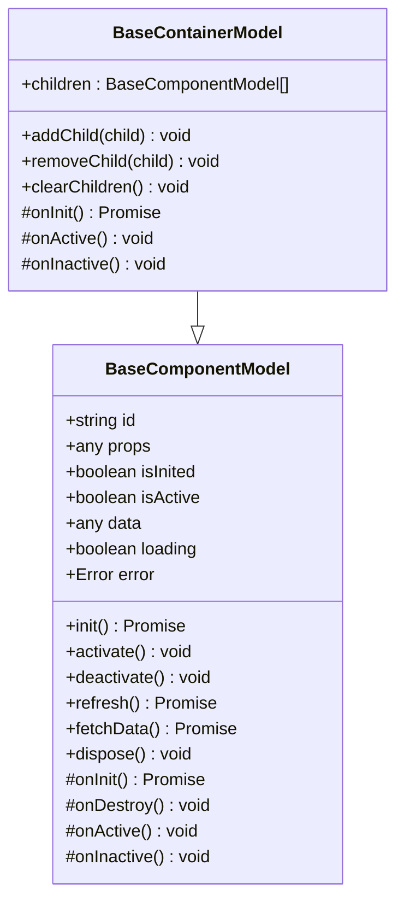
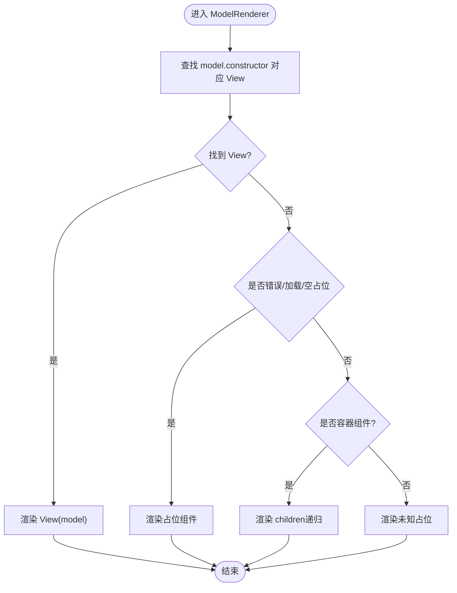
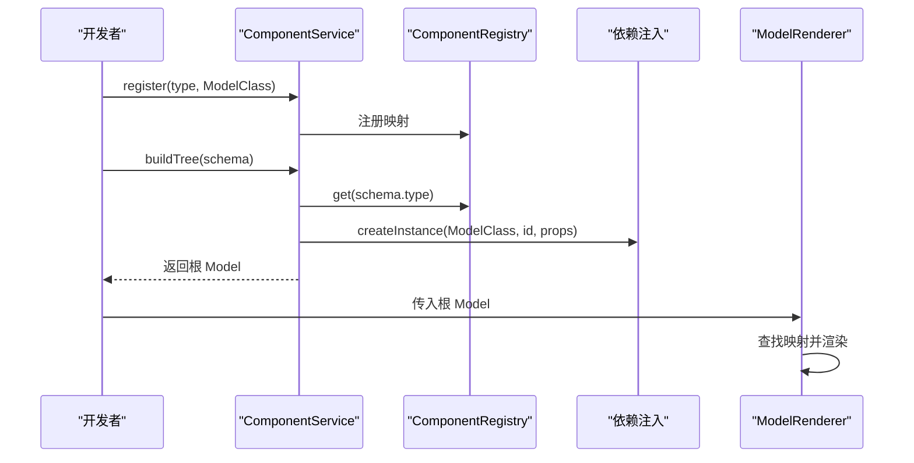
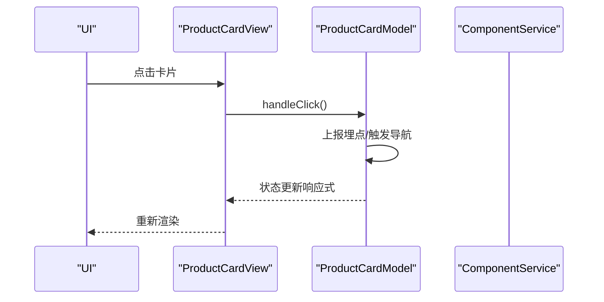
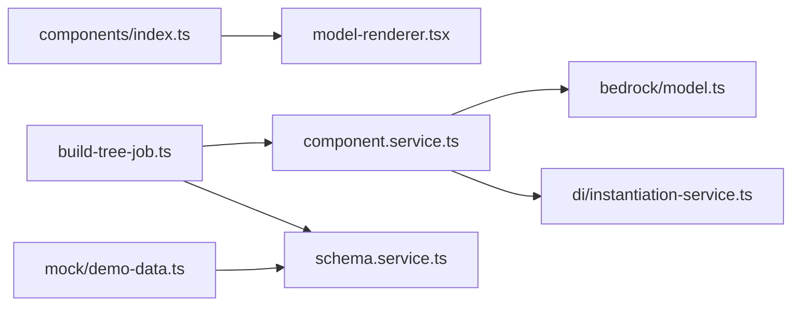

# 自定义组件开发

<cite>
**本文引用的文件**
- [packages/h5-builder/src/bedrock/model.ts](file://packages/h5-builder/src/bedrock/model.ts)
- [packages/h5-builder/src/components/model-renderer.tsx](file://packages/h5-builder/src/components/model-renderer.tsx)
- [packages/h5-builder/src/components/index.ts](file://packages/h5-builder/src/components/index.ts)
- [packages/h5-builder/src/services/component.service.ts](file://packages/h5-builder/src/services/component.service.ts)
- [packages/h5-builder/src/services/schema.service.ts](file://packages/h5-builder/src/services/schema.service.ts)
- [packages/h5-builder/src/jobs/build-tree-job.ts](file://packages/h5-builder/src/jobs/build-tree-job.ts)
- [packages/h5-builder/src/jobs/lifecycle.ts](file://packages/h5-builder/src/jobs/lifecycle.ts)
- [packages/h5-builder/src/placeholder/index.ts](file://packages/h5-builder/src/placeholder/index.ts)
- [packages/h5-builder/src/bedrock/di/instantiation-service.ts](file://packages/h5-builder/src/bedrock/di/instantiation-service.ts)
- [packages/h5-builder/src/bedrock/di/index.ts](file://packages/h5-builder/src/bedrock/di/index.ts)
- [packages/h5-builder/src/components/product-card/product-card.model.ts](file://packages/h5-builder/src/components/product-card/product-card.model.ts)
- [packages/h5-builder/src/components/product-card/product-card.view.tsx](file://packages/h5-builder/src/components/product-card/product-card.view.tsx)
- [packages/h5-builder/src/components/text-card/text-card.model.ts](file://packages/h5-builder/src/components/text-card/text-card.model.ts)
- [packages/h5-builder/src/components/text-card/text-card.view.tsx](file://packages/h5-builder/src/components/text-card/text-card.view.tsx)
- [packages/h5-builder/src/mock/demo-data.ts](file://packages/h5-builder/src/mock/demo-data.ts)
</cite>

## 目录
1. [简介](#简介)
2. [项目结构](#项目结构)
3. [核心组件](#核心组件)
4. [架构总览](#架构总览)
5. [详细组件分析](#详细组件分析)
6. [依赖关系分析](#依赖关系分析)
7. [性能考量](#性能考量)
8. [故障排查指南](#故障排查指南)
9. [结论](#结论)
10. [附录](#附录)

## 简介
本指南面向希望扩展框架组件库的开发者，系统讲解如何基于现有架构创建新的自定义组件。内容涵盖：
- 如何定义组件模型类，继承 BaseComponentModel 并实现必要的生命周期方法
- 如何实现组件视图（View），使用 React 函数组件进行 UI 渲染
- 模型与视图的分离原则，以及通过 ModelRenderer 进行组件渲染的机制
- 完整的开发流程：从定义组件类型、注册组件到在 Schema 中使用
- 常见错误与调试技巧，包括组件注册冲突、生命周期执行顺序等问题的解决方案

## 项目结构
该仓库采用“模型驱动 + 视图映射”的前端组件体系，核心模块包括：
- bedrock：通用基础设施（模型基类、依赖注入、工具等）
- components：内置组件与渲染器（含 ModelRenderer）
- services：组件服务（注册、构建、异步加载）、Schema 服务
- jobs：页面生命周期作业（获取 Schema、构建模型树等）

图表来源
- [packages/h5-builder/src/bedrock/model.ts](file://packages/h5-builder/src/bedrock/model.ts#L1-L243)
- [packages/h5-builder/src/components/model-renderer.tsx](file://packages/h5-builder/src/components/model-renderer.tsx#L1-L105)
- [packages/h5-builder/src/components/index.ts](file://packages/h5-builder/src/components/index.ts#L1-L14)
- [packages/h5-builder/src/services/component.service.ts](file://packages/h5-builder/src/services/component.service.ts#L1-L735)
- [packages/h5-builder/src/services/schema.service.ts](file://packages/h5-builder/src/services/schema.service.ts#L1-L37)
- [packages/h5-builder/src/jobs/build-tree-job.ts](file://packages/h5-builder/src/jobs/build-tree-job.ts#L1-L59)
- [packages/h5-builder/src/jobs/lifecycle.ts](file://packages/h5-builder/src/jobs/lifecycle.ts#L1-L18)
- [packages/h5-builder/src/placeholder/index.ts](file://packages/h5-builder/src/placeholder/index.ts#L1-L30)
- [packages/h5-builder/src/mock/demo-data.ts](file://packages/h5-builder/src/mock/demo-data.ts#L1-L334)

章节来源
- [packages/h5-builder/src/bedrock/model.ts](file://packages/h5-builder/src/bedrock/model.ts#L1-L243)
- [packages/h5-builder/src/components/model-renderer.tsx](file://packages/h5-builder/src/components/model-renderer.tsx#L1-L105)
- [packages/h5-builder/src/services/component.service.ts](file://packages/h5-builder/src/services/component.service.ts#L1-L735)

## 核心组件
- BaseComponentModel：所有组件 Model 的基类，提供响应式状态、生命周期钩子（init/activate/deactivate/refresh/fetchData）、资源清理等能力
- BaseContainerModel：容器组件基类，默认对子组件进行批量初始化、激活、停用
- ModelRenderer：根据 Model 类型查找并渲染对应的 View；若未注册则回退到占位组件或容器默认渲染
- ComponentService：组件注册与构建的核心服务，负责将 Schema 转为 Model 树，支持异步加载与并发控制
- ComponentRegistry：维护 type → ModelClass 的映射
- SchemaService：提供页面 Schema 的获取与响应式封装
- 占位组件：ErrorPlaceholderModel、LoadingPlaceholderModel、EmptyPlaceholderModel

章节来源
- [packages/h5-builder/src/bedrock/model.ts](file://packages/h5-builder/src/bedrock/model.ts#L1-L243)
- [packages/h5-builder/src/components/model-renderer.tsx](file://packages/h5-builder/src/components/model-renderer.tsx#L1-L105)
- [packages/h5-builder/src/services/component.service.ts](file://packages/h5-builder/src/services/component.service.ts#L1-L735)
- [packages/h5-builder/src/placeholder/index.ts](file://packages/h5-builder/src/placeholder/index.ts#L1-L30)

## 架构总览
下图展示从 Schema 到最终渲染的关键流程：SchemaService 提供 Schema，ComponentService 构建 Model 树，ModelRenderer 根据 Model 查找 View 并渲染，占位组件在异常情况下兜底。

图表来源
- [packages/h5-builder/src/services/schema.service.ts](file://packages/h5-builder/src/services/schema.service.ts#L1-L37)
- [packages/h5-builder/src/services/component.service.ts](file://packages/h5-builder/src/services/component.service.ts#L1-L735)
- [packages/h5-builder/src/components/model-renderer.tsx](file://packages/h5-builder/src/components/model-renderer.tsx#L1-L105)
- [packages/h5-builder/src/placeholder/index.ts](file://packages/h5-builder/src/placeholder/index.ts#L1-L30)
- [packages/h5-builder/src/bedrock/di/instantiation-service.ts](file://packages/h5-builder/src/bedrock/di/instantiation-service.ts#L1-L468)

## 详细组件分析

### 模型基类与生命周期
- 响应式状态：isInited、isActive、data、loading、error
- 生命周期钩子：
  - onInit：初始化逻辑（必须返回 Promise）
  - onDestroy：销毁清理
  - onActive/onInactive：激活/停用（容器默认对子组件批量处理）
- 数据刷新：refresh() 统一封装 loading/error 流程
- 资源清理：register() 注册 IDisposable 或清理函数，dispose() 自动调用 onDestroy 并释放资源

图表来源
- [packages/h5-builder/src/bedrock/model.ts](file://packages/h5-builder/src/bedrock/model.ts#L1-L243)

章节来源
- [packages/h5-builder/src/bedrock/model.ts](file://packages/h5-builder/src/bedrock/model.ts#L1-L243)

### 视图与 ModelRenderer
- 视图原则：纯 UI 组件，不包含业务逻辑；通过 props 接收 model，使用 observer 自动响应状态变化；交互通过调用 model 方法处理
- ModelRenderer：
  - 维护 Model-View 映射表，按 model.constructor 查找对应 View
  - 未找到映射时，优先返回占位组件（错误/加载/空状态）
  - 若为容器组件且未注册 View，则默认渲染子组件
  - 未知类型返回未知占位

图表来源
- [packages/h5-builder/src/components/model-renderer.tsx](file://packages/h5-builder/src/components/model-renderer.tsx#L1-L105)
- [packages/h5-builder/src/placeholder/index.ts](file://packages/h5-builder/src/placeholder/index.ts#L1-L30)

章节来源
- [packages/h5-builder/src/components/model-renderer.tsx](file://packages/h5-builder/src/components/model-renderer.tsx#L1-L105)
- [packages/h5-builder/src/placeholder/index.ts](file://packages/h5-builder/src/placeholder/index.ts#L1-L30)

### 组件注册与构建
- ComponentRegistry：维护 type → ModelClass 映射，支持批量注册与查询
- ComponentService：
  - buildTree：校验 Schema，创建 Model 实例，递归构建容器子树
  - 异步加载：preloadComponentsUnified 支持 Model/View 分离加载与并发控制，完成后统一建立 Model-View 映射
  - 错误兜底：未知类型或构建失败返回占位组件

图表来源
- [packages/h5-builder/src/services/component.service.ts](file://packages/h5-builder/src/services/component.service.ts#L1-L735)
- [packages/h5-builder/src/bedrock/di/instantiation-service.ts](file://packages/h5-builder/src/bedrock/di/instantiation-service.ts#L1-L468)

章节来源
- [packages/h5-builder/src/services/component.service.ts](file://packages/h5-builder/src/services/component.service.ts#L1-L735)
- [packages/h5-builder/src/bedrock/di/instantiation-service.ts](file://packages/h5-builder/src/bedrock/di/instantiation-service.ts#L1-L468)

### 示例：商品卡片组件
- Model：ProductCardModel 继承 BaseComponentModel，实现 onInit/refresh/fetchData，暴露计算属性与交互方法
- View：ProductCardView 使用 observer 包裹，按 loading/error/data 分支渲染，点击事件委托给 model.handleClick()

图表来源
- [packages/h5-builder/src/components/product-card/product-card.model.ts](file://packages/h5-builder/src/components/product-card/product-card.model.ts#L1-L133)
- [packages/h5-builder/src/components/product-card/product-card.view.tsx](file://packages/h5-builder/src/components/product-card/product-card.view.tsx#L1-L81)

章节来源
- [packages/h5-builder/src/components/product-card/product-card.model.ts](file://packages/h5-builder/src/components/product-card/product-card.model.ts#L1-L133)
- [packages/h5-builder/src/components/product-card/product-card.view.tsx](file://packages/h5-builder/src/components/product-card/product-card.view.tsx#L1-L81)

### 示例：文本卡片组件
- Model：TextCardModel 继承 BaseComponentModel，简单组件无需复杂初始化
- View：TextCardView 读取 props 与计算属性，按行数控制文本截断

章节来源
- [packages/h5-builder/src/components/text-card/text-card.model.ts](file://packages/h5-builder/src/components/text-card/text-card.model.ts#L1-L21)
- [packages/h5-builder/src/components/text-card/text-card.view.tsx](file://packages/h5-builder/src/components/text-card/text-card.view.tsx#L1-L32)

## 依赖关系分析
- 组件注册入口：components/index.ts 导出 ModelRenderer 与各组件，便于集中引入
- 依赖注入：InstantiationService 提供 createInstance/createChild/invokeFunction 等能力，支持服务依赖解析与循环依赖检测
- Schema 驱动：SchemaService 提供响应式 Schema，BuildTreeJob 在 Prepare 阶段构建模型树

图表来源
- [packages/h5-builder/src/components/index.ts](file://packages/h5-builder/src/components/index.ts#L1-L14)
- [packages/h5-builder/src/components/model-renderer.tsx](file://packages/h5-builder/src/components/model-renderer.tsx#L1-L105)
- [packages/h5-builder/src/services/component.service.ts](file://packages/h5-builder/src/services/component.service.ts#L1-L735)
- [packages/h5-builder/src/bedrock/di/instantiation-service.ts](file://packages/h5-builder/src/bedrock/di/instantiation-service.ts#L1-L468)
- [packages/h5-builder/src/services/schema.service.ts](file://packages/h5-builder/src/services/schema.service.ts#L1-L37)
- [packages/h5-builder/src/jobs/build-tree-job.ts](file://packages/h5-builder/src/jobs/build-tree-job.ts#L1-L59)
- [packages/h5-builder/src/mock/demo-data.ts](file://packages/h5-builder/src/mock/demo-data.ts#L1-L334)

章节来源
- [packages/h5-builder/src/components/index.ts](file://packages/h5-builder/src/components/index.ts#L1-L14)
- [packages/h5-builder/src/bedrock/di/instantiation-service.ts](file://packages/h5-builder/src/bedrock/di/instantiation-service.ts#L1-L468)

## 性能考量
- 异步加载与并发控制：ComponentService.preloadComponentsUnified 支持 Model/View 分离加载，统一队列并发调度，避免阻塞
- 占位组件：在加载失败或未知类型时返回轻量占位，减少渲染成本
- 容器默认行为：BaseContainerModel 对子组件批量初始化/激活/停用，避免重复逻辑
- 响应式更新：使用 mobx-vue-lite 的 observable，最小化重渲染范围

章节来源
- [packages/h5-builder/src/services/component.service.ts](file://packages/h5-builder/src/services/component.service.ts#L550-L735)
- [packages/h5-builder/src/bedrock/model.ts](file://packages/h5-builder/src/bedrock/model.ts#L1-L243)

## 故障排查指南
- 组件注册冲突
  - 现象：重复注册同 type 会被覆盖并打印警告
  - 处理：确保每个 type 唯一；如需替换，显式注销后重新注册
  - 参考路径：[packages/h5-builder/src/services/component.service.ts](file://packages/h5-builder/src/services/component.service.ts#L56-L87)
- 未知组件类型
  - 现象：buildTree 抛错或返回错误占位组件
  - 处理：确认 Schema.type 与注册的 type 一致；检查 register/registerAll 是否调用
  - 参考路径：[packages/h5-builder/src/services/component.service.ts](file://packages/h5-builder/src/services/component.service.ts#L161-L185)
- Schema 缺失字段
  - 现象：缺少 type/id 时抛错或返回错误占位
  - 处理：确保每个组件节点包含 type 与 id
  - 参考路径：[packages/h5-builder/src/services/component.service.ts](file://packages/h5-builder/src/services/component.service.ts#L211-L226)
- Model/View 未映射
  - 现象：ModelRenderer 无法找到对应 View，可能渲染容器默认子节点或未知占位
  - 处理：使用 registerModelView 建立映射；或为容器组件提供默认渲染
  - 参考路径：[packages/h5-builder/src/components/model-renderer.tsx](file://packages/h5-builder/src/components/model-renderer.tsx#L1-L105)
- 生命周期执行顺序
  - 现象：init/activate/deactivate 未按预期触发
  - 处理：确认容器子组件是否正确继承 BaseContainerModel；必要时覆写 onInit/onActive/onInactive 并调用 super
  - 参考路径：[packages/h5-builder/src/bedrock/model.ts](file://packages/h5-builder/src/bedrock/model.ts#L168-L242)
- 依赖注入错误
  - 现象：UnknownDependency/CyclicDependency 错误
  - 处理：检查构造函数注解的 Service 是否已注册；避免循环依赖
  - 参考路径：[packages/h5-builder/src/bedrock/di/instantiation-service.ts](file://packages/h5-builder/src/bedrock/di/instantiation-service.ts#L1-L468)

章节来源
- [packages/h5-builder/src/services/component.service.ts](file://packages/h5-builder/src/services/component.service.ts#L56-L87)
- [packages/h5-builder/src/services/component.service.ts](file://packages/h5-builder/src/services/component.service.ts#L161-L185)
- [packages/h5-builder/src/services/component.service.ts](file://packages/h5-builder/src/services/component.service.ts#L211-L226)
- [packages/h5-builder/src/components/model-renderer.tsx](file://packages/h5-builder/src/components/model-renderer.tsx#L1-L105)
- [packages/h5-builder/src/bedrock/model.ts](file://packages/h5-builder/src/bedrock/model.ts#L168-L242)
- [packages/h5-builder/src/bedrock/di/instantiation-service.ts](file://packages/h5-builder/src/bedrock/di/instantiation-service.ts#L1-L468)

## 结论
通过本指南，开发者可以：
- 明确模型与视图的职责边界，遵循响应式与生命周期最佳实践
- 使用 ComponentService 与 ModelRenderer 完成组件注册、构建与渲染
- 借助 Schema 驱动与异步加载机制，实现高性能、可维护的组件扩展

## 附录

### 从零到一：创建自定义组件的完整流程
- 定义组件类型与 Schema
  - 在 Schema 中新增组件节点，设置 type/id/props，必要时包含 children
  - 参考路径：[packages/h5-builder/src/mock/demo-data.ts](file://packages/h5-builder/src/mock/demo-data.ts#L1-L334)
- 定义 Model
  - 继承 BaseComponentModel，实现 onInit/refresh/fetchData 等
  - 可选：使用依赖注入（@IHttpService/@ITrackerService 等）
  - 参考路径：[packages/h5-builder/src/bedrock/model.ts](file://packages/h5-builder/src/bedrock/model.ts#L1-L243)
- 定义 View
  - 使用 observer 包裹 React 函数组件，按 loading/error/data 分支渲染
  - 交互通过调用 model 方法处理
  - 参考路径：[packages/h5-builder/src/components/product-card/product-card.view.tsx](file://packages/h5-builder/src/components/product-card/product-card.view.tsx#L1-L81)
- 注册组件
  - 同步注册：ComponentService.register(type, ModelClass)
  - 异步注册：ComponentService.registerAsync/ registerAsyncBatch
  - 建立映射：registerModelView(ModelClass, ViewComponent)
  - 参考路径：[packages/h5-builder/src/services/component.service.ts](file://packages/h5-builder/src/services/component.service.ts#L116-L129)
  - 参考路径：[packages/h5-builder/src/components/model-renderer.tsx](file://packages/h5-builder/src/components/model-renderer.tsx#L1-L105)
- 在 Schema 中使用
  - 确保 type 与注册一致；构建模型树后交由 ModelRenderer 渲染
  - 参考路径：[packages/h5-builder/src/services/schema.service.ts](file://packages/h5-builder/src/services/schema.service.ts#L1-L37)
  - 参考路径：[packages/h5-builder/src/jobs/build-tree-job.ts](file://packages/h5-builder/src/jobs/build-tree-job.ts#L1-L59)