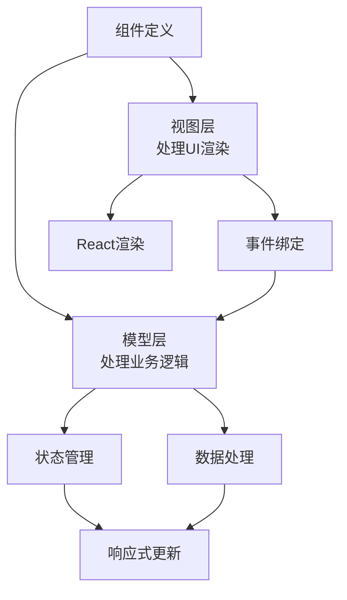
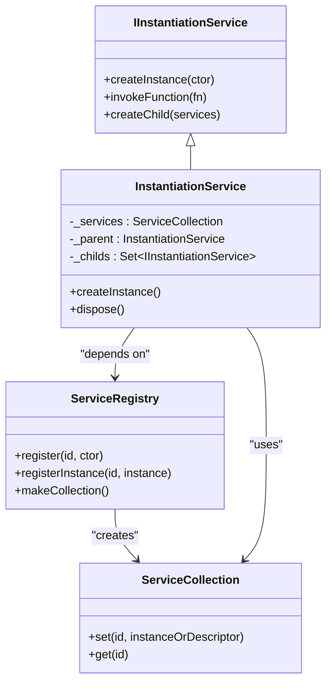
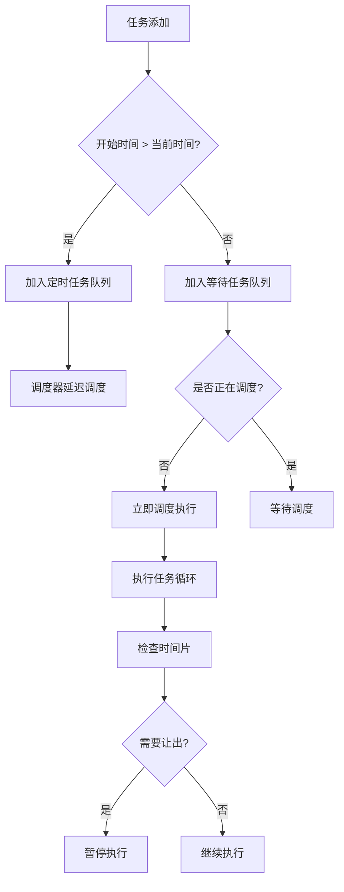
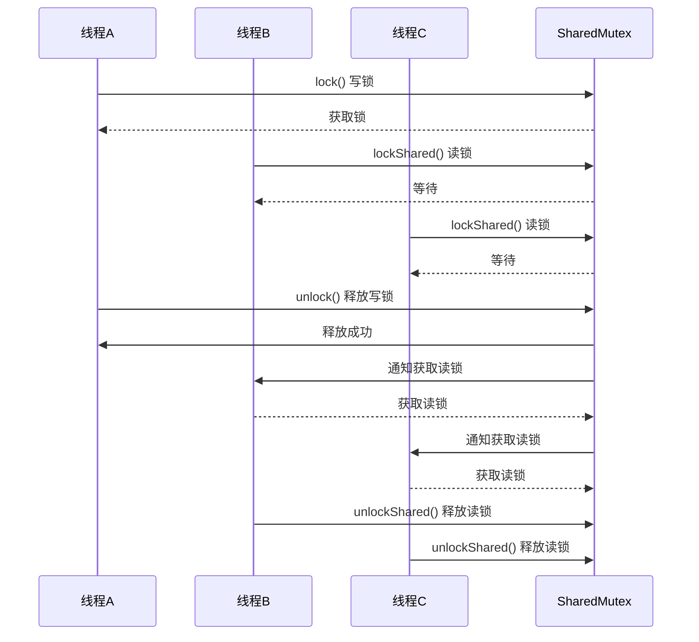
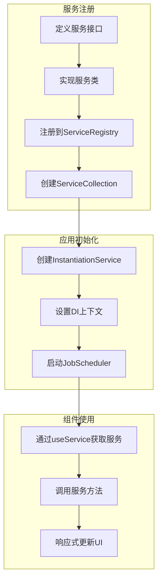

# 高级主题

<cite>
**本文档中引用的文件**   
- [shared-mutex.ts](file://packages/h5-builder/src/bedrock/lock/shared-mutex.ts)
- [instantiation-service.ts](file://packages/h5-builder/src/bedrock/di/instantiation-service.ts)
- [scheduler.ts](file://packages/h5-builder/src/bedrock/scheduler/core/scheduler.ts)
- [async-queue.ts](file://packages/h5-builder/src/bedrock/async/queue/queue.ts)
- [component.model.ts](file://packages/h5-builder/src/components/product-card/product-card.model.ts)
- [component.view.tsx](file://packages/h5-builder/src/components/product-card/product-card.view.tsx)
- [service-identifiers.ts](file://packages/h5-builder/src/services/service-identifiers.ts)
- [context.web.tsx](file://packages/h5-builder/src/bedrock/di/context.web.tsx)
- [demo-progressive.tsx](file://packages/h5-builder/src/demo-progressive.tsx)
- [get-schema-job.ts](file://packages/h5-builder/src/jobs/get-schema-job.ts)
</cite>

## 目录
1. [引言](#引言)
2. [组件模型与视图分离](#组件模型与视图分离)
3. [依赖注入与服务扩展](#依赖注入与服务扩展)
4. [性能优化策略](#性能优化策略)
5. [并发控制与锁机制](#并发控制与锁机制)
6. [框架扩展完整示例](#框架扩展完整示例)
7. [调试技巧与常见陷阱](#调试技巧与常见陷阱)
8. [结论](#结论)

## 引言

本高级主题文档面向有经验的开发者，深入探讨框架的高级用法。文档涵盖自定义组件开发的最佳实践、依赖注入系统的扩展模式、性能优化策略、并发控制机制以及框架扩展的完整示例。通过本指南，开发者将掌握如何构建可维护、高性能且可扩展的应用程序架构。

## 组件模型与视图分离

框架采用组件模型与视图分离的设计模式，将业务逻辑与UI渲染解耦。每个组件由独立的模型文件（.model.ts）和视图文件（.view.tsx）组成，通过清晰的职责划分提高代码可维护性。

**图示来源**
- [product-card.model.ts](file://packages/h5-builder/src/components/product-card/product-card.model.ts#L1-L50)
- [product-card.view.tsx](file://packages/h5-builder/src/components/product-card/product-card.view.tsx#L1-L40)

**本节来源**
- [product-card.model.ts](file://packages/h5-builder/src/components/product-card/product-card.model.ts#L1-L100)
- [product-card.view.tsx](file://packages/h5-builder/src/components/product-card/product-card.view.tsx#L1-L80)

## 依赖注入与服务扩展

框架提供强大的依赖注入（DI）容器系统，支持服务的注册、注入和生命周期管理。通过服务标识符（ServiceIdentifier）和构造函数注入，实现松耦合的组件通信。

**图示来源**
- [instantiation-service.ts](file://packages/h5-builder/src/bedrock/di/instantiation-service.ts#L61-L468)
- [service-registry.ts](file://packages/h5-builder/src/bedrock/di/service-registry.ts#L16-L100)

**本节来源**
- [instantiation-service.ts](file://packages/h5-builder/src/bedrock/di/instantiation-service.ts#L1-L468)
- [service-identifiers.ts](file://packages/h5-builder/src/services/service-identifiers.ts#L1-L20)
- [context.web.tsx](file://packages/h5-builder/src/bedrock/di/context.web.tsx#L1-L41)

## 性能优化策略

框架提供多种性能优化机制，包括懒加载、任务分片和响应式优化，确保应用在复杂场景下的流畅运行。

### 懒加载与延迟实例化

通过`SyncDescriptor`的`supportsDelayedInstantiation`参数，实现服务的延迟实例化，减少启动时的资源消耗。

### 任务分片与调度

基于调度器（Scheduler）和任务队列（TaskQueue）实现任务分片，将长时间运行的任务分解为多个小任务，在空闲时间片中执行。

**图示来源**
- [scheduler.ts](file://packages/h5-builder/src/bedrock/scheduler/core/scheduler.ts#L24-L174)
- [task.ts](file://packages/h5-builder/src/bedrock/scheduler/core/task.ts#L4-L53)

### 响应式优化

利用`IdleValue`和`useService`等机制，在适当的时机创建和获取服务实例，避免不必要的计算和渲染。

**本节来源**
- [scheduler.ts](file://packages/h5-builder/src/bedrock/scheduler/core/scheduler.ts#L1-L174)
- [idle-value.ts](file://packages/h5-builder/src/bedrock/di/lazy/idle-value.ts#L1-L30)
- [queue.ts](file://packages/h5-builder/src/bedrock/async/queue/queue.ts#L13-L57)

## 并发控制与锁机制

框架提供`SharedMutex`读写锁机制，用于控制多线程环境下的资源访问，确保数据一致性。

### SharedMutex 核心特性

- 写写互斥、读写互斥，读读可重入
- 写者优先于读者
- 写者唤醒顺序按调用顺序

**图示来源**
- [shared-mutex.ts](file://packages/h5-builder/src/bedrock/lock/shared-mutex.ts#L48-L243)
- [capability.ts](file://packages/h5-builder/src/bedrock/lock/capability.ts#L23-L89)

**本节来源**
- [shared-mutex.ts](file://packages/h5-builder/src/bedrock/lock/shared-mutex.ts#L1-L243)
- [semaphore.ts](file://packages/h5-builder/src/bedrock/lock/semaphore.ts#L1-L25)

## 框架扩展完整示例

通过一个完整的示例展示如何扩展框架功能，包括自定义服务的注册、依赖注入和使用。

**图示来源**
- [demo-progressive.tsx](file://packages/h5-builder/src/demo-progressive.tsx#L24-L73)
- [get-schema-job.ts](file://packages/h5-builder/src/jobs/get-schema-job.ts#L13-L46)

**本节来源**
- [demo-progressive.tsx](file://packages/h5-builder/src/demo-progressive.tsx#L1-L73)
- [get-schema-job.ts](file://packages/h5-builder/src/jobs/get-schema-job.ts#L1-L46)
- [job-scheduler.ts](file://packages/h5-builder/src/bedrock/launch/job-scheduler.ts#L1-L35)

## 调试技巧与常见陷阱

### 常见陷阱规避

1. **循环依赖**：避免服务之间的循环依赖，使用`_handleError`机制捕获并处理
2. **内存泄漏**：确保可释放资源（Disposable）正确释放，利用`dispose()`方法
3. **异步竞态**：使用`Barrier`机制同步异步操作，确保执行顺序

### 调试技巧

1. **启用追踪**：通过`_enableTracing`参数开启服务创建追踪，分析依赖关系
2. **错误监听**：订阅`onError`事件，捕获服务实例化过程中的错误
3. **性能分析**：利用调度器的`shouldYieldToHost`机制，分析任务执行性能

**本节来源**
- [instantiation-service.ts](file://packages/h5-builder/src/bedrock/di/instantiation-service.ts#L24-L468)
- [barrier.ts](file://packages/h5-builder/src/bedrock/async/barrier.ts#L11-L59)
- [disposable-store.ts](file://packages/h5-builder/src/bedrock/dispose/disposable-store.ts#L1-L25)

## 结论

本文档深入探讨了框架的高级主题，涵盖了组件模型与视图分离、依赖注入系统、性能优化策略、并发控制机制以及框架扩展的完整实践。通过掌握这些高级用法，开发者能够构建更加健壮、高效和可维护的应用程序。建议在实际项目中逐步应用这些最佳实践，并根据具体需求进行适当调整和优化。