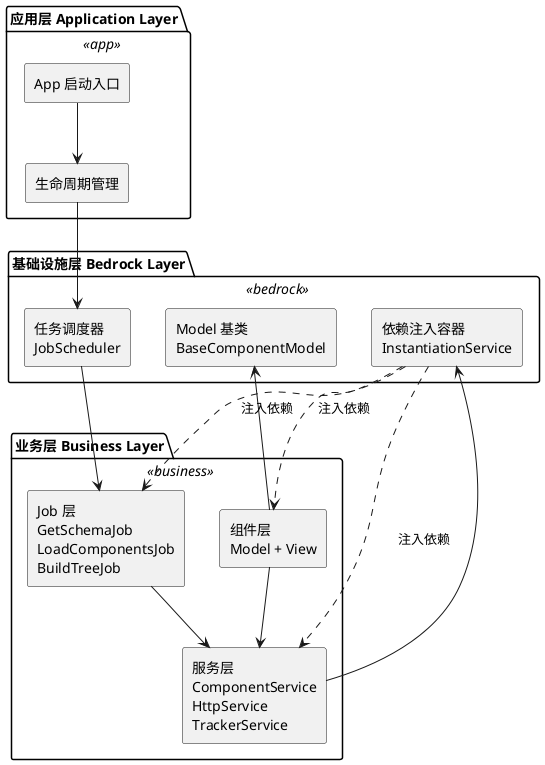
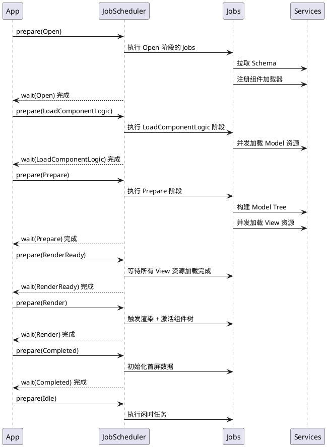
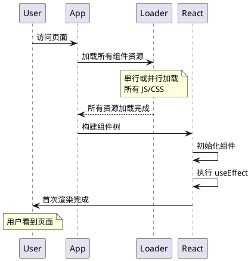
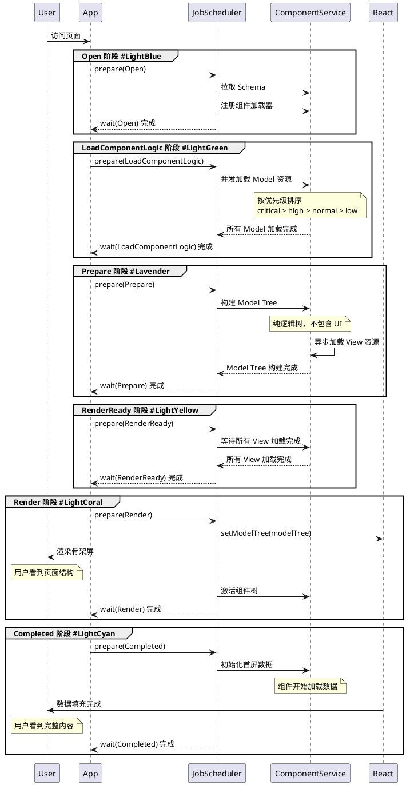

# H5-Builder 新架构设计评审文档

> **项目定位**: 电商搭建场景下的移动端落地页框架  
> **架构目标**: 基于依赖注入、生命周期驱动、逻辑视图分离的现代化前端架构

---

## 📋 目录

1. [架构概览](#架构概览)
2. [核心设计思想](#核心设计思想)
3. [关键技术实现](#关键技术实现)
4. [开发指南](#开发指南)
5. [架构优势对比](#架构优势对比)
6. [常见问题解答](#常见问题解答)

---

## 架构概览

### 整体架构图



### 目录结构

```
h5-builder/
├── src/
│   ├── bedrock/              # 基础设施层（参考 VSCode 架构）
│   │   ├── di/              # 依赖注入系统
│   │   │   ├── instantiation-service.ts    # DI 容器核心实现
│   │   │   ├── base.ts                     # Service 标识符和装饰器
│   │   │   └── descriptor.ts               # 服务描述符
│   │   ├── launch/          # 启动和调度系统
│   │   │   ├── job-scheduler.ts            # Job 调度器
│   │   │   └── abstract-job.ts             # Job 抽象基类
│   │   ├── async/           # 异步工具（Barrier、Queue 等）
│   │   ├── event/           # 事件系统
│   │   ├── dispose/         # 资源管理
│   │   └── model.ts         # Model 基类
│   ├── services/            # 服务层
│   │   ├── component.service.ts    # 组件注册、加载、构建
│   │   ├── http.service.ts         # HTTP 请求
│   │   ├── tracker.service.ts      # 埋点上报
│   │   └── service-identifiers.ts  # 服务标识符定义
│   ├── jobs/                # 任务层（生命周期驱动）
│   │   ├── lifecycle.ts            # 生命周期枚举
│   │   ├── get-schema-job.ts       # 获取 Schema
│   │   ├── load-components-job.ts  # 加载组件资源
│   │   ├── build-tree-job.ts       # 构建模型树
│   │   └── activate-tree-job.ts    # 激活组件树
│   └── components/          # 组件层（Model + View 分离）
│       ├── product-card/
│       │   ├── product-card.model.ts    # 业务逻辑
│       │   └── product-card.view.tsx    # UI 渲染
│       └── tabs-container/
│           ├── tabs-container.model.ts
│           └── tabs-container.view.tsx
```

---

## 核心设计思想

### 1. 依赖注入（Dependency Injection）

> **灵感来源**: VSCode 的 DI 系统  
> **核心价值**: 解耦、可测试、可扩展

#### 1.1 为什么需要 DI？

传统前端开发中，模块之间的依赖关系通常是硬编码的：

```typescript
// ❌ 传统方式：硬编码依赖
class ProductCard {
  private http = new HttpService();  // 直接 new，强耦合
  private tracker = new TrackerService();
  
  async loadData() {
    const data = await this.http.get('/api/product');
    this.tracker.track('PRODUCT_LOADED');
  }
}
```

**问题**:
- **强耦合**: `ProductCard` 直接依赖具体实现，难以替换
- **难以测试**: 无法 mock `HttpService`，必须发起真实请求
- **配置困难**: 无法统一管理服务实例（如共享 HTTP 配置）

#### 1.2 DI 如何解决？

```typescript
// ✅ DI 方式：依赖注入
class ProductCardModel {
  constructor(
    id: string,
    props: ProductCardProps,
    @IHttpService private http: HttpService,      // 通过装饰器声明依赖
    @ITrackerService private tracker: TrackerService
  ) {
    super(id, props);
  }
  
  async loadData() {
    const data = await this.http.get('/api/product');
    this.tracker.track('PRODUCT_LOADED');
  }
}
```

**优势**:
- **解耦**: `ProductCardModel` 只依赖接口（`IHttpService`），不关心具体实现
- **可测试**: 测试时可以注入 Mock 服务
- **统一配置**: 所有服务由 DI 容器统一管理和配置

#### 1.3 DI 系统核心概念

##### Service Identifier（服务标识符）

```typescript
// 定义服务标识符
export const IHttpService = createDecorator<HttpService>('httpService');
export const ITrackerService = createDecorator<TrackerService>('trackerService');
```

- 本质是**参数装饰器**，用于标记构造函数的依赖
- 编译时记录依赖关系到构造函数的元数据中

##### Service Registration（服务注册）

```typescript
// 注册服务到 DI 容器
const registry = new ServiceRegistry();
registry.register(IHttpService, new SyncDescriptor(HttpService, [
  { baseURL: 'https://api.example.com' }  // 静态参数
]));
registry.register(ITrackerService, TrackerService);  // 无参数
```

- 使用 `SyncDescriptor` 描述如何创建服务实例
- 支持传递静态参数（如配置对象）

##### Service Instantiation（服务实例化）

```typescript
const instantiationService = new InstantiationService(registry.makeCollection());

// 自动解析依赖并创建实例
const productCard = instantiationService.createInstance(
  ProductCardModel,
  'product-1',
  { productId: 123 }
);
```

**DI 容器会自动**:
1. 分析 `ProductCardModel` 的依赖（`IHttpService`、`ITrackerService`）
2. 递归创建依赖的服务实例
3. 注入到构造函数中
4. 返回完整的 `ProductCardModel` 实例

#### 1.4 高级特性

##### 延迟实例化（Lazy Instantiation）

```typescript
// 服务只有在真正使用时才会被创建
registry.register(IExpensiveService, new SyncDescriptor(
  ExpensiveService,
  [],
  true  // supportsDelayedInstantiation = true
));
```

- 使用 `IdleValue` + `Proxy` 实现
- 首次访问服务属性时才触发实例化
- 优化启动性能

##### 子容器（Child Container）

```typescript
// 创建子容器，继承父容器的服务
const childContainer = instantiationService.createChild(new ServiceCollection());
childContainer.services.set(ILocalService, LocalService);
```

- 子容器可以覆盖父容器的服务
- 销毁子容器时自动清理资源
- 适用于模块化场景

##### 循环依赖检测

```typescript
// DI 容器会自动检测循环依赖并抛出错误
class ServiceA {
  constructor(@IServiceB b: ServiceB) {}
}
class ServiceB {
  constructor(@IServiceA a: ServiceA) {}  // ❌ 循环依赖！
}
```

---

### 2. 生命周期驱动（Lifecycle-Driven）

> **核心思想**: 应用启动不是一次性的，而是分阶段渐进式完成

#### 2.1 生命周期阶段定义

```typescript
export enum PageLifecycle {
  Open = "页面打开，正在拉取 schema 中...",
  LoadComponentLogic = "加载组件逻辑 Model JS 资源中...",
  Prepare = "构建模型树、同时登台组件视图加载中...",
  RenderReady = "模型树和视图资源全部准备完成",
  Render = "启动渲染",
  Completed = "首屏视图数据填充中...",
  Idle = "处于空闲阶段",
}
```

#### 2.2 生命周期驱动流程



#### 2.3 Job 调度器（JobScheduler）

```typescript
class JobScheduler<T, K extends T = T> {
  // 注册 Job 到指定生命周期阶段
  registerJob<Ctor extends new (...args: any[]) => AbstractJob<T, K>>(
    phase: K,
    ctor: Ctor,
    ...args: GetLeadingNonServiceArgs<ConstructorParameters<Ctor>>
  ): void;
  
  // 准备阶段：实例化 Job 并执行 prepare
  prepare(phase: K): boolean;
  
  // 等待阶段：等待所有 Job 完成
  async wait(phase: K): Promise<void>;
  
  // 推进到下一阶段
  advanceToPhase(phase: K): void;
}
```

**关键特性**:
- **按需实例化**: Job 只在对应阶段才被创建（节省内存）
- **并发执行**: 同一阶段的多个 Job 并发执行
- **阻塞控制**: 通过 `Barrier` 实现阶段间的同步

#### 2.4 Job 抽象基类

```typescript
abstract class AbstractJob<T, K extends T = T> {
  protected abstract _name: string;
  protected _store: Map<K, Barrier[]> = new Map();
  
  // 判断是否需要等待
  shouldWait(phase: K): boolean;
  
  // 等待异步任务完成
  wait(phase: K): Promise<void>;
  
  // 准备阶段：执行任务
  prepare(phase: K): void;
  
  // 子类实现：具体的阶段逻辑
  protected abstract _executePhase(phase: K): void;
}
```

**示例：GetSchemaJob**

```typescript
class GetSchemaJob extends AbstractJob<PageLifecycle> {
  protected _name = 'GetSchema';
  private _schemaBarrier = new Barrier();
  
  protected async _executePhase(phase: PageLifecycle) {
    switch (phase) {
      case PageLifecycle.Open:
        this._setBarrier(PageLifecycle.Open, this._schemaBarrier);
        
        // 1. 拉取 Schema
        const schema = await this.schemaService.fetchSchema();
        
        // 2. 注册组件加载器
        this._registerComponentLoader();
        
        // 3. 开始预加载组件
        this.componentService.preloadComponentsUnified(schema);
        
        // 4. 打开 Barrier，允许进入下一阶段
        this._schemaBarrier.open();
        break;
    }
  }
}
```

---

### 3. Model-View 分离

> **核心原则**: 业务逻辑与 UI 渲染完全解耦

#### 3.1 为什么要分离？

传统 React 组件常常混合了逻辑和 UI：

```typescript
// ❌ 传统方式：逻辑和 UI 混在一起
function ProductCard({ productId }: Props) {
  const [data, setData] = useState(null);
  const [loading, setLoading] = useState(false);
  
  useEffect(() => {
    setLoading(true);
    fetch(`/api/product/${productId}`)
      .then(res => res.json())
      .then(setData)
      .finally(() => setLoading(false));
  }, [productId]);
  
  const handleClick = () => {
    track('PRODUCT_CLICK', { productId });
  };
  
  if (loading) return <div>加载中...</div>;
  return <div onClick={handleClick}>{data?.name}</div>;
}
```

**问题**:
- **难以测试**: 逻辑和 UI 耦合，无法单独测试业务逻辑
- **难以复用**: 逻辑绑定在组件中，无法在其他场景复用
- **难以维护**: 组件体积膨胀，职责不清晰

#### 3.2 Model-View 分离方案

```typescript
// ✅ Model: 纯业务逻辑
class ProductCardModel extends BaseComponentModel<ProductCardProps> {
  // 响应式状态（mobx-vue-lite）
  data: ProductData | null = null;
  loading = false;
  error: Error | null = null;
  
  constructor(
    id: string,
    props: ProductCardProps,
    @IHttpService private http: HttpService,
    @ITrackerService private tracker: TrackerService
  ) {
    super(id, props);
  }
  
  // 生命周期：初始化
  protected async onInit(): Promise<void> {
    await this.refresh();
  }
  
  // 生命周期：激活
  protected onActive(): void {
    this.tracker.track('PRODUCT_EXPOSURE', {
      productId: this.data?.id
    });
  }
  
  // 业务方法：加载数据
  async fetchData(): Promise<void> {
    const data = await this.http.get(`/api/product/${this.props.productId}`);
    this.data = data;
  }
  
  // 业务方法：点击事件
  handleClick(): void {
    this.tracker.track('PRODUCT_CLICK', { productId: this.data?.id });
  }
  
  // 计算属性
  get formattedPrice(): string {
    return `¥${this.data?.price.toFixed(2)}`;
  }
}
```

```typescript
// ✅ View: 纯 UI 渲染
export const ProductCardView: React.FC<{ model: ProductCardModel }> = observer(({ model }) => {
  if (model.loading) {
    return <div className="loading">加载中...</div>;
  }
  
  if (model.error) {
    return <div className="error">{model.error.message}</div>;
  }
  
  return (
    <div className="product-card" onClick={() => model.handleClick()}>
      
      <h3>{model.data?.name}</h3>
      <div className="price">{model.formattedPrice}</div>
    </div>
  );
});
```

**优势**:
- **可测试**: Model 可以独立测试，无需渲染 UI
- **可复用**: Model 可以在不同 UI 框架中复用（React、Vue、小程序）
- **职责清晰**: Model 负责逻辑，View 负责渲染

#### 3.3 响应式状态管理

使用 `mobx-vue-lite`（基于 Vue 3 响应式系统的 MobX 实现）：

```typescript
import { observable } from 'mobx-vue-lite';

class BaseComponentModel {
  constructor(public id: string, public props: P) {
    // 使整个对象响应式
    return observable(this) as this;
  }
}
```

- **自动追踪**: View 中访问的 Model 属性会被自动追踪
- **精确更新**: 只有依赖的属性变化时才重新渲染
- **无需手动优化**: 不需要 `useMemo`、`useCallback`

---

### 4. 渐进式渲染（Progressive Rendering）

> **核心思想**: 优先构建逻辑树，视图资源异步加载，渲染不阻塞

#### 4.1 传统渲染 vs 渐进式渲染

##### 传统渲染流程



**传统渲染的性能优化手段**：

1. **代码分割（Code Splitting）**
```typescript
// ✅ 可以做：按路由分割
const ProductPage = lazy(() => import('./ProductPage'));

// ❌ 难以做：组件级别的细粒度分割
// 问题：组件间依赖复杂，难以确定分割边界
const ProductCard = lazy(() => import('./ProductCard'));
const ProductList = lazy(() => import('./ProductList'));
// 如果 ProductList 依赖 ProductCard，会导致瀑布式加载
```

2. **预加载（Preload）**
```typescript
// ✅ 可以做：预加载关键资源
<link rel="preload" href="/critical.js" as="script" />

// ❌ 难以做：动态预加载策略
// 问题：无法根据用户行为动态调整预加载优先级
// 例如：用户滚动到某个区域才预加载该区域的组件
```

3. **骨架屏（Skeleton）**
```typescript
// ✅ 可以做：静态骨架屏
function ProductList() {
  const [loading, setLoading] = useState(true);
  
  if (loading) {
    return <Skeleton />;  // 静态骨架屏
  }
  return <div>{/* 真实内容 */}</div>;
}

// ❌ 难以做：渐进式骨架屏
// 问题：无法做到"部分组件已加载，部分组件还在加载"
// 要么全部 Loading，要么全部显示
```

**传统渲染的核心问题**：

| 问题 | 原因 | 影响 |
|------|------|------|
| **全量加载阻塞** | 必须等待所有组件资源加载完成 | 首屏时间长，白屏时间长 |
| **无法细粒度控制** | 组件粒度的加载优先级难以控制 | 关键组件和非关键组件同等对待 |
| **优化成本高** | 需要手动管理 lazy、Suspense、预加载 | 代码复杂度高，维护困难 |
| **无法动态调整** | 加载策略在构建时确定 | 无法根据运行时情况优化 |

---

##### 渐进式渲染流程



**渐进式渲染的优势**：

| 优势 | 实现方式 | 效果 |
|------|---------|------|
| **优先级加载** | 组件注册时指定 priority（critical/high/normal/low） | 关键组件优先加载，非关键组件延后 |
| **并发控制** | 统一队列 + Promise.race 实现"完成一个，补充一个" | 避免同时发起过多请求，优化网络利用率 |
| **逻辑优先** | 先加载 Model，后加载 View | Model Tree 可以提前执行业务逻辑 |
| **渐进式渲染** | Model Tree 构建完成即可渲染骨架屏 | 用户更早看到页面结构，体验更好 |
| **动态调整** | 运行时根据 Schema 动态决定加载策略 | 灵活应对不同页面配置 |

#### 4.2 实现原理

##### 阶段 1: 优先加载 Model

```typescript
// LoadComponentLogic 阶段：只加载 Model
const modelPromises = componentNames.map(name => loadModel(name));
await Promise.all(modelPromises);
```

##### 阶段 2: 构建 Model Tree

```typescript
// Prepare 阶段：构建逻辑树（同时异步加载 View）
const modelTree = componentService.buildModelTree(schema);
```

- **Model Tree** 是纯逻辑树，不包含 UI
- 可以提前执行业务逻辑（如数据预加载）

##### 阶段 3: 等待 View 资源

```typescript
// RenderReady 阶段：确保所有 View 加载完成
await componentService.getViewsReady();
```

##### 阶段 4: 触发渲染

```typescript
// Render 阶段：设置 modelTree，触发 React 渲染
setModelTree(modelTree);
```

- 此时 Model 和 View 都已就绪
- React 可以立即渲染完整的 UI

##### 阶段 5: 数据初始化

```typescript
// Completed 阶段：激活组件树，触发数据加载
await modelTree.init();
await modelTree.activate();
```

- 组件开始加载数据（如商品信息）
- UI 显示 Loading 状态 → 数据填充

**优势**:
- **首屏更快**: 不需要等待所有资源，优先渲染骨架屏
- **体验更好**: 用户更早看到页面结构
- **可扩展**: 支持更细粒度的渲染策略（如虚拟滚动）

---

## 关键技术实现

### 1. 依赖注入容器实现

#### 核心数据结构

```typescript
class InstantiationService {
  // 服务集合
  private readonly _services: ServiceCollection;
  
  // 父容器（支持层级）
  private readonly _parent?: InstantiationService;
  
  // 依赖图（用于循环依赖检测）
  private readonly _globalGraph?: Graph<string, any>;
  
  // 正在创建的服务（防止递归）
  private readonly _activeInstantiations = new Set<ServiceIdentifier<any>>();
}
```

#### 服务创建流程

```typescript
private _createAndCacheServiceInstance<T>(
  id: ServiceIdentifier<T>,
  desc: SyncDescriptor<T>,
  _trace: Trace
): T {
  // 1. 构建临时依赖图
  const graph = new Graph<string, Triple>((data) => data.id.toString());
  const stack = [{ id, desc, _trace }];
  
  // 2. DFS 遍历依赖
  while (stack.length) {
    const item = stack.pop()!;
    graph.lookupOrInsertNode(item);
    
    // 检查所有依赖项
    for (const dependency of getServiceDependencies(item.desc.ctor)) {
      const instanceOrDesc = this._getServiceInstanceOrDescriptor(dependency.id);
      
      if (instanceOrDesc instanceof SyncDescriptor) {
        // 依赖尚未实例化，加入图中
        graph.insertEdge(item, { id: dependency.id, desc: instanceOrDesc, _trace });
        stack.push({ id: dependency.id, desc: instanceOrDesc, _trace });
      }
    }
  }
  
  // 3. 拓扑排序，按依赖顺序创建实例
  while (true) {
    const leafs = graph.leafs();  // 找到无依赖的节点
    
    if (leafs.length === 0) {
      if (!graph.isEmpty()) {
        throw new CyclicDependencyError(graph);  // 循环依赖
      }
      break;
    }
    
    // 创建叶子节点的实例
    for (const { data } of leafs) {
      const instance = this._createServiceInstance(data.id, data.desc.ctor, data.desc.staticArguments);
      this._setServiceInstance(data.id, instance);
      graph.removeNode(data);
    }
  }
  
  return this._getServiceInstanceOrDescriptor(id) as T;
}
```

**关键点**:
- 使用**图算法**检测循环依赖
- 使用**拓扑排序**确定创建顺序
- 支持**延迟实例化**（Proxy + IdleValue）

---

### 2. Job 调度器实现

#### Barrier 同步原语

```typescript
class Barrier {
  private _isOpen = false;
  private _promise: Promise<boolean>;
  private _completePromise!: (v: boolean) => void;
  
  constructor() {
    this._promise = new Promise((resolve) => {
      this._completePromise = resolve;
    });
  }
  
  // 打开 Barrier
  open(): void {
    this._isOpen = true;
    this._completePromise(true);
  }
  
  // 等待 Barrier 打开
  wait(): Promise<boolean> {
    return this._promise;
  }
}
```

#### Job 执行流程

```typescript
class JobScheduler {
  async wait(phase: K): Promise<void> {
    const jobPromises: Promise<void>[] = [];
    
    // 收集所有需要等待的 Job
    for (const [, job] of this._jobPools) {
      if (job.shouldWait(phase)) {
        jobPromises.push(job.wait(phase));
      }
    }
    
    // 并发等待所有 Job 完成
    await Promise.all(jobPromises);
    
    // 推进到下一阶段
    this._currentPhase = phase;
  }
}
```

---

### 3. 组件异步加载实现

#### 统一队列并发控制

```typescript
class ComponentService {
  private readonly TOTAL_CONCURRENCY = 6;  // 总并发数
  
  preloadComponentsUnified(schema: ComponentSchema) {
    const componentNames = this.collectComponents(schema);
    const sortedNames = this.sortComponentsByPriority(componentNames);
    
    const modelPromises = new Map<string, Promise<any>>();
    const viewPromises = new Map<string, Promise<any>>();
    const tasks: Promise<any>[] = [];
    
    // 先添加所有 Model 任务
    sortedNames.forEach(name => {
      const promise = this.loadModel(name);
      modelPromises.set(name, promise);
      tasks.push(promise);
    });
    
    // 再添加所有 View 任务
    sortedNames.forEach(name => {
      const promise = this.loadView(name);
      viewPromises.set(name, promise);
      tasks.push(promise);
    });
    
    // 并发控制
    this.processPromiseQueue(tasks, this.TOTAL_CONCURRENCY);
    
    return {
      modelTreeReady: Promise.all(Array.from(modelPromises.values())),
      viewsReady: Promise.all([...modelPromises.values(), ...viewPromises.values()])
    };
  }
}
```

#### Promise 队列处理

```typescript
private async processPromiseQueue(
  promises: Array<Promise<any>>,
  concurrency: number
): Promise<void> {
  const executing: Promise<void>[] = [];
  
  for (const promise of promises) {
    const wrappedPromise = promise.then(() => {
      const index = executing.indexOf(wrappedPromise);
      if (index !== -1) {
        executing.splice(index, 1);
      }
    });
    
    executing.push(wrappedPromise);
    
    // 达到并发限制，等待任意一个完成
    if (executing.length >= concurrency) {
      await Promise.race(executing);
    }
  }
  
  await Promise.all(executing);
}
```

**特性**:
- **优先级排序**: critical > high > normal > low
- **并发控制**: 使用 `Promise.race` 实现"完成一个，补充一个"
- **分离加载**: Model 和 View 独立加载，互不阻塞

---

## Bedrock 基础设施层模块使用指南

> **说明**: Bedrock 层提供了一系列底层工具模块，是整个架构的基石。本节详细介绍各模块的用途和使用方法。

### 1. 依赖注入模块 (`bedrock/di`)

已在前文详细介绍，核心组件包括：
- `InstantiationService`: DI 容器
- `createDecorator`: 创建服务标识符
- `SyncDescriptor`: 服务描述符

### 2. 异步工具模块 (`bedrock/async`)

#### 2.1 Barrier（屏障）

**用途**: 用于同步异步任务，类似于 Promise，但可以在外部控制何时 resolve。

**使用场景**:
- Job 中控制异步任务的完成时机
- 等待多个异步操作完成后再继续

**API**:
```typescript
class Barrier {
  isOpen(): boolean;           // 检查是否已打开
  open(): void;                // 打开屏障，resolve Promise
  reject(e: unknown): void;    // 拒绝屏障，reject Promise
  wait(): Promise<boolean>;    // 等待屏障打开
}
```

**示例**:
```typescript
class GetSchemaJob extends AbstractJob<PageLifecycle> {
  private _schemaBarrier = new Barrier();
  
  protected async _executePhase(phase: PageLifecycle) {
    if (phase === PageLifecycle.Open) {
      // 1. 设置 Barrier，告诉 JobScheduler 需要等待
      this._setBarrier(PageLifecycle.Open, this._schemaBarrier);
      
      // 2. 执行异步任务
      const schema = await this.schemaService.fetchSchema();
      
      // 3. 任务完成，打开 Barrier
      this._schemaBarrier.open();
    }
  }
}

// JobScheduler 会等待 Barrier 打开后才进入下一阶段
await jobScheduler.wait(PageLifecycle.Open);
```

**辅助函数**:
```typescript
// 从 Promise 创建 Barrier
const barrier = makeBarrierByPromise(
  fetch('/api/data'),
  false  // openWhenReject: 是否在 Promise reject 时也打开 Barrier
);
```

#### 2.2 Queue（队列）

**用途**: 提供各种队列实现，用于任务调度和并发控制。

**可用队列类型**:
- `Queue`: 基础队列
- `PriorityQueue`: 优先级队列
- `AsyncQueue`: 异步队列

### 3. 事件系统模块 (`bedrock/event`)

#### 3.1 Emitter（事件发射器）

**用途**: 实现发布-订阅模式，用于组件间通信。

**API**:
```typescript
class Emitter<T> {
  readonly event: Event<T>;    // 事件监听接口
  fire(event: T): void;        // 触发事件
  dispose(): void;             // 销毁事件发射器
}
```

**示例**:
```typescript
// 定义事件类型
interface ProductClickEvent {
  productId: number;
  timestamp: number;
}

// 创建事件发射器
class ProductService {
  private _onProductClick = new Emitter<ProductClickEvent>();
  readonly onProductClick: Event<ProductClickEvent> = this._onProductClick.event;
  
  handleClick(productId: number) {
    // 触发事件
    this._onProductClick.fire({
      productId,
      timestamp: Date.now()
    });
  }
  
  dispose() {
    this._onProductClick.dispose();
  }
}

// 监听事件
const productService = new ProductService();
const disposable = productService.onProductClick((event) => {
  console.log('Product clicked:', event.productId);
});

// 取消监听
disposable.dispose();
```

#### 3.2 PhaseEmitter（阶段事件发射器）

**用途**: 用于生命周期阶段的事件管理，支持事件补发（晚注册的监听器也能收到之前的事件）。

**使用场景**:
- 生命周期阶段切换通知
- 确保晚注册的监听器也能收到历史事件

#### 3.3 辅助函数

```typescript
// 监听事件一次后自动解绑
listenOnce(event, (data) => {
  console.log('只触发一次:', data);
});

// 监听事件直到满足条件后解绑
listenWhen(event, (data) => {
  return data.count > 10;  // 返回 true 时解绑
}, (data) => {
  console.log('满足条件:', data);
});
```

### 4. 资源管理模块 (`bedrock/dispose`)

#### 4.1 DisposableStore（资源垃圾袋）

**用途**: 统一管理需要清理的资源（事件监听器、定时器、订阅等）。

**API**:
```typescript
class DisposableStore {
  add<T extends IDisposable>(resource: T): T;  // 添加资源
  dispose(): void;                              // 清理所有资源
  clear(): void;                                // 清空但不销毁
  get isDisposed(): boolean;                    // 是否已销毁
}
```

**示例**:
```typescript
class MyComponent extends BaseComponentModel {
  protected _disposables = new DisposableStore();
  
  protected async onInit() {
    // 注册事件监听器
    this.register(
      someService.onEvent((data) => {
        console.log(data);
      })
    );
    
    // 注册定时器
    const timerId = setInterval(() => {
      console.log('tick');
    }, 1000);
    this.register(() => clearInterval(timerId));
    
    // 注册其他资源
    const subscription = observable.subscribe(...);
    this.register(subscription);
  }
  
  // 组件销毁时，所有注册的资源会自动清理
  dispose() {
    this._disposables.dispose();
  }
}
```

#### 4.2 IDisposable 接口

```typescript
interface IDisposable {
  dispose(): void;
}

// 任何实现了 dispose 方法的对象都可以被 DisposableStore 管理
```

### 5. 函数工具模块 (`bedrock/function`)

提供常用的函数工具：

```typescript
// 防抖
const debouncedFn = debounce((value: string) => {
  console.log(value);
}, 300);

// 节流
const throttledFn = throttle((value: string) => {
  console.log(value);
}, 300);

// 一次性函数（只执行一次）
const onceFn = once(() => {
  console.log('只执行一次');
});
```

### 6. 结构工具模块 (`bedrock/structure`)

#### 6.1 Graph（图）

**用途**: 用于依赖关系管理、循环依赖检测。

**使用场景**:
- DI 容器中检测服务间的循环依赖
- 任务调度中分析任务依赖关系

```typescript
const graph = new Graph<string, any>((data) => data.id);

// 插入节点
graph.lookupOrInsertNode({ id: 'A', value: 1 });
graph.lookupOrInsertNode({ id: 'B', value: 2 });

// 插入边（A 依赖 B）
graph.insertEdge({ id: 'A' }, { id: 'B' });

// 查找循环依赖
const cycle = graph.findCycleSlow();
if (cycle) {
  console.error('发现循环依赖:', cycle);
}

// 获取叶子节点（无依赖的节点）
const leafs = graph.leafs();
```

### 7. 断言工具模块 (`bedrock/assert`)

```typescript
// 断言条件为真，否则抛出错误
lvAssert(condition, 'Error message');

// 标记不应该到达的代码路径
lvAssertNotHere('This should never happen');
```

### 8. Promise 工具模块 (`bedrock/promise`)

```typescript
// 创建可取消的 Promise
const { promise, cancel } = createCancelablePromise(async (token) => {
  // token.isCancellationRequested 检查是否已取消
  const data = await fetchData();
  return data;
});

// 取消 Promise
cancel();
```

### 9. 锁工具模块 (`bedrock/lock`)

```typescript
// 互斥锁，确保同一时间只有一个任务执行
const lock = new Lock();

await lock.acquire(async () => {
  // 临界区代码
  await doSomething();
});
```

---

## 开发指南

### 1. 如何定义一个新服务

#### Step 1: 创建服务类

```typescript
// services/my-service.ts
export class MyService {
  readonly _serviceBrand: undefined;  // 服务标记
  
  constructor(
    @IOtherService private otherService: OtherService  // 注入依赖
  ) {}
  
  doSomething(): void {
    this.otherService.call();
  }
}
```

#### Step 2: 定义服务标识符

```typescript
// services/service-identifiers.ts
export const IMyService = createDecorator<MyService>('myService');
```

#### Step 3: 注册服务

```typescript
// demo-progressive.tsx
const registry = new ServiceRegistry();
registry.register(IMyService, MyService);
```

#### Step 4: 使用服务

```typescript
class MyComponent {
  constructor(
    @IMyService private myService: MyService
  ) {}
  
  onClick() {
    this.myService.doSomething();
  }
}
```

---

### 2. 如何定义一个新 Job

#### Step 1: 创建 Job 类

```typescript
// jobs/my-job.ts
export class MyJob extends AbstractJob<PageLifecycle> {
  protected _name = 'MyJob';
  private _barrier = new Barrier();
  
  constructor(
    @IMyService private myService: MyService
  ) {
    super();
  }
  
  protected async _executePhase(phase: PageLifecycle) {
    switch (phase) {
      case PageLifecycle.Open:
        this._setBarrier(PageLifecycle.Open, this._barrier);
        
        // 执行异步任务
        await this.myService.doAsyncWork();
        
        // 打开 Barrier
        this._barrier.open();
        break;
    }
  }
}
```

#### Step 2: 注册 Job

```typescript
// demo-progressive.tsx
jobScheduler.registerJob(PageLifecycle.Open, MyJob);
```

**注意事项**:
- Job 会在对应阶段自动实例化（延迟创建）
- 使用 `Barrier` 控制异步任务的完成时机
- 支持依赖注入，可以注入任何服务

---

### 3. 如何开发一个新组件

#### Step 1: 定义 Props 和 Data 类型

```typescript
// components/my-component/types.ts
export interface MyComponentProps {
  title: string;
  count?: number;
}

export interface MyComponentData {
  items: string[];
}
```

#### Step 2: 创建 Model

```typescript
// components/my-component/my-component.model.ts
export class MyComponentModel extends BaseComponentModel<MyComponentProps> {
  // ✅ 响应式数据：需要触发 UI 更新的数据
  data: MyComponentData | null = null;
  loading = false;
  error: Error | null = null;
  
  // ✅ 响应式状态：UI 相关的状态
  selectedIndex = -1;
  isExpanded = false;
  
  // ❌ 非响应式数据：不需要触发 UI 更新的数据
  // 使用 private 修饰符，避免被 observable 包装
  private _cache = new Map<string, any>();
  private _requestId = 0;
  
  constructor(
    id: string,
    props: MyComponentProps,
    @IHttpService private http: HttpService
  ) {
    super(id, props);
  }
  
  // 初始化生命周期
  protected async onInit(): Promise<void> {
    await this.refresh();
  }
  
  // 加载数据
  async fetchData(): Promise<void> {
    this.loading = true;
    this.error = null;
    try {
      const data = await this.http.get('/api/my-data');
      this.data = data;
    } catch (e: any) {
      this.error = e;
    } finally {
      this.loading = false;
    }
  }
  
  // 业务方法
  handleItemClick(index: number): void {
    this.selectedIndex = index;  // 修改响应式状态，触发 UI 更新
    console.log('Item clicked:', this.data?.items[index]);
  }
  
  toggleExpand(): void {
    this.isExpanded = !this.isExpanded;  // 触发 UI 更新
  }
  
  // 计算属性
  get itemCount(): number {
    return this.data?.items.length ?? 0;
  }
  
  get selectedItem(): string | null {
    if (this.selectedIndex === -1 || !this.data) {
      return null;
    }
    return this.data.items[this.selectedIndex];
  }
}

**响应式数据最佳实践**：

| 数据类型 | 是否响应式 | 原因 | 示例 |
|---------|-----------|------|------|
| **UI 状态** | ✅ 是 | 需要触发 UI 更新 | `loading`, `error`, `selectedIndex` |
| **业务数据** | ✅ 是 | 需要在 UI 中展示 | `data`, `items`, `user` |
| **计算属性** | ✅ 是 | 依赖响应式数据，自动更新 | `get itemCount()` |
| **缓存数据** | ❌ 否 | 不需要触发 UI 更新 | `private _cache` |
| **请求 ID** | ❌ 否 | 仅用于内部逻辑 | `private _requestId` |
| **常量配置** | ❌ 否 | 不会变化 | `private readonly _config` |
| **临时变量** | ❌ 否 | 方法内部使用 | 函数内的 `const temp` |

**性能优化建议**：

1. **避免过度响应式**
```typescript
// ❌ 不好：所有数据都响应式
class BadModel extends BaseComponentModel {
  cache = new Map();  // 会被 observable 包装，但不需要
  tempData = [];      // 临时数据，不需要响应式
}

// ✅ 好：只有必要的数据响应式
class GoodModel extends BaseComponentModel {
  data = [];  // 需要在 UI 中展示，响应式
  
  private _cache = new Map();  // private，不会被 observable 包装
  private _tempData = [];      // private，不会被 observable 包装
}
```

2. **使用计算属性代替方法**
```typescript
// ❌ 不好：每次调用都重新计算
getFilteredItems() {
  return this.data?.items.filter(item => item.active);
}

// ✅ 好：使用计算属性，自动缓存
get filteredItems() {
  return this.data?.items.filter(item => item.active) ?? [];
}
```

3. **批量更新**
```typescript
// ❌ 不好：多次触发更新
updateMultipleFields() {
  this.field1 = 'value1';  // 触发更新
  this.field2 = 'value2';  // 触发更新
  this.field3 = 'value3';  // 触发更新
}

// ✅ 好：一次性更新（mobx-vue-lite 会自动批处理）
updateMultipleFields() {
  // 在同一个 tick 内的多次修改会被自动批处理
  this.field1 = 'value1';
  this.field2 = 'value2';
  this.field3 = 'value3';
  // 只触发一次 UI 更新
}
```


#### Step 3: 创建 View

```typescript
// components/my-component/my-component.view.tsx
export const MyComponentView: React.FC<{ model: MyComponentModel }> = observer(({ model }) => {
  if (model.loading) {
    return <div>加载中...</div>;
  }
  
  if (model.error) {
    return <div>错误: {model.error.message}</div>;
  }
  
  return (
    <div>
      <h2>{model.props.title}</h2>
      <p>共 {model.itemCount} 项</p>
      <ul>
        {model.data?.items.map((item, index) => (
          <li key={index} onClick={() => model.handleItemClick(index)}>
            {item}
          </li>
        ))}
      </ul>
    </div>
  );
});

#### Step 3.5: 使用子 UI 组件（重要）

**场景**: 实际开发中，一个业务组件通常会拆分为多个子 UI 组件，如何在 Model-View 分离的架构下组织这些子组件？

##### 方案 1: 纯 UI 子组件（推荐）

**适用场景**: 子组件只负责 UI 展示，不包含业务逻辑

```typescript
// components/my-component/sub-components/ItemCard.tsx
// 纯 UI 组件，不使用 observer
interface ItemCardProps {
  item: string;
  index: number;
  isSelected: boolean;
  onClick: (index: number) => void;
}

export const ItemCard: React.FC<ItemCardProps> = ({ item, index, isSelected, onClick }) => {
  return (
    <div 
      className={`item-card ${isSelected ? 'selected' : ''}`}
      onClick={() => onClick(index)}
    >
      <span>{item}</span>
      {isSelected && <CheckIcon />}
    </div>
  );
};

// components/my-component/my-component.view.tsx
export const MyComponentView: React.FC<{ model: MyComponentModel }> = observer(({ model }) => {
  return (
    <div>
      <h2>{model.props.title}</h2>
      {model.data?.items.map((item, index) => (
        <ItemCard
          key={index}
          item={item}
          index={index}
          isSelected={model.selectedIndex === index}  // 从 Model 读取状态
          onClick={model.handleItemClick.bind(model)}  // 调用 Model 方法
        />
      ))}
    </div>
  );
});
```

**要点**:
- ✅ 子组件 `ItemCard` 是纯 UI 组件，不使用 `observer`
- ✅ 所有状态和方法都从 Model 传入
- ✅ 子组件通过 props 接收数据，保持纯粹性
- ✅ 父组件 `MyComponentView` 使用 `observer`，负责响应式更新

---

##### 方案 2: 响应式子组件

**适用场景**: 子组件需要直接访问 Model，且有复杂的响应式逻辑

```typescript
// components/my-component/sub-components/ItemList.tsx
// 响应式子组件，使用 observer
interface ItemListProps {
  model: MyComponentModel;  // 直接传递 Model
}

export const ItemList: React.FC<ItemListProps> = observer(({ model }) => {
  // 直接访问 Model 的响应式数据
  return (
    <div className="item-list">
      {model.data?.items.map((item, index) => (
        <div 
          key={index}
          className={model.selectedIndex === index ? 'selected' : ''}
          onClick={() => model.handleItemClick(index)}
        >
          {item}
        </div>
      ))}
      
      {/* 展开/收起按钮 */}
      {model.itemCount > 5 && (
        <button onClick={() => model.toggleExpand()}>
          {model.isExpanded ? '收起' : '展开'}
        </button>
      )}
    </div>
  );
});

// components/my-component/my-component.view.tsx
export const MyComponentView: React.FC<{ model: MyComponentModel }> = observer(({ model }) => {
  return (
    <div>
      <h2>{model.props.title}</h2>
      {/* 直接传递 Model */}
      <ItemList model={model} />
    </div>
  );
});
```

**要点**:
- ✅ 子组件 `ItemList` 使用 `observer`，可以响应 Model 变化
- ✅ 直接传递 Model 实例，子组件可以访问所有状态和方法
- ✅ 适合有复杂交互逻辑的子组件

---

##### 方案 3: 组合模式（最佳实践）

**适用场景**: 大型组件，需要拆分为多个子组件，既有纯 UI 组件，也有响应式组件

```typescript
// components/my-component/sub-components/Header.tsx
// 纯 UI 组件
interface HeaderProps {
  title: string;
  count: number;
}

export const Header: React.FC<HeaderProps> = ({ title, count }) => {
  return (
    <div className="header">
      <h2>{title}</h2>
      <span className="count">共 {count} 项</span>
    </div>
  );
};

// components/my-component/sub-components/ItemGrid.tsx
// 响应式子组件
interface ItemGridProps {
  model: MyComponentModel;
}

export const ItemGrid: React.FC<ItemGridProps> = observer(({ model }) => {
  const visibleItems = model.isExpanded 
    ? model.data?.items 
    : model.data?.items.slice(0, 6);
  
  return (
    <div className="item-grid">
      {visibleItems?.map((item, index) => (
        <ItemCard
          key={index}
          item={item}
          index={index}
          isSelected={model.selectedIndex === index}
          onClick={model.handleItemClick.bind(model)}
        />
      ))}
    </div>
  );
});

// components/my-component/sub-components/Footer.tsx
// 响应式子组件
interface FooterProps {
  model: MyComponentModel;
}

export const Footer: React.FC<FooterProps> = observer(({ model }) => {
  if (model.itemCount <= 6) return null;
  
  return (
    <div className="footer">
      <button onClick={() => model.toggleExpand()}>
        {model.isExpanded ? '收起' : `展开全部 (${model.itemCount})`}
      </button>
    </div>
  );
});

// components/my-component/my-component.view.tsx
export const MyComponentView: React.FC<{ model: MyComponentModel }> = observer(({ model }) => {
  if (model.loading) return <Skeleton />;
  if (model.error) return <ErrorView error={model.error} />;
  
  return (
    <div className="my-component">
      {/* 纯 UI 组件：传递具体数据 */}
      <Header title={model.props.title} count={model.itemCount} />
      
      {/* 响应式组件：传递 Model */}
      <ItemGrid model={model} />
      <Footer model={model} />
    </div>
  );
});
```

**要点**:
- ✅ `Header` 是纯 UI 组件，只接收必要的数据
- ✅ `ItemGrid` 和 `Footer` 是响应式组件，可以访问 Model
- ✅ 主组件 `MyComponentView` 负责组合所有子组件
- ✅ 清晰的职责划分：纯 UI 组件负责展示，响应式组件负责交互

---

##### 子组件开发最佳实践

| 场景 | 推荐方案 | 是否使用 observer | 是否传递 Model |
|------|---------|------------------|---------------|
| **纯展示组件** | 纯 UI 组件 | ❌ 否 | ❌ 否，传递具体数据 |
| **简单交互组件** | 纯 UI 组件 | ❌ 否 | ❌ 否，传递回调函数 |
| **复杂交互组件** | 响应式组件 | ✅ 是 | ✅ 是 |
| **需要多个 Model 状态** | 响应式组件 | ✅ 是 | ✅ 是 |
| **第三方 UI 库组件** | 纯 UI 组件 | ❌ 否 | ❌ 否，传递具体数据 |

**性能优化建议**:

1. **优先使用纯 UI 组件**
```typescript
// ✅ 好：纯 UI 组件，React 可以优化
const ItemCard: React.FC<ItemCardProps> = React.memo(({ item, onClick }) => {
  return <div onClick={onClick}>{item}</div>;
});

// ❌ 避免：不必要的 observer
const ItemCard: React.FC<ItemCardProps> = observer(({ item, onClick }) => {
  return <div onClick={onClick}>{item}</div>;
});
```

2. **避免过度传递 Model**
```typescript
// ❌ 不好：传递整个 Model，但只用了一个字段
<SubComponent model={model} />

// ✅ 好：只传递需要的数据
<SubComponent title={model.props.title} count={model.itemCount} />
```

3. **合理拆分组件粒度**
```typescript
// ❌ 不好：一个巨大的组件
export const MyComponentView = observer(({ model }) => {
  return (
    <div>
      {/* 500 行代码... */}
    </div>
  );
});

// ✅ 好：拆分为多个子组件
export const MyComponentView = observer(({ model }) => {
  return (
    <div>
      <Header model={model} />
      <Content model={model} />
      <Footer model={model} />
    </div>
  );
});
```


#### Step 4: 注册组件

```typescript
// jobs/get-schema-job.ts
componentService.registerAsync('MyComponent', {
  model: () => import('../components/my-component').then(m => m.MyComponentModel),
  view: () => import('../components/my-component').then(m => m.MyComponentView),
}, { priority: 'normal' });
```

**开发规范**:
- ✅ Model 负责所有业务逻辑（数据加载、状态管理、事件处理）
- ✅ View 只负责 UI 渲染，通过 `model.xxx` 访问状态和方法
- ✅ 使用 `observer` HOC 包裹 View，自动响应状态变化
- ✅ Model 中的状态自动响应式（通过 `observable`）
- ❌ 不要在 View 中写业务逻辑
- ❌ 不要在 Model 中引用 React 组件

---

### 4. 如何开发容器组件

容器组件（如 Tabs、List）需要管理子组件，继承 `BaseContainerModel`：

```typescript
export class MyContainerModel extends BaseContainerModel<MyContainerProps, MyChildModel> {
  protected async onInit(): Promise<void> {
    // 自定义初始化逻辑
    console.log('容器初始化，子组件数量:', this.children.length);
    
    // 调用父类方法，初始化所有子组件
    await super.onInit();
  }
  
  protected onActive(): void {
    // 自定义激活逻辑（如只激活当前 Tab）
    const activeChild = this.children[this.activeIndex];
    activeChild?.activate();
  }
}
```

**注意事项**:
- 子组件通过 `ComponentService.buildTree` 自动添加到 `children` 数组
- 容器销毁时会自动销毁所有子组件
- 可以覆写 `onInit`、`onActive`、`onInactive` 实现自定义逻辑

---

## 架构优势对比

### 传统前端架构 vs 新架构

| 维度 | 传统架构 | 新架构 | 优势 |
|------|---------|--------|------|
| **依赖管理** | 硬编码依赖（`new Service()`） | 依赖注入（DI 容器） | ✅ 解耦、可测试、可配置 |
| **启动流程** | 一次性加载所有资源 | 分阶段渐进式启动 | ✅ 首屏更快、体验更好 |
| **组件架构** | 逻辑和 UI 混合 | Model-View 分离 | ✅ 可测试、可复用、职责清晰 |
| **状态管理** | `useState` + `useEffect` | 响应式 Model（mobx-vue-lite） | ✅ 自动追踪、精确更新、无需优化 |
| **资源加载** | 同步加载，阻塞渲染 | 异步加载，优先级排序 | ✅ 并发控制、性能优化 |
| **生命周期** | 组件级生命周期 | 应用级生命周期 + 组件级生命周期 | ✅ 全局协调、精细控制 |
| **可测试性** | 难以测试（逻辑和 UI 耦合） | 易于测试（Model 独立测试） | ✅ 单元测试覆盖率高 |
| **可扩展性** | 修改困难，影响面大 | 模块化，易于扩展 | ✅ 新增功能不影响现有代码 |

---

### 具体场景对比

#### 场景 1: 添加新的数据源

**传统架构**:
```typescript
// ❌ 需要修改所有使用 HTTP 的组件
function ProductCard() {
  const [data, setData] = useState(null);
  
  useEffect(() => {
    // 硬编码 fetch，难以替换为其他数据源
    fetch('/api/product').then(res => res.json()).then(setData);
  }, []);
}
```

**新架构**:
```typescript
// ✅ 只需替换 HttpService 的实现
registry.register(IHttpService, new SyncDescriptor(GraphQLService));  // 替换为 GraphQL
```

---

#### 场景 2: 单元测试

**传统架构**:
```typescript
// ❌ 必须渲染组件，难以 mock 依赖
test('ProductCard loads data', async () => {
  const { getByText } = render(<ProductCard productId={1} />);
  await waitFor(() => expect(getByText('商品 1')).toBeInTheDocument());
});
```

**新架构**:
```typescript
// ✅ 直接测试 Model，无需渲染 UI
test('ProductCardModel loads data', async () => {
  const mockHttp = { get: jest.fn().mockResolvedValue({ name: '商品 1' }) };
  const model = new ProductCardModel('test', { productId: 1 }, mockHttp, mockTracker);
  
  await model.init();
  
  expect(model.data.name).toBe('商品 1');
  expect(mockHttp.get).toHaveBeenCalledWith('/api/product/1');
});
```

---

#### 场景 3: 跨平台复用

**传统架构**:
```typescript
// ❌ React 组件无法在 Vue 或小程序中复用
function ProductCard() {
  // React 特定代码
}
```

**新架构**:
```typescript
// ✅ Model 可以在任何框架中复用
// React
<ProductCardView model={model} />

// Vue
<ProductCardView :model="model" />

// 小程序
<product-card-view model="{{model}}" />
```

---

## 常见问题解答

### Q1: 为什么不直接使用 MobX，而是用 mobx-vue-lite？

**A**: `mobx-vue-lite` 是基于 Vue 3 响应式系统的 MobX 实现，具有以下优势：
- **体积更小**: 不需要引入完整的 MobX
- **性能更好**: Vue 3 响应式系统经过高度优化
- **兼容性好**: 可以与 Vue 生态无缝集成

---

### Q2: DI 容器会不会影响性能？

**A**: 不会。DI 容器的开销主要在启动阶段（服务实例化），运行时几乎没有性能损耗：
- **延迟实例化**: 服务只在真正使用时才创建
- **单例模式**: 服务实例只创建一次，后续直接复用
- **编译时优化**: 依赖关系在编译时确定，运行时无需解析

---

### Q3: 如何调试 DI 容器的依赖关系？

**A**: 开启 Tracing 功能：
```typescript
const instantiationService = new InstantiationService(
  registry.makeCollection(),
  undefined,
  true  // enableTracing = true
);
```

控制台会输出依赖图，帮助排查循环依赖等问题。

---

### Q4: Model-View 分离会不会增加代码量？

**A**: 短期看会增加一些代码，但长期收益巨大：
- **减少重复代码**: Model 可以在多个 View 中复用
- **减少 Bug**: 逻辑和 UI 分离，降低耦合，减少 Bug
- **提高开发效率**: Model 可以独立开发和测试，不依赖 UI

---

### Q5: 如何处理 Model 之间的通信？

**A**: 有以下几种方式：
1. **通过 Props 传递**: 父组件将数据通过 Props 传递给子组件
2. **通过服务层**: 使用共享的 Service（如 EventBus、Store）
3. **通过父 Model**: 子 Model 可以访问父 Model（通过构造函数注入）

```typescript
class ParentModel extends BaseContainerModel {
  sharedData = { count: 0 };
}

class ChildModel extends BaseComponentModel {
  constructor(
    id: string,
    props: ChildProps,
    private parent: ParentModel  // 注入父 Model
  ) {
    super(id, props);
  }
  
  increment() {
    this.parent.sharedData.count++;
  }
}
```

---

### Q6: 如何优化首屏性能？

**A**: 架构已内置多种优化手段：
1. **优先级加载**: 设置组件优先级（critical > high > normal > low）
2. **并发控制**: 限制同时加载的资源数量，避免阻塞
3. **渐进式渲染**: 优先渲染骨架屏，数据异步填充
4. **延迟实例化**: 服务按需创建，减少启动开销

额外优化建议：
- 使用 Code Splitting（动态 import）
- 使用 CDN 加速资源加载
- 使用 Service Worker 缓存资源

---

## 总结

### 核心价值

1. **可维护性**: 模块化、解耦、职责清晰
2. **可测试性**: Model 独立测试，覆盖率高
3. **可扩展性**: 新增功能不影响现有代码
4. **性能优化**: 渐进式加载、并发控制、响应式更新
5. **开发体验**: 依赖注入、生命周期管理、自动响应式

### 适用场景

- ✅ 复杂的电商搭建场景
- ✅ 需要高度可配置的页面
- ✅ 需要跨平台复用逻辑
- ✅ 需要高性能的移动端页面

### 学习路径

1. **理解 DI**: 从简单的服务注册和注入开始
2. **理解生命周期**: 跟踪 `demo-progressive.tsx` 的启动流程
3. **理解 Model-View 分离**: 阅读 `ProductCard` 组件示例
4. **实践**: 开发一个新组件，体验完整流程

---

## 附录

### 参考资料

- [VSCode 架构文档](https://github.com/microsoft/vscode/wiki/Source-Code-Organization)
- [MobX 官方文档](https://mobx.js.org/)
- [Vue 3 响应式原理](https://vuejs.org/guide/extras/reactivity-in-depth.html)

### 关键文件索引

- DI 容器核心: [instantiation-service.ts](file:///Users/neo/github/mobx/packages/h5-builder/src/bedrock/di/instantiation-service.ts)
- Job 调度器: [job-scheduler.ts](file:///Users/neo/github/mobx/packages/h5-builder/src/bedrock/launch/job-scheduler.ts)
- Model 基类: [model.ts](file:///Users/neo/github/mobx/packages/h5-builder/src/bedrock/model.ts)
- 组件服务: [component.service.ts](file:///Users/neo/github/mobx/packages/h5-builder/src/services/component.service.ts)
- 生命周期定义: [lifecycle.ts](file:///Users/neo/github/mobx/packages/h5-builder/src/jobs/lifecycle.ts)
- Demo 入口: [demo-progressive.tsx](file:///Users/neo/github/mobx/packages/h5-builder/src/demo-progressive.tsx)

---
